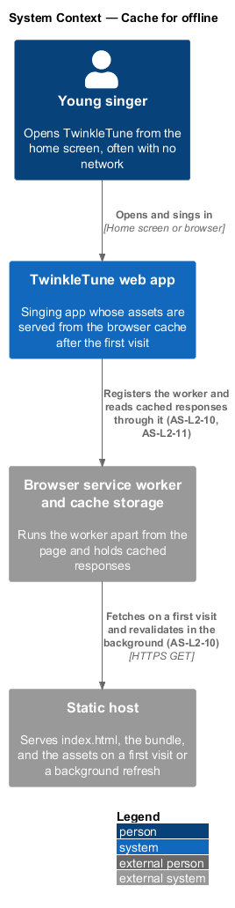
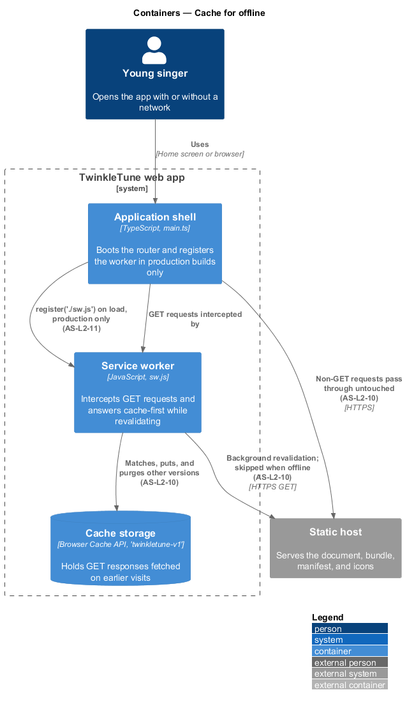
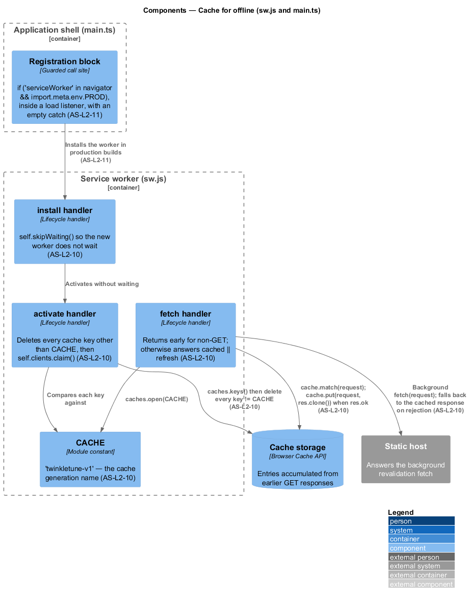
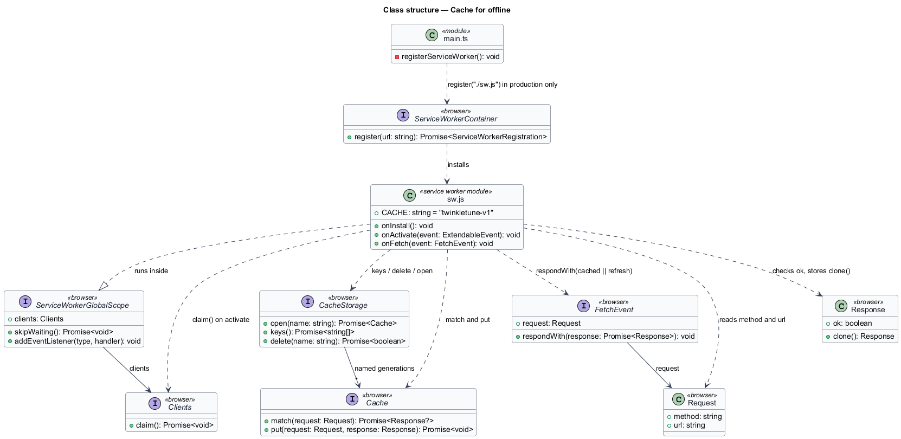
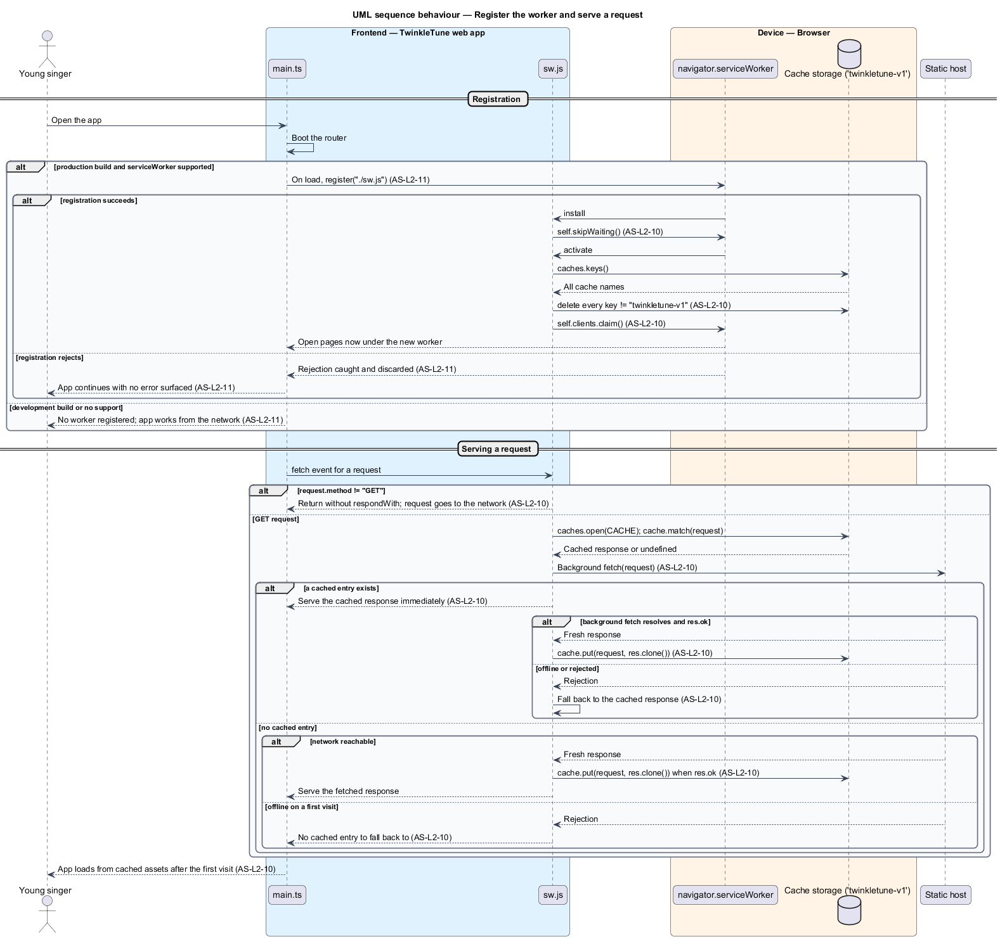

# Cache For Offline

## Overview

A tablet in a back seat or a bedroom is not reliably online, and solo play is
designed never to need the family server. This feature is what keeps the app
itself loadable when the network is gone: a service worker that keeps a copy of
every asset the app has already fetched, and serves that copy first on later
visits.

The strategy is deliberately modest. The service worker pre-caches nothing and
declares no asset list; it fills its cache as a side effect of ordinary browsing,
then serves what it holds and refreshes it in the background. A first visit
therefore requires the network, and every visit after it does not.

Offline support is treated as a bonus rather than a guarantee. Registration is
confined to production builds and its failure is swallowed, so a browser without
service-worker support, a development server, or a rejected registration all
leave the app working exactly as before.

The terms below are used throughout.

- service worker — script the browser runs apart from any page, able to intercept
  that page's network requests
- cache-first — response strategy that answers from the cache when an entry exists
  and reaches the network only when it does not
- stale-while-revalidate — cache-first strategy that additionally re-fetches in the
  background, so the next visit sees fresher content
- cache version — name identifying one generation of cached entries, changed to
  retire the previous generation
- activation — lifecycle event at which a newly installed service worker takes over
  from its predecessor
- claim — act of a service worker assuming control of already-open pages rather
  than waiting for them to be reloaded
- safe method — HTTP method that does not change server state; only `GET` is treated
  as cacheable here

Installability is a separate concern, covered by
[Install As PWA](../install-as-pwa/README.md); the two are declared independently
and either may hold without the other.

## Description

The feature is realized by `frontend/public/sw.js` and one registration block in
`frontend/src/main.ts`. No server logic participates.

- **`CACHE`** — the module constant naming the cache generation, `'twinkletune-v1'`.
  Changing this string is what retires the previous generation.
- **`install` handler** — calls `self.skipWaiting()`, so a newly installed worker
  does not wait for existing pages to close before activating.
- **`activate` handler** — wraps its work in `event.waitUntil`. It reads
  `caches.keys()`, deletes every key that is not `CACHE`, and then calls
  `self.clients.claim()` so already-open pages come under the new worker's control
  immediately.
- **`fetch` handler** — returns without calling `respondWith` when
  `request.method !== 'GET'`, leaving non-`GET` requests to the network untouched.
  For a `GET` it opens `CACHE`, awaits `cache.match(request)`, and starts a
  background `fetch(request)`. The background fetch calls
  `cache.put(request, res.clone())` when `res && res.ok`, and falls back to the
  cached response on rejection. The handler answers with `cached || refresh`, so a
  cached entry is served immediately and an uncached request waits on the network.
- **Registration block** — the guard `if ('serviceWorker' in navigator &&
  import.meta.env.PROD)` in `frontend/src/main.ts`. It registers inside a `load`
  listener, calls `navigator.serviceWorker.register('./sw.js')` with a relative
  path, and attaches a `.catch()` whose body is empty apart from the comment that
  offline support is a bonus and never an error.

The cache holds no explicit pre-cache list, so the set of entries is exactly the
set of `GET` responses the app has already made.

## Requirements

The feature realizes the following level-2 (L2) requirements. Each L2 requirement
refines a level-1 (L1) requirement, cited by identifier.

| L2 ID | Refines (L1) | Requirement |
|-------|--------------|-------------|
| `AS-L2-10` | `AS-L1-5` | The service worker shall serve GET requests cache-first while revalidating in the background, ignore non-GET requests, version its cache, purge previous-version caches on activation, and take control immediately. |
| `AS-L2-11` | `AS-L1-5` | The service worker shall be registered only in production builds, after load, and a registration failure shall never surface as an error (offline support is a bonus, not a requirement). |

## Diagrams

### System context

The singer opens TwinkleTune with or without a network; the browser's service
worker answers from its own cache so a previously visited app still loads
(`AS-L2-10`).

### Containers

The web app registers the service worker only in a production build (`AS-L2-11`),
and the worker mediates every `GET` between the app and the static host, keeping
its copies in the browser cache storage (`AS-L2-10`).

### Components

The three lifecycle handlers inside `sw.js` and the guarded registration block in
`main.ts`, with the versioned cache they read, fill, and purge (`AS-L2-10`,
`AS-L2-11`).

### Class structure

The service-worker module's constant and event handlers, the registration block
that installs it, and the cache-storage interfaces both depend on.

### Behaviour — register the worker and serve a request

Registration is confined to a production build and its rejection is swallowed
(`AS-L2-11`). Activation purges other cache versions and claims open pages, and
each `GET` is answered cache-first while a background fetch refreshes the entry;
non-`GET` requests pass straight through (`AS-L2-10`).

