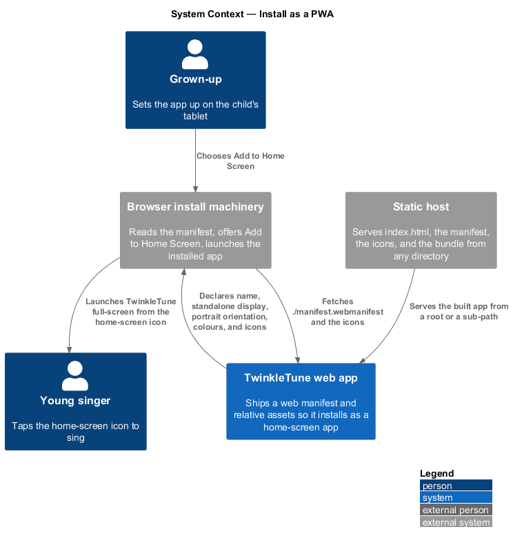
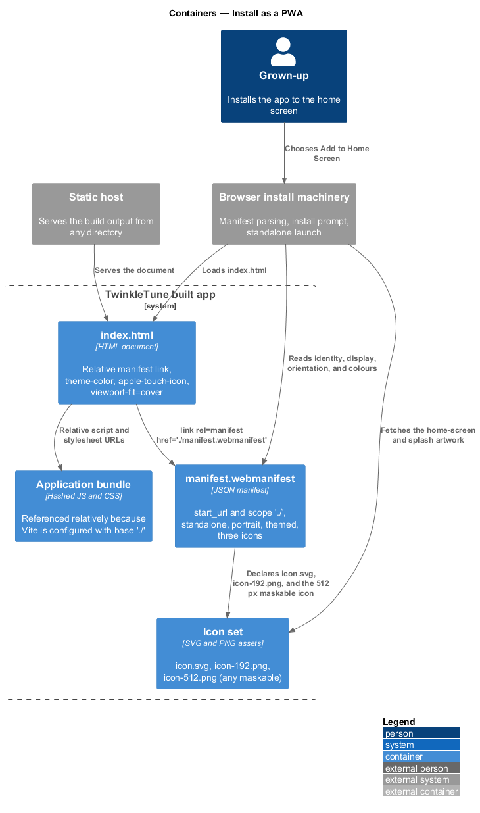
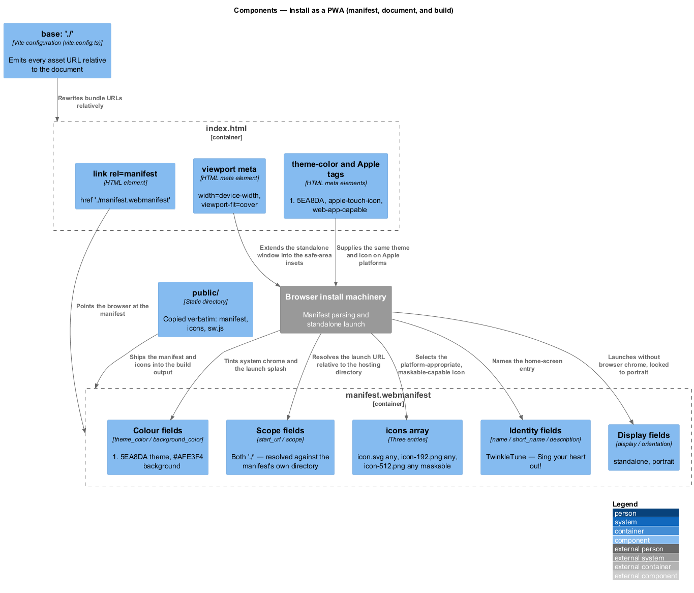
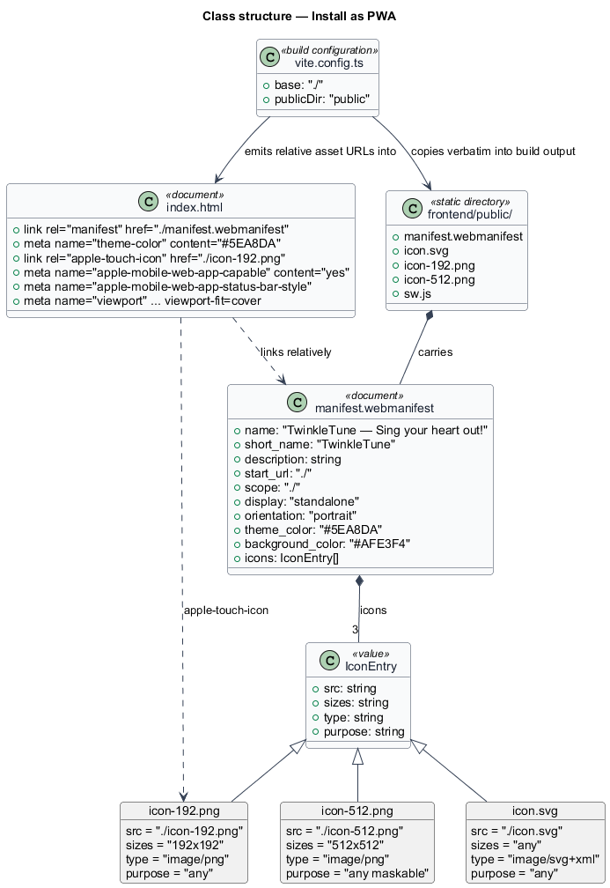
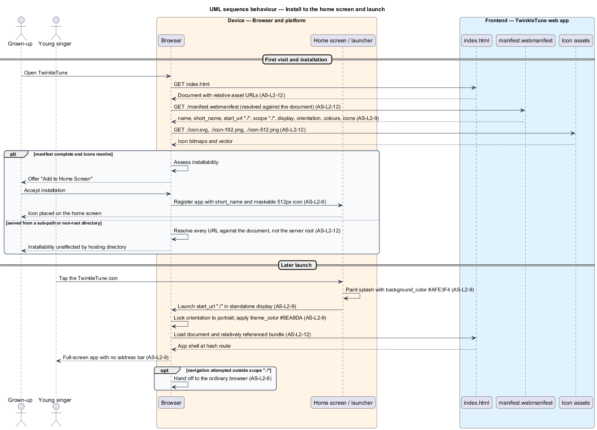

# Install As PWA

## Overview

The intended way to use TwinkleTune is from a tablet's home screen: a grown-up
opens the app once in a browser, chooses "Add to Home Screen", and from then on the
child taps an icon and gets a full-screen singing app with no address bar. This
feature covers what makes that possible — the web manifest that declares the app's
identity, display mode, orientation, colours, and icons, together with the relative
path scheme that lets the built app work from whatever directory it is served
from.

Portability is part of the same story. The build emits relative URLs and the
manifest scopes itself relatively, so the identical bundle runs from the root of a
static host, from a sub-path behind a reverse proxy, or from a folder on the family
server without any per-deployment rewriting.

The terms below are used throughout.

- web manifest — JSON document declaring an installable web app's name, icons,
  colours, display mode, and scope
- installability — browser's willingness to offer "Add to Home Screen" for the app
- standalone display — launch mode with no browser address bar or tabs, so the app
  fills the screen like a native one
- scope — URL prefix the installed app is allowed to navigate within
- start URL — address the installed app opens at
- maskable icon — icon whose artwork tolerates being cropped to a platform's shape
  without losing its subject
- theme colour — colour a platform applies to system chrome around the app
- relative asset path — URL resolved against the document rather than the server
  root, so the bundle is independent of its hosting directory

Offline behaviour is a separate concern, covered by
[Cache For Offline](../cache-for-offline/README.md); installability and offline
support are declared independently and either may hold without the other.

## Description

The feature is realized by `frontend/public/manifest.webmanifest`,
`frontend/index.html`, `frontend/vite.config.ts`, and the three icon files in
`frontend/public/`. No server logic participates.

- **`manifest.webmanifest`** — the manifest. `name` is
  `"TwinkleTune — Sing your heart out!"`, `short_name` is `"TwinkleTune"`, and
  `description` is `"A singing buddy that tunes every song to your voice and cheers
  for every note."`.
- **`start_url` and `scope`** — both `"./"`. The installed app opens at, and stays
  within, the directory the manifest itself was served from.
- **`display: "standalone"`** — launch mode without browser chrome.
- **`orientation: "portrait"`** — the locked orientation, matching the single-column
  `470px` screen layout the design system defines.
- **`theme_color: "#5EA8DA"` and `background_color: "#AFE3F4"`** — the sky-blue
  theme and the aqua splash background, both drawn from the design tokens `--blue`
  and `--aqua`.
- **`icons`** — three entries: `icon.svg` at `sizes: "any"` with type
  `image/svg+xml` and purpose `any`; `icon-192.png` at `192x192` with purpose `any`;
  and `icon-512.png` at `512x512` with purpose `"any maskable"`, which is the entry
  satisfying the maskable requirement.
- **`<link rel="manifest" href="./manifest.webmanifest">`** — the relative manifest
  link in `frontend/index.html`.
- **`<meta name="theme-color" content="#5EA8DA">`** — the document-level theme
  colour, matching the manifest value.
- **iOS install tags** — `<link rel="apple-touch-icon" href="./icon-192.png">`,
  `<meta name="apple-mobile-web-app-capable" content="yes">`, and
  `<meta name="apple-mobile-web-app-status-bar-style" content="default">`, which
  give the same home-screen behaviour on platforms that read the Apple tags rather
  than the manifest.
- **`<meta name="viewport" ... viewport-fit=cover>`** — the viewport declaration
  that lets the standalone window extend into a device's safe-area insets.
- **`base: './'`** — the Vite configuration option in `frontend/vite.config.ts`. It
  makes every emitted script, stylesheet, and asset URL relative to the document.
- **`frontend/public/`** — the static directory copied verbatim into the build
  output, carrying `manifest.webmanifest`, `icon.svg`, `icon-192.png`,
  `icon-512.png`, and `sw.js` alongside the hashed bundle assets.
- **hash-based routes** — the router's `#/...` URLs keep every in-app navigation
  inside the single `index.html`, so no server-side rewrite rule is a precondition
  for hosting the app from a sub-path.

## Requirements

The feature realizes the following level-2 (L2) requirements. Each L2 requirement
refines a level-1 (L1) requirement, cited by identifier.

| L2 ID | Refines (L1) | Requirement |
|-------|--------------|-------------|
| `AS-L2-9` | `AS-L1-4` | The app shall ship a web manifest declaring a name, standalone display, portrait orientation, themed colours, and icons including a maskable 512px icon, so it installs as a home-screen app. |
| `AS-L2-12` | `AS-L1-4` | The built app shall use relative asset paths so it can be hosted from any directory or static host without reconfiguration. |

## Diagrams

### System context

A grown-up installs TwinkleTune from the browser; the browser reads the manifest to
learn the app's name, icon, colours, and display mode (`AS-L2-9`).

### Containers

The static host serves `index.html`, the manifest, the icons, and the relatively
referenced bundle; nothing resolves against the server root (`AS-L2-12`).

### Components

The manifest's identity, display, colour, and icon groups map to what the platform
shows on the home screen and at launch (`AS-L2-9`), and `base: './'` governs how
every asset URL is emitted (`AS-L2-12`).

### Class structure

The manifest document's fields, the three icon entries, and the build and document
settings that reference them relatively.

### Behaviour — install to the home screen and launch

The browser fetches the relative manifest and icons (`AS-L2-12`), offers
installation, and later launches the app standalone in portrait with the declared
colours (`AS-L2-9`).

