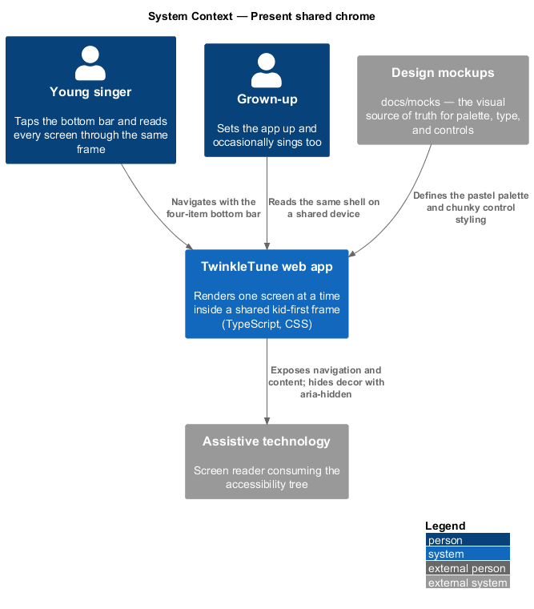
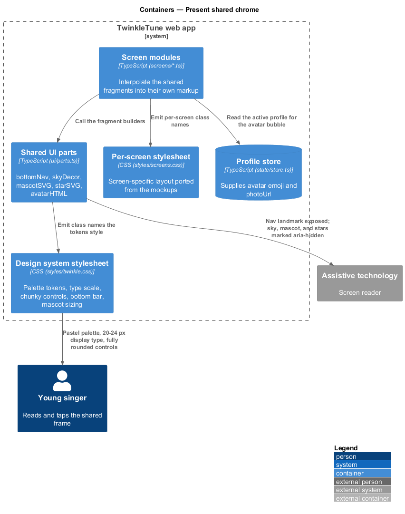
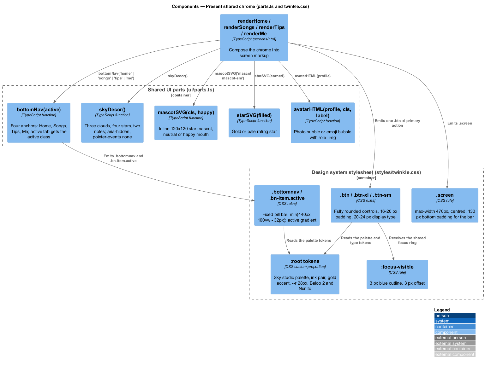
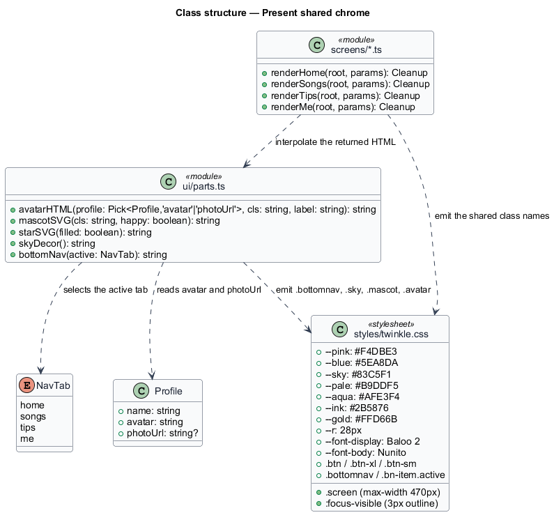
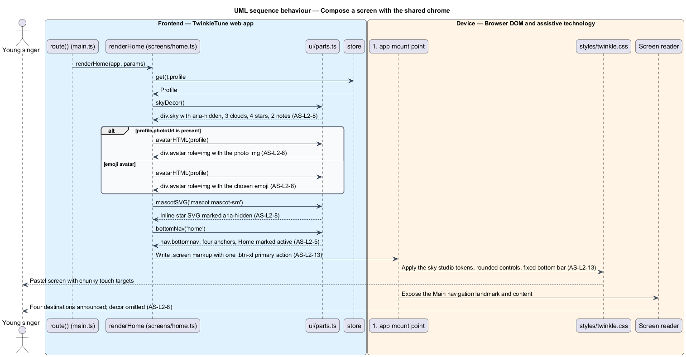
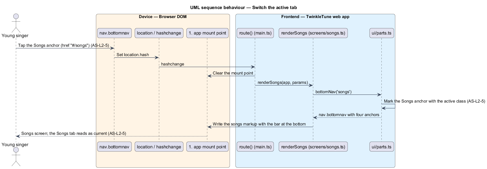

# Present Shared Chrome

## Overview

Every TwinkleTune screen sits on the same pastel sky, uses the same chunky
rounded buttons, and — on the four main screens — carries the same four-item bar
across the bottom. That shared frame is the chrome: everything a child sees that
does not belong to one particular screen. It exists so a nine-year-old learns the
app once. The bottom bar is always in the same place with the same four words, the
mascot always looks the same, and the sky behind every screen tells the child they
are still inside TwinkleTune.

The chrome also carries the product's kid-first presentation rules (principle P5):
one obvious primary action per screen, few words, large rounded type, and touch
targets sized for small fingers. The decorative parts of the chrome — clouds,
twinkling stars, floating notes, the mascot itself — are hidden from assistive
technology, so a screen reader announces the four navigation destinations and the
screen content without wading through ornament.

The terms below are used throughout.

- chrome — shared visual frame surrounding screen content: navigation, mascot,
  avatar, and decorative sky
- bottom navigation — fixed four-item bar giving the primary destinations Home,
  Songs, Tips, and Me
- nav tab — one of the four bottom-navigation destinations, identified by the
  `NavTab` union
- active tab — bottom-navigation item matching the screen currently mounted
- mascot — Twinkle, the star character rendered as inline SVG with a neutral or
  happy mouth
- sky decor — fixed, non-interactive layer of drifting clouds, twinkling stars, and
  floating musical notes behind every screen
- avatar bubble — round element showing the singer's profile photo when one exists
  and the chosen emoji otherwise
- design system — the palette, type scale, radii, and control sizing declared as
  custom properties in `twinkle.css`

The chrome is produced as HTML strings that each screen interpolates into its own
markup; it has no lifecycle of its own and no server dependency. Dialogs and
transient messages are separate primitives, covered by
[Show Modals And Toasts](../show-modals-and-toasts/README.md).

## Description

The feature is realized by `frontend/apps/game/src/ui/parts.ts` for the markup fragments and
by `frontend/apps/game/src/styles/twinkle.css` and `frontend/apps/game/src/styles/screens.css` for the
design system. `docs/mocks/` holds the design source of truth the stylesheets were
ported from.

- **`bottomNav(active)`** — returns a `<nav class="bottomnav" aria-label="Main
  navigation">` holding exactly four anchors built by the local `item()` helper:
  Home to `#/home` with 🏠, Songs to `#/songs` with 🎵, Tips to `#/tips` with 💡,
  and Me to `#/me` with ⭐. The anchor whose tab equals `active` receives the extra
  `active` class.
- **`NavTab`** — exported union type `'home' | 'songs' | 'tips' | 'me'`. Four
  screens call `bottomNav` with their own tab: `home.ts`, `songs.ts`, `tips.ts`,
  and `me.ts`.
- **`.bottomnav`** — the stylesheet rule fixing the bar `18px` from the bottom at
  `z-index: 50`, centred, with `width: min(440px, calc(100vw - 32px))` and a fully
  rounded white pill background.
- **`.bn-item.active`** — the active-tab rule, painting a
  `linear-gradient(135deg, var(--aqua), var(--pale))` background and switching the
  label from `--ink-soft` to `--ink`. The semantic marker distinguishing the active
  tab for assistive technology is `<TO SUPPLY>`; the shipped markup carries the
  visual `active` class only.
- **`skyDecor()`** — returns `
` holding three
  `.cloud` elements (drift durations `95s`, `78s`, and `110s` at `9%`, `28%`, and
  `66%` from the top), four `.tstar` glyphs, and two `.fnote` glyphs. `.sky` is
  `position: fixed; inset: 0; pointer-events: none; z-index: 0`, so it never
  intercepts a tap. Nine screens include it.
- **`mascotSVG(cls, happy)`** — returns an inline `<svg viewBox="0 0 120 120"
  aria-hidden="true">` drawing the ten-point star in `#FFD66B` with an `#E8B445`
  stroke, two eyes, two cheeks, and a mouth path chosen by `happy`. The `cls`
  argument selects the size: `.mascot` is `110px`, `.mascot-sm` is `72px`, and
  `.mascot-lg` is `150px`, all with the `floaty` `3.4s` animation.
- **`starSVG(filled)`** — returns the same star path as a rating glyph, filled
  `#FFD66B` on `#E8B445` when earned and `#EAF3FA` on `#C6D9E8` when not, also
  `aria-hidden="true"`. The results screen renders three of them.
- **`avatarHTML(profile, cls, label)`** — returns a `
`, defaulting `cls` to `avatar` and `label` to `Your avatar`.
  When `profile.photoUrl` is present it wraps an ``; otherwise it renders `profile.avatar`, the chosen emoji.
- **design tokens** — the `:root` block in `twinkle.css` declaring the "sky studio"
  palette `--pink: #F4DBE3`, `--blue: #5EA8DA`, `--sky: #83C5F1`,
  `--pale: #B9DDF5`, `--aqua: #AFE3F4`, the ink pair `--ink: #2B5876` and
  `--ink-soft: #5E87A6`, the gold accent `--gold: #FFD66B`, the corner radius
  `--r: 28px`, and the two families `--font-display: "Baloo 2"` and
  `--font-body: "Nunito"`. `body` paints the four-stop sky-to-pink gradient with
  `background-attachment: fixed`.
- **`.btn`** — the primary control: fully rounded (`border-radius: 999px`),
  `16px 30px` padding at `20px` display type, with a `6px` solid bottom shadow that
  collapses to `1px` on `:active`. `.btn-xl` is the one-per-screen primary action at
  full width, `20px 30px` padding and `24px` type; `.btn-sm` is the `16px` secondary.
- **`.screen`** — the layout container, `max-width: 470px` centred with
  `28px 22px 130px` padding, so the same markup fills a phone and centres on a
  tablet. `.screen--nonav` reduces the bottom padding to `40px` where no bottom bar
  is present.
- **`:focus-visible`** — global rule drawing a `3px` `--blue` outline with `3px`
  offset on every focusable control.
- **viewport meta** — `width=device-width, initial-scale=1.0, viewport-fit=cover`
  in `frontend/apps/game/index.html`, paired with the fluid `min()` widths rather than
  breakpoint media queries; the stylesheets declare no width-based `@media` block.

## Requirements

The feature realizes the following level-2 (L2) requirements. Each L2 requirement
refines a level-1 (L1) requirement, cited by identifier.

| L2 ID | Refines (L1) | Requirement |
|-------|--------------|-------------|
| `AS-L2-5` | `AS-L1-3` | The primary navigation shall be a four-item bottom bar — Home, Songs, Tips, Me — with the active tab visually and semantically marked. |
| `AS-L2-8` | `AS-L1-3` | The shell shall provide reusable mascot, star, avatar, and decorative sky components used consistently across screens, with decorative elements hidden from assistive technology. |
| `AS-L2-13` | `AS-L1-6` | The presentation shell shall use the product's pastel "sky studio" palette, large rounded type and chunky touch targets, one prominent primary action per screen, and shall adapt to tablet and phone viewports. |

## Diagrams

### System context

The child reads and taps the shared chrome; a screen reader consumes only the
navigation and content, because the decorative layers are marked `aria-hidden`
(`AS-L2-8`).

### Containers

Screen modules compose their markup from the `parts.ts` fragments, and the design
system stylesheets supply the palette, type, and control sizing (`AS-L2-13`).

### Components

`bottomNav()`, `skyDecor()`, `mascotSVG()`, `starSVG()`, and `avatarHTML()` are
independent string builders; the stylesheet rules `.bottomnav`, `.sky`, `.mascot`,
and `.btn` style what they emit (`AS-L2-5`, `AS-L2-8`).

### Class structure

`parts.ts` exposes five pure functions over `NavTab` and the `Profile` fields
`avatar` and `photoUrl`, backed by the token and control rules in `twinkle.css`.

### Behaviour — compose a screen with the shared chrome

Mounting a main screen builds the sky decor, the avatar bubble, the mascot, and the
bottom bar with its active tab (`AS-L2-5`, `AS-L2-8`), all styled by the design
tokens (`AS-L2-13`); the `alt` covers the photo and emoji avatar forms.

### Behaviour — switch the active tab

Tapping a bottom-navigation anchor changes the hash, the router remounts, and the
newly mounted screen calls `bottomNav()` with its own tab so the active marking
follows the child (`AS-L2-5`).

