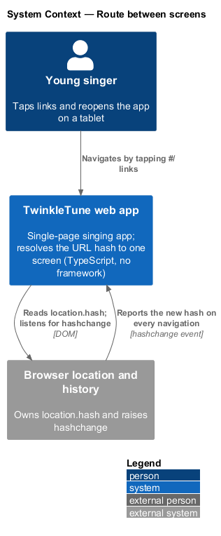
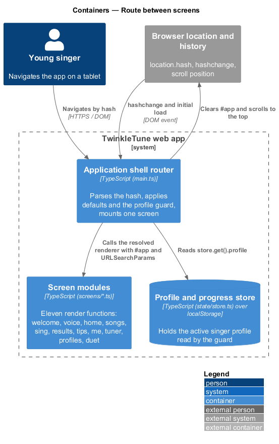
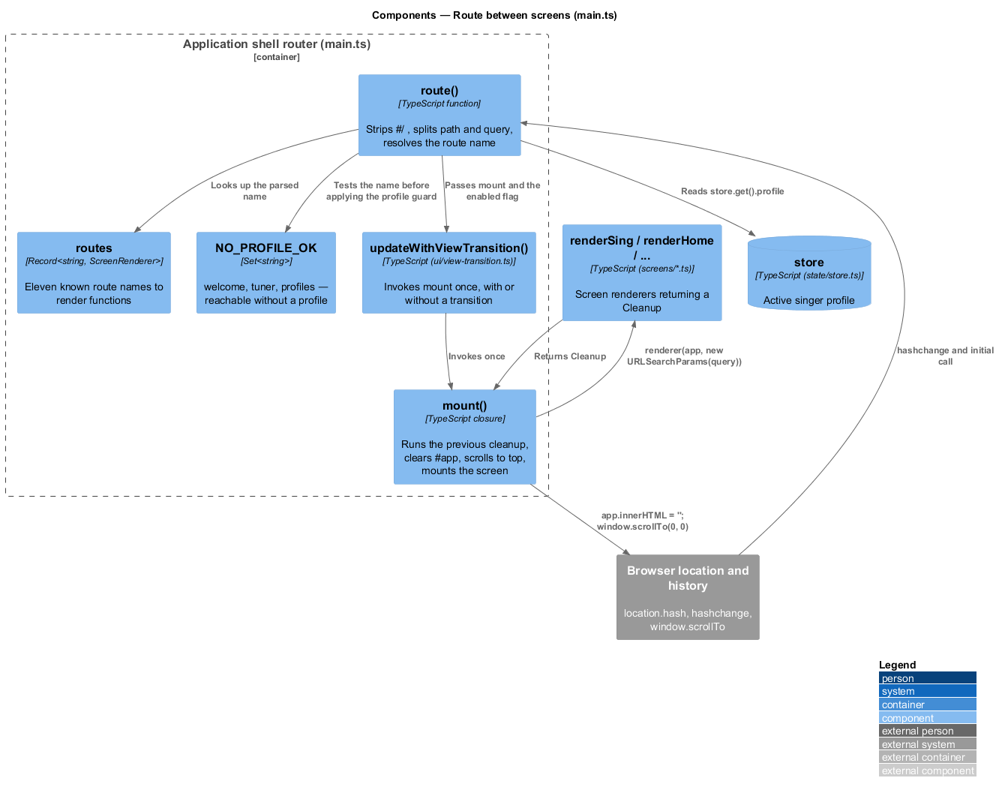
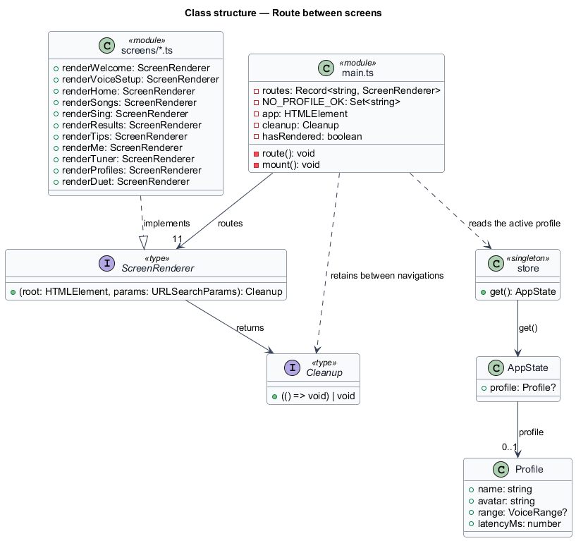
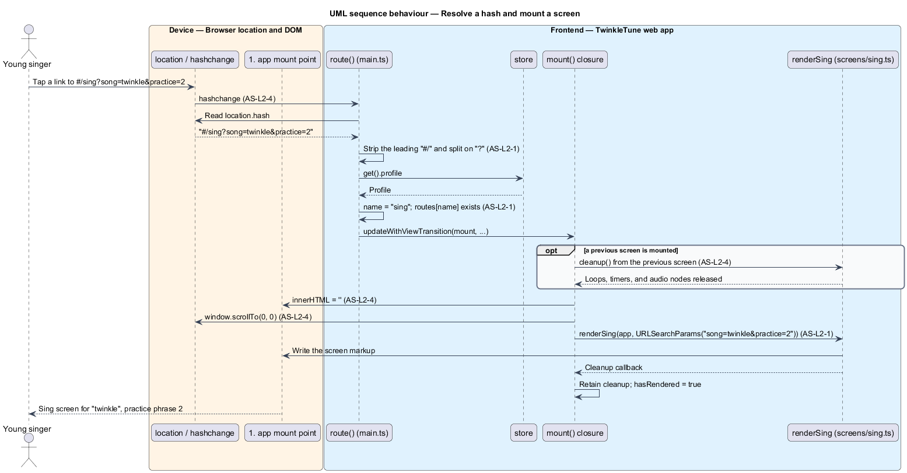
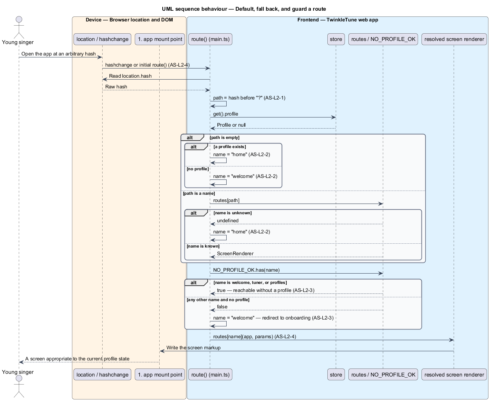

# Route Between Screens

## Overview

TwinkleTune ships as a single HTML page with no routing framework. Every screen —
welcome, voice setup, home, songs, sing, results, tips, me, tuner, profiles, and
duet — renders into one element, and the URL hash decides which of them is on
screen. This feature covers that decision: reading the hash, choosing a screen,
redirecting when the chosen screen is unavailable, tearing down the previous
screen, and mounting the next one.

The routing rules exist because a child can reach any URL by tapping a link, by
reloading, or by restoring a tab from days ago. A route that resolves to nothing
would leave a blank page, and a route that reaches a song list before a singer
profile exists would show an empty, confusing screen. The router therefore always
lands on a screen that makes sense for the current state.

The terms below are used throughout.

- application shell — frame that hosts one screen at a time and owns navigation,
  the shared UI primitives, and the installable app surface
- route name — first path segment of the URL hash, identifying which screen renders
- route table — map from route name to the function that renders that screen
- screen renderer — function that fills the mount point and returns an optional
  cleanup callback
- cleanup — callback returned by a screen renderer that releases the timers, loops,
  and device resources the screen acquired
- mount point — `#app` element that holds exactly one rendered screen
- profile guard — rule that redirects a profile-requiring route to onboarding when
  no singer profile exists
- onboarding — welcome screen on which the first singer profile is created

Screen content belongs to the individual screen subsystems; this feature owns only
the frame around them. The visual transition applied while a screen swaps is
covered separately by [Transition Between Views](../transition-between-views/README.md).

## Description

The feature lives entirely in `frontend/src/main.ts`, with the profile read from
`frontend/src/state/store.ts`. No server participates.

- **`routes`** — `Record<string, ScreenRenderer>` holding the eleven known route
  names: `welcome`, `voice`, `home`, `songs`, `sing`, `results`, `tips`, `me`,
  `tuner`, `profiles`, and `duet`. Each maps to the render function imported from
  `screens/`, for example `sing` to `renderSing`.
- **`ScreenRenderer`** — exported type `(root: HTMLElement, params: URLSearchParams)
  => Cleanup`. Every screen receives the mount point and the parsed query string.
- **`Cleanup`** — exported type `(() => void) | void`. A screen that holds a render
  loop, an audio graph, or a microphone returns a function that releases it; a
  static screen returns nothing.
- **`NO_PROFILE_OK`** — `Set<string>` of the three route names reachable without a
  profile: `welcome`, `tuner`, and `profiles`.
- **`app`** — the `#app` element resolved once at module load with
  `document.getElementById('app')`. It is the single mount point.
- **`cleanup`** — module-level variable holding the current screen's cleanup
  callback between navigations.
- **`route()`** — the router. It strips the leading `#/` from `location.hash` with
  `/^#\/?/`, splits the remainder on `?` into `path` and `query`, and resolves the
  route name in three ordered steps: an empty `path` becomes `home` when
  `store.get().profile` is set and `welcome` otherwise; a name absent from `routes`
  becomes `home`; a name outside `NO_PROFILE_OK` becomes `welcome` when no profile
  exists.
- **`mount()`** — the closure `route()` builds for the resolved name. It calls the
  previous `cleanup` when one is a function, clears it, sets `app.innerHTML = ''`,
  calls `window.scrollTo(0, 0)`, invokes `routes[name](app, new URLSearchParams(query))`,
  stores the returned cleanup, and sets `hasRendered = true`.
- **`store`** — the state singleton from `state/store.ts`. `store.get().profile` is
  the `Profile | null` the default rule and the profile guard read.
- **hash-change binding** — `window.addEventListener('hashchange', route)` followed
  by a direct `route()` call, so the first paint and every later navigation run the
  same path.
- **`updateWithViewTransition(mount, enabled)`** — the wrapper `route()` hands
  `mount` to. Whatever the transition support, `mount` runs exactly once.

Navigation elsewhere in the app is expressed as plain `href` values such as
`#/home`, `#/songs`, and `#/sing?song=twinkle&practice=2`, so the browser's own
history stack drives the router.

## Requirements

The feature realizes the following level-2 (L2) requirements. Each L2 requirement
refines a level-1 (L1) requirement, cited by identifier.

| L2 ID | Refines (L1) | Requirement |
|-------|--------------|-------------|
| `AS-L2-1` | `AS-L1-1` | The router shall map the URL hash to one of the known screens (welcome, voice, home, songs, sing, results, tips, me, tuner, profiles, duet), parsing any query string into parameters passed to the screen. |
| `AS-L2-2` | `AS-L1-2` | An empty route shall resolve to home when a profile exists, otherwise to onboarding; an unrecognised route name shall fall back to home. |
| `AS-L2-3` | `AS-L1-2` | A screen that requires a profile shall redirect to onboarding when no profile exists; only welcome, tuner, and profiles shall be reachable without a profile. |
| `AS-L2-4` | `AS-L1-1` | On each navigation the router shall invoke the previous screen's cleanup, clear the mount point, reset scroll to the top, and mount the new screen; navigation shall be driven by hash changes and an initial route on load. |

## Diagrams

### System context

The child navigates the TwinkleTune web app by tapping links that change the URL
hash; the browser reports each change back to the app, which renders the matching
screen (`AS-L2-1`).

### Containers

The router in `main.ts` reads the profile from the state store to decide the route
(`AS-L2-2`, `AS-L2-3`) and mounts one of the eleven screen modules into `#app`.

### Components

`route()` resolves a name against `routes` and `NO_PROFILE_OK`, then builds a
`mount()` closure that tears down the previous screen and renders the next one
(`AS-L2-4`).

### Class structure

`route()` and `mount()` operate over the `routes` table of `ScreenRenderer`
functions, each returning a `Cleanup`, and read `Profile` through the store.

### Behaviour — resolve a hash and mount a screen

A hash change parses the name and query (`AS-L2-1`), runs the previous cleanup,
clears the mount point, resets scroll, and mounts the new screen (`AS-L2-4`).

### Behaviour — default, fall back, and guard

The `alt` branches show the three redirect rules: an empty path resolving by
profile presence (`AS-L2-2`), an unknown name falling back to home (`AS-L2-2`), and
a profile-requiring name redirecting to welcome (`AS-L2-3`).

