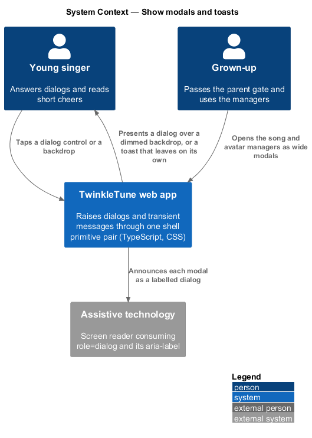
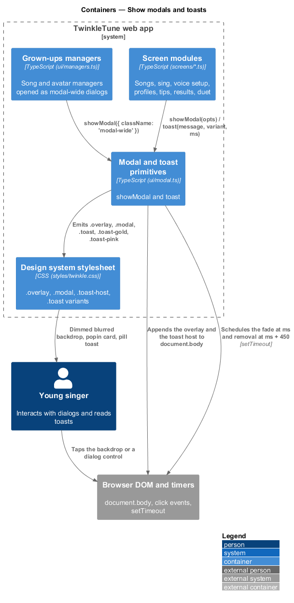
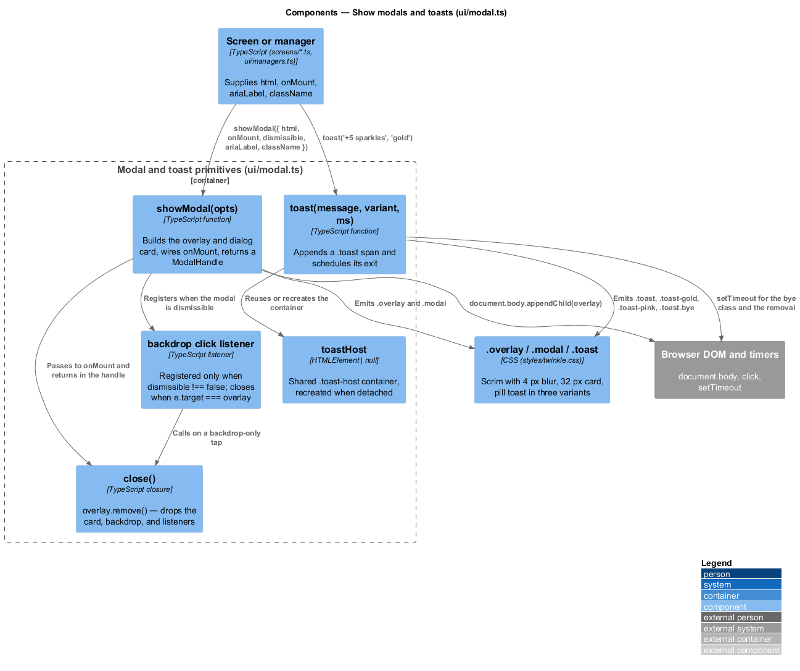
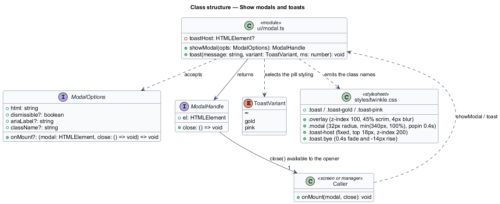
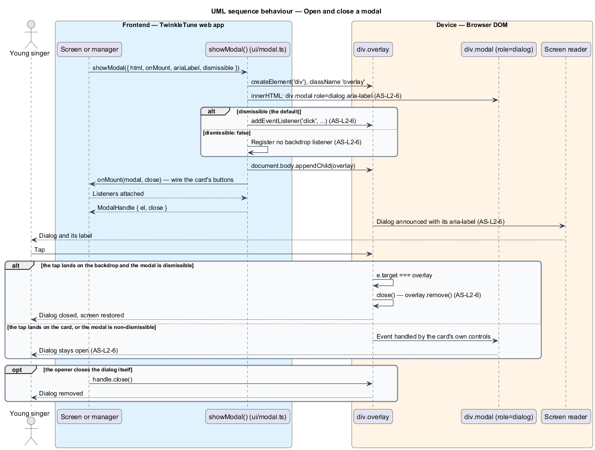
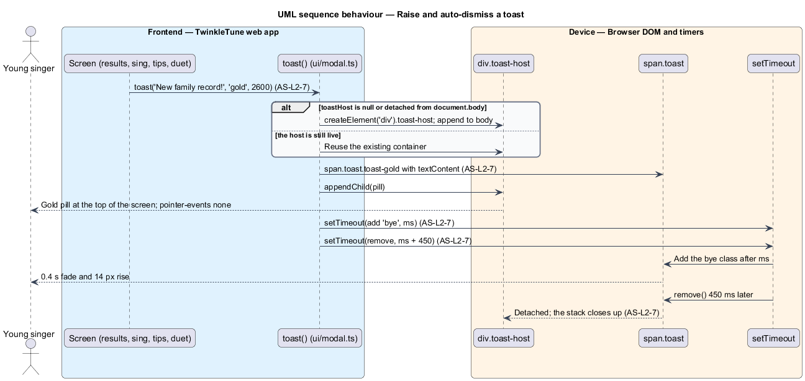

# Show Modals And Toasts

## Overview

Two interruption shapes appear across TwinkleTune. A modal takes over the screen
and waits for a decision — the parent gate, the pause dialog, the end-of-song
prompt, the song and avatar managers. A toast slides in at the top, says one short
encouraging thing, and leaves on its own — "+5 sparkles", "New family record!",
"One more time — you sound great!". This feature provides both as shell primitives,
so every dialog and every transient message in the app looks and behaves the same
way.

Centralising them matters for a child's experience and for correctness. A single
modal implementation means every dialog is announced as a dialog, sits on the same
dimmed backdrop, and closes the same way. A single toast implementation means
messages stack in one place instead of overlapping, and never steal a tap from the
screen underneath.

The terms below are used throughout.

- modal — dialog card centred over a dimmed backdrop that covers the current screen
- backdrop — full-screen overlay behind the modal card; a tap on it closes a
  dismissible modal
- dismissible modal — modal that closes when the backdrop is tapped
- non-dismissible modal — modal that ignores backdrop taps, so the decision is made
  through its own controls
- modal handle — object returned to the caller carrying the card element and a
  `close` function, so the opener may close the modal itself
- toast — transient message pill that appears at the top of the screen and removes
  itself after a short interval
- toast variant — one of three tones: neutral, gold for celebration, pink for a
  gentle nudge
- toast host — single fixed container that stacks concurrent toasts

The shell owns the primitives; the dialogs built on them belong to the features
that raise them. The parent gate, for instance, is a Grown-Ups Corner behaviour
that consumes `showModal`.

## Description

The feature is realized by `frontend/src/ui/modal.ts` with the presentation rules
in `frontend/src/styles/twinkle.css`. Nothing crosses the network.

- **`showModal(opts)`** — the exported factory. It creates a `div.overlay`, sets its
  inner HTML to a `div.modal` carrying `role="dialog"` and `aria-label`, appends the
  overlay to `document.body`, calls `opts.onMount` with the card and the `close`
  function, and returns a `ModalHandle`.
- **`ModalOptions`** — the option record: `html` (the card's inner markup),
  `onMount?(modal, close)` for wiring buttons, `dismissible?` defaulting to true,
  `ariaLabel?` defaulting to `'Dialog'`, and `className?` for card variants such as
  `modal-wide`.
- **`ModalHandle`** — the exported result type `{ el: HTMLElement; close: () => void }`.
  `el` is the `.modal` card, not the overlay.
- **`close`** — the closure `() => overlay.remove()`. Removing the overlay removes
  the card, the backdrop, and every listener attached to them.
- **backdrop dismissal** — a `click` listener registered on the overlay only when
  `opts.dismissible !== false`. It calls `close()` only when `e.target === overlay`,
  so a tap landing on the card does not close the modal. Three call sites pass
  `dismissible: false`: the two sing-screen dialogs and the voice-setup completion
  dialog.
- **`.overlay`** — the stylesheet rule: `position: fixed; inset: 0; z-index: 100`,
  a `rgba(43, 88, 118, .45)` scrim with a `4px` backdrop blur, `display: grid;
  place-items: center`, and a `0.25s` `fadein`.
- **`.modal`** — the card rule: white, `border-radius: 32px`, `28px 24px` padding,
  `width: min(340px, 100%)`, entering with a `0.4s` `popin` spring. `.modal h3`
  renders at `24px` in the display face.
- **`toast(message, variant, ms)`** — the exported function. `variant` defaults to
  `''` and `ms` to `2200`. It appends a `span.toast` carrying `textContent` to the
  host, schedules `classList.add('bye')` at `ms`, and schedules `remove()` at
  `ms + 450`.
- **`toastHost`** — module-level `HTMLElement | null`. `toast` recreates the
  `div.toast-host` whenever it is null or no longer contained by `document.body`,
  so a toast raised after a screen swap still lands in a live container.
- **`.toast-host`** — `position: fixed; top: 18px`, horizontally centred at
  `z-index: 200`, a column flex stack with `10px` gaps and
  `pointer-events: none`, so a toast never intercepts a tap.
- **`.toast` variants** — the neutral pill is white on `--ink`; `.toast-gold` is a
  `#FFE9AE`-to-`--gold` gradient on `--gold-ink`; `.toast-pink` is `--pink` on
  `--pink-ink`.
- **`.toast.bye`** — the exit rule, a `0.4s` transition to `opacity: 0` and
  `translateY(-14px)`, which the `450 ms` removal delay covers.
- **callers** — `showModal` is used by the songs, sing, voice-setup, profiles, and
  tips screens and by `ui/managers.ts`; `toast` is used by those screens and by the
  duet and results screens. Longer messages pass an explicit duration, such as
  `2600` for a new family record and `1600` for a streak cheer.

## Requirements

The feature realizes the following level-2 (L2) requirements. Each L2 requirement
refines a level-1 (L1) requirement, cited by identifier.

| L2 ID | Refines (L1) | Requirement |
|-------|--------------|-------------|
| `AS-L2-6` | `AS-L1-3` | The shell shall provide a modal primitive that renders an accessible dialog over a backdrop, supports a non-dismissible mode, and closes on backdrop click when dismissible. |
| `AS-L2-7` | `AS-L1-3` | The shell shall provide a transient toast with neutral, gold (celebratory), and pink (gentle) variants that auto-dismisses after a short interval. |

## Diagrams

### System context

The child meets both primitives inside the app: dialogs that wait for a decision
(`AS-L2-6`) and short messages that leave on their own (`AS-L2-7`).

### Containers

Screen modules and the grown-ups managers call the same two functions in
`ui/modal.ts`, which append their elements to `document.body` above the mounted
screen.

### Components

`showModal` builds the overlay, the dialog card, and the conditional backdrop
listener (`AS-L2-6`); `toast` reuses one host and schedules the fade and removal
timers (`AS-L2-7`).

### Class structure

`ui/modal.ts` exposes `showModal` over `ModalOptions` and `ModalHandle`, plus
`toast` over the three variants and the retained `toastHost`.

### Behaviour — open and close a modal

The `alt` contrasts the dismissible and non-dismissible modes, and the inner guard
shows that only a tap landing on the overlay itself closes the dialog (`AS-L2-6`).

### Behaviour — raise and auto-dismiss a toast

A toast attaches to the shared host, carries its variant styling, fades at the
requested interval, and is removed `450 ms` later (`AS-L2-7`).

