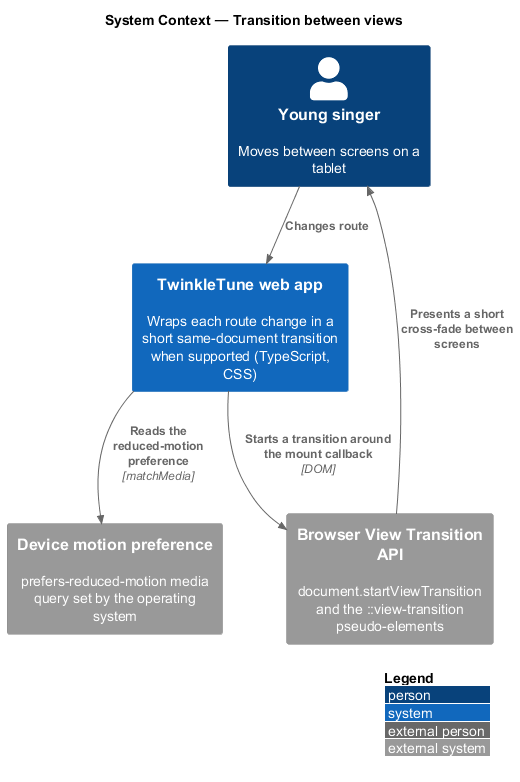
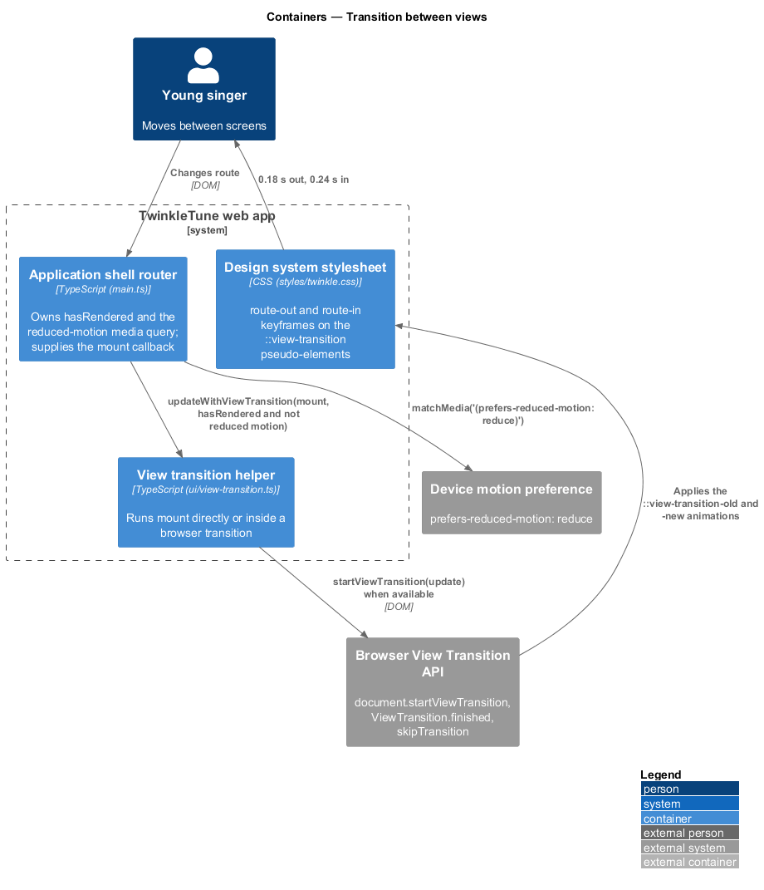
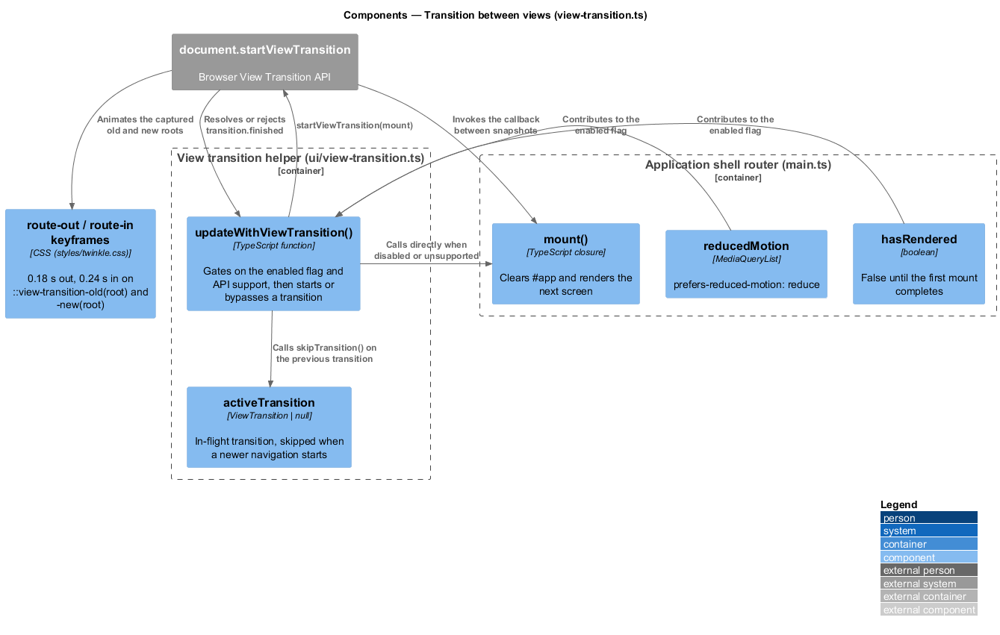
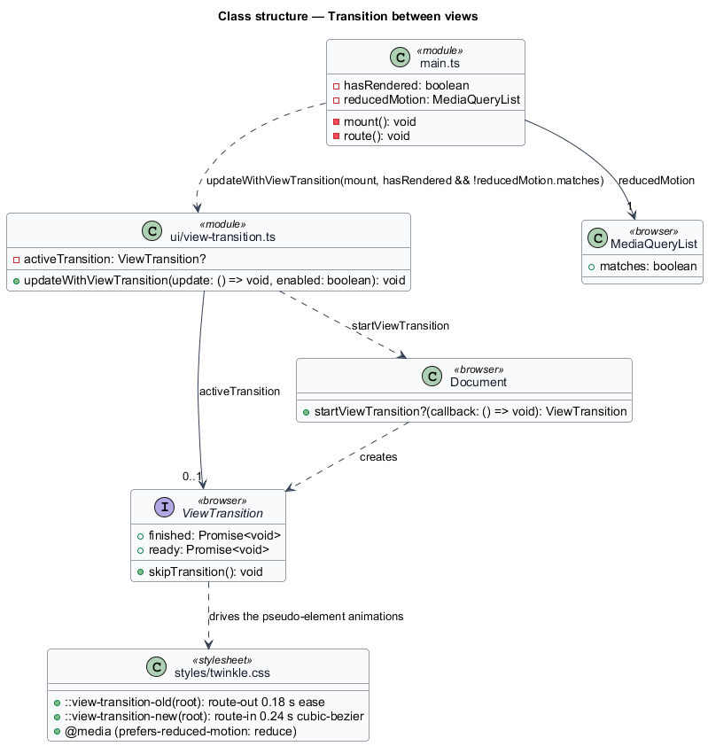
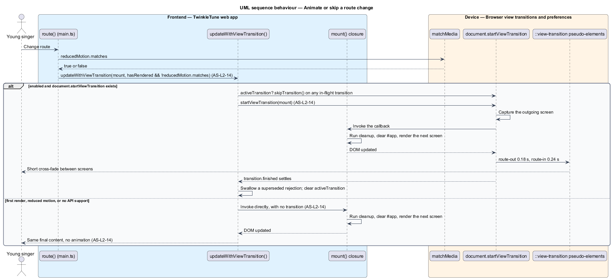

# Transition Between Views

## Overview

A hash change in TwinkleTune replaces the whole page body in one synchronous
step. Without any softening, the swap reads as a hard cut: the old screen
disappears mid-blink and the new one snaps into place. This feature adds a short
cross-fade between screens using the browser's same-document View Transition API,
so a child sees one screen give way to the next rather than a flicker.

The transition is decoration on top of navigation, never a precondition for it. A
browser without the API, a first paint with nothing to transition from, and a
device configured for reduced motion all take the same code path as before —
`mount` runs immediately, synchronously, and the resulting DOM is identical. That
is the point of the design: the animation may be skipped at any time without
changing what the child ends up looking at.

The terms below are used throughout.

- view transition — browser-managed animation between two states of the same
  document, driven by a callback that performs the DOM update
- transition callback — the `mount` function whose DOM writes the browser captures
  as the "new" state
- reduced motion — operating-system preference, surfaced as the
  `(prefers-reduced-motion: reduce)` media query, that suppresses non-essential
  animation
- superseded transition — in-flight transition abandoned because a newer
  navigation started before it finished
- first render — initial `route()` call on load, for which no previous screen
  exists to animate away from

## Description

The feature is realized by `frontend/apps/game/src/ui/view-transition.ts`, the call site in
`frontend/apps/game/src/main.ts`, and the pseudo-element rules in
`frontend/apps/game/src/styles/twinkle.css`.

- **`updateWithViewTransition(update, enabled)`** — the exported function. It reads
  `document.startViewTransition` through a narrowing cast and, when `enabled` is
  false or the API is absent, calls `update()` and returns. Otherwise it starts a
  transition around `update`.
- **`activeTransition`** — module-level `ViewTransition | null` holding the
  in-flight transition. A new transition calls `activeTransition?.skipTransition()`
  first, so rapid navigation jumps straight to the newest screen instead of
  queueing animations.
- **transition bookkeeping** — the function awaits `transition.finished`, swallows
  the rejection a superseded transition produces, and clears `activeTransition` in
  `finally` only when it still refers to that same transition.
- **`hasRendered`** — flag in `main.ts`, false until the first `mount()` completes.
  It keeps the first paint untransitioned.
- **`reducedMotion`** — `window.matchMedia('(prefers-reduced-motion: reduce)')`
  evaluated once at module load in `main.ts`. `route()` passes
  `hasRendered && !reducedMotion.matches` as the `enabled` argument.
- **`::view-transition-old(root)`** — CSS rule running the `route-out` keyframes for
  `0.18 s` with `ease` timing. `route-out` animates to `opacity: 0` and
  `translateY(-6px)`.
- **`::view-transition-new(root)`** — CSS rule running the `route-in` keyframes for
  `0.24 s` with `cubic-bezier(.2, .8, .3, 1)`. `route-in` animates from
  `opacity: 0` and `translateY(10px)`.
- **reduced-motion stylesheet rule** — the `@media (prefers-reduced-motion: reduce)`
  block in `twinkle.css` collapses every animation and transition duration to
  `0.01 ms`, covering any animation the JavaScript flag does not gate.

## Requirements

The feature realizes the following level-2 (L2) requirement. Each L2 requirement
refines a level-1 (L1) requirement, cited by identifier.

| L2 ID | Refines (L1) | Requirement |
|-------|--------------|-------------|
| `AS-L2-14` | `AS-L1-1, AS-L1-6` | After the initial render, route changes shall use a short same-document View Transition when supported. Unsupported browsers and users requesting reduced motion shall receive the same synchronous route update without transition motion. |

## Diagrams

### System context

The child navigates between screens, and the browser's View Transition API
animates the swap when the device supports it and reduced motion is not requested
(`AS-L2-14`).

### Containers

The router hands its `mount` callback to the transition helper, which either runs
it directly or wraps it in a browser-managed transition styled by the design
system stylesheet.

### Components

`updateWithViewTransition()` gates on `hasRendered`, the reduced-motion media
query, and the presence of `document.startViewTransition`, then tracks the
in-flight transition in `activeTransition` (`AS-L2-14`).

### Class structure

`view-transition.ts` exposes one function over a retained `ViewTransition` handle;
`main.ts` supplies the `mount` callback and the enabling flag.

### Behaviour — animate or skip a route change

The `alt` shows the two paths: the transitioned update, which skips any superseded
transition before starting a new one, and the direct update taken on first render,
under reduced motion, or without API support (`AS-L2-14`).

