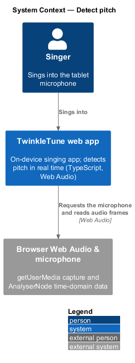
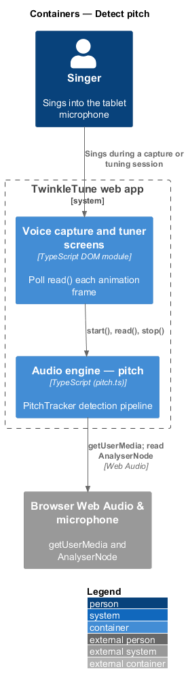
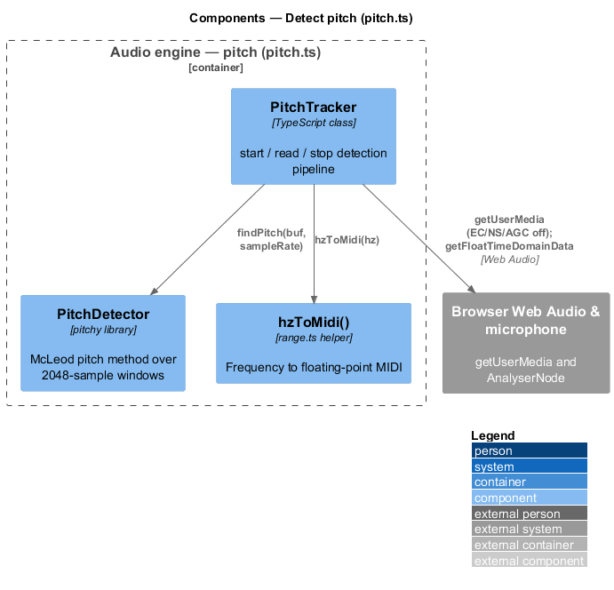
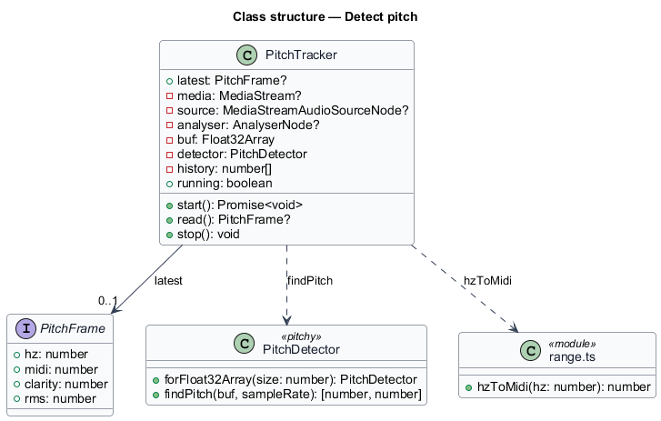
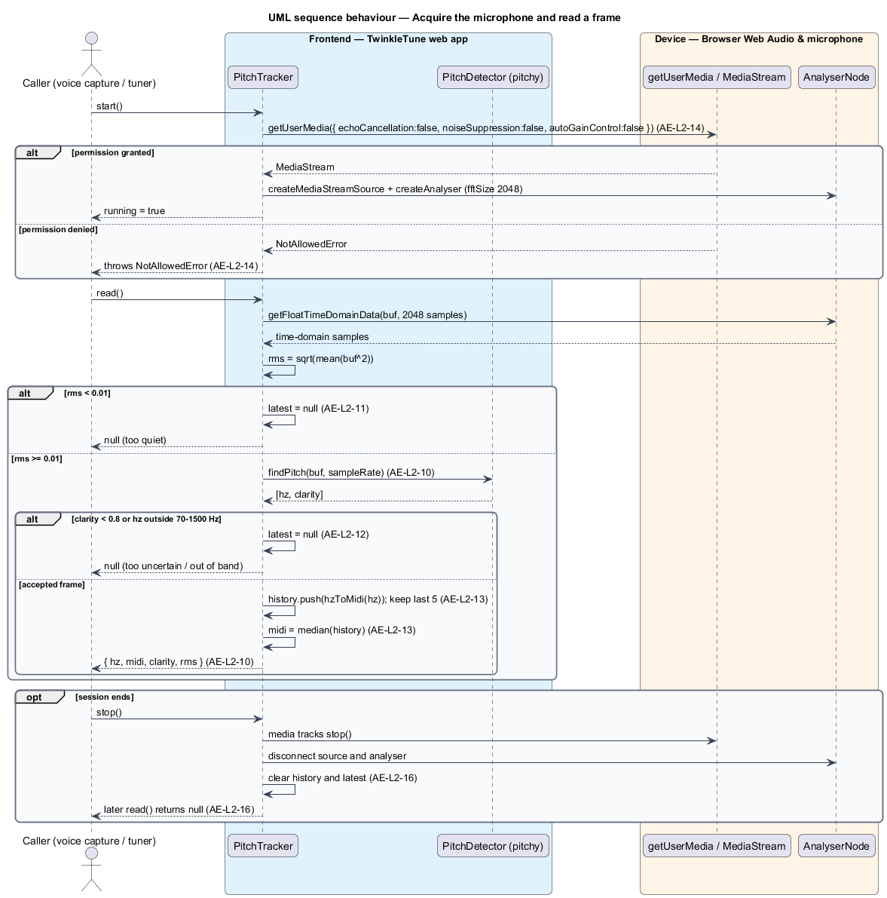

# Detect pitch

## Overview

TwinkleTune listens to a child sing and reports the pitch in real time, so
gameplay and scoring can react to whether the note is high or low. Detection runs
on the device from the microphone; no audio leaves the tablet. Homes are noisy
and tablets are budget hardware, so the detector rejects sound that is too quiet
or too uncertain to be a sung note, and it smooths brief octave jumps.

audio engine — on-device layer that synthesises a song's melody and detects the
singer's pitch

This feature covers pitch input: acquiring the microphone, analysing one window
of samples per frame, gating and smoothing the result, and releasing the
microphone on stop. It reports raw pitch only; deciding whether the pitch is
correct belongs to scoring, and finding a comfortable vocal range belongs to
voice personalization. It runs offline on the device.

The terms below are used throughout.

- pitch frame — per-poll result carrying `hz`, a floating-point `midi`, a
  `clarity`, and an `rms`, or absent when the frame is rejected
- McLeod pitch method — autocorrelation-based algorithm, supplied by the `pitchy`
  library, that estimates a fundamental frequency and a clarity from a window of
  samples
- RMS — root-mean-square amplitude of a window, used as a loudness gate
- clarity — detector confidence in the range 0 to 1, used to reject uncertain
  detections
- median filter — smoothing that reports the median of the most recent accepted
  MIDI values, so one octave-error blip cannot swing the result
- floating-point MIDI — MIDI note number carried as a real number, so a pitch
  between two semitones is representable

## Description

The feature is a frontend-only slice inside `frontend/packages/audio-engine/src/pitch.ts`, with
one helper from `range.ts` and the `pitchy` library. No server participates.

- **`PitchTracker`** — class that owns the microphone and analysis graph.
  `start()` acquires the stream and builds the analyser; `read()` produces one
  frame; `stop()` releases everything. The `running` getter is true while an
  analyser exists.
- **`PitchFrame`** — result type with `hz`, `midi` (float, `60.0 = C4`),
  `clarity` (0 to 1), and `rms`.
- **`start()`** — async method that calls `getUserMedia` with `echoCancellation`,
  `noiseSuppression`, and `autoGainControl` all `false`, builds a
  `MediaStreamAudioSourceNode` and an `AnalyserNode` with `fftSize = 2048`, and
  connects them. A denied permission surfaces as a `NotAllowedError` thrown to
  the caller.
- **`read()`** — method that copies 2048 time-domain samples into `buf`, computes
  `rms`, and returns `null` when `rms < MIN_RMS`. Otherwise it calls
  `detector.findPitch(buf, sampleRate)` and returns `null` when
  `clarity < MIN_CLARITY`, `hz < MIN_HZ`, or `hz > MAX_HZ`. On an accepted frame
  it pushes `hzToMidi(hz)` into `history`, keeps the last `MEDIAN_WINDOW` values,
  and reports the median as `midi`.
- **`stop()`** — method that stops the media tracks, disconnects the source and
  analyser, nulls the graph, and clears `history` and `latest`.
- **`PitchDetector.forFloat32Array(FFT_SIZE)`** — `pitchy` detector configured
  for the 2048-sample window; `findPitch` returns `[hz, clarity]`.
- **`hzToMidi(hz)`** — `range.ts` helper computing `69 + 12·log2(hz/440)`.

Constants (the shipped baseline): `FFT_SIZE = 2048`, `MIN_RMS = 0.01`,
`MIN_CLARITY = 0.8`, `MIN_HZ = 70`, `MAX_HZ = 1500`, `MEDIAN_WINDOW = 5`.

## Requirements

The feature realizes the following level-2 (L2) requirements. Each L2 requirement
refines a level-1 (L1) requirement, cited by identifier.

| L2 ID | Refines (L1) | Requirement |
|-------|--------------|-------------|
| `AE-L2-10` | `AE-L1-4` | The engine shall analyse 2048-sample time-domain windows with the McLeod pitch method and, for an accepted frame, report `{ hz, midi, clarity, rms }` where `midi` is a float (`69 + 12·log2(hz/440)`). |
| `AE-L2-11` | `AE-L1-5` | The engine shall reject (report no pitch for) any frame whose RMS level is below 0.01, so quiet background noise does not register as singing. |
| `AE-L2-12` | `AE-L1-5` | The engine shall reject a frame whose detector clarity is below 0.8 or whose frequency falls outside 70–1500 Hz, so uncertain or out-of-band detections are discarded. |
| `AE-L2-13` | `AE-L1-4, AE-L1-5` | The reported MIDI value shall be the median of the most recent 5 accepted frames, so a single octave-error blip cannot swing the reported pitch. |
| `AE-L2-14` | `AE-L1-6` | The engine shall request the microphone with echo cancellation, noise suppression, and auto-gain **disabled** (to preserve pitch fidelity), and shall propagate a permission-denied error to the caller rather than swallowing it. |
| `AE-L2-16` | `AE-L1-6` | Stopping the tracker shall stop the media tracks, disconnect the audio nodes, and clear the smoothing history and last frame, so no microphone remains active and no stale pitch survives into a later session. |

## Diagrams

### System context

The singer sings into the TwinkleTune web app, which requests the microphone and
reads audio frames through the browser Web Audio API on the device.

### Containers

A voice-capture or tuner screen polls the pitch engine each frame, and the engine
acquires the microphone and reads the analyser through the browser.

### Components

Inside `pitch.ts`, `PitchTracker` reads the `AnalyserNode`, delegates the
frequency estimate to the `pitchy` `PitchDetector`, and converts frequency to
MIDI through `hzToMidi()`.

### Class structure

`PitchTracker` produces a `PitchFrame`, depends on the `pitchy` `PitchDetector`
for `findPitch`, and on `range.ts` for `hzToMidi`.

### Behaviour — acquire the microphone and read a frame

`start()` requests the microphone with echo cancellation, noise suppression, and
auto-gain off (`AE-L2-14`); the `alt` models the denied-permission path. `read()`
then applies the RMS gate (`AE-L2-11`), the clarity and bounds gate (`AE-L2-12`),
the McLeod estimate (`AE-L2-10`), and the median filter (`AE-L2-13`), with the
too-quiet and too-uncertain rejections shown as `alt` branches and the teardown
(`AE-L2-16`) as an `opt`.

