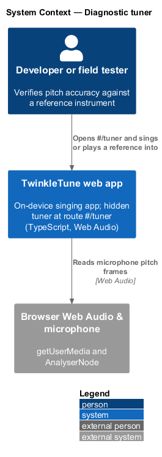
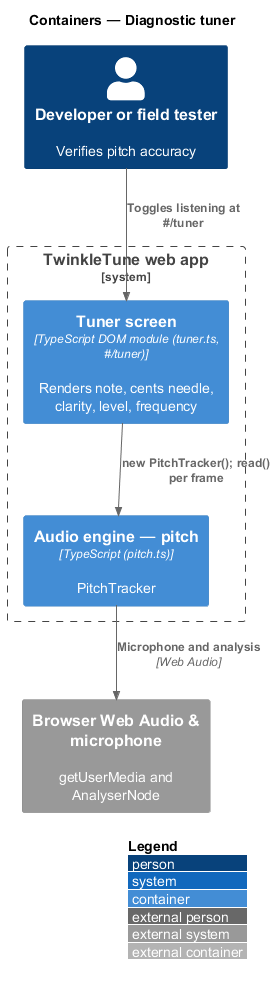
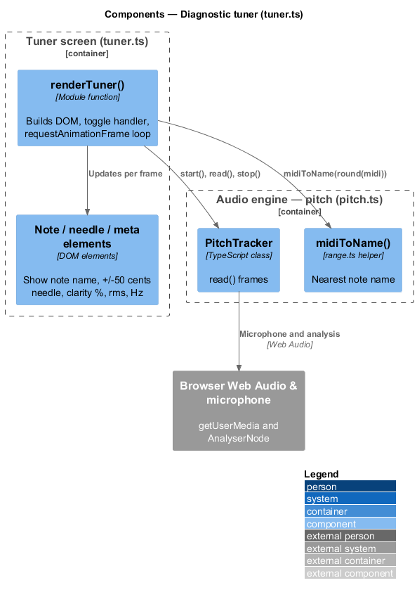
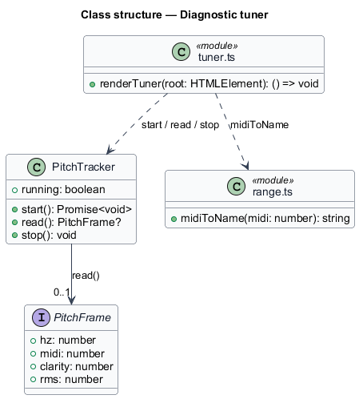
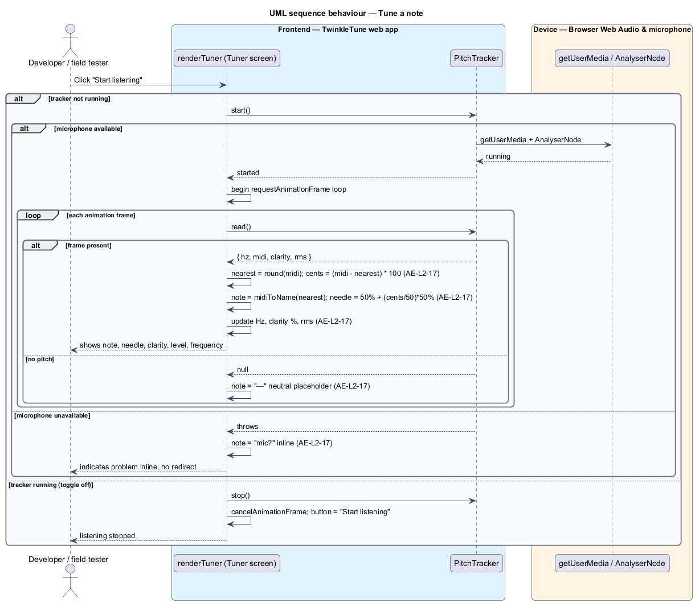

# Diagnostic tuner

## Overview

The audio engine's pitch detector needs a way to be checked against a known
reference — a piano note, a tuning app, a physical tuner — without extra tooling.
The diagnostic tuner is a hidden developer screen that shows, live, what the
detector hears: the nearest note, how many cents sharp or flat, the detector's
confidence, the loudness, and the raw frequency. A tester sings or plays a
reference and confirms the readout matches.

audio engine — on-device layer that synthesises a song's melody and detects the
singer's pitch

This feature covers only the tuner screen and its use of the pitch detector. It
is reached at the route `#/tuner` and is not linked from normal navigation. It
runs offline on the device.

The terms below are used throughout.

- diagnostic tuner — hidden screen that displays the live pitch readout for
  verifying detection accuracy
- cents deviation — distance from the nearest semitone in hundredths of a
  semitone, positive when sharp and negative when flat
- needle — horizontal indicator whose offset from centre shows the cents
  deviation across a ±50-cent span
- neutral placeholder — dash shown for the note when no pitch is detected, so a
  stale note is not left on screen

## Description

The feature is a frontend-only slice inside `frontend/src/screens/tuner.ts`,
driving `PitchTracker` from `pitch.ts` and `midiToName` from `range.ts`. No
server participates.

- **`renderTuner(root)`** — function that renders the tuner markup into `root`,
  wires the toggle button and the animation-frame loop, and returns a teardown
  that cancels the loop and stops the tracker. It constructs one `PitchTracker`.
- **`PitchTracker`** — pitch engine class (from the detect-pitch feature). The
  screen calls `start()`, `read()`, and `stop()` and reads the `running` getter.
- **`loop()`** — inner function scheduled with `requestAnimationFrame`. It reads
  a frame; on `null` it sets the note element to the neutral placeholder `—` and
  returns. On a frame it computes `nearest = Math.round(f.midi)` and
  `cents = (f.midi - nearest) * 100`, sets the note text to
  `midiToName(nearest)`, positions the needle at
  `calc(50% + (cents / 50) * 50% - 4px)`, and writes the frequency, the clarity
  as a percentage, and the RMS.
- **Toggle handler** — button click handler. When the tracker is running it
  stops the tracker, cancels the loop, and resets the button label. Otherwise it
  awaits `tracker.start()` and starts the loop; a thrown error (microphone
  unavailable) sets the note element to `mic?` inline, without navigation.
- **`midiToName(midi)`** — `range.ts` helper returning the note name and octave
  for a rounded MIDI value (for example `A4`).

The readout elements are `[data-note]`, `[data-needle]`, `[data-hz]`,
`[data-clarity]`, and `[data-rms]`; the button is `[data-toggle]`.

## Requirements

The feature realizes the following level-2 (L2) requirement, which refines a
level-1 (L1) requirement, cited by identifier.

| L2 ID | Refines (L1) | Requirement |
|-------|--------------|-------------|
| `AE-L2-17` | `AE-L1-7` | The hidden tuner screen shall display, per detected frame, the nearest note name, the cents deviation on a needle (±50 cents mapped across the display), the clarity as a percentage, the level (RMS), and the frequency; it shall toggle listening on/off and, if the microphone is unavailable, indicate this inline without navigating away. |

## Diagrams

### System context

The developer or field tester opens the hidden `#/tuner` screen in the TwinkleTune
web app and sings or plays a reference; the app reads pitch frames through the
browser Web Audio API.

### Containers

The tuner screen drives the pitch engine, which acquires the microphone and reads
the analyser through the browser.

### Components

Inside `tuner.ts`, `renderTuner()` runs the animation-frame loop, reads frames
from `PitchTracker`, names the note through `midiToName()`, and updates the note,
needle, and meta elements.

### Class structure

`renderTuner` depends on `PitchTracker` for frames, on `range.ts` for
`midiToName`, and reads the `PitchFrame` fields it displays.

### Behaviour — tune a note

Toggling listening on starts the tracker and the loop; each frame updates the
note name, the cents needle, the clarity, the level, and the frequency
(`AE-L2-17`). A missing frame shows the neutral placeholder, and an unavailable
microphone is indicated inline as `mic?` without navigating away, both shown as
`alt` branches (`AE-L2-17`).

