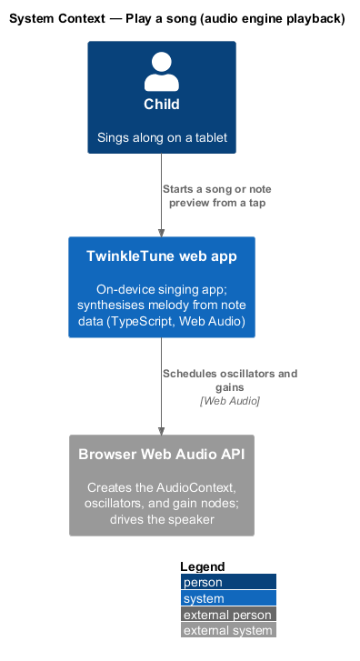
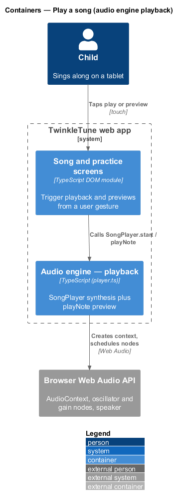
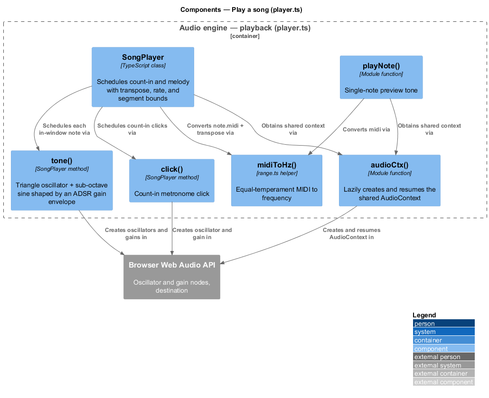
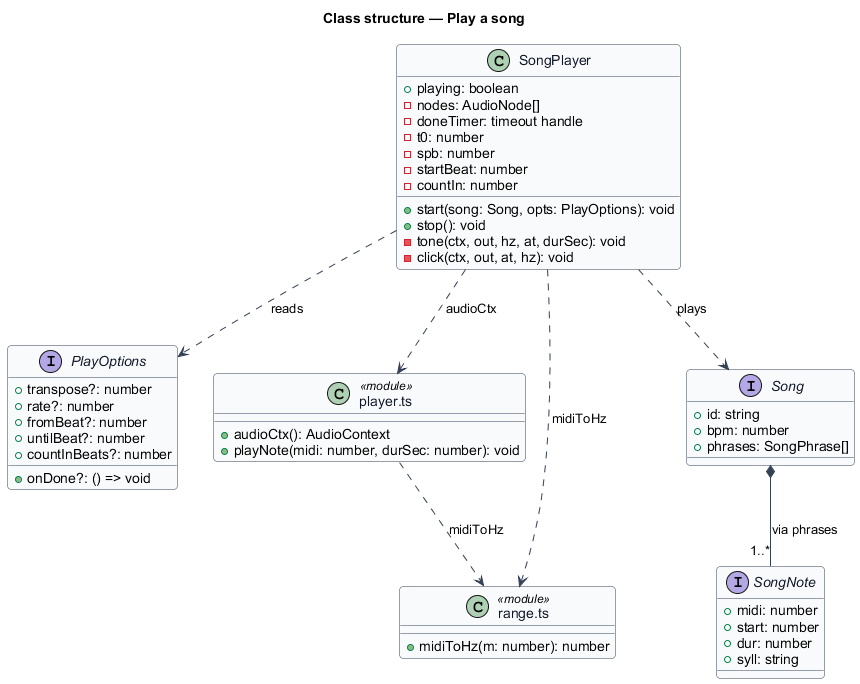
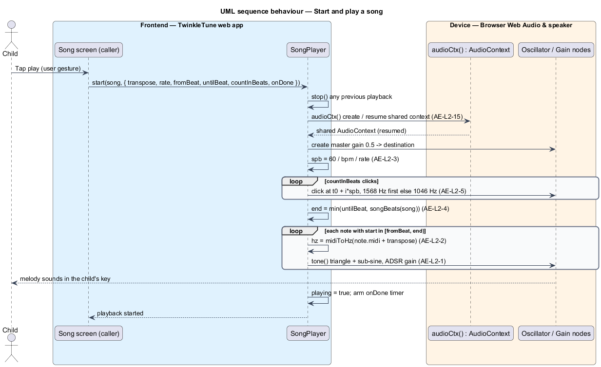
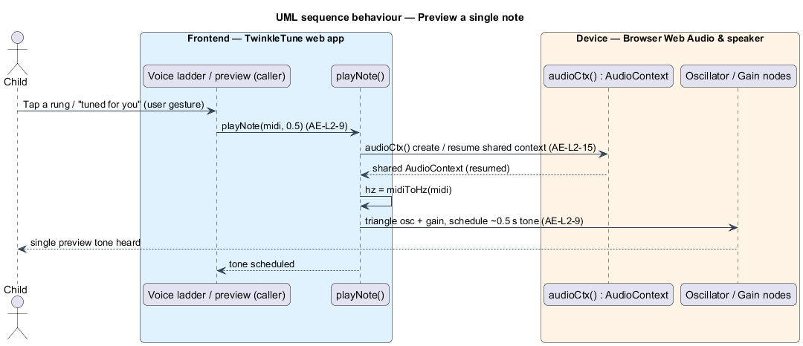

# Play a song

## Overview

TwinkleTune is a singing app for children. It plays each song in a key that
suits the singer, and it can slow a hard phrase down for practice. Playback is
synthesised on the device from note data — a song is a list of
`{ midi, start, dur, syll }` records, not a recording — so the melody can be
re-keyed or slowed with no audio files and no artefacts.

audio engine — on-device layer that synthesises a song's melody and detects the
singer's pitch

This feature covers the playback half of the audio engine: turning a song into
sound with a caller-chosen key, speed, segment, and count-in, and previewing one
note on demand. Scoring, the gameplay visuals, and the pitch input belong to
other subsystems; this feature produces sound only. It runs fully offline on the
device through the browser Web Audio API, with no server involved.

The terms below are used throughout.

- transposition — shift of every note by a fixed number of semitones, so a song
  sounds higher or lower with no change to its timing
- playback rate — multiplier on playback speed, where 1 is normal speed and 0.7
  lengthens each beat for slow practice
- segment — run of a song bounded by a start beat and a stop beat, so a single
  phrase or the whole song can play
- count-in — sequence of metronome clicks before the melody that sets the tempo
  for the singer
- ADSR gain envelope — attack, sustain, and release curve applied to a note's
  amplitude, so a tone fades in and out instead of clicking
- master gain — single gain node the whole mix passes through before the speaker
- single-note preview — one-off tone at a given MIDI pitch, played outside a song
- AudioContext — browser Web Audio graph and clock shared by playback and pitch
  analysis

## Description

The feature is a frontend-only slice inside `frontend/packages/audio-engine/src/player.ts`, with
one helper from `range.ts`. No server participates.

- **`SongPlayer`** — class that schedules a song's count-in and melody.
  `start(song, opts)` reads `PlayOptions`, stops any previous playback, obtains
  the shared context, computes seconds-per-beat, schedules the count-in and the
  in-window notes, and arms the completion timer. `stop()` tears the playback
  down.
- **`PlayOptions`** — options object carrying `transpose`, `rate`, `fromBeat`,
  `untilBeat`, `countInBeats`, and `onDone`. Defaults are `transpose = 0`,
  `rate = 1`, `fromBeat = 0`, `untilBeat = Infinity`, and `countInBeats = 4`.
- **`SongPlayer.tone(...)`** — private method that renders one note as a
  `triangle` oscillator at the note frequency plus a quieter `sine` one octave
  below, shaped by an ADSR gain envelope and mixed through the master gain
  (value 0.5).
- **`SongPlayer.click(...)`** — private method that renders one count-in click as
  a short `sine` tone; beat 0 sounds at 1568 Hz and later beats at 1046 Hz.
- **`playNote(midi, durSec = 0.5)`** — module function that plays a single
  `triangle` tone at the pitch of `midi` for a default 0.5 s, used by the voice
  ladder and the "tuned for you" preview.
- **`audioCtx()`** — module function that lazily creates the single shared
  `AudioContext` and resumes it when suspended.
- **`midiToHz(m)`** — `range.ts` helper that converts a MIDI value to frequency
  by equal temperament (`440·2^((m-69)/12)`).
- **`songBeats(song)` / `allNotes(song)`** — `songs/types.ts` helpers that give
  the song length in beats and its flat note list, used to bound the segment and
  iterate the notes.

Timing: `start()` sets `t0 = ctx.currentTime + 0.08` and `spb = 60 / bpm / rate`.
A note at beat `b` is scheduled at `t0 + (countInBeats + b - fromBeat)·spb`. The
segment upper bound is `end = min(untilBeat, songBeats(song))`, and a note is
scheduled only when `fromBeat <= start < end`.

## Requirements

The feature realizes the following level-2 (L2) requirements. Each L2 requirement
refines a level-1 (L1) requirement, cited by identifier.

| L2 ID | Refines (L1) | Requirement |
|-------|--------------|-------------|
| `AE-L2-1` | `AE-L1-1` | The engine shall synthesise each note as a triangle oscillator at the note's frequency plus a quieter sine one octave below, shaped by an attack/sustain/release gain envelope, mixed through a master gain, so the voice is soft and toy-piano-like. |
| `AE-L2-2` | `AE-L1-2` | The engine shall shift every note's pitch by the caller-supplied `transpose` semitones by converting `note.midi + transpose` to frequency, with no change to timing and no artefacts. |
| `AE-L2-3` | `AE-L1-2` | The engine shall scale playback speed by the caller-supplied `rate`, computing seconds-per-beat as `60 / bpm / rate`; a `rate` of 0.7 shall lengthen every beat for slow practice while preserving pitch. |
| `AE-L2-4` | `AE-L1-2` | The engine shall play only notes whose start lies in `[fromBeat, end)` where `end = min(untilBeat, songLengthInBeats)`, enabling a single phrase (or the whole song) to be scheduled. |
| `AE-L2-5` | `AE-L1-2` | Before the melody, the engine shall play `countInBeats` metronome clicks (default 4) at one per beat, with the first click higher in pitch than the rest, to prepare the singer. |
| `AE-L2-9` | `AE-L1-1` | The engine shall play a single note of a given MIDI value for a short default duration, for use by the voice ladder and the "tuned for you" preview. |
| `AE-L2-15` | `AE-L1-6` | The engine shall create a single shared `AudioContext` lazily and resume it when suspended, so audio starts reliably after the first user gesture on mobile browsers. |

## Diagrams

### System context

The child starts a song or a preview in the TwinkleTune web app, which schedules
sound through the browser Web Audio API on the device.

### Containers

A song or practice screen calls the playback engine, which creates the shared
`AudioContext` and schedules oscillator and gain nodes.

### Components

Inside `player.ts`, `SongPlayer` drives `tone()` for each in-window note and
`click()` for the count-in, obtaining the shared context from `audioCtx()` and
frequencies from `midiToHz()`; `playNote()` reuses the same context for previews.

### Class structure

`SongPlayer` reads `PlayOptions`, plays a `Song`, and depends on the `player.ts`
and `range.ts` module functions for the shared context and for MIDI-to-frequency
conversion.

### Behaviour — start and play a song

`start()` resumes the shared context, computes seconds-per-beat from `rate`
(`AE-L2-3`), schedules the count-in clicks (`AE-L2-5`), bounds the segment
(`AE-L2-4`), and schedules each in-window note through `midiToHz` with the
transposition applied (`AE-L2-2`) and the toy-piano voice (`AE-L2-1`).

### Behaviour — preview a single note

`playNote()` resumes the shared context (`AE-L2-15`) and schedules one short tone
at the requested pitch (`AE-L2-9`), for the voice ladder and the "tuned for you"
preview.

