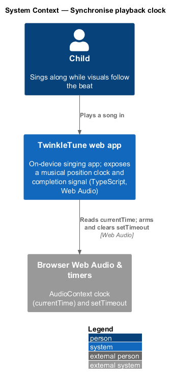
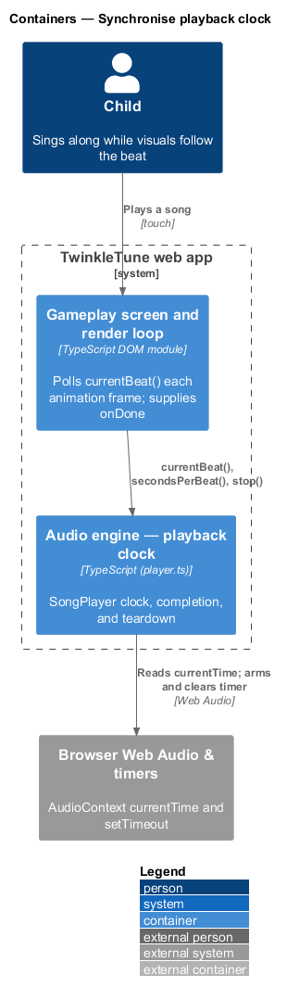
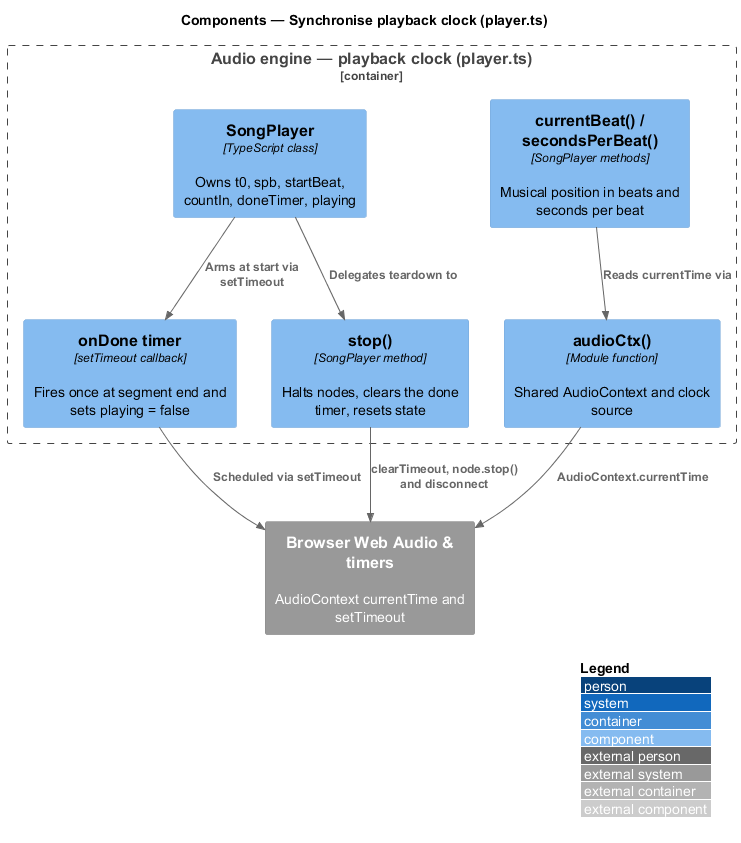
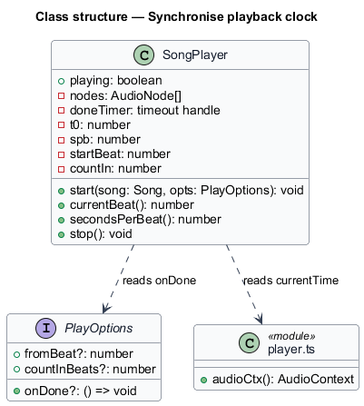
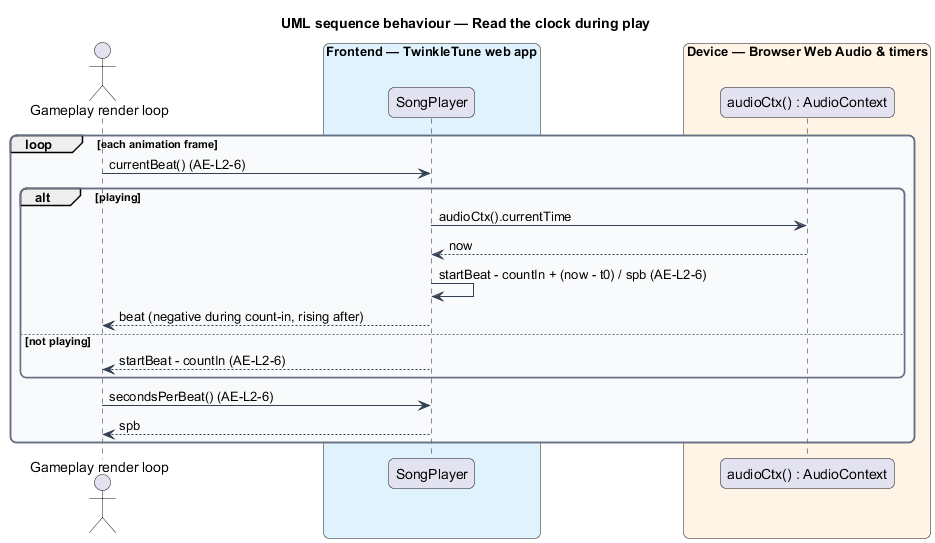
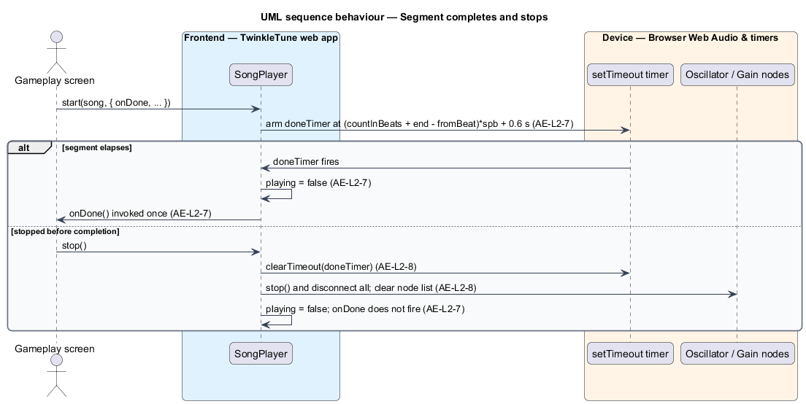

# Synchronise playback clock

## Overview

TwinkleTune plays a synthesised melody while gameplay visuals — falling pitch
pills and a singing avatar — track the same beat. For the picture to stay locked
to the sound, the playback engine exposes where the music is, in beats, at any
moment, and signals when a scheduled stretch of music has finished.

audio engine — on-device layer that synthesises a song's melody and detects the
singer's pitch

This feature covers the timing surface of the playback engine: a musical
position clock read once per animation frame, a one-shot completion signal, and a
clean teardown that halts sound and cancels the pending signal. The gameplay
render loop consumes the clock; this feature only reports position and tears the
playback down. It runs offline on the device.

The terms below are used throughout.

- musical position clock — reading, in beats, of how far playback has advanced
  from the segment start, negative during the count-in
- seconds-per-beat — duration of one beat at the current tempo and rate, written
  `spb`
- count-in — sequence of metronome clicks before the melody, spanning
  `countInBeats` beats of negative clock position
- completion signal — single `onDone` callback invoked once after the scheduled
  segment plus a short tail elapses
- teardown — stop of every scheduled node and cancellation of the pending
  completion signal, leaving no audible tail or leaked node

## Description

The feature is a frontend-only slice inside `frontend/src/audio/player.ts`. No
server participates. The relevant members of `SongPlayer` are:

- **`currentBeat()`** — method returning the position in beats relative to the
  segment start. When not playing it returns `startBeat - countIn`; while playing
  it returns `startBeat - countIn + (audioCtx().currentTime - t0) / spb`. The
  value is negative during the count-in and rises through the segment.
- **`secondsPerBeat()`** — method returning the current `spb`, so the render loop
  can size one beat in seconds.
- **`onDone` timer** — completion signal armed in `start()` with `setTimeout` at
  `(countInBeats + end - fromBeat)·spb + 0.6` s. On fire it sets `playing = false`
  and invokes the caller's `onDone` once. The handle is held in `doneTimer`.
- **`stop()`** — method that sets `playing = false`, clears `doneTimer` when set,
  and, for each node in `nodes`, stops the oscillators and disconnects the node,
  then empties the node list. `start()` calls `stop()` first, so a new song
  replaces any playing one with no overlap.
- **`audioCtx()`** — module function that supplies the shared `AudioContext`
  whose `currentTime` is the clock source read by `currentBeat()`.

State that backs the clock: `t0` (context time of the count-in start plus a
0.08 s lead), `spb`, `startBeat` (the `fromBeat`), and `countIn` (the
`countInBeats`).

## Requirements

The feature realizes the following level-2 (L2) requirements. Each L2 requirement
refines a level-1 (L1) requirement, cited by identifier.

| L2 ID | Refines (L1) | Requirement |
|-------|--------------|-------------|
| `AE-L2-6` | `AE-L1-3` | The engine shall report the current position in beats relative to the segment start, returning a negative value during the count-in and increasing through the segment; it shall also report the current seconds-per-beat. |
| `AE-L2-7` | `AE-L1-3` | When an `onDone` callback is supplied, the engine shall invoke it once, after the scheduled segment (plus a short tail) has elapsed, and shall mark playback as no longer playing. |
| `AE-L2-8` | `AE-L1-6` | Stopping playback shall halt and disconnect all scheduled audio nodes, clear any pending completion timer, and set the not-playing state, leaving no audible tail or leaked node. |

## Diagrams

### System context

The child plays a song in the TwinkleTune web app, which reads the browser's
`AudioContext` clock and schedules a `setTimeout` timer on the device.

### Containers

The gameplay screen and render loop poll the playback engine for the current beat
and supply the completion callback; the engine reads the clock and manages the
timer through the browser.

### Components

Inside `player.ts`, `currentBeat()` and `secondsPerBeat()` read the shared
context clock, the `onDone` timer fires the completion signal, and `stop()` tears
the playback down.

### Class structure

`SongPlayer` holds the clock state (`t0`, `spb`, `startBeat`, `countIn`,
`doneTimer`, `playing`), reads `PlayOptions.onDone`, and reads the shared context
clock through the `player.ts` module function.

### Behaviour — read the clock during play

Each animation frame reads `currentBeat()` (`AE-L2-6`); while playing it derives
the beat from the shared context time, and when stopped it returns the resting
count-in position. `secondsPerBeat()` reports the current `spb` (`AE-L2-6`).

### Behaviour — segment completes and stops

The armed timer fires once at the end of the segment, sets `playing = false`, and
invokes `onDone` (`AE-L2-7`). The `alt` branch shows a stop before completion:
`stop()` clears the timer and disconnects every node (`AE-L2-8`), so `onDone`
does not fire.

