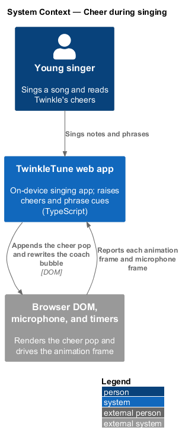
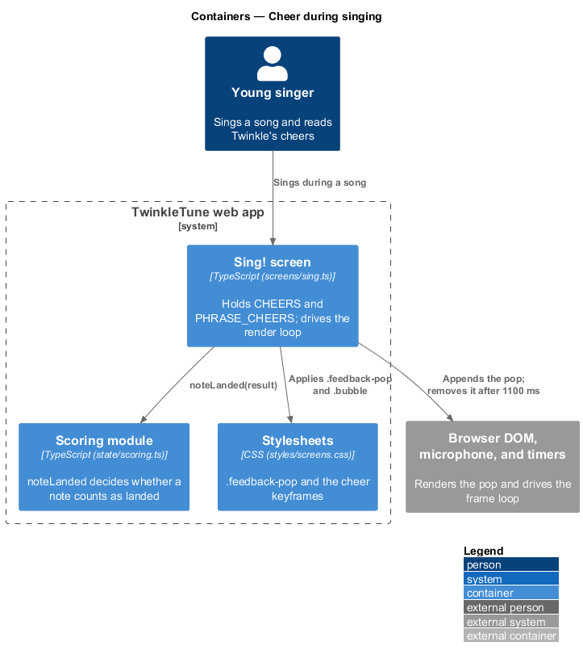
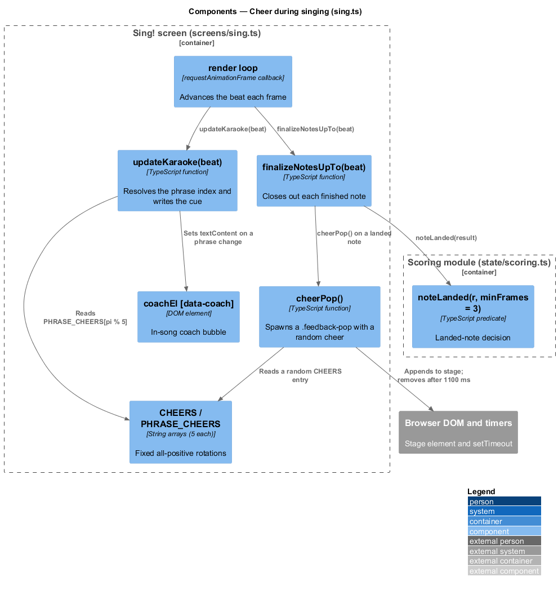
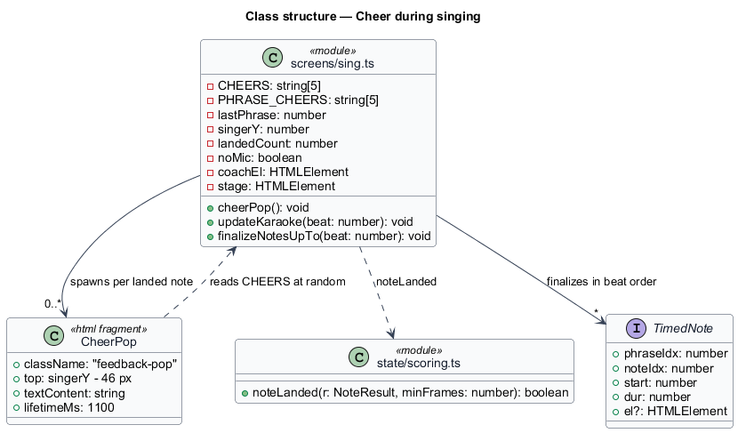
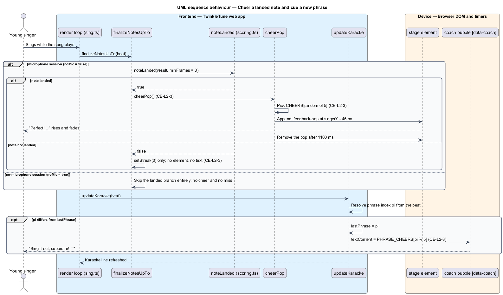

# Cheer During Singing

## Overview

While a child sings, TwinkleTune answers every landed note with a short burst of
praise and every new lyric phrase with a fresh line from Twinkle. This feature
owns that copy and the way it is drawn: the fixed cheer rotations, the pop
animation above the singing star, and the in-song coach bubble that changes as
the song moves from phrase to phrase.

The slice is deliberately narrow. The Sing! screen decides *when* a note has
landed and *when* the song crosses a phrase boundary; this feature decides *what
is said* and guarantees the answer is always positive. The streak chip, the
sparkle tally, and the "tuned just for you" reveal are the neighbouring
`encourage-during-play` slice in Singing Gameplay; nothing here duplicates them.

The terms below are used throughout.

- landed note — note the singer matched within tolerance for at least 3 heard
  frames, as decided by `noteLanded`
- cheer — one-to-three-word praise drawn at random from a fixed rotation and
  shown above the singing star
- cheer pop — transient element that fades in, rises, and removes itself 1100 ms
  after a landed note
- phrase cue — encouraging line written into the in-song coach bubble when the
  song advances to a new lyric phrase
- phrase index — position of the current phrase in the song, used to pick the cue
  deterministically
- silent miss — unlanded note that resets the streak and produces no message at
  all

## Description

The feature lives entirely in `frontend/src/screens/sing.ts`, with the animation
in `frontend/src/styles/screens.css` and the landed-note decision in
`frontend/src/state/scoring.ts`. No server participates.

- **`CHEERS`** — module-level array of 5 strings:
  `'Perfect! ✨'`, `'Great! 🌟'`, `'Yes! 💙'`, `'Sparkly! ✨'`, `'Wow! 🎉'`. Every
  entry is praise; the array holds no neutral or corrective wording.
- **`PHRASE_CHEERS`** — module-level array of 5 strings:
  `'Big breath — here comes the next part!'`, `"You're doing wonderfully! 💙"`,
  `'Right on the notes — keep going!'`, `'I love this part! 🎵'`, and
  `'Sing it out, superstar! ⭐'`.
- **`cheerPop()`** — function that creates a ``,
  positions it at `singerY - 46` px, sets its text to
  `CHEERS[Math.floor(Math.random() * CHEERS.length)]`, appends it to `stage`, and
  removes it with a `setTimeout` of 1100 ms.
- **`.feedback-pop`** — absolutely positioned class at `left:30%` running the
  `cheer` keyframe animation for 1 s: scale from 0.4 to 1.1, then a rise of 26 px
  while fading out.
- **`singerY`** — smoothed vertical position of the singing star, so the cheer
  appears just above wherever the child's pitch has placed it.
- **`updateKaraoke(beat)`** — function that resolves the current phrase index
  `pi` from the beat. When `pi !== lastPhrase` it stores the new index in
  `lastPhrase` and sets `coachEl.textContent = PHRASE_CHEERS[pi %
  PHRASE_CHEERS.length]`, so each phrase change brings one cue and repeated
  frames inside a phrase bring none.
- **`coachEl`** (`[data-coach]`) — the in-song coach bubble, seeded with
  `Take a big balloon breath… 🎈` before the first phrase resolves.
- **`lastPhrase`** — index of the phrase most recently announced, initialised to
  `-1`.
- **`finalizeNotesUpTo(beat)`** — function that closes out each note whose end
  beat has passed. On `noteLanded(r)` it increments `landedCount`, advances the
  streak, adds the `hit` class to the note pill, and calls `cheerPop()`. On an
  unlanded note it calls `setStreak(0)` and nothing else — no element is created
  and no text is written.
- **`noteLanded(r, minFrames = 3)`** (`frontend/src/state/scoring.ts`) — predicate
  deciding whether a note counts as landed.
- **`noMic`** — flag set when the child plays without a microphone. While `noMic`
  is true the whole landed/unlanded branch is skipped, so a no-microphone session
  produces neither cheers nor silent misses.

## Requirements

The feature realizes the following level-2 (L2) requirement, refining the cited
level-1 (L1) requirement.

| L2 ID | Refines (L1) | Requirement |
|-------|--------------|-------------|
| `CE-L2-3` | `CE-L1-2` | On each landed note the system shall show a short, varied, positive cheer; on each new phrase the coach bubble shall show an encouraging cue. No missed note shall produce a negative message. |

## Diagrams

### System context

The child sings into the tablet and reads cheers and phrase cues drawn on device;
no cheer text crosses a network (`CE-L2-3`).

### Containers

The Sing! screen module holds the cheer rotations and writes them into the stage
and the coach bubble, styled by the stylesheet container (`CE-L2-3`).

### Components

`finalizeNotesUpTo` calls `cheerPop` for each landed note and `updateKaraoke`
sets the phrase cue; `noteLanded` supplies the landed decision (`CE-L2-3`).

### Class structure

The Sing! screen module owns both fixed rotations, the cheer pop element, and the
coach bubble element, and depends on the scoring module for `noteLanded`.

### Behaviour — cheer a landed note and cue a new phrase

Each animation frame finalises the notes whose time has passed and refreshes the
karaoke line. The `alt` branches show the landed note raising a random cheer and
the unlanded note passing in silence, and the `opt` shows a phrase change writing
one cue into the coach bubble (`CE-L2-3`).

