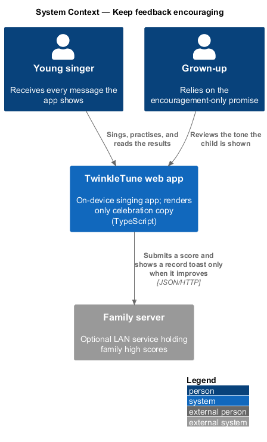
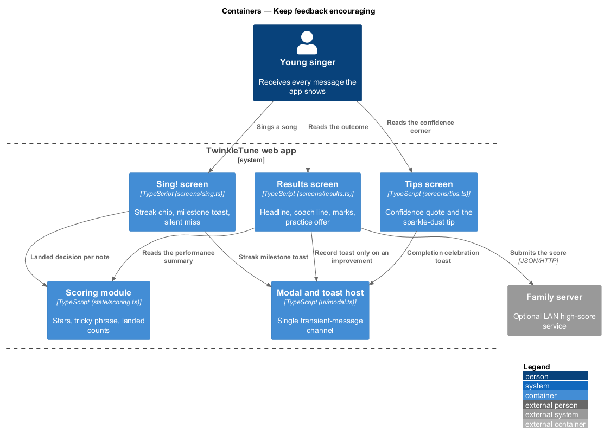
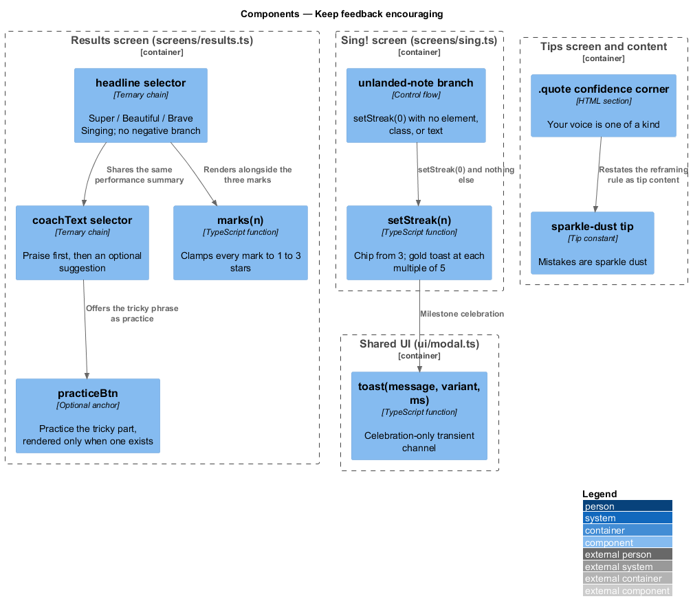
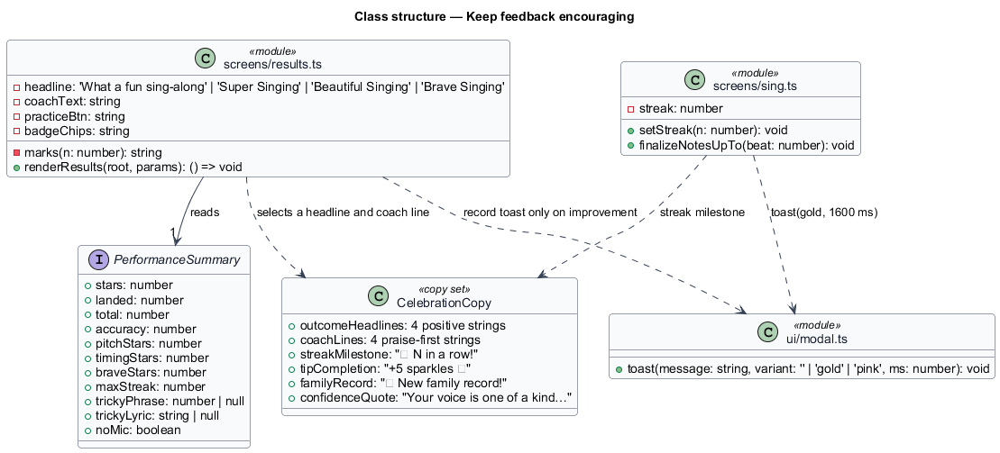
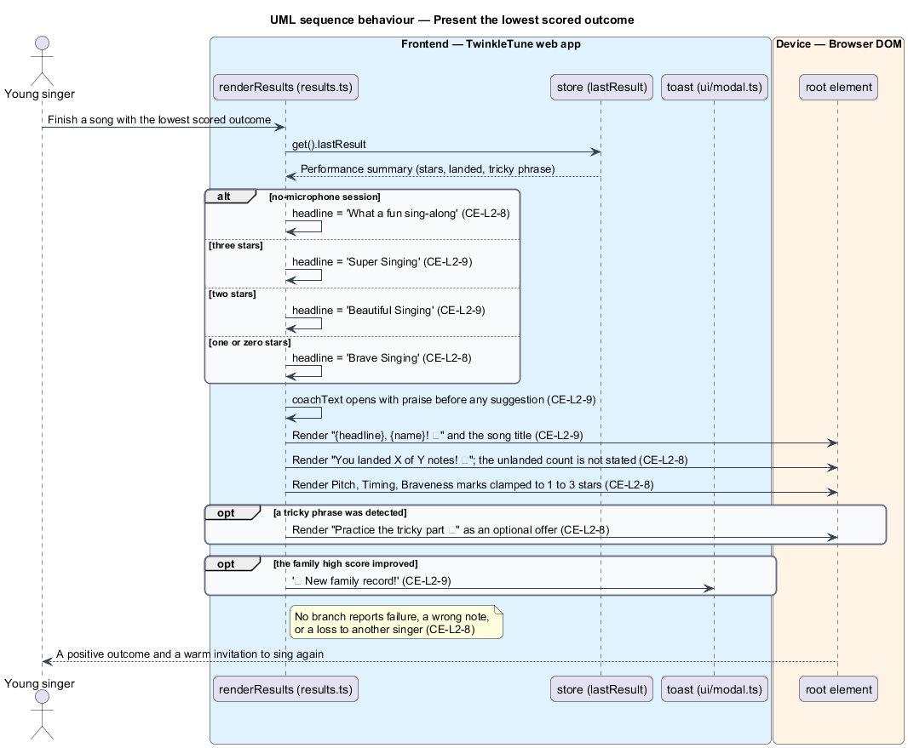
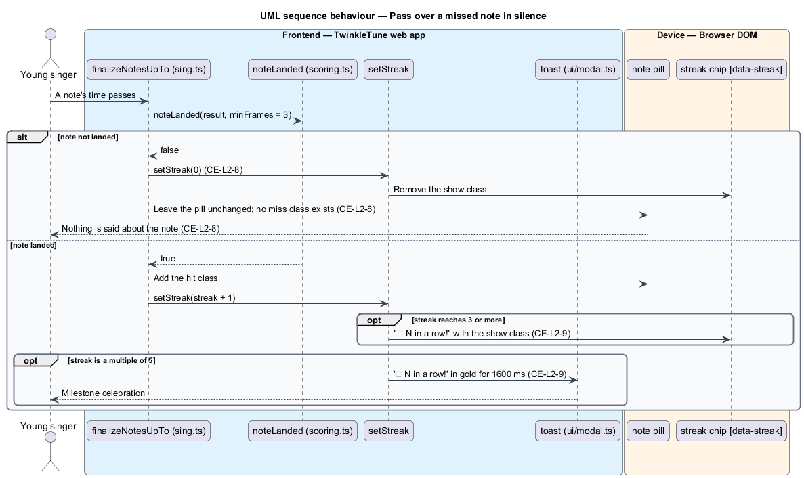

# Keep Feedback Encouraging

## Overview

Product principle P1 states that no subsystem presents failure, ranking against
others, or punitive feedback to the child. This feature is where that principle
becomes a concrete design: the vocabulary the product is allowed to use, the
absence of any failure path in the interface, and the reframing of difficulty as
an invitation. It is cross-cutting by nature — it constrains the results screen,
the singing stage, the tips library, and every toast — rather than owning a
screen of its own.

Two rules carry the whole feature. The first is negative: nothing rendered to the
child names failure, error, or loss, so there is no interface state to design for
a bad performance. The second is positive: every celebration is written warmly
and specifically, so praise reads as attention rather than as a stock message.
The design achieves the first rule by construction — the lowest outcome is a
named positive outcome and an unlanded note produces no output at all — and the
second by an authored, reviewed copy set.

The terms below are used throughout.

- encouragement-only guarantee — product-wide rule that no rendered text names
  failure, wrongness, or loss
- outcome headline — top line of the results screen naming the performance, of
  which the lowest is `Brave Singing`
- silent miss — unlanded note that resets the streak and renders no text or
  element
- reframing — presentation of a difficult passage as an optional practice offer
  rather than a deduction
- tricky part — phrase with the lowest landed ratio, offered afterwards as an
  optional loop
- celebration copy — headlines, coach lines, streak toasts, badge chips, and
  quotes shown after or during a performance

## Description

The feature has no single module. It is realised by the copy and the branch
structure of `frontend/src/screens/results.ts`,
`frontend/src/screens/sing.ts`, `frontend/src/screens/tips.ts`, and
`frontend/src/ui/modal.ts`.

- **`headline`** (`results.ts`) — the outcome line. `r.noMic` yields
  `'What a fun sing-along'`; otherwise `r.stars === 3` yields `'Super Singing'`,
  `r.stars === 2` yields `'Beautiful Singing'`, and every remaining case —
  including zero stars — yields `'Brave Singing'`. The ternary chain has no
  branch that names a poor result, so the worst outcome is still an achievement.
- **`whoop` heading** — renders `${headline}, ${name}! 🎉` above a `<small>`
  carrying the song title, so the child's own name is part of the celebration.
- **`coachText`** (`results.ts`) — the coach line, selected in four branches: the
  no-microphone invitation `That sounded like so much fun! Want to sing it again
  with Twinkle listening?`; the tricky-part reframe `Your notes sparkled! The
  "{trickyLyric}" part was tricky — want to practice just that bit?`; the
  three-star line `Absolutely magical. You landed this song — pick a brave new
  one!`; and the fallback `That was wonderful. One more sing and it'll shine even
  brighter!`. Every branch opens with praise before any suggestion.
- **`practiceBtn`** (`results.ts`) — rendered only when `r.trickyPhrase !== null`
  outside no-microphone mode, as an optional link labelled
  `Practice the tricky part 🎯`. It is an offer, not a required correction.
- **`scoreCard`** (`results.ts`) — states the count as
  `You landed ${r.landed} of ${r.total} notes! 🎯` with an accuracy fill bar. The
  count of unlanded notes is never stated, and the three marks are labelled
  `Pitch`, `Timing`, and `Braveness`, each rendered as one to three stars by
  `marks(n)` so that no mark can show zero.
- **`badgeChips`** (`results.ts`) — `.badge-toast` chips reading
  `{emoji} New badge: {name}!`, added only for newly earned badges; no chip is
  rendered for a badge missed.
- **`setStreak(n)`** (`sing.ts`) — on a landed note it advances the streak, shows
  `🔥 ${streak} in a row!` from 3 upwards, and fires
  `toast('🔥 ${streak} in a row!', 'gold', 1600)` at every multiple of 5. On an
  unlanded note `finalizeNotesUpTo` calls `setStreak(0)` and takes no other
  action: the chip hides, and no text, class, or element marks the note.
- **`hit` class** (`sing.ts`, `.note.hit` in `styles/screens.css`) — the only
  per-note visual state applied after a note finalises. No matching miss class
  exists, so an unlanded note is styled exactly like a note not yet reached.
- **`.quote` block** (`tips.ts`) — the confidence corner carrying
  `"Your voice is one of a kind — that's your superpower."` attributed to
  Twinkle.
- **`sparkle-dust` tip** (`tips-data.ts`) — the tip titled "Mistakes are sparkle
  dust", whose steps state that every singer sings wobbly notes and close with
  `Twinkle says: brave singing beats perfect singing, every time. 💙`. It turns
  the reframing rule into content the child can read directly.
- **`toast(message, variant, ms)`** (`ui/modal.ts`) — the shared transient
  message. Every call site in the product passes a celebration: `+5 sparkles ✨`
  on a completed tip, the streak milestone, and `🏆 New family record!` when a
  high score improves. No call site reports a loss when a score does not improve.
- **`Maybe later`** (`tips.ts`) — the dismissal link on the tip walk-through,
  worded as a deferral rather than a cancellation.
- **enforcement** — `<TO SUPPLY>`. The guarantee is currently upheld by authored
  copy and by the absence of failure branches; no automated vocabulary check or
  lint rule guards new copy against regressions.

## Requirements

The feature realizes the following level-2 (L2) requirements, each refining the
cited level-1 (L1) requirements.

| L2 ID | Refines (L1) | Requirement |
|-------|--------------|-------------|
| `CE-L2-8` | `CE-L1-5` | No screen, message, toast, headline, or reward interaction shall tell the child of failure, wrongness, or loss; the lowest scored outcome shall still be framed positively ("Brave Singing"), missed notes shall pass without comment, and difficulty shall be reframed as an invitation to practise. |
| `CE-L2-9` | `CE-L1-2, CE-L1-5` | Celebration copy — headlines, streak milestones, coach lines, and quotes — shall be warm, affirming, and child-appropriate. |

## Diagrams

### System context

The child receives only positive text from the app, whatever the performance; the
family server never contributes copy to a scored result (`CE-L2-8`).

### Containers

The guarantee spans the results screen, the Sing! screen, the tips screen, and
the shared toast host, each of which renders only celebration copy (`CE-L2-8`,
`CE-L2-9`).

### Components

The headline, coach line, practice offer, streak toast, and confidence quote are
the five points at which the guarantee is enforced by construction (`CE-L2-8`,
`CE-L2-9`).

### Class structure

The results copy selectors read the performance summary and map every outcome —
including the lowest — onto a positive headline and a warm coach line.

### Behaviour — present the lowest scored outcome

Even for a performance with zero stars the headline resolves to `Brave Singing`,
the coach line opens with praise, and the tricky phrase is offered as an optional
practice loop rather than a correction (`CE-L2-8`, `CE-L2-9`).

### Behaviour — pass over a missed note in silence

An unlanded note resets the streak and produces no element, no class, and no
text, while a landed note raises the streak chip and the milestone toast
(`CE-L2-8`, `CE-L2-9`).

