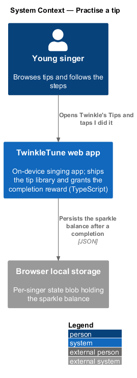
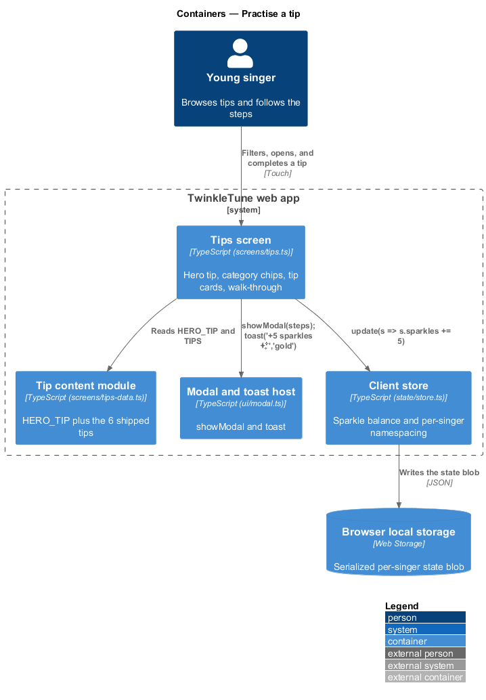
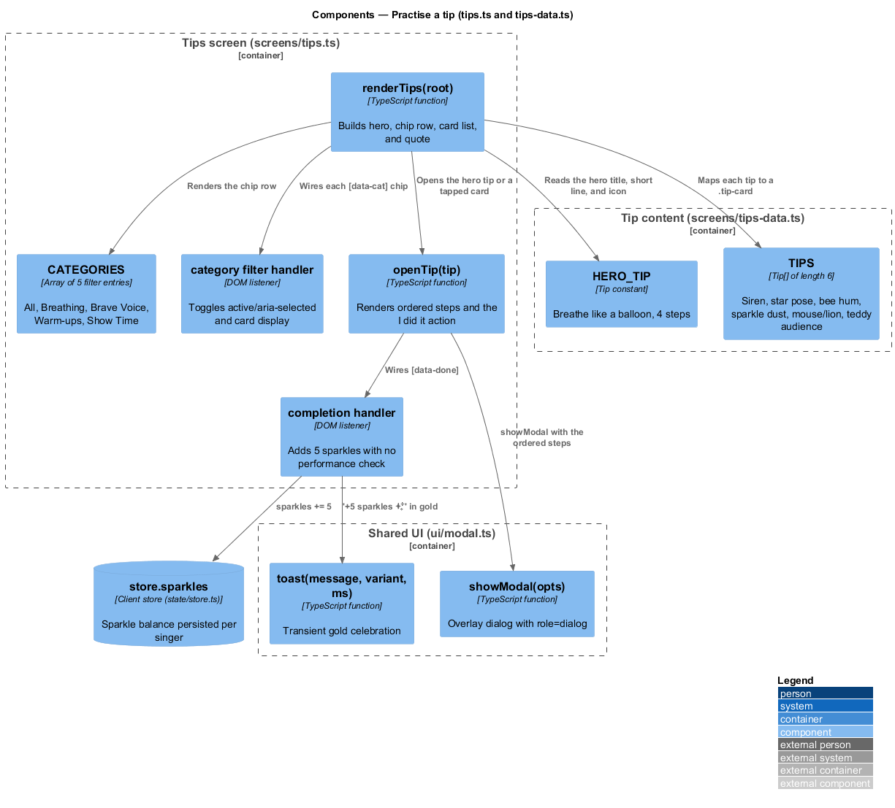
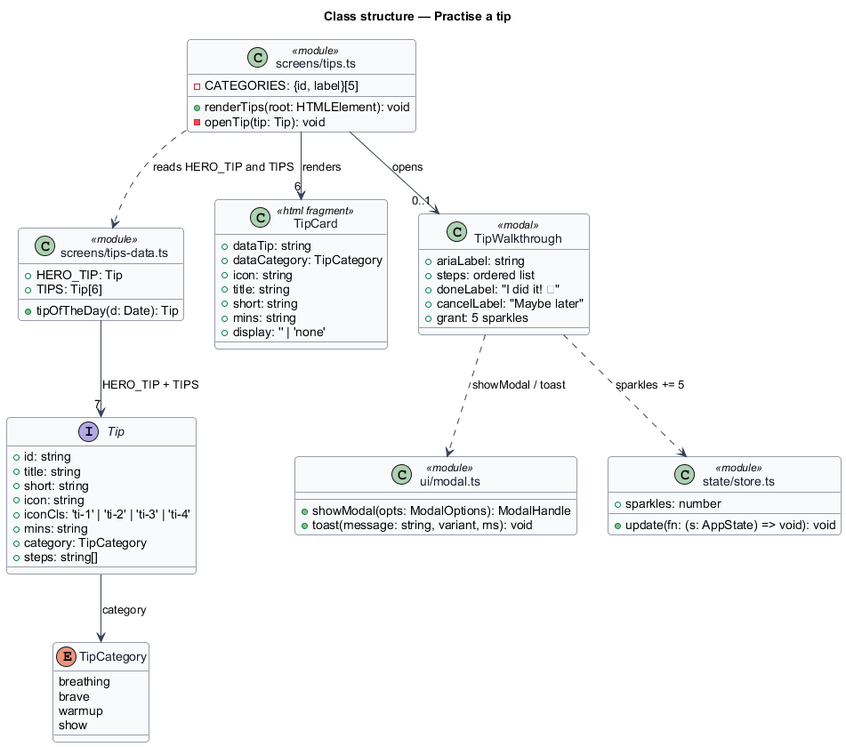
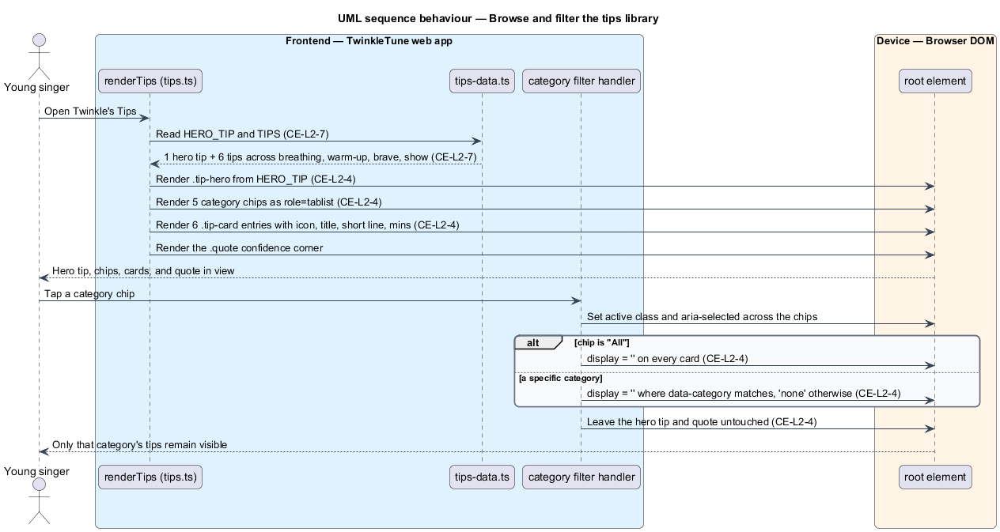
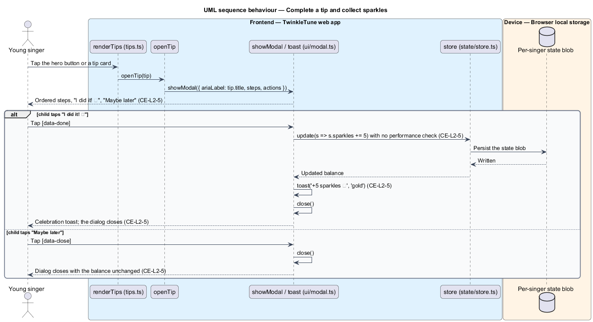

# Practise A Tip

## Overview

Twinkle's Tips is the part of TwinkleTune that builds skill and courage outside
the scored singing loop. It is a small, fixed library of warm-ups and confidence
exercises written as playful games — breathe like a balloon, siren like a
firetruck, stand like a star — that a child can browse, open, follow step by
step, and finish. Finishing is the only condition: the app never checks whether
the exercise was performed correctly, and it grants the same reward either way.

This feature covers the whole tips screen as one vertical slice: the shipped tip
content, the hero tip and category filter that organise it, the step-by-step
walk-through dialog, and the unconditional sparkle grant on completion. Selecting
which tip appears on the home dashboard each day is the neighbouring
`surface-the-daily-tip` slice. The sparkle balance this feature adds to belongs
to Rewards & Progression.

The terms below are used throughout.

- tip — short warm-up or confidence exercise with an icon, title, one-line
  summary, estimated time, category, and ordered steps
- hero tip — single tip promoted at the top of the screen under the label
  `⭐ TWINKLE'S FAVOURITE`
- tip card — tappable summary row showing one tip's icon, title, short line, and
  estimated time
- category chip — filter button that hides every tip card outside one category
- tip walk-through — modal dialog listing a tip's ordered steps with an
  `I did it! ✨` action
- unconditional reward — sparkle grant made on the completion tap alone, with no
  measurement of how the exercise was performed
- confidence corner — closing quote block that repeats Twinkle's affirmation of
  the child's own voice

## Description

The feature spans `frontend/src/screens/tips.ts` (screen and dialog),
`frontend/src/screens/tips-data.ts` (content), `frontend/src/ui/modal.ts`
(dialog and toast host), and `frontend/src/state/store.ts` (sparkle balance). No
server participates; the content is compiled into the bundle.

- **`Tip`** — interface in `tips-data.ts` with `id`, `title`, `short`, `icon`,
  `iconCls` (`'ti-1' | 'ti-2' | 'ti-3' | 'ti-4'`), `mins`, `category`
  (`'breathing' | 'brave' | 'warmup' | 'show'`), and `steps: string[]`.
- **`HERO_TIP`** — the promoted tip `balloon`, "Breathe like a balloon", category
  `breathing`, icon `🎈`, `mins: '1 min'`, 4 steps.
- **`TIPS`** — array of the 6 remaining tips: `siren` ("Siren like a firetruck",
  `warmup`), `star-pose` ("Stand like a star", `brave`), `bee` ("The bumblebee
  hum", `warmup`), `sparkle-dust` ("Mistakes are sparkle dust", `brave`),
  `whisper-loud` ("Tiny mouse, big lion", `show`), and `audience` ("Sing to your
  teddy first", `show`). Each carries 4 steps; `mins` values are `'1 min'`,
  `'2 min'`, `'3 min'`, and `'read'`.
- **`CATEGORIES`** — array in `tips.ts` of 5 filter entries: `all` ("All"),
  `breathing` ("🌬️ Breathing"), `brave` ("💪 Brave Voice"), `warmup`
  ("🎶 Warm-ups"), and `show` ("🎭 Show Time").
- **`renderTips(root)`** — function that writes the screen: a topbar, a coach
  row, the `.tip-hero` section built from `HERO_TIP` with a `Try it with me ▶`
  button, the `.chip-row` of category chips as a `role="tablist"`, the
  `[data-tip-list]` container of tip cards, the `.quote` confidence corner, and
  the bottom navigation.
- **tip card markup** — `<button class="tip-card" data-tip="{id}"
  data-category="{category}">` holding a `.tip-ico` span carrying `iconCls` and
  the emoji, a `.tip-body` with the title and `short` line, and a `.tip-min` span
  with `mins`.
- **category filter handler** — listener on each `[data-cat]` chip that toggles
  the `active` class and `aria-selected` across the chips, then sets
  `card.style.display` to `''` when the chip is `all` or matches the card's
  `data-category`, and to `'none'` otherwise. The hero tip and the quote sit
  outside `[data-tip-list]`, so filtering leaves both in place.
- **`openTip(tip)`** — function that calls `showModal` with `ariaLabel:
  tip.title` and a body of the emoji, the title, an `<ol class="tip-steps">` of
  the steps in order, an `I did it! ✨` button (`[data-done]`), and a
  `Maybe later` link (`[data-close]`).
- **completion handler** — the `[data-done]` listener runs `store.update((s) => {
  s.sparkles += 5 })`, calls `toast('+5 sparkles ✨', 'gold')`, and closes the
  dialog. It reads no timing, no microphone, and no prior state, so completion
  cannot fail.
- **`showModal(opts)`** (`ui/modal.ts`) — creates the `.overlay` and `.modal`
  with `role="dialog"`, wires backdrop dismissal, and returns a `ModalHandle`.
- **`toast(message, variant, ms)`** (`ui/modal.ts`) — appends a transient
  `.toast` to a shared host; the gold variant runs for the default 2200 ms.
- **`store.sparkles`** — the running sparkle balance in `state/store.ts`, the
  same counter that levels and the daily goal read.

Constants (the shipped baseline): 7 tips in total (1 hero plus 6), 5 category
chips including "All", 4 steps per tip, and a completion grant of exactly
5 sparkles.

## Requirements

The feature realizes the following level-2 (L2) requirements, each refining the
cited level-1 (L1) requirement.

| L2 ID | Refines (L1) | Requirement |
|-------|--------------|-------------|
| `CE-L2-4` | `CE-L1-3` | The tips screen shall present a featured hero tip and a filterable set of tip cards organised by category (Breathing, Brave Voice, Warm-ups, Show Time), each card showing an icon, title, short line, and estimated time. |
| `CE-L2-5` | `CE-L1-3` | Opening a tip shall show its ordered steps and an "I did it!" action; completing a tip shall grant exactly 5 sparkles unconditionally, with no performance check, and shall celebrate the completion. |
| `CE-L2-7` | `CE-L1-3` | The product shall ship a hero breathing tip and six additional tips spanning breathing, warm-up, bravery, and performance themes, each with playful steps. |

## Diagrams

### System context

The child browses and completes tips on the tablet; the tip content ships inside
the web app and the sparkle grant stays in browser storage (`CE-L2-7`).

### Containers

The tips screen reads the bundled tip data, opens the walk-through through the
shared modal container, and credits sparkles to the local store (`CE-L2-4`,
`CE-L2-5`).

### Components

`renderTips` builds the hero section, chip row, and card list from `HERO_TIP` and
`TIPS`; `openTip` renders the steps and wires the completion handler that adds
5 sparkles (`CE-L2-4`, `CE-L2-5`).

### Class structure

The `Tip` interface backs both `HERO_TIP` and the 6 entries of `TIPS`; the tips
screen renders cards from them and the walk-through dialog from one of them.

### Behaviour — browse and filter the tips library

The screen renders the hero tip, the 5 category chips, and the 6 tip cards, then
shows and hides cards as chips are selected while the hero tip and the quote stay
in place (`CE-L2-4`, `CE-L2-7`).

### Behaviour — complete a tip and collect sparkles

Opening a tip lists its ordered steps; the `I did it! ✨` tap adds exactly
5 sparkles, raises the gold toast, and closes the dialog, while `Maybe later`
leaves the balance untouched (`CE-L2-5`).

