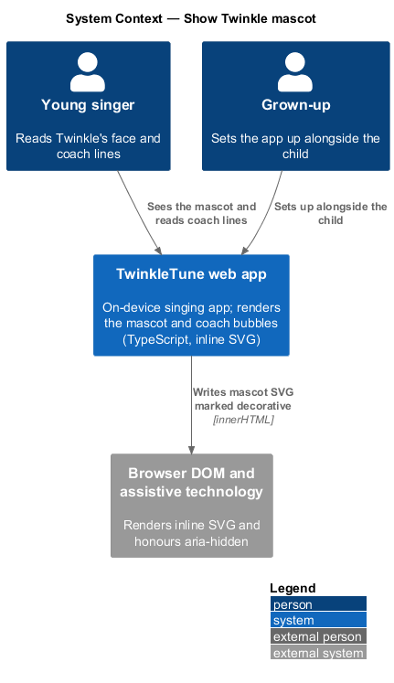
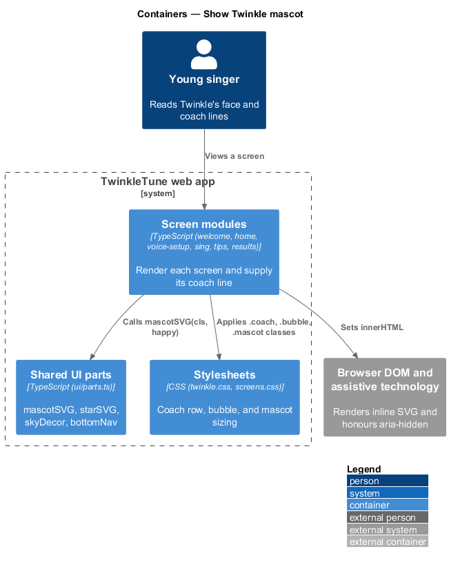
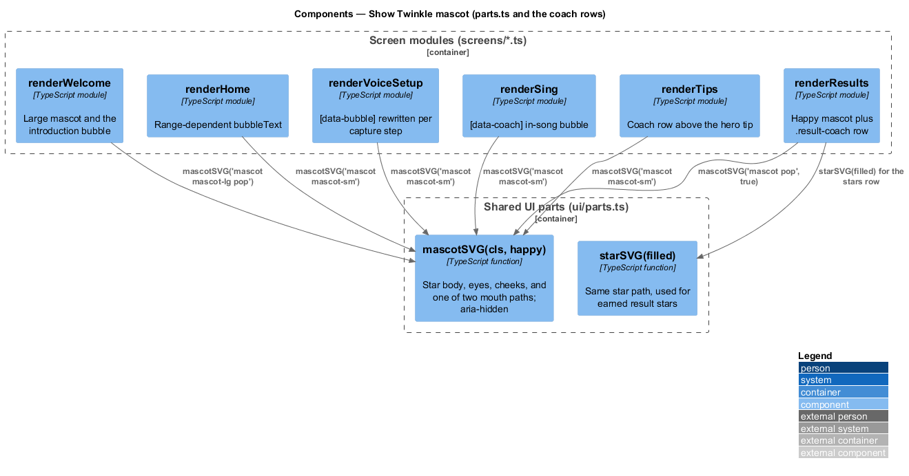
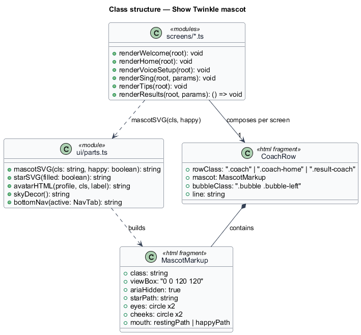
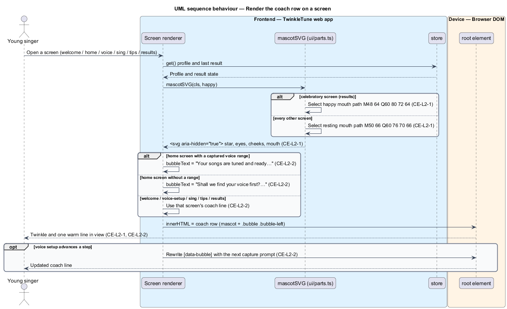

# Show Twinkle Mascot

## Overview

TwinkleTune speaks to the child through one character rather than through system
messages. Twinkle is a yellow star with a face, drawn inline as SVG, and paired
with a speech bubble that carries a line of copy suited to whichever screen is
open. The pairing is what turns instructions ("sing your lowest note") into
friendly talk from a companion, which is the identity the product is built on.

This feature covers the mascot artwork and the coaching voice that accompanies
it: the two facial expressions, the accessibility treatment, and the presence of
a coach line on the six screens that carry one. The messages fired during play
belong to the cheer feature, and the celebration copy on the results screen
belongs to the encouragement-guarantee feature; this slice owns the character
and the per-screen bubble that frames every other message.

The terms below are used throughout.

- Twinkle — star-shaped mascot that acts as the app's single coaching persona
- mascot SVG — inline `<svg>` fragment, 120 by 120 in its view box, that draws
  the star body, two eyes, two cheeks, and a mouth
- happy expression — alternate mouth path with a wider, deeper curve, used on
  celebratory screens
- coach bubble — rounded speech balloon carrying one short line in Twinkle's
  first-person voice
- coach row — layout pairing a small mascot with a coach bubble side by side
- decorative image — graphic marked `aria-hidden="true"` so assistive technology
  skips it and reads the surrounding text instead

## Description

The feature is frontend-only. The artwork lives in `frontend/src/ui/parts.ts`
and each screen module composes it with its own bubble copy. No server
participates.

- **`mascotSVG(cls, happy)`** — function in `frontend/src/ui/parts.ts` returning
  the mascot markup as an HTML string. `cls` defaults to `'mascot'`; `happy`
  defaults to `false`. The returned `<svg>` carries `viewBox="0 0 120 120"` and
  `aria-hidden="true"`, so the mascot is decorative to assistive technology.
- **`mouth`** — local constant selecting one of two SVG paths. The resting mouth
  is `M50 66 Q60 76 70 66`; the happy mouth is `M48 64 Q60 80 72 64`, a wider and
  deeper curve. Both draw with `stroke="#2B5876"` and `stroke-width="4"`.
- **star body path** — `M60 6 L75 42 L114 45 L84 71 L94 110 L60 89 L26 110 L36 71
  L6 45 L45 42 Z`, filled `#FFD66B` with a `#E8B445` stroke of width 7. The same
  path backs `starSVG(filled)`, so earned stars and the mascot share one shape.
- **eyes and cheeks** — four circles: eyes at `(48, 56)` and `(72, 56)` with
  radius 4.5 in `#2B5876`; cheeks at `(41, 66)` and `(79, 66)` with radius 5.5 in
  `#F4DBE3`.
- **size classes** — `mascot-lg` on the welcome screen, `mascot-sm` in coach
  rows, `pop` for the entry animation. `renderResults` calls
  `mascotSVG('mascot pop', true)` for the celebratory portrait and
  `mascotSVG('mascot mascot-sm')` for the coach row beneath it.
- **`.coach` / `.bubble` / `.bubble-left`** — classes in
  `frontend/src/styles/screens.css` and `frontend/src/styles/twinkle.css`.
  `.coach` is a flex row with a 14 px gap; `.coach .bubble` takes the remaining
  width; `.bubble-left::after` draws the tail.
- **`renderWelcome`** (`frontend/src/screens/welcome.ts`) — renders a large
  mascot plus the bubble `Hi! I'm Twinkle, your singing buddy. What should I call
  you?`.
- **`renderHome`** (`frontend/src/screens/home.ts`) — computes `bubbleText` from
  `profile.range`: with a captured range it reads `Your songs are tuned and ready.
  Let's make today sparkle! ✨`; without one it reads `Shall we find your voice
  first? Then every song fits YOU! 💙`, steering the child toward voice setup.
- **`renderVoiceSetup`** (`frontend/src/screens/voice-setup.ts`) — holds the
  bubble in `[data-bubble]` and rewrites it as the game advances, from the
  opening invitation to `Sing your lowest comfy note…` and then `Beautiful! Now
  squeak up high like a baby bird…`.
- **`coachEl`** (`frontend/src/screens/sing.ts`, `[data-coach]`) — the in-song
  bubble, seeded with `Take a big balloon breath… 🎈`.
- **`renderTips`** (`frontend/src/screens/tips.ts`) — pairs a small mascot with
  `Every great singer started exactly where you are! 💙`.
- **`renderResults`** (`frontend/src/screens/results.ts`) — renders the happy
  mascot above the headline and a `.result-coach` row whose bubble carries
  `coachText`, or the duet line `What a duet! Singing together is the best magic.
  💙`.

## Requirements

The feature realizes the following level-2 (L2) requirements, each refining the
cited level-1 (L1) requirement.

| L2 ID | Refines (L1) | Requirement |
|-------|--------------|-------------|
| `CE-L2-1` | `CE-L1-1` | The system shall render Twinkle as a star-shaped mascot with a friendly face, and shall offer a happier expression variant for celebratory contexts; the mascot shall be decorative to assistive technology. |
| `CE-L2-2` | `CE-L1-1` | A context-appropriate coach line ("bubble") shall be present on the welcome, home, voice-setup, singing, tips, and results screens, always in Twinkle's warm first-person voice. |

## Diagrams

### System context

The child reads Twinkle's face and coach lines on the tablet; the TwinkleTune web
app draws both on device, with no server and no network involved (`CE-L2-1`).

### Containers

The six screen modules that carry a coach row sit inside the web app container
and compose the shared UI parts module for the artwork (`CE-L2-2`).

### Components

`mascotSVG()` in `parts.ts` is the single source of the artwork; each screen
renderer calls it and supplies its own bubble copy (`CE-L2-1`, `CE-L2-2`).

### Class structure

The parts module exposes `mascotSVG` and `starSVG` over one shared star path, and
each screen renderer composes a coach row from a mascot and a bubble.

### Behaviour — render the coach row on a screen

A screen renderer requests the mascot markup, chooses the resting or happy mouth,
and pairs it with a bubble line chosen for that screen's context; the `alt`
branch shows the home screen's range-dependent copy (`CE-L2-1`, `CE-L2-2`).

