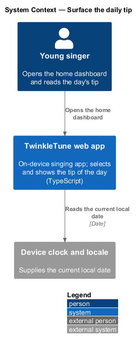
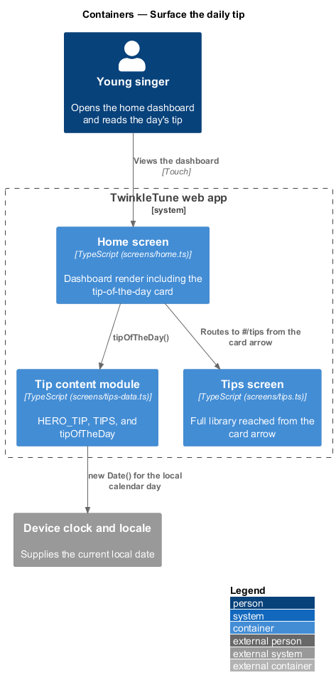
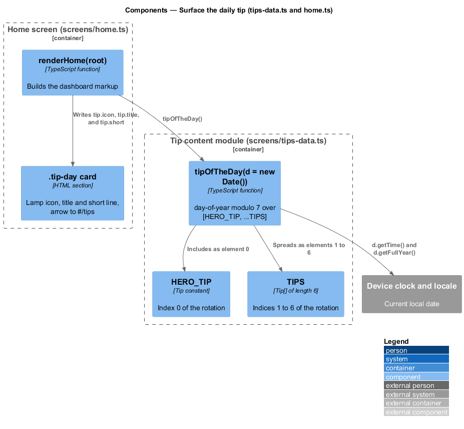
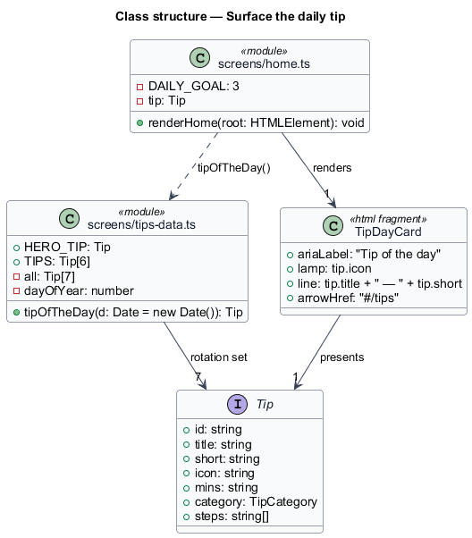
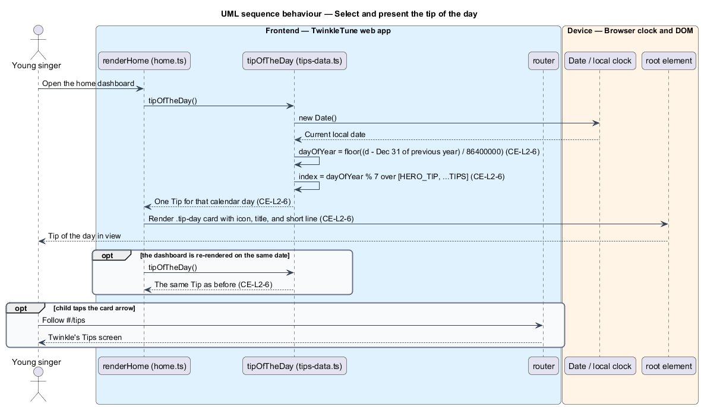

# Surface The Daily Tip

## Overview

The home dashboard carries one small card that changes every day: a single tip
from Twinkle's library, chosen by the calendar date. The card gives a returning
child something new to look at without any content having to be downloaded, and
it acts as the doorway into the wider tips library for a child who would not
otherwise open it.

Selection is deterministic. The same date always yields the same tip, on every
device and with no stored history, because the choice is a function of the day of
the year alone. This feature covers that selection function and the dashboard
card that presents it. The tip content itself and the walk-through that follows a
tap belong to the `practise-a-tip` slice.

The terms below are used throughout.

- tip of the day — one tip selected from the shipped set by the current calendar
  date
- day-of-year — whole number of days between 31 December of the previous year and
  the given date, computed in the device's local time zone
- deterministic rotation — selection made from the date alone, so the result is
  reproducible and holds no state between sessions
- tip-of-the-day card — home dashboard row showing the selected tip's icon,
  title, and short line, with an arrow into the tips screen

## Description

The feature spans `frontend/apps/game/src/screens/tips-data.ts` (selection) and
`frontend/apps/game/src/screens/home.ts` (presentation), styled by
`frontend/apps/game/src/styles/screens.css`. No server participates and nothing is stored.

- **`tipOfTheDay(d: Date = new Date()): Tip`** — function in `tips-data.ts` that
  builds `const all = [HERO_TIP, ...TIPS]`, computes `dayOfYear`, and returns
  `all[dayOfYear % all.length]`. The default argument makes the current date the
  normal input while leaving the function directly testable with a fixed date.
- **`dayOfYear`** — `Math.floor((d.getTime() - new Date(d.getFullYear(), 0,
  0).getTime()) / 86400000)`. The anchor `new Date(year, 0, 0)` is local midnight
  on 31 December of the previous year, and `86400000` is the number of
  milliseconds in a day, so 1 January yields 1.
- **`all.length`** — 7, the hero tip plus the 6 entries of `TIPS`. The modulo by
  7 cycles the whole set across 7 consecutive days and repeats it thereafter.
- **`renderHome(root)`** (`screens/home.ts`) — calls `const tip = tipOfTheDay()`
  once per render, alongside the level, streak, and daily-goal figures.
- **tip-of-the-day card** — `<section class="card tip-day" aria-label="Tip of the
  day">` holding a `.lamp` span with `tip.icon`, a `.tip-day-body` with the
  heading `Tip of the day` and the line `${tip.title} — ${tip.short}`, and an
  `<a class="tip-arrow" href="#/tips" aria-label="More tips">` that routes to the
  tips screen.
- **`.tip-day`** (`styles/screens.css`) — flex row with a 14 px gap and 18 px by
  20 px padding, placing the lamp icon, the body, and the arrow on one line.

## Requirements

The feature realizes the following level-2 (L2) requirement, refining the cited
level-1 (L1) requirement.

| L2 ID | Refines (L1) | Requirement |
|-------|--------------|-------------|
| `CE-L2-6` | `CE-L1-4` | The system shall select a "tip of the day" deterministically from the set of 7 tips by calendar day, and shall surface it on the home dashboard. |

## Diagrams

### System context

The child sees a different tip on the home dashboard each day; the selection runs
on device from the tablet clock and nothing is fetched or stored (`CE-L2-6`).

### Containers

The home screen calls the tip content module for the day's selection and links
onward to the tips screen (`CE-L2-6`).

### Components

`tipOfTheDay` derives the day-of-year and indexes the 7-tip set; `renderHome`
places the result in the `.tip-day` card (`CE-L2-6`).

### Class structure

`tipOfTheDay` reads `HERO_TIP` and `TIPS` and returns one `Tip`, which the home
screen renders as the tip-of-the-day card.

### Behaviour — select and present the tip of the day

The home render reads the device date, converts it to a day-of-year, indexes the
7-tip set by that value modulo 7, and writes the chosen tip into the dashboard
card; a second render on the same date repeats the same choice (`CE-L2-6`).

