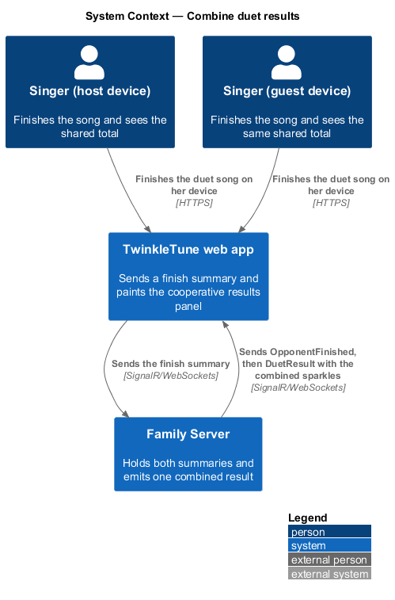
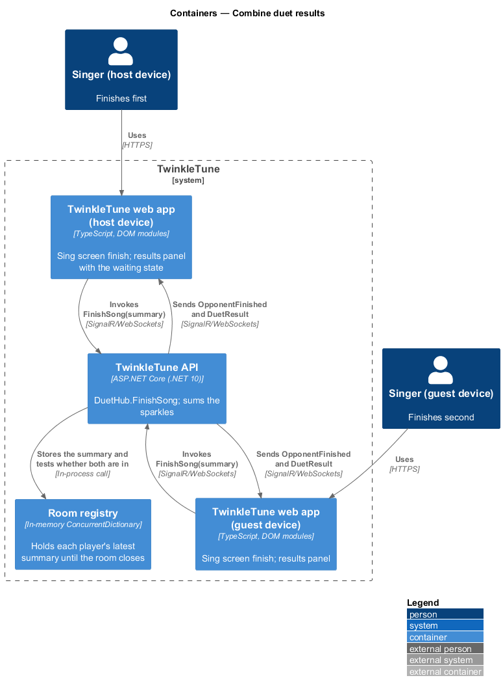
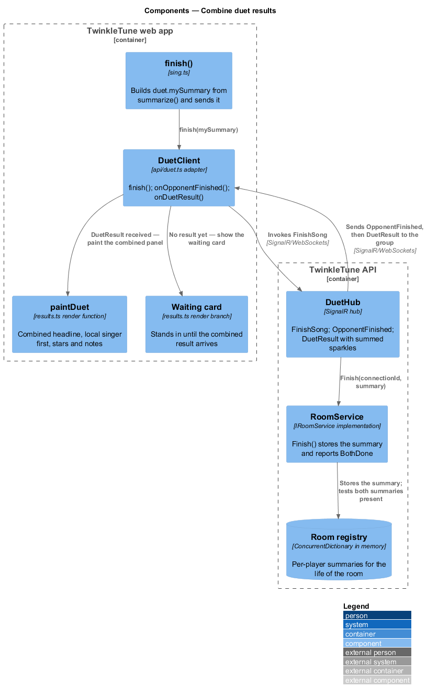
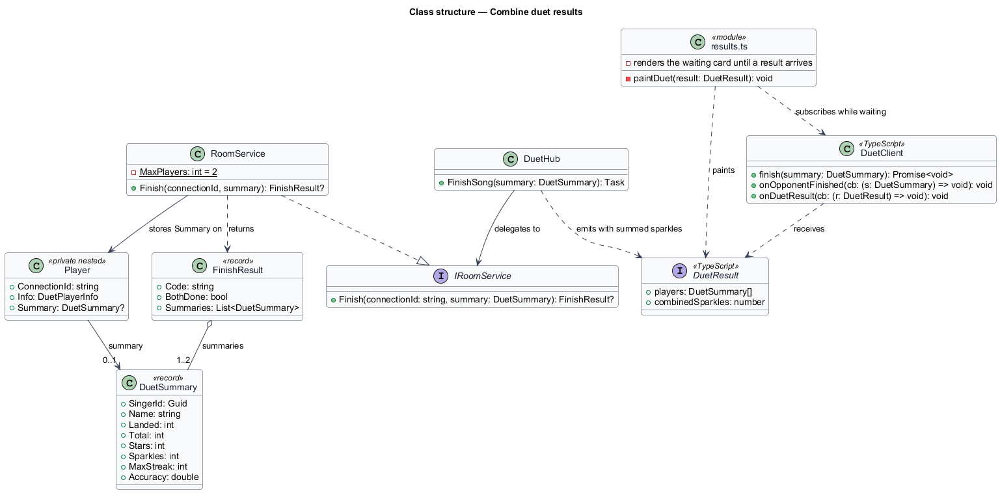
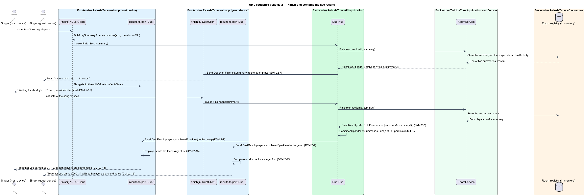

# Combine Duet Results

## Overview

A duet ends the way the product intends it to end: with one number that belongs
to both singers. When a singer reaches the last note her device sends a summary
of her performance; the other device hears that she has finished; and once both
summaries are in, the server adds the two sparkle totals and sends one combined
result to the room. The results panel leads with that shared total. No winner is
named and no ranking is drawn, because the point of the mode is that two sisters
made something together.

The terms below are used throughout.

- finish summary — per-singer record of a completed performance carrying singer
  id, name, landed count, note total, stars, sparkles, maximum streak, and
  accuracy
- combined result — message holding both singers' summaries and the sum of their
  sparkles, sent once both have finished
- family sparkles — combined sparkle total that headlines the duet results panel
- waiting state — results panel state shown to the singer who finished first,
  standing in for the combined result that has not arrived
- cooperative framing — presentation that celebrates a shared outcome and states
  no winner or loser
- local singer — the singer using the device on which a panel is being painted,
  identified by matching `singerId`

The feature closes the duet: it consumes the gameplay's per-performance summary
and it is the last thing the duet session is used for before it ends.

## Description

Frontend — singing screen (`frontend/src/screens/sing.ts`):

- **`finish()`** — builds `summary` through `summarize(song, results, noMic)` and
  records the local play. In duet mode it then fills `duet.mySummary` with
  `singerId`, `name`, `landed`, `total`, `stars` (forced to `0` when
  `summary.noMic`), `sparkles`, `maxStreak`, and `accuracy`, calls
  `duet.client.finish(duet.mySummary)` with a swallowed failure, and navigates to
  `#/results?duet=1` after 600 ms.
- **`duet.client.onDuetResult(r)`** — registered on the singing screen so a
  combined result arriving before navigation is captured into `duet.result`.

Frontend — results screen (`frontend/src/screens/results.ts`):

- **`paintDuet(result)`** — sorts `result.players` so the local singer comes
  first by comparing `a.singerId === duet.me.singerId`, then renders a
  `score-card` whose heading reads
  `` `Together you earned ${result.combinedSparkles} ✨!` `` above one
  `profile-card` per player carrying the name, `'★'.repeat(p.stars)` padded with
  `'☆'` to three, and `` `${p.landed} of ${p.total} notes · ✨${p.sparkles}` ``.
- **waiting state** — when `duet.result` is absent, the panel renders
  `` `Waiting for ${duet.opponent?.name ?? 'your duet buddy'}… 🎶` `` with the
  note `They're still singing their heart out!`, and subscribes
  `duet.client.onDuetResult` to repaint through `paintDuet` when the result
  arrives.
- **duet-mode chrome** — the coach line reads
  `What a duet! Singing together is the best magic. 💙`, the practise button is
  omitted, and the actions are `Another duet 🎤🎤` and home, both of which call
  `duetSession.end()`.

Frontend — duet API adapter (`frontend/src/api/duet.ts`):

- **`DuetClient.finish(summary)`** — invokes `FinishSong` and returns the
  invocation promise.
- **`DuetClient.onOpponentFinished(cb)`** and **`onDuetResult(cb)`** — register
  handlers for the two closing events.
- **`DuetSummary`** and **`DuetResult`** — client-side shapes; `DuetResult`
  carries `players: DuetSummary[]` and `combinedSparkles: number`.

Backend — TwinkleTune API application (`backend/src/TwinkleTune.Api/Hubs/DuetHub.cs`):

- **`FinishSong(DuetSummary summary)`** — calls `rooms.Finish` and returns
  without effect when the result is `null`. Otherwise it sends `OpponentFinished`
  with the summary to `Clients.OthersInGroup(result.Code)`, and when
  `result.BothDone` it sends `DuetResult` to `Clients.Group(result.Code)` with
  `Players = result.Summaries` and
  `CombinedSparkles = result.Summaries.Sum(s => s.Sparkles)`.

Backend — Application and Domain
(`backend/src/TwinkleTune.Application/Duet/RoomService.cs`):

- **`RoomService.Finish(connectionId, summary)`** — resolves the room, locates
  the player by connection id, stores `player.Summary`, stamps
  `room.LastActivity`, and computes
  `done = room.Players.Count == MaxPlayers && room.Players.All(p => p.Summary is not null)`.
  It returns a `FinishResult` carrying the code, that flag, and every non-null
  summary.
- **`DuetSummary`** — record with `Guid SingerId`, `string Name`, `int Landed`,
  `int Total`, `int Stars`, `int Sparkles`, `int MaxStreak`, and
  `double Accuracy`.
- **`FinishResult`** — record with `Code`, `BothDone`, and `Summaries`.

Constants (the shipped baseline): 3 stars maximum in the padded star row, 600 ms
delay before navigating to the results screen, `MaxPlayers = 2` as the
both-finished condition.

Coverage: `DuetFlowTests` exercises the two-finish path and asserts that the
combined sparkles equal the sum of the two summaries.

## Requirements

The feature realizes the following level-2 (L2) requirements. Each L2 requirement
refines a level-1 (L1) requirement, cited by identifier.

| L2 ID | Refines (L1) | Requirement |
|-------|--------------|-------------|
| `DM-L2-7` | `DM-L1-5, DM-L1-6` | When a singer finishes, the hub shall notify the other; when both have finished, the hub shall emit a combined `DuetResult` to the room containing both players' summaries and the sum of their sparkles. |
| `DM-L2-15` | `DM-L1-6` | The duet results panel shall lead with the combined family sparkle total, shall show each player's stars and notes side by side with the local singer first, and shall show a friendly waiting state until the combined result arrives; winning and losing shall not be emphasised. |

## Diagrams

### System context

Both singers finish on their own devices; the family server is the only place the
two totals meet, and it returns one shared number (`DM-L2-7`).

### Containers

Each web app sends its finish summary to the hub; the hub notifies the other
device immediately and broadcasts the combined result once the second summary
lands (`DM-L2-7`).

### Components

`RoomService.Finish` stores each summary and reports whether both are in;
`DuetHub` sums the sparkles, and `paintDuet` renders the shared headline with the
local singer first (`DM-L2-7`, `DM-L2-15`).

### Class structure

`DuetSummary` travels from the singing screen to the room, and `FinishResult`
becomes the `DuetResult` the results panel paints (`DM-L2-7`, `DM-L2-15`).

### Behaviour — finish and combine the two results

The first finish notifies the other singer and leaves the room waiting
(`DM-L2-7`), the finisher's own panel shows the waiting state (`DM-L2-15`), and
the second finish produces one `DuetResult` whose combined sparkles headline both
panels (`DM-L2-7`, `DM-L2-15`).

