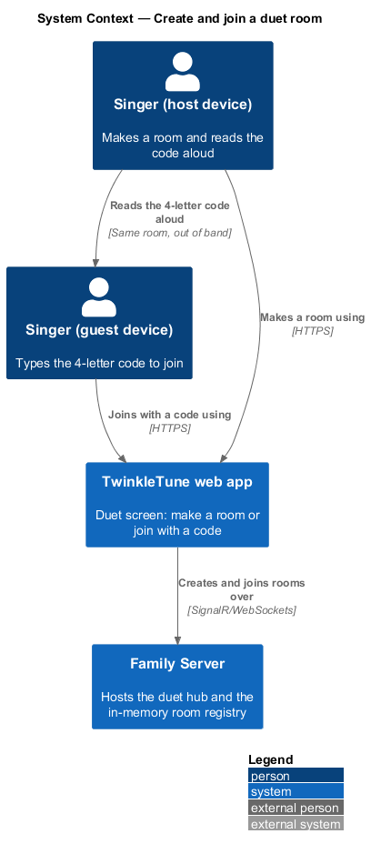
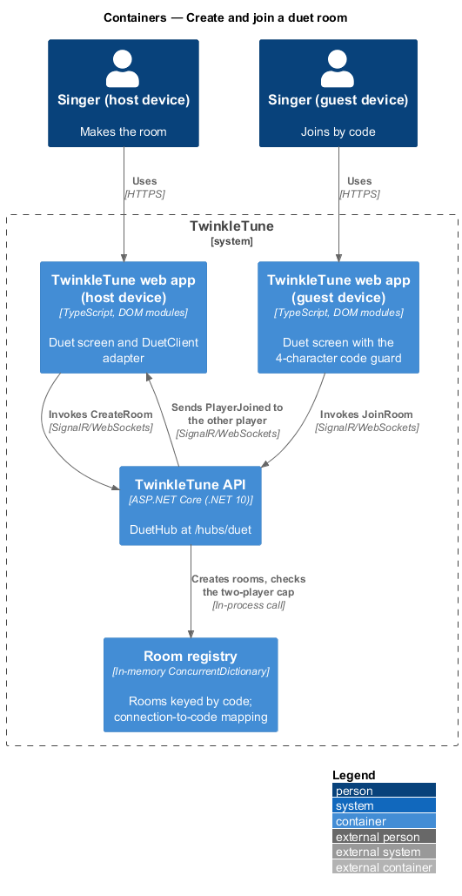
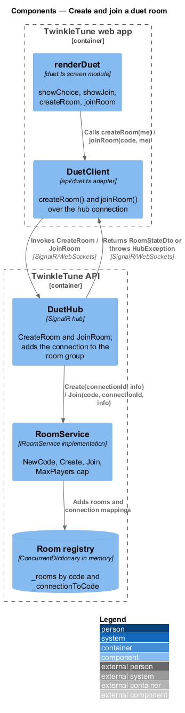
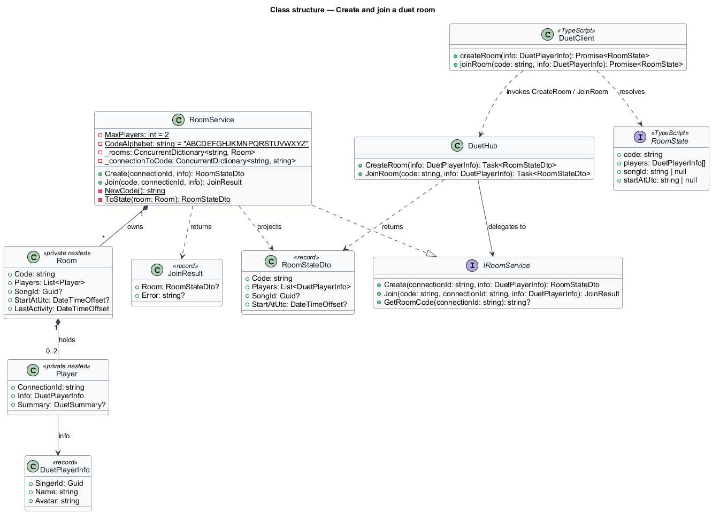
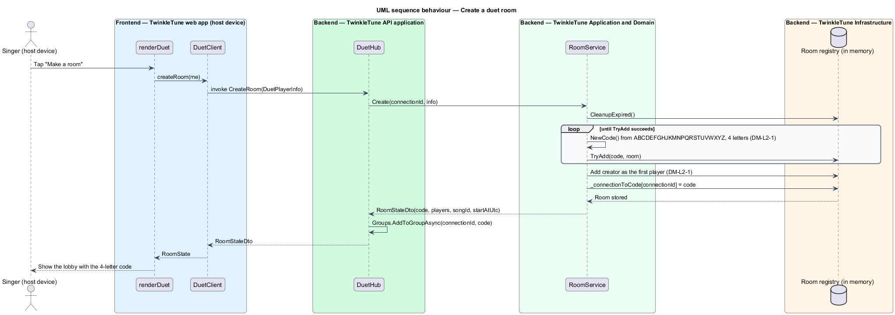
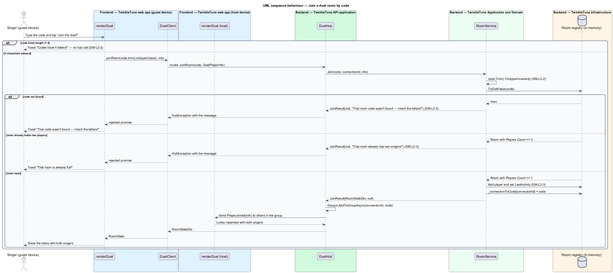

# Create and Join a Room

## Overview

A duet needs a meeting point before it needs anything else. This feature is that
meeting point: one singer makes a room on the family server and reads a short
code aloud, and a second singer on another device types the code in. The room
holds exactly the two of them, carries no accounts, and disappears when they are
done. Everything about the design serves two sisters standing in the same house
with two tablets — the code is short enough to shout across a room, and the
letters that get misheard are not in it.

The terms below are used throughout.

- duet room — ephemeral server-side container holding at most two singers, the
  song they have chosen, and the moment their song starts
- room code — 4-letter string that identifies a room for the life of that room
- unambiguous alphabet — 23-letter set `ABCDEFGHJKMNPQRSTUVWXYZ`, omitting `I`,
  `L`, and `O` so a code read aloud is not misheard as another code
- player info — triple of singer id, display name, and avatar that a client
  presents when it creates or joins a room
- room state — snapshot of a room's code, its players, its selected song, and its
  start time, returned to a client after a create or a join
- connection mapping — association from a SignalR connection id to the room code
  that connection belongs to
- hub group — SignalR broadcast set named after the room code, used to address
  both players or only the other player

Creating and joining are the two entry points into every later duet behaviour:
the synchronised start, the score relay, and the combined result all address the
hub group this feature establishes.

## Description

Frontend — TwinkleTune web app (`frontend/apps/game/src/screens/duet.ts`):

- **`showChoice()`** — renders the two entry actions, `Make a room ⭐` and
  `Join with a code 🔑`, and wires them to `createRoom()` and `showJoin()`.
- **`showJoin()`** — renders a single code field with `maxlength="4"` and
  `autocapitalize="characters"`, focuses it, and wires the join action.
- **`createRoom()`** — awaits `ensureClient()`, calls `c.createRoom(me)`, wires
  the room events, and shows the lobby.
- **`joinRoom(code)`** — returns early with the toast `Codes have 4 letters!`
  when `code.trim().length !== 4`, otherwise calls
  `c.joinRoom(code.trim().toUpperCase(), me)`. A thrown hub error is mapped by
  message content: `found` becomes `That code wasn't found — check the letters!`,
  `two singers` becomes `That room is already full!`, and anything else becomes
  `Couldn't join right now 💙`.
- **`me`** — the `DuetPlayerInfo` built from the active profile's `singerId`,
  `name`, and `avatar`.

Frontend — duet API adapter (`frontend/apps/game/src/api/duet.ts`):

- **`DuetClient.createRoom(info)`** — invokes the hub method `CreateRoom` and
  resolves to a `RoomState`.
- **`DuetClient.joinRoom(code, info)`** — invokes `JoinRoom` and resolves to a
  `RoomState`; a server-side rejection surfaces as a rejected promise.
- **`RoomState`** — client-side shape with `code`, `players`, `songId`, and
  `startAtUtc`.

Backend — TwinkleTune API application (`backend/src/TwinkleTune.Api/Hubs/DuetHub.cs`):

- **`CreateRoom(DuetPlayerInfo info)`** — calls `rooms.Create` with
  `Context.ConnectionId`, adds the connection to the hub group named after the
  new code, and returns the `RoomStateDto`.
- **`JoinRoom(string code, DuetPlayerInfo info)`** — calls `rooms.Join`, throws a
  `HubException` carrying the service's error text when the join is refused, adds
  the connection to the group, sends `PlayerJoined` to
  `Clients.OthersInGroup(state.Code)`, and returns the `RoomStateDto`.

Backend — Application and Domain
(`backend/src/TwinkleTune.Application/Duet/RoomService.cs`):

- **`RoomService.Create(connectionId, info)`** — runs `CleanupExpired()`, then
  loops generating a code and adding the room until `_rooms.TryAdd(code, room)`
  succeeds, so a collision retries rather than overwriting. The creator is added
  as the first `Player` and the connection mapping is recorded.
- **`RoomService.Join(code, connectionId, info)`** — runs `CleanupExpired()`,
  normalises the code with `code.Trim().ToUpperInvariant()`, and returns a
  `JoinResult` carrying either the room state or one of two errors:
  `That room code wasn't found — check the letters!` for an unknown code and
  `That room already has two singers!` for a full room. The membership check and
  the add happen inside `lock (room)`.
- **`NewCode()`** — builds a 4-character string by drawing each character from
  `CodeAlphabet` with `Random.Shared`.
- **`ToState(room)`** — projects a `Room` into the `RoomStateDto` sent to
  clients, exposing player info but never connection ids.
- **`Room`** and **`Player`** — private nested classes holding the room's code,
  player list, song id, start time, and last-activity stamp, and each player's
  connection id, info, and summary.
- **`_rooms`** — `ConcurrentDictionary<string, Room>` keyed by code.
- **`_connectionToCode`** — `ConcurrentDictionary<string, string>` mapping a
  connection id to its room code.
- **`DuetPlayerInfo`**, **`RoomStateDto`**, **`JoinResult`** — the records
  crossing the hub boundary.

Constants (the shipped baseline): `MaxPlayers = 2`, code length `4`,
`CodeAlphabet = "ABCDEFGHJKMNPQRSTUVWXYZ"` (23 letters).

Coverage: `RoomServiceTests` exercises code shape, join normalisation, and the
two-player cap; `DuetFlowTests` exercises the create-then-join path over a live
hub connection.

## Requirements

The feature realizes the following level-2 (L2) requirements. Each L2 requirement
refines a level-1 (L1) requirement, cited by identifier.

| L2 ID | Refines (L1) | Requirement |
|-------|--------------|-------------|
| `DM-L2-1` | `DM-L1-1, DM-L1-2` | Creating a room shall generate a unique 4-letter code drawn from an alphabet that excludes the ambiguous letters `I`, `L`, and `O`, add the creator as the first player, and return the room state. |
| `DM-L2-2` | `DM-L1-2` | A second singer shall join by code, trimmed and upper-cased; an unknown code shall be rejected with "that room code wasn't found", and a full room shall be rejected with "already has two singers". The client shall require a 4-character code before attempting to join. |
| `DM-L2-3` | `DM-L1-2` | A room shall hold at most two players, and a third join shall be rejected. |

## Diagrams

### System context

Two singers on two devices reach the same family server; the host creates the
room and the guest joins it by code (`DM-L2-1`, `DM-L2-2`).

### Containers

Both devices run the same web app and speak to the SignalR duet hub on the family
server; the room registry that answers create and join lives in memory inside the
API process (`DM-L2-1`).

### Components

The duet screen calls `DuetClient`, which invokes `CreateRoom` and `JoinRoom` on
`DuetHub`; `RoomService` owns code generation, the two-player cap, and the
connection mapping (`DM-L2-1`, `DM-L2-3`).

### Class structure

`RoomService` implements `IRoomService` over private `Room` and `Player` types
and returns `RoomStateDto` and `JoinResult` records; the frontend `DuetClient`
mirrors those shapes as `RoomState` and `DuetPlayerInfo` (`DM-L2-1`, `DM-L2-2`).

### Behaviour — create a room

The host device asks the hub for a room, `RoomService` draws a code from the
unambiguous alphabet and retries on collision, and the creator becomes the sole
player of the returned room state (`DM-L2-1`).

### Behaviour — join a room by code

The guest device applies the 4-character client guard (`DM-L2-2`), the service
normalises the code and checks the two-player cap (`DM-L2-3`), and a successful
join notifies the host through `PlayerJoined`; the `alt` branches carry the
unknown-code and full-room rejections.

