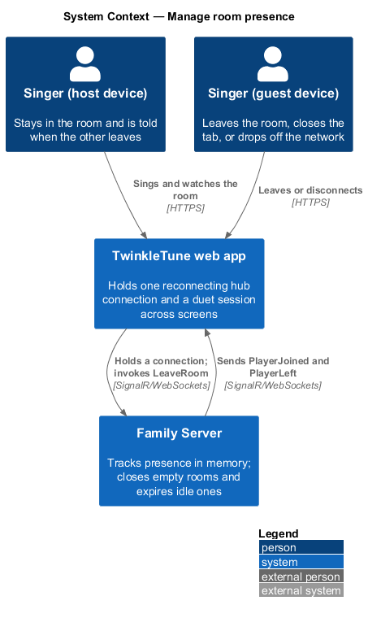
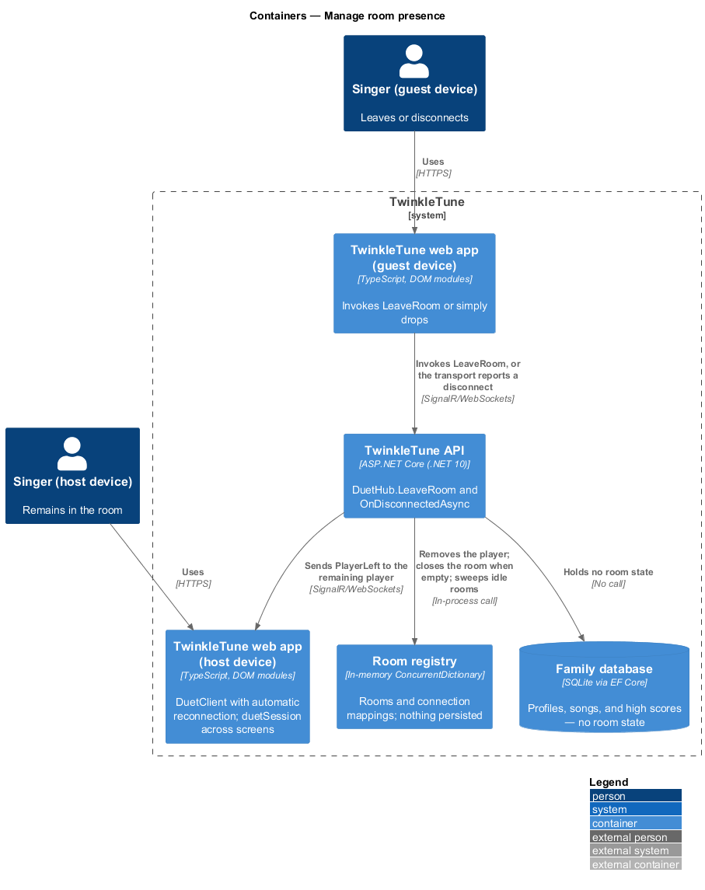
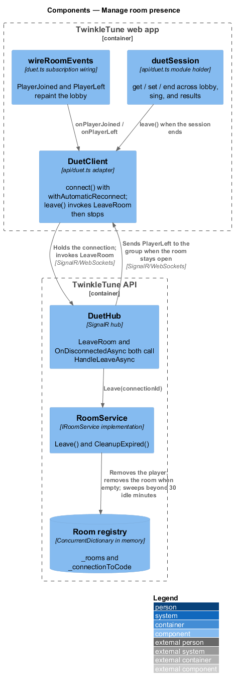
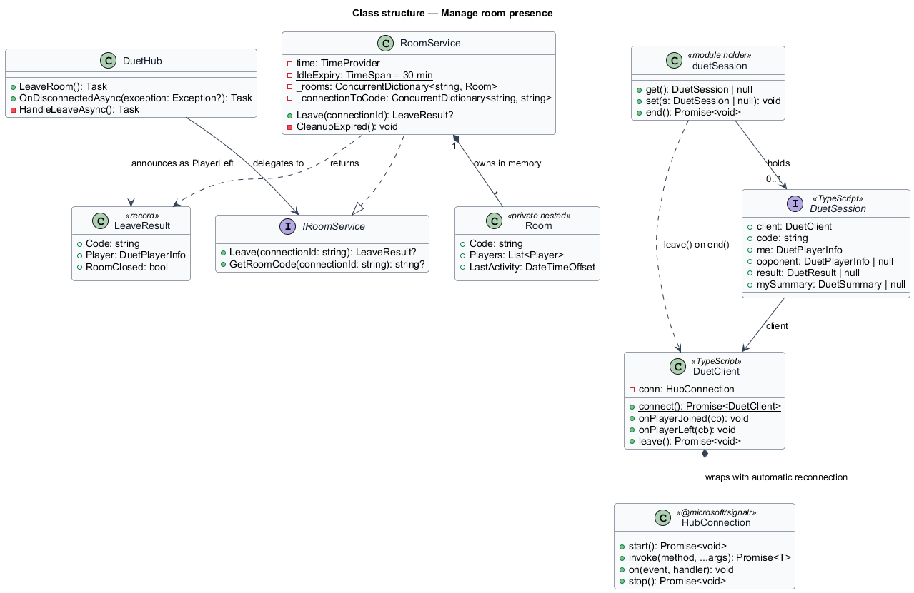
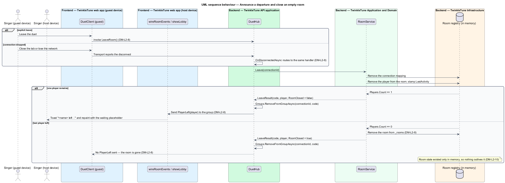
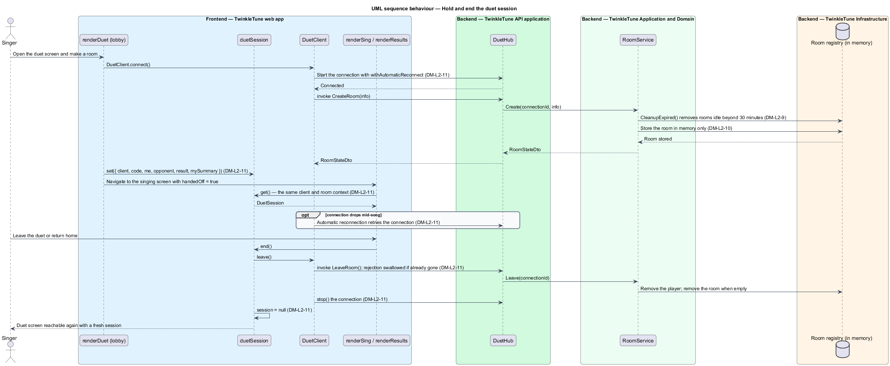

# Manage Room Presence

## Overview

Tablets get closed mid-song, Wi-Fi drops, and a duet buddy wanders off. This
feature is what keeps a room honest about who is actually in it: the arrival and
departure announcements, the equivalence of an explicit leave and a dropped
connection, the closure of a room that no one is left in, and the sweep that
removes rooms nobody ever came back to. It also owns the connection itself — the
single wrapper the screens share, the reconnection policy, and the session object
that survives the walk from lobby to singing screen to results.

The terms below are used throughout.

- presence — record of which singers currently hold a connection to a room
- explicit leave — departure a singer chooses, invoking `LeaveRoom` before the
  connection stops
- disconnect — departure the transport reports, whether from a closed tab, a
  dropped network, or a stopped connection
- room closure — removal of a room from the registry once its last player is gone
- idle expiry — removal of a room whose last activity is older than 30 minutes
- automatic reconnection — SignalR client policy that retries a dropped
  connection without the screens taking part
- duet session — module-level holder carrying the live client, the room code, the
  local player, the opponent, the local summary, and the combined result across
  screen navigations

Presence underpins every other duet behaviour: the two-player cap, the start
precondition, and the both-finished test all read the player list this feature
maintains.

## Description

Frontend — duet API adapter (`frontend/src/api/duet.ts`):

- **`DuetClient.connect()`** — static factory building a `HubConnection` against
  `` `${API_URL}/hubs/duet` `` with `.withAutomaticReconnect()` and
  `.configureLogging(LogLevel.Warning)`, starting it, and wrapping it in a
  `DuetClient`. The constructor is private, so the connection is never handed to
  a screen directly.
- **`DuetClient.leave()`** — invokes `LeaveRoom`, swallows a rejection from a
  connection that has already gone, and then calls `conn.stop()`.
- **`onPlayerJoined(cb)`** and **`onPlayerLeft(cb)`** — register handlers for the
  two presence events, each carrying a `DuetPlayerInfo`.
- **`DuetSession`** — interface with `client`, `code`, `me`, `opponent`,
  `result`, and `mySummary`.
- **`duetSession`** — module-level holder exposing `get()`, `set(s)`, and
  `end()`; `end()` calls `session.client.leave()` and then clears the session to
  `null`.

Frontend — screens (`frontend/src/screens/duet.ts`, `sing.ts`, `results.ts`):

- **`ensureClient()`** — returns the existing `client` or connects once, so the
  duet screen holds at most one connection.
- **`wireRoomEvents(c)`** — on `PlayerJoined` appends the player to
  `lobbyRoom.players` when not already present, raises the gold toast
  `` `${p.name} is here! 🎉` ``, and repaints; on `PlayerLeft` filters the player
  out, raises the pink toast `` `${p.name} left 💙` ``, and repaints.
- **`renderDuet` teardown** — returns a function that calls `duetSession.end()`
  unless `handedOff` is true, so leaving the lobby releases the room while
  navigating into the song does not.
- **`renderSing`** — reads the session with `duetSession.get()` and redirects to
  `#/duet` when it is missing; leaving the duet from the pause menu calls
  `duetSession.end()` before navigating.
- **`results.ts`** — `Another duet 🎤🎤` awaits `duetSession.end()` before
  routing back to `#/duet`, and the home action ends the session as well.

Backend — TwinkleTune API application (`backend/src/TwinkleTune.Api/Hubs/DuetHub.cs`):

- **`LeaveRoom()`** — delegates to `HandleLeaveAsync()`.
- **`OnDisconnectedAsync(exception)`** — calls `HandleLeaveAsync()` and then the
  base implementation, so a dropped connection follows the same path as an
  explicit leave.
- **`HandleLeaveAsync()`** — calls `rooms.Leave`, returns when the result is
  `null`, removes the connection from the hub group, and sends `PlayerLeft` with
  the departing player's info to `Clients.Group(left.Code)` only when
  `!left.RoomClosed`.
- **`JoinRoom`** — sends `PlayerJoined` with the joining player's info to
  `Clients.OthersInGroup(state.Code)`.

Backend — Application and Domain
(`backend/src/TwinkleTune.Application/Duet/RoomService.cs`):

- **`RoomService.Leave(connectionId)`** — removes the connection mapping with
  `_connectionToCode.TryRemove`, resolves the room, removes the player under
  `lock (room)`, stamps `room.LastActivity`, and removes the room from `_rooms`
  when the player list is empty. It returns a `LeaveResult` carrying the code,
  the departing player's info, and the `RoomClosed` flag.
- **`CleanupExpired()`** — computes `cutoff = time.GetUtcNow() - IdleExpiry` and
  removes every room whose `LastActivity` is older, clearing the connection
  mapping of each of its players. It runs at the head of `Create` and `Join`, so
  the sweep is driven by traffic rather than by a timer.
- **`_rooms`** and **`_connectionToCode`** — the two `ConcurrentDictionary`
  instances that constitute the entire store. Nothing is written to the database,
  so a server restart leaves no rooms behind.
- **`LeaveResult`** — record with `Code`, `Player`, and `RoomClosed`.
- **`TimeProvider time`** — injected clock that `CleanupExpired` and every
  activity stamp read.

Constants (the shipped baseline): `IdleExpiry = TimeSpan.FromMinutes(30)`,
`MaxPlayers = 2`.

Coverage: `RoomServiceTests` exercises leave, room closure, and idle removal;
`DuetFlowTests` exercises the `PlayerLeft` notification over a live connection.

## Requirements

The feature realizes the following level-2 (L2) requirements. Each L2 requirement
refines a level-1 (L1) requirement, cited by identifier.

| L2 ID | Refines (L1) | Requirement |
|-------|--------------|-------------|
| `DM-L2-8` | `DM-L1-8` | The system shall announce a player joining, shall announce a player leaving whether by explicit leave or by disconnect, and shall close a room once it is empty. |
| `DM-L2-9` | `DM-L1-8` | Rooms idle for longer than 30 minutes shall be removed, releasing their players' connection mappings. |
| `DM-L2-10` | `DM-L1-8` | Room state shall be held only in memory and shall not survive a server restart. |
| `DM-L2-11` | `DM-L1-7, DM-L1-8` | The client shall wrap the hub connection with automatic reconnection, shall expose typed create, join, start, tick, and finish calls together with event subscriptions, and shall maintain a duet session across the lobby, singing, and results screens, ending it by leaving the room and stopping the connection when the duet is done. |

## Diagrams

### System context

Two singers hold connections to the family server; the server is the only thing
that knows who is currently in a room, and it forgets everything when it restarts
(`DM-L2-8`, `DM-L2-10`).

### Containers

Each web app holds one reconnecting hub connection; the registry lives in the API
process memory, with no database behind it (`DM-L2-10`, `DM-L2-11`).

### Components

`DuetClient` and `duetSession` own the connection and the cross-screen state;
`DuetHub.HandleLeaveAsync` funnels explicit leave and disconnect into
`RoomService.Leave`, and `CleanupExpired` sweeps idle rooms (`DM-L2-8`,
`DM-L2-9`, `DM-L2-11`).

### Class structure

`LeaveResult` reports whether a departure closed the room, and `DuetSession`
holds the client and room context that outlives each screen (`DM-L2-8`,
`DM-L2-11`).

### Behaviour — announce a departure and close an empty room

The `alt` shows the explicit leave and the disconnect converging on the same
handler; the remaining singer is told, and a room left with no players is removed
from the in-memory registry (`DM-L2-8`, `DM-L2-10`).

### Behaviour — hold and end the duet session

One connection is built with automatic reconnection and carried through the
lobby, singing, and results screens by `duetSession`; ending the session leaves
the room and stops the connection (`DM-L2-11`), and the next create or join
sweeps rooms idle beyond 30 minutes (`DM-L2-9`).

