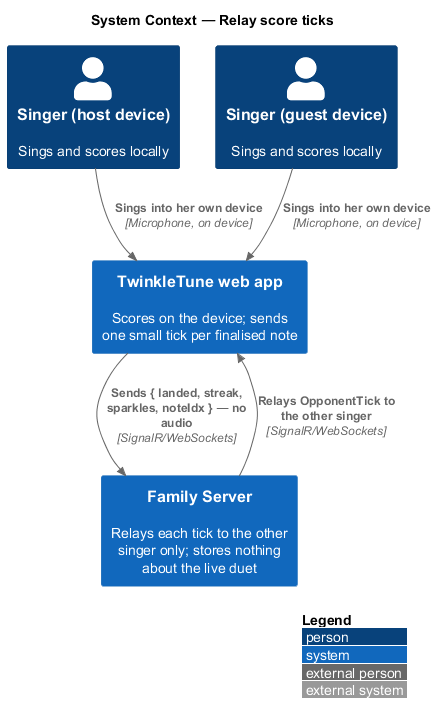
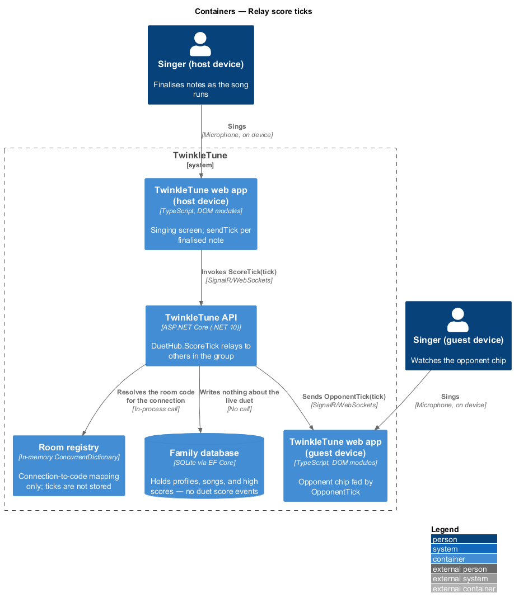
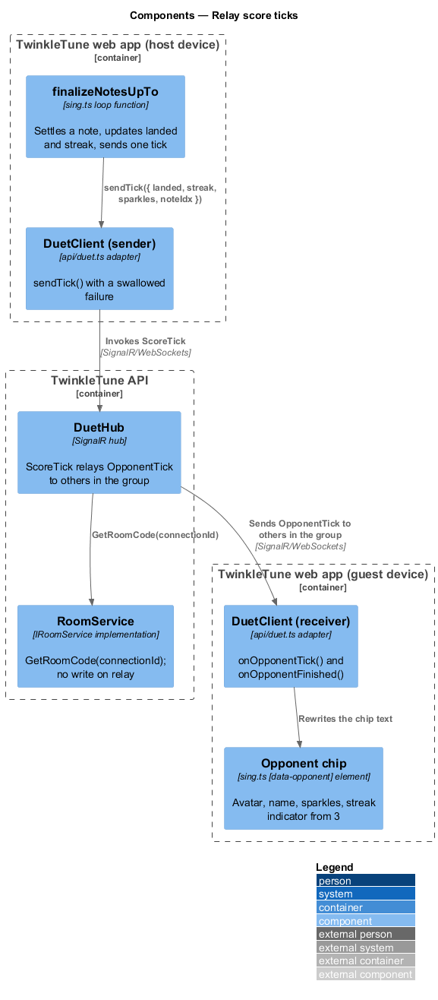
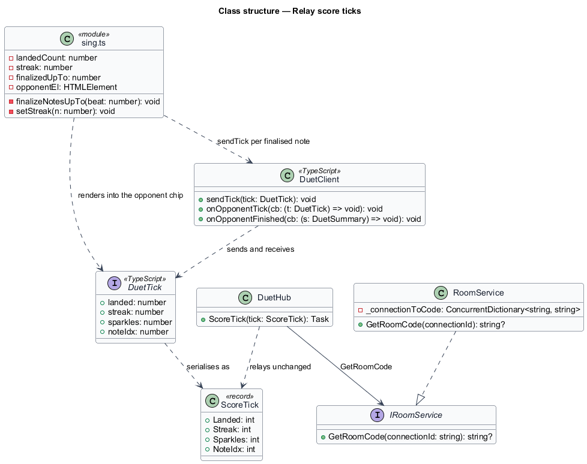
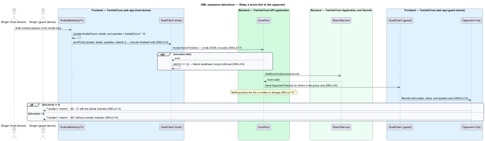

# Relay Score Ticks

## Overview

During a duet each device hears only its own singer. What crosses the network is
a running tally: how many notes the other singer has landed, how many in a row,
how many sparkles she has, and how far through the song she is. That tally is the
whole of the shared experience during the song — it drives the opponent chip on
the stage and it is the reason a duet feels like singing next to someone. The
messages are deliberately tiny and deliberately rare: one per finalised note, no
audio, nothing written down anywhere.

The terms below are used throughout.

- score tick — four-field message carrying `landed`, `streak`, `sparkles`, and
  `noteIdx`, sent when a note is finalised
- finalised note — note whose sung window has fully elapsed, so its landed or
  missed outcome is settled and no longer changes
- opponent chip — element on the singing stage showing the other singer's avatar,
  name, sparkle count, and streak
- streak indicator — flame and number appended to the opponent chip once the
  other singer's streak reaches 3
- relay — forwarding of a message to the room's other member without the sender
  receiving a copy
- network minimisation — property that only small score and summary messages
  cross the network during a duet

Score ticks flow from the singing gameplay loop, which owns the scoring, to the
opponent overlay on the other device. Nothing about a tick is stored.

## Description

Frontend — singing screen (`frontend/src/screens/sing.ts`):

- **`finalizeNotesUpTo(beat)`** — advances `finalizedUpTo` past every note whose
  window has elapsed. For each note it updates `landedCount` and the streak, then
  calls `duet?.client.sendTick({ landed: landedCount, streak, sparkles:
  landedCount * 10, noteIdx: finalizedUpTo })`. One tick leaves the device per
  finalised note, and the optional chaining means solo play sends nothing.
- **opponent overlay wiring** — when `duet` is non-null, `opponentEl.hidden` is
  cleared and the chip is seeded with
  `` `${opp?.avatar ?? '🎤'} ${opp?.name ?? 'Duet buddy'} · ready!` ``.
- **`duet.client.onOpponentTick(t)`** — rewrites the chip as
  `` `${avatar} ${name} ✨${t.sparkles}${t.streak >= 3 ? ` 🔥${t.streak}` : ''}` ``,
  so the streak indicator appears only from a streak of 3.
- **`duet.client.onOpponentFinished(s)`** — raises the gold toast
  `` `${s.name} finished — ${s.landed} notes! 🎉` ``.
- **`[data-opponent]`** — the `span.opponent-chip` in the stage markup, hidden
  outside duet mode.

Frontend — duet API adapter (`frontend/src/api/duet.ts`):

- **`DuetClient.sendTick(tick)`** — invokes `ScoreTick` and attaches
  `.catch(() => {})`, so a failed tick is swallowed and never interrupts the
  song. The method returns `void` rather than a promise.
- **`DuetTick`** — client-side shape with `landed`, `streak`, `sparkles`, and
  `noteIdx`, all numbers.

Backend — TwinkleTune API application (`backend/src/TwinkleTune.Api/Hubs/DuetHub.cs`):

- **`ScoreTick(ScoreTick tick)`** — resolves the room code through
  `rooms.GetRoomCode(Context.ConnectionId)` and, when a code is found, sends
  `OpponentTick` with the tick to `Clients.OthersInGroup(code)`. A connection with
  no room silently sends nothing. The hub does not read, transform, or store the
  tick.

Backend — Application and Domain
(`backend/src/TwinkleTune.Application/Duet/RoomService.cs`):

- **`ScoreTick`** — record with `int Landed`, `int Streak`, `int Sparkles`, and
  `int NoteIdx`; the whole payload that crosses the wire per note.
- **`RoomService.GetRoomCode(connectionId)`** — reads `_connectionToCode` and
  returns the code or `null`. It performs no write, so relaying a tick does not
  refresh the room's idle timer.

What crosses the network during a duet: `ScoreTick`, `DuetSummary`, the room and
start messages, and the presence events. No audio is transmitted, and no duet
score event reaches the database — the room registry is in memory and holds only
the latest per-player summary.

Constants (the shipped baseline): 10 sparkles per landed note, streak indicator
threshold `3`, one tick per finalised note.

Coverage: `DuetFlowTests` exercises the relay reaching only the other connection.

## Requirements

The feature realizes the following level-2 (L2) requirements. Each L2 requirement
refines a level-1 (L1) requirement, cited by identifier.

| L2 ID | Refines (L1) | Requirement |
|-------|--------------|-------------|
| `DM-L2-6` | `DM-L1-3, DM-L1-5` | A client shall emit at most one score tick per finalised note carrying `{ landed, streak, sparkles, noteIdx }`; the hub shall relay each tick to the other player only; tick send failures shall be swallowed. |
| `DM-L2-14` | `DM-L1-5` | During a duet, the singing screen shall show the opponent's avatar and name with a live sparkle count, shall show a streak indicator once the streak reaches 3, and shall announce when the opponent finishes. |
| `DM-L2-17` | `DM-L1-3` | Only score ticks and finish summaries shall cross the network during a duet; no audio shall be transmitted, and duet score events shall not be persisted. |

## Diagrams

### System context

Each singer hears only her own device; what travels between the two is a small
score message per finalised note, never audio (`DM-L2-6`, `DM-L2-17`).

### Containers

The singing screen on one device sends `ScoreTick` to the hub, which relays
`OpponentTick` to the other device only; no store is written on either side
(`DM-L2-6`, `DM-L2-17`).

### Components

`finalizeNotesUpTo` throttles the send to one per finalised note, `DuetHub`
resolves the room code and relays to the others in the group, and the opponent
chip renders the received tick (`DM-L2-6`, `DM-L2-14`).

### Class structure

`DuetTick` on the client and the `ScoreTick` record on the server carry the same
four integers; `DuetClient` sends one and receives the other's (`DM-L2-6`).

### Behaviour — relay a score tick to the opponent

A finalised note produces one tick (`DM-L2-6`), the hub forwards it to the other
member of the group and nowhere else (`DM-L2-6`, `DM-L2-17`), and the receiving
chip shows sparkles with the streak indicator only from 3 upward (`DM-L2-14`);
the `opt` covers the swallowed send failure.

