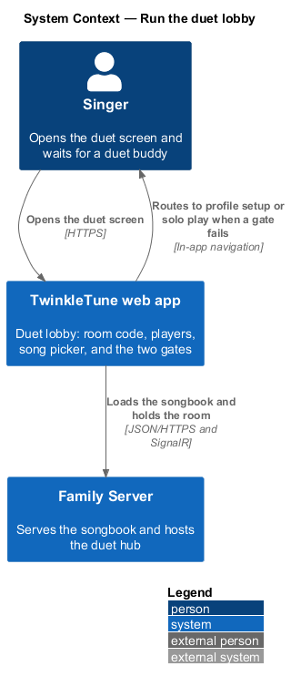
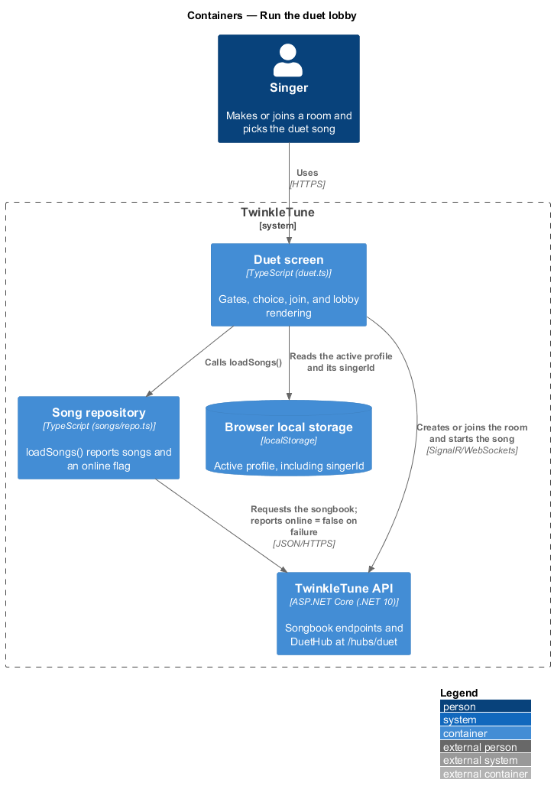
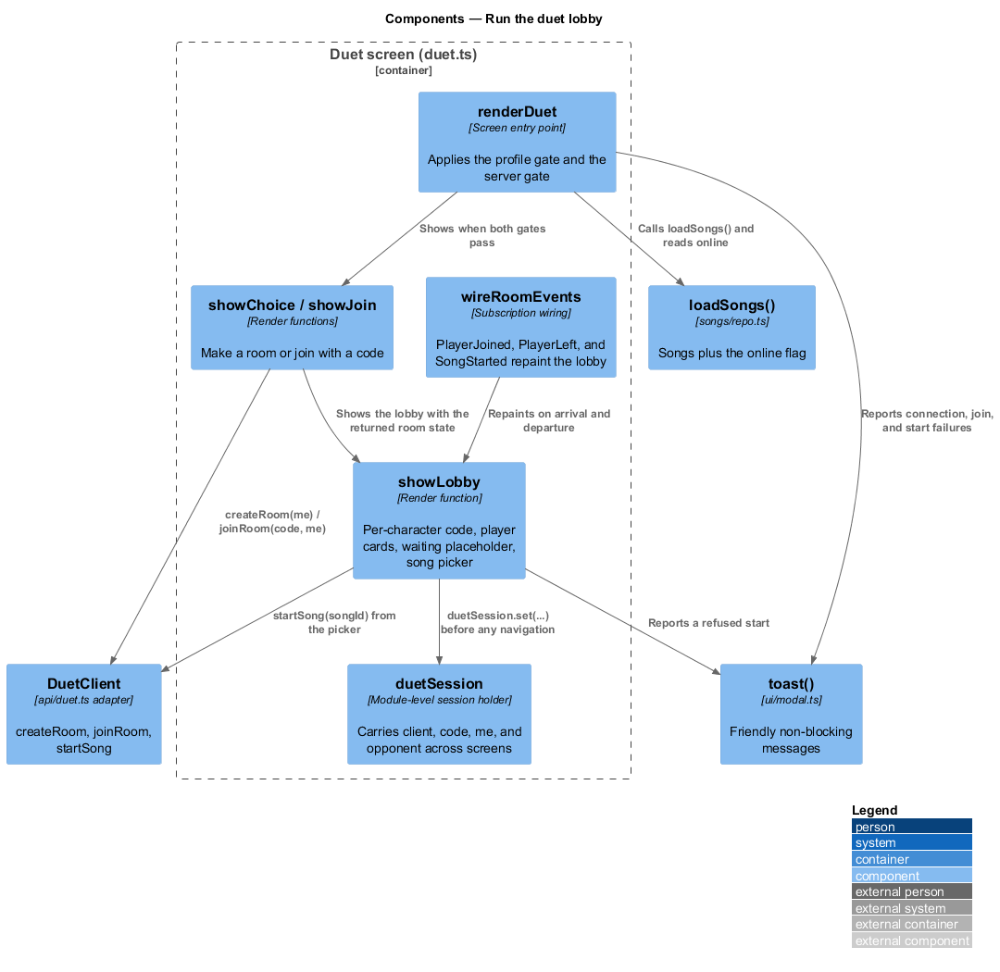
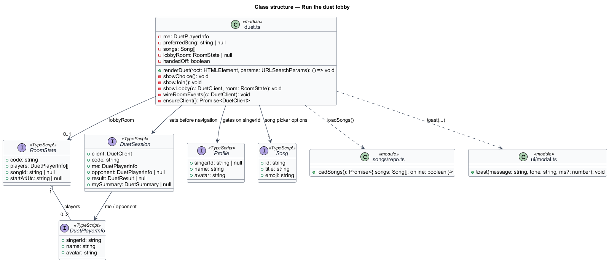
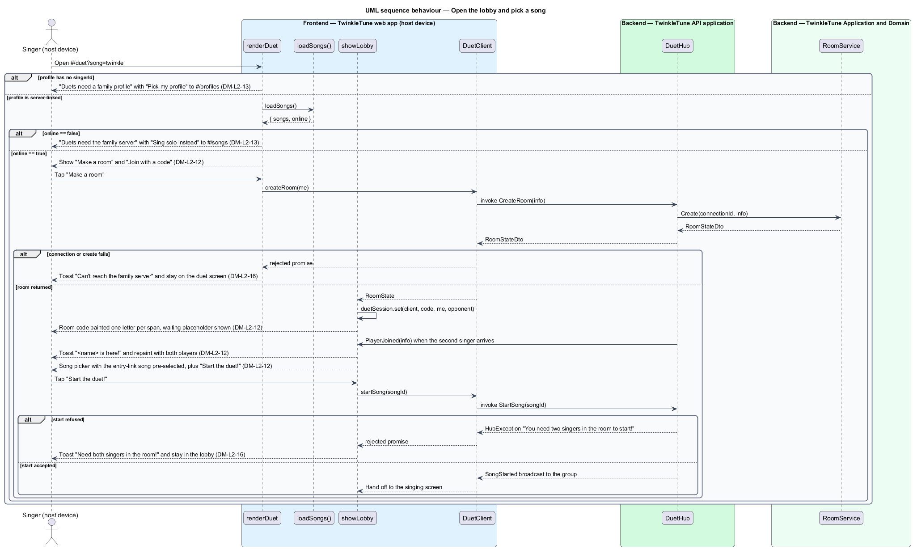

# Run the Duet Lobby

## Overview

Between opening the duet screen and singing together sits a short waiting room.
The lobby is where the room code is shown big enough to read across a room, where
each singer watches the other arrive, and where the song for the duet is chosen.
It is also where the two preconditions for a duet are checked: a duet needs a
profile the server knows about, and it needs the family server to answer. When
either is missing, the lobby routes the singer somewhere kind rather than showing
an error.

The terms below are used throughout.

- lobby — duet-screen state that displays the room code, the present players, and
  the song picker once both singers are in the room
- per-character code display — rendering of the 4-letter code as one styled
  element per letter, so a young reader can call the letters out one at a time
- waiting placeholder — stand-in player card shown while a room holds one singer
- preferred song — song id carried into the duet screen on the entry link as the
  `song` query parameter, pre-selected in the picker
- server-linked profile — active profile carrying a `singerId` issued by the
  family server, as opposed to a local-only profile that exists on one device
- graceful fallback — routing a blocked singer to a working alternative, such as
  solo play or profile setup, in place of an error state
- non-blocking message — toast that reports a transient failure and leaves the
  singer on the duet screen

The lobby depends on room creation and joining for the room it displays, and
hands off to the synchronised start once both singers are present.

## Description

Frontend — TwinkleTune web app (`frontend/src/screens/duet.ts`):

- **`renderDuet(root, params)`** — the whole feature. It reads
  `store.get().profile`, reads `params.get('song')` into `preferredSong`, paints
  the shell, and then chooses one of three paths: profile setup, solo fallback,
  or `showChoice()`.
- **profile gate** — when `!profile.singerId`, the stage renders the message that
  duets need a family profile and a single `Pick my profile ⭐` action linking to
  `#/profiles`; `renderDuet` returns a no-op teardown without opening a
  connection.
- **server gate** — `loadSongs()` resolves `{ songs, online }`; when `!online`
  the stage renders the message that duets need the family server together with a
  `Sing solo instead ▶` link to `#/songs`, and `showChoice()` is never reached.
- **`showLobby(c, room)`** — stores `lobbyRoom`, calls `duetSession.set(...)`
  with the client, code, `me`, the resolved opponent, and null result and
  summary, then renders three blocks: the `ROOM CODE` card with
  `room.code.split('').map((ch) => '' + ch + '')` inside
  `.duet-code`, a `.duet-players` row of profile cards, and a `[data-song-area]`
  container.
- **waiting placeholder** — when `room.players.length !== 2`, `showLobby` appends
  a `profile-card profile-new` card reading `Waiting…` with an hourglass, and the
  caption reads `Tell your duet buddy this code!`; with both present the caption
  reads `Everyone is here! 🎉`.
- **song picker** — rendered into `[data-song-area]` only when both singers are
  present. Each loaded song becomes an `<option value="{s.id}">` carrying its
  emoji and title, with ` selected` applied when `s.id === preferredSong`. A
  `Start the duet! 🎤🎤` button reads the selected value and calls
  `c.startSong(songId)`.
- **`wireRoomEvents(c)`** — subscribes to `onPlayerJoined`, `onPlayerLeft`, and
  `onSongStarted`; the first two mutate `lobbyRoom.players`, raise a toast, and
  repaint the lobby.
- **toasts** — `Can't reach the family server 📡` when `createRoom()` or
  `joinRoom()` throws while connecting, the three join messages, and
  `Need both singers in the room!` when `c.startSong(songId)` rejects. Each is
  raised through `toast(message, 'pink')` and leaves the lobby standing.
- **`toast(message, tone, duration?)`** — `frontend/src/ui/modal.ts` helper that
  shows a transient banner; the `gold` tone carries arrivals and the `pink` tone
  carries departures and failures.

Frontend — song repository (`frontend/src/songs/repo.ts`):

- **`loadSongs()`** — resolves `{ songs, online }`, reporting `online: false`
  when the server songbook request fails and the cached or bundled catalogue is
  served instead. The duet screen reads that flag as its server-reachability
  check.

## Requirements

The feature realizes the following level-2 (L2) requirements. Each L2 requirement
refines a level-1 (L1) requirement, cited by identifier.

| L2 ID | Refines (L1) | Requirement |
|-------|--------------|-------------|
| `DM-L2-12` | `DM-L1-1` | The lobby shall let a singer make a room or join with a code, display the room code in large per-character form, show both players with a waiting placeholder when alone, and — once both are present — offer a song picker pre-selecting the song passed in, together with a start action. |
| `DM-L2-13` | `DM-L1-7` | Duets shall require a server-linked profile and a reachable server; a local-only profile shall be routed to profile setup and an unreachable server shall be routed to solo play, each with a friendly message rather than an error. |
| `DM-L2-16` | `DM-L1-7` | Transient connection, join, and start failures shall surface as friendly, non-blocking messages while keeping the singer on the duet screen. |

## Diagrams

### System context

The singer opens the duet screen; the lobby reaches the family server for the
songbook and the room, and routes to profile setup or solo play when either
precondition fails (`DM-L2-13`).

### Containers

The duet screen reads the active profile from local storage, loads the songbook
over REST, and holds the room over the SignalR hub connection (`DM-L2-12`,
`DM-L2-13`).

### Components

`renderDuet` composes the gates, the choice and join views, and `showLobby`;
`toast` carries every transient failure without leaving the screen (`DM-L2-16`).

### Class structure

The lobby holds a `RoomState` and a `DuetSession`, and renders from
`DuetPlayerInfo` and `Song`; the render functions are the lobby's states
(`DM-L2-12`).

### Behaviour — open the lobby and pick a song

The two gates run first (`DM-L2-13`), the lobby paints the per-character code and
the waiting placeholder, the arrival of the second singer repaints it with the
song picker pre-selecting the entry-link song (`DM-L2-12`), and a refused start
raises a non-blocking message (`DM-L2-16`).

