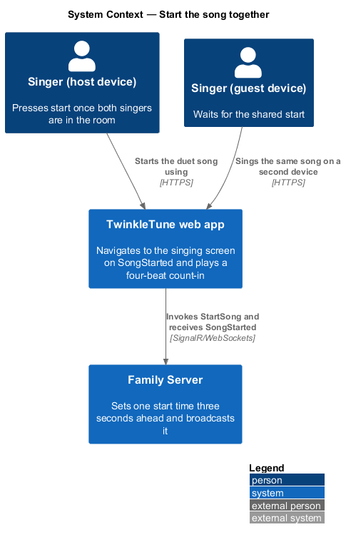
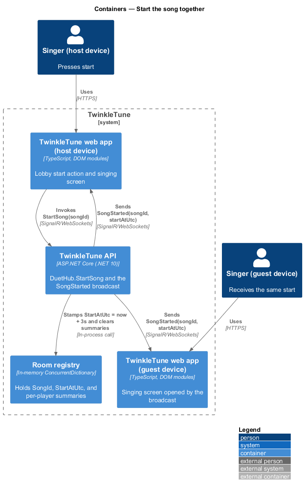
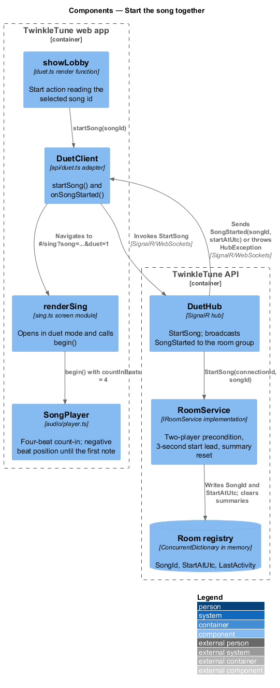
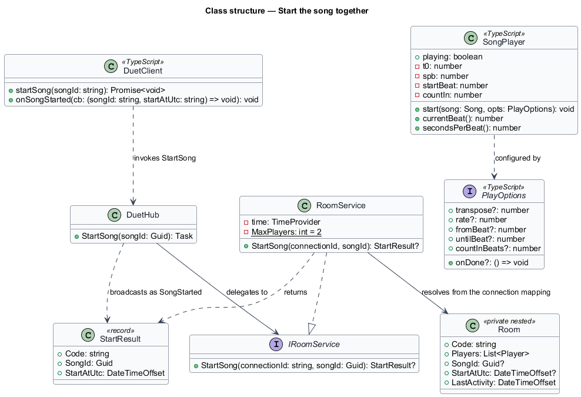
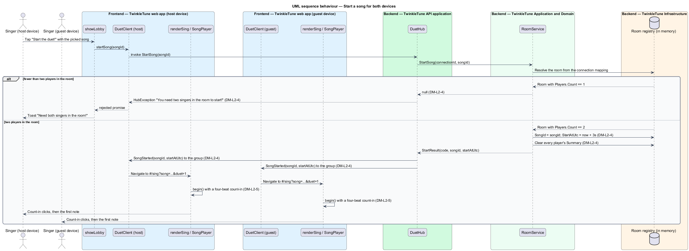

# Start the Song Together

## Overview

Two singers in two rooms of the same house press start once, and both songs
begin. This feature is the moment of agreement: the server refuses to start
unless both singers are present, fixes one start time slightly in the future,
clears anything left over from a previous run, and tells both devices at the same
moment. The near-future start time exists because two tablets on the same
home network do not agree on the current instant to the millisecond, and the
count-in that opens every song widens the window in which a small disagreement
does not matter.

The terms below are used throughout.

- synchronised start — single server-issued moment that both devices treat as the
  beginning of the same performance
- start lead — interval by which the server places the start time ahead of the
  moment the start is requested, fixed at 3 seconds
- clock skew — difference between two devices' notions of the current instant
- count-in — four metronome clicks played before the first note, during which the
  beat position is negative
- summary reset — clearing of both players' stored finish summaries when a song
  starts, so a second run is not judged against the first
- per-phrase comparison — comparing two performances a phrase at a time rather
  than instant by instant, so a momentary network delay does not distort the
  result

The feature sits between the lobby, which supplies the chosen song, and the
singing screen, which runs the gameplay loop and the opponent overlay.

## Description

Frontend — TwinkleTune web app (`frontend/src/screens/duet.ts`):

- **start action** — the lobby's `Start the duet! 🎤🎤` button reads the selected
  `songId` and calls `c.startSong(songId)`; a rejection raises the toast
  `Need both singers in the room!`.
- **`onSongStarted` subscription** — registered in `wireRoomEvents(c)`. It
  resolves the opponent from `lobbyRoom.players`, sets `handedOff = true` so the
  screen teardown does not end the session, and navigates to
  `#/sing?song={songId}&duet=1`.

Frontend — duet API adapter (`frontend/src/api/duet.ts`):

- **`DuetClient.startSong(songId)`** — invokes the hub method `StartSong` and
  returns the invocation promise, so a refusal is observable to the caller.
- **`DuetClient.onSongStarted(cb)`** — registers a handler for the `SongStarted`
  event with the signature `(songId: string, startAtUtc: string) => void`.

Frontend — singing screen and player
(`frontend/src/screens/sing.ts`, `frontend/src/audio/player.ts`):

- **`renderSing(root, params)`** — reads `duet` from `duetSession.get()` when
  `params.get('duet') === '1'`, and returns to `#/duet` when the session is
  absent. In duet mode the start control reads `I'm ready! 🎤🎤`.
- **`begin(from = fromBeat, countIn = 4)`** — starts `SongPlayer` with
  `countInBeats: countIn` and begins the animation frame loop.
- **`SongPlayer.start(song, opts)`** — schedules `countInBeats` clicks from `t0`,
  the first at 1568 Hz and the rest at 1046 Hz, and places the first note at
  `t0 + countInBeats · spb`.
- **`SongPlayer.currentBeat()`** — returns `startBeat - countIn` before playback
  and advances from there, so the beat position is negative through the count-in.

Backend — TwinkleTune API application (`backend/src/TwinkleTune.Api/Hubs/DuetHub.cs`):

- **`StartSong(Guid songId)`** — calls `rooms.StartSong` and throws
  `HubException("You need two singers in the room to start!")` when the service
  returns `null`; otherwise it sends `SongStarted` with `start.SongId` and
  `start.StartAtUtc` to `Clients.Group(start.Code)`, reaching both players.

Backend — Application and Domain
(`backend/src/TwinkleTune.Application/Duet/RoomService.cs`):

- **`RoomService.StartSong(connectionId, songId)`** — resolves the room from the
  connection mapping and returns `null` when no room is found or when
  `room.Players.Count < MaxPlayers`. Otherwise, inside `lock (room)`, it records
  `room.SongId`, sets `room.StartAtUtc = time.GetUtcNow().AddSeconds(3)`, stamps
  `room.LastActivity`, sets every `p.Summary` to `null`, and returns a
  `StartResult`.
- **`StartResult`** — record carrying `Code`, `SongId`, and `StartAtUtc`.
- **`TimeProvider time`** — injected clock, so `StartAtUtc` is deterministic under
  test.

Constants (the shipped baseline): start lead `3` seconds, `MaxPlayers = 2`,
count-in `4` beats (`2` beats on a practice repeat).

Realisation gap: the server issues `StartAtUtc` and `DuetClient.onSongStarted`
carries it, but the duet screen's handler binds only `songId` and each device
begins its own count-in when its singer taps `I'm ready! 🎤🎤`. The alignment
therefore rests on the count-in rather than on the timestamp. Aligning playback
to `startAtUtc` on the device is `<TO SUPPLY>`, as is the per-phrase comparison
of the two performances that ADR-0001 names as the latency-variance mitigation.

Coverage: `RoomServiceTests` exercises the refusal below two players and the
3-second lead; `DuetFlowTests` exercises the `SongStarted` broadcast to both
connections.

## Requirements

The feature realizes the following level-2 (L2) requirements. Each L2 requirement
refines a level-1 (L1) requirement, cited by identifier.

| L2 ID | Refines (L1) | Requirement |
|-------|--------------|-------------|
| `DM-L2-4` | `DM-L1-1, DM-L1-4` | Starting a song shall require two players; on start the server shall set a start time approximately 3 seconds in the future, clear any prior summaries, and broadcast `SongStarted` with the song id and start time to both clients. A start attempted with fewer than two players shall be refused. |
| `DM-L2-5` | `DM-L1-4` | The synchronised start shall combine the server-issued future start time with the gameplay count-in so that small clock differences between devices do not desynchronise the shared start; result comparison shall be per phrase rather than instantaneous. |

## Diagrams

### System context

Both singers reach the same family server, and the server alone decides when the
shared song begins (`DM-L2-4`).

### Containers

One device invokes `StartSong` on the hub; the hub broadcasts `SongStarted` to
the room group so both web apps navigate to the singing screen (`DM-L2-4`).

### Components

`RoomService.StartSong` enforces the two-player precondition and stamps the
3-second lead, and `SongPlayer` supplies the four-beat count-in that absorbs the
remaining skew (`DM-L2-4`, `DM-L2-5`).

### Class structure

`StartResult` carries the code, song id, and start time from `RoomService` to
`DuetHub`, and `SongPlayer` holds the count-in that the beat clock offsets
against (`DM-L2-4`, `DM-L2-5`).

### Behaviour — start a song for both devices

The `alt` shows the refusal below two players and the accepted path that stamps
`StartAtUtc = now + 3s` and clears prior summaries (`DM-L2-4`); both devices
receive one broadcast and each opens its own four-beat count-in (`DM-L2-5`).

