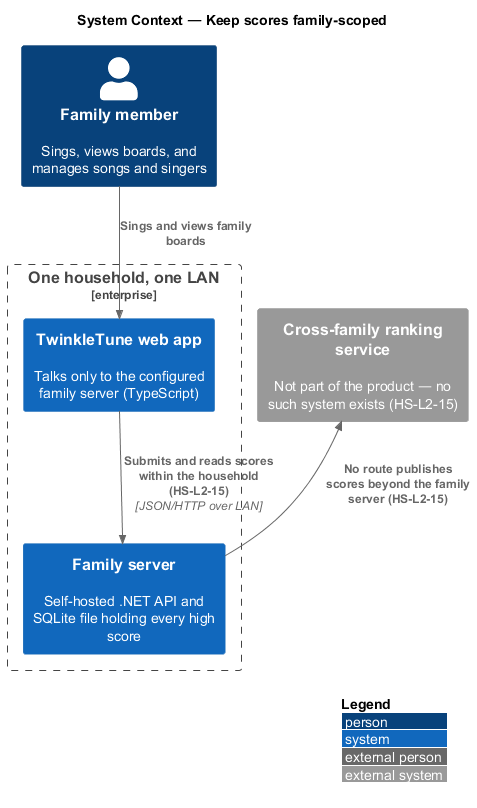
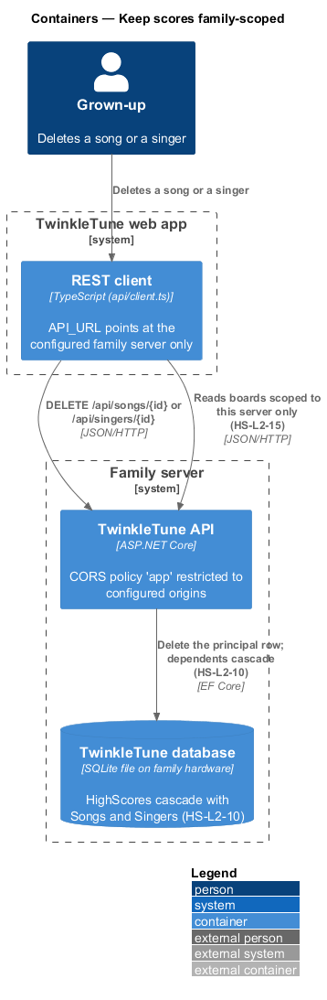
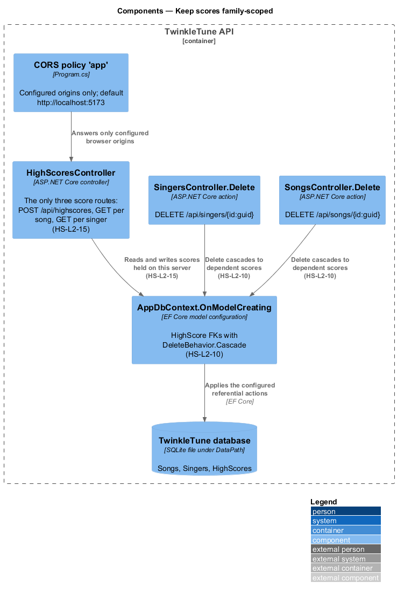
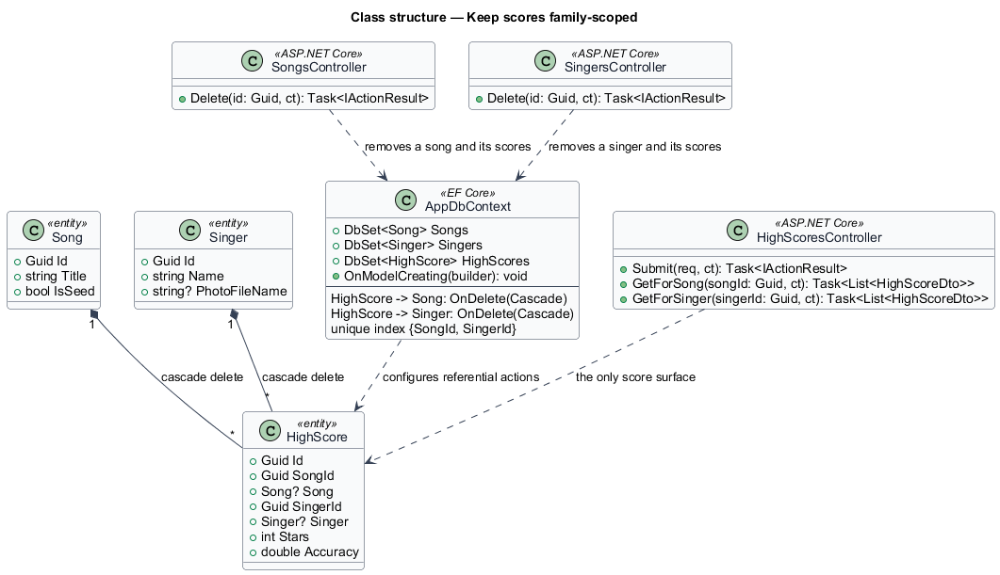
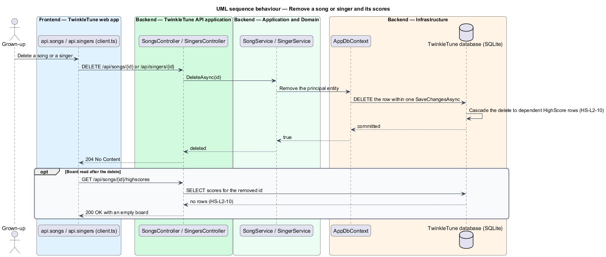
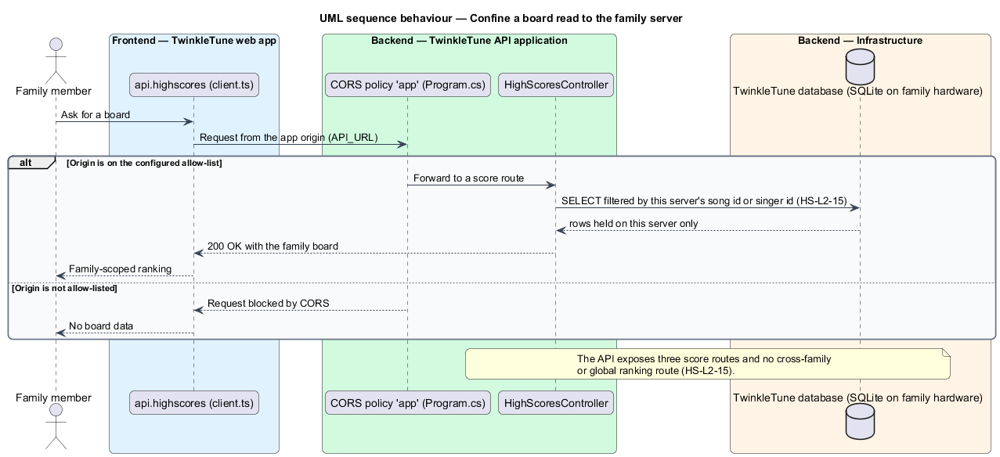

# Keep scores family-scoped

## Overview

High scores are the one part of TwinkleTune where a child's result is compared
against someone else's, so the boundary around them is drawn deliberately. Scores
live only on the family's own server, on the home network, and the API surface
offers no way to rank a singer against anyone outside that server. The same
posture governs deletion: removing a song or a singer removes the scores that
referenced them, so no orphaned result outlives the thing it was about.

The terms below are used throughout.

- family scope — boundary within which a score is visible: exactly one
  self-hosted family server on a home LAN
- global leaderboard — cross-family ranking of singers, which the product does not
  offer and for which no endpoint exists
- cascade delete — referential action that removes dependent `HighScore` rows when
  the principal `Song` or `Singer` row is removed
- orphaned score — high-score row whose song or singer no longer exists, which the
  cascade rules prevent
- CORS origin allow-list — configured set of browser origins the API answers,
  defaulting to `http://localhost:5173`

The posture stated here follows ADR-0001 (.NET and SignalR backend for real-time
head-to-head singing) and ADR-0002 (Clean Architecture, EF Core with SQLite, and a
no-auth LAN deployment), and product principles P3 (data minimisation and
on-premises storage) and P4 (LAN-only, no accounts).

## Description

Backend — persistence
(`backend/src/TwinkleTune.Infrastructure/Persistence/AppDbContext.cs`):

- **`AppDbContext.OnModelCreating`, `HighScore` block** — configures the entity
  with `b.HasIndex(h => new { h.SongId, h.SingerId }).IsUnique()` and the two
  relationships below.
- **`HighScore` → `Song` relationship** —
  `b.HasOne(h => h.Song).WithMany().HasForeignKey(h => h.SongId).OnDelete(DeleteBehavior.Cascade)`.
- **`HighScore` → `Singer` relationship** —
  `b.HasOne(h => h.Singer).WithMany().HasForeignKey(h => h.SingerId).OnDelete(DeleteBehavior.Cascade)`.
- **`DbSet<HighScore> HighScores`** — the single set through which every score is
  read and written; SQLite applies the cascade at the database level.

Backend — API surface:

- **`SongsController.Delete`** — `[HttpDelete("{id:guid}")]` returning
  `NoContent()` or `NotFound()`; the removal of the song row triggers the score
  cascade.
- **`SingersController.Delete`** — the same shape for a singer.
- **`HighScoresController`** — the complete high-score surface: `POST
  /api/highscores`, `GET /api/songs/{songId:guid}/highscores`, and `GET
  /api/singers/{singerId:guid}/highscores`. Every read is filtered by a song id
  or a singer id belonging to this server; no route returns scores across
  families and no route ranks singers globally.
- **`Program.cs` CORS policy `"app"`** — built from
  `builder.Configuration.GetSection("Cors:Origins").Get<string[]>() ?? ["http://localhost:5173"]`
  with `.AllowAnyHeader().AllowAnyMethod().AllowCredentials()`, so the API answers
  only the configured home origins.
- **`Program.cs` connection string** — defaults to
  `Data Source={dataDir}/twinkletune.db`, a file on the family's own hardware;
  there is no remote or shared store.

Frontend:

- **`API_URL`** (`frontend/src/api/client.ts`) — `VITE_API_URL` when configured,
  otherwise `http://localhost:5240` in development and the empty string (same
  origin) in production, so the public static build never probes a visitor's
  machine for a family server.
- **absence of a global board screen** — the app has no screen that requests
  scores from anything other than the configured family server.

## Requirements

The feature realizes the following level-2 (L2) requirements. Each L2 requirement
refines a level-1 (L1) requirement, cited by identifier.

| L2 ID | Refines (L1) | Requirement |
|-------|--------------|-------------|
| `HS-L2-10` | `HS-L1-6` | A high score shall be deleted automatically when its song or its singer is deleted. |
| `HS-L2-15` | `HS-L1-6` | High scores shall be scoped to the single family server, and the product shall expose no global or cross-family leaderboard. |

## Diagrams

### System context

Scores stay inside one household: the web app talks only to that family's own
server, and no external ranking service participates (`HS-L2-15`).

### Containers

The TwinkleTune API stores every score in a SQLite file on the family's hardware
and answers only the configured CORS origins, with no outbound path to any
cross-family service (`HS-L2-15`).

### Components

`AppDbContext.OnModelCreating` configures both high-score foreign keys with
`DeleteBehavior.Cascade`, so `SongsController.Delete` and
`SingersController.Delete` clear the dependent rows (`HS-L2-10`); the three
`HighScoresController` routes are the whole score surface (`HS-L2-15`).

### Class structure

`HighScore` holds required `SongId` and `SingerId` foreign keys, both configured
in `AppDbContext` with cascade delete (`HS-L2-10`), and `HighScoresController`
declares the only three routes that touch scores (`HS-L2-15`).

### Behaviour — remove a song or singer and its scores

Deleting a song or a singer through the grown-ups' surface removes the principal
row, and SQLite removes the dependent high-score rows in the same transaction, so
a later board read returns nothing for the removed entity (`HS-L2-10`).

### Behaviour — confine a board read to the family server

Every board read is filtered by a song id or singer id held on this server and
answered only for a configured CORS origin; no route offers a cross-family
ranking (`HS-L2-15`).

