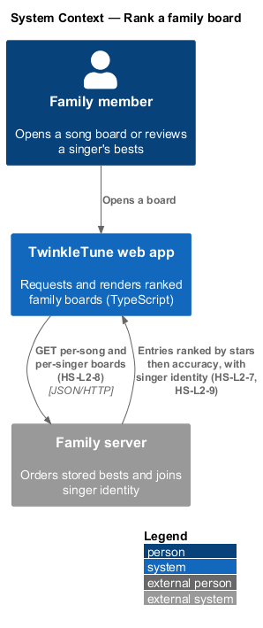
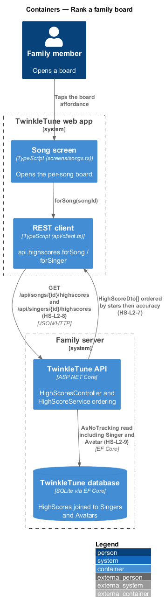
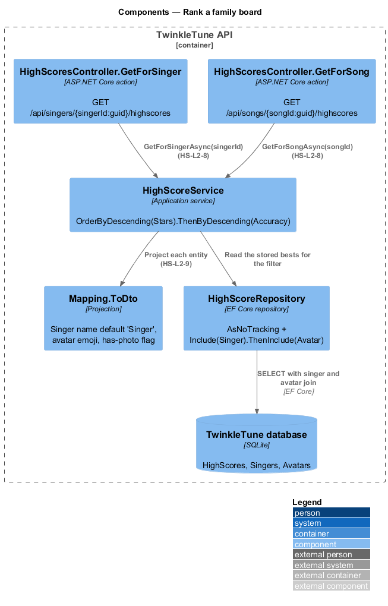
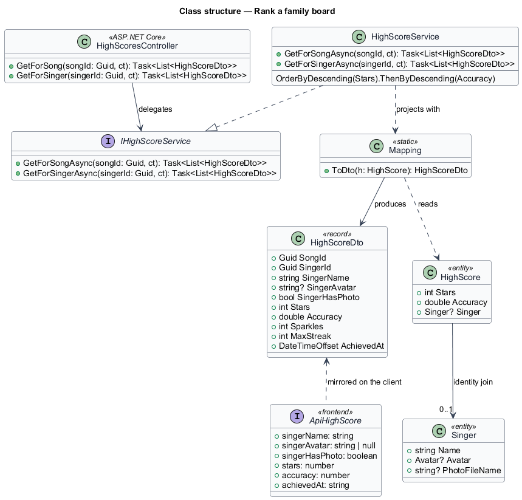
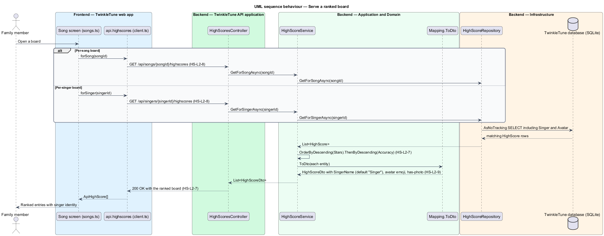

# Rank a family board

## Overview

A board answers one of two questions: who in the family sings this song best, and
how does one singer do across the songs they have sung. Both are served by the
family server from the same stored bests, ordered the same way a best is
defined — stars first, accuracy as the tie-break. Each entry carries enough
singer identity for the app to draw a recognisable row without a second request,
so a child sees a name and a face-like avatar rather than an identifier.

The terms below are used throughout.

- board — ordered list of stored bests, either for one song across singers or for
  one singer across songs
- per-song board — board served by `GET /api/songs/{songId}/highscores`
- per-singer board — board served by `GET /api/singers/{singerId}/highscores`
- board entry — `HighScoreDto` describing one stored best together with the
  singer's identity
- ranking key — pair (stars descending, accuracy descending) that orders every
  board
- singer identity — the name, avatar emoji, and has-photo flag joined onto a
  board entry

Producing the stored bests is covered by `record-personal-best`; rendering a
board in the app is covered by `show-song-board`.

## Description

Backend — API
(`backend/src/TwinkleTune.Api/Controllers/HighScoresController.cs`):

- **`GetForSong`** — `[HttpGet("/api/songs/{songId:guid}/highscores")]` action
  returning `Task<List<HighScoreDto>>` from `svc.GetForSongAsync(songId, ct)`.
  The `:guid` route constraint means a bundled slug id never matches the route.
- **`GetForSinger`** — `[HttpGet("/api/singers/{singerId:guid}/highscores")]`
  action returning `Task<List<HighScoreDto>>` from
  `svc.GetForSingerAsync(singerId, ct)`.

Backend — application
(`backend/src/TwinkleTune.Application/Services/HighScoreService.cs`,
`backend/src/TwinkleTune.Application/Mapping.cs`,
`backend/src/TwinkleTune.Application/Dtos/Dtos.cs`):

- **`GetForSongAsync`** — reads `highScores.GetForSongAsync(songId, ct)` then
  applies `.OrderByDescending(h => h.Stars).ThenByDescending(h => h.Accuracy)`
  and `.Select(h => h.ToDto()).ToList()`.
- **`GetForSingerAsync`** — the same ordering and projection over
  `highScores.GetForSingerAsync(singerId, ct)`.
- **`Mapping.ToDto(this HighScore h)`** — projects the entity onto a
  `HighScoreDto`, resolving `h.Singer?.Name ?? "Singer"`,
  `h.Singer?.Avatar?.Emoji`, and `h.Singer?.PhotoFileName is not null`.
- **`HighScoreDto`** — record of `Guid SongId`, `Guid SingerId`,
  `string SingerName`, `string? SingerAvatar`, `bool SingerHasPhoto`,
  `int Stars`, `double Accuracy`, `int Sparkles`, `int MaxStreak`,
  `DateTimeOffset AchievedAt`.

Backend — infrastructure
(`backend/src/TwinkleTune.Infrastructure/Repositories/Repositories.cs`):

- **`HighScoreRepository.GetForSongAsync`** — `AsNoTracking()` query over
  `HighScores` with `.Include(h => h.Singer)!.ThenInclude(s => s!.Avatar)`,
  filtered by `SongId`. The include is what makes the name and emoji available
  without a second round trip.
- **`HighScoreRepository.GetForSingerAsync`** — the same shape filtered by
  `SingerId`.

Frontend — REST client (`frontend/apps/game/src/api/client.ts`):

- **`api.highscores.forSong`** — `GET /api/songs/${songId}/highscores` resolving
  `ApiHighScore[]`.
- **`api.highscores.forSinger`** — `GET /api/singers/${singerId}/highscores`
  resolving `ApiHighScore[]`.
- **`ApiHighScore`** — client interface mirroring `HighScoreDto` in camel case:
  `songId`, `singerId`, `singerName`, `singerAvatar`, `singerHasPhoto`, `stars`,
  `accuracy`, `sparkles`, `maxStreak`, `achievedAt`.

## Requirements

The feature realizes the following level-2 (L2) requirements. Each L2 requirement
refines a level-1 (L1) requirement, cited by identifier.

| L2 ID | Refines (L1) | Requirement |
|-------|--------------|-------------|
| `HS-L2-7` | `HS-L1-3` | Per-song and per-singer boards shall be ordered by stars descending, then accuracy descending. |
| `HS-L2-8` | `HS-L1-5` | The server shall expose per-song (`GET /api/songs/{id}/highscores`) and per-singer (`GET /api/singers/{id}/highscores`) board endpoints alongside the submission endpoint. |
| `HS-L2-9` | `HS-L1-1` | Each board entry shall carry the singer's name (defaulting to "Singer" when absent), avatar emoji, and a has-photo flag, alongside stars, accuracy, sparkles, max streak, and achievement time. |

## Diagrams

### System context

A family member opens a board in the web app, which reads the ranked list from
the family server (`HS-L2-8`).

### Containers

The REST client calls the board endpoints; the API orders the stored bests and
projects them with singer identity before answering (`HS-L2-7`, `HS-L2-9`).

### Components

`HighScoresController` exposes the two board routes (`HS-L2-8`),
`HighScoreService` applies the stars-then-accuracy ordering (`HS-L2-7`), and
`Mapping.ToDto` joins the singer's name, avatar, and has-photo flag (`HS-L2-9`).

### Class structure

`HighScoreDto` and its client mirror `ApiHighScore` carry both the score values
and the singer identity (`HS-L2-9`); `IHighScoreService` declares the two board
reads (`HS-L2-8`).

### Behaviour — serve a ranked board

The `alt` distinguishes the per-song route from the per-singer route (`HS-L2-8`);
both take the same path through the `AsNoTracking` include query, the
stars-then-accuracy ordering (`HS-L2-7`), and the `ToDto` projection that resolves
the singer name default (`HS-L2-9`).

