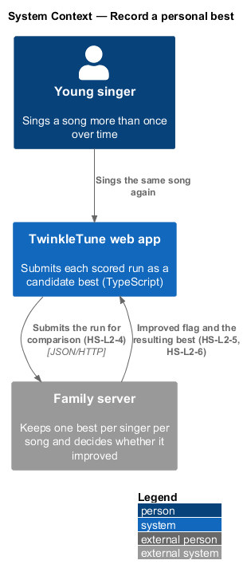
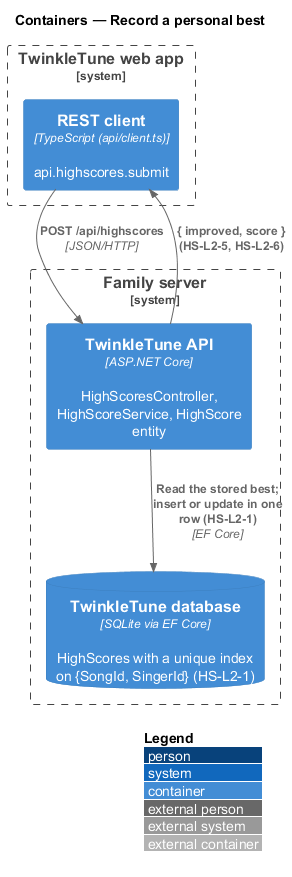
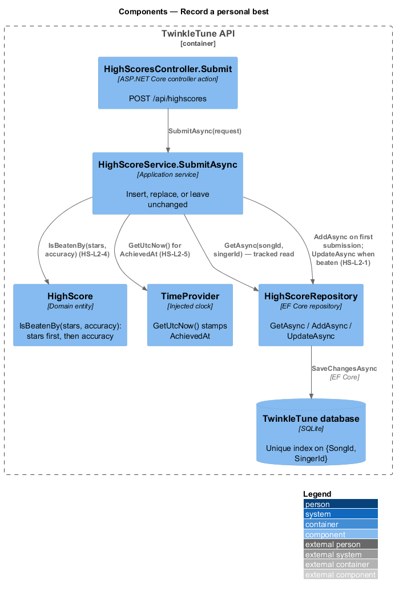
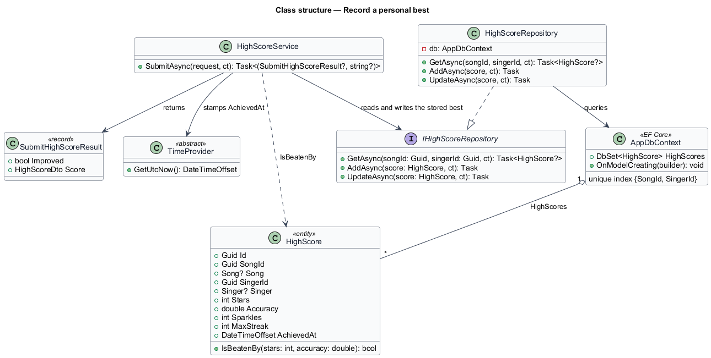
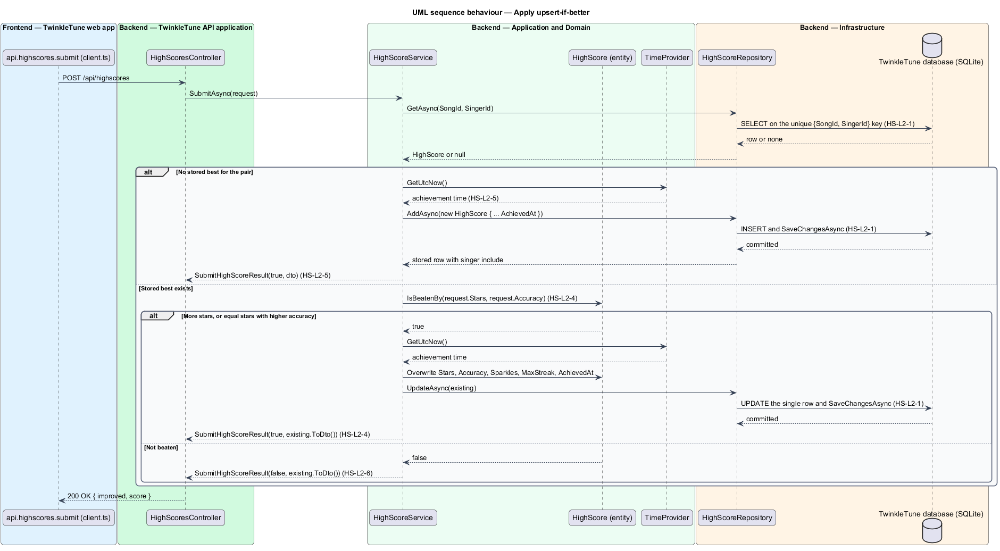

# Record a personal best

## Overview

The family server keeps one row per singer per song — a personal best, not a
history of attempts. A submission that arrives for a pair with no stored row
creates it; a submission for a pair that already has one replaces the stored
values only when the new performance genuinely beats them. The comparison uses
stars first and accuracy as the tie-break, the same ordering the boards use, so
"best" means the same thing everywhere in the product. Every outcome reports
whether the record changed, which is what drives the celebration on the results
screen.

The terms below are used throughout.

- stored best — single `HighScore` row for a (song, singer) pair, holding stars,
  accuracy, sparkles, max streak, and the achievement time
- upsert-if-better — write policy that inserts a missing record and updates an
  existing one only when the incoming result beats it
- beaten by — relation holding when the incoming stars exceed the stored stars,
  or the stars are equal and the incoming accuracy is higher
- achievement time — `DateTimeOffset` stamped from `TimeProvider` at the moment a
  record is created or replaced
- improved outcome — `SubmitHighScoreResult` whose `Improved` is `true`, meaning
  the stored best changed in this call

Validation of the submitted values runs first and is covered by
`validate-submission`; ordering the resulting rows for display is covered by
`rank-family-board`.

## Description

Backend — domain
(`backend/src/TwinkleTune.Domain/Entities/HighScore.cs`):

- **`HighScore`** — entity with `Guid Id`, `Guid SongId`, `Song? Song`,
  `Guid SingerId`, `Singer? Singer`, `int Stars`, `double Accuracy`,
  `int Sparkles`, `int MaxStreak`, and `DateTimeOffset AchievedAt`.
- **`HighScore.IsBeatenBy(int stars, double accuracy)`** — expression-bodied
  method returning `stars > Stars || (stars == Stars && accuracy > Accuracy)`.
  This is the single definition of "better" in the subsystem.

Backend — application
(`backend/src/TwinkleTune.Application/Services/HighScoreService.cs`):

- **`HighScoreService`** — primary-constructor service taking
  `IHighScoreRepository highScores`, `ISongRepository songs`,
  `ISingerRepository singers`, and `TimeProvider time`.
- **`SubmitAsync`** — after validation, calls
  `highScores.GetAsync(request.SongId, request.SingerId, ct)` and branches on the
  result.
- **insert branch** — when `existing is null`, constructs a `HighScore` with
  `Id = Guid.NewGuid()`, the submitted values, and
  `AchievedAt = time.GetUtcNow()`; calls `highScores.AddAsync(fresh, ct)`,
  re-reads the row to pick up the singer include, and returns
  `new SubmitHighScoreResult(true, dto)`.
- **replace branch** — when `existing.IsBeatenBy(request.Stars,
  request.Accuracy)` holds, overwrites `Stars`, `Accuracy`, `Sparkles`,
  `MaxStreak`, and `AchievedAt` on the tracked entity, calls
  `highScores.UpdateAsync(existing, ct)`, and returns
  `new SubmitHighScoreResult(true, existing.ToDto())`.
- **unchanged branch** — otherwise returns
  `new SubmitHighScoreResult(false, existing.ToDto())` with the stored best
  untouched.
- **`TimeProvider`** — injected clock, so the achievement time is controllable in
  `HighScoreServiceTests`.

Backend — infrastructure
(`backend/src/TwinkleTune.Infrastructure/Repositories/Repositories.cs`,
`backend/src/TwinkleTune.Infrastructure/Persistence/AppDbContext.cs`):

- **`HighScoreRepository.GetAsync`** — `FirstOrDefaultAsync` over `HighScores`
  filtered by `SongId` and `SingerId`, with
  `.Include(h => h.Singer)!.ThenInclude(s => s!.Avatar)`; the query is tracked, so
  the replace branch persists through `SaveChangesAsync`.
- **`HighScoreRepository.AddAsync`** — adds the entity and calls
  `db.SaveChangesAsync(ct)`.
- **`HighScoreRepository.UpdateAsync`** — calls `db.SaveChangesAsync(ct)` on the
  already-tracked entity.
- **unique index** — `b.HasIndex(h => new { h.SongId, h.SingerId }).IsUnique()`
  in `AppDbContext.OnModelCreating`, which makes the one-row-per-pair rule a
  database constraint rather than a service convention.

## Requirements

The feature realizes the following level-2 (L2) requirements. Each L2 requirement
refines a level-1 (L1) requirement, cited by identifier.

| L2 ID | Refines (L1) | Requirement |
|-------|--------------|-------------|
| `HS-L2-1` | `HS-L1-1` | The store shall permit at most one high-score record per (song, singer) pair; a repeat submission shall update that single record in place or leave it unchanged, never create a second. |
| `HS-L2-4` | `HS-L1-2` | An existing best shall be replaced only when the new result beats it — more stars, or equal stars with higher accuracy. |
| `HS-L2-5` | `HS-L1-2` | A first submission for a (song, singer) pair shall create the record, stamp the achievement time, and report the result as improved. |
| `HS-L2-6` | `HS-L1-2` | A submission that does not beat the stored best shall leave it unchanged, report the result as not improved, and return the existing best. |

## Diagrams

### System context

The web app submits a finished performance to the family server, which keeps one
best per singer per song and answers with whether that best changed (`HS-L2-1`,
`HS-L2-5`).

### Containers

The TwinkleTune API compares the submission against the stored row in the SQLite
database, whose unique index on `{SongId, SingerId}` enforces the one-row-per-pair
rule (`HS-L2-1`).

### Components

`HighScoreService.SubmitAsync` reads the stored best through
`HighScoreRepository`, asks `HighScore.IsBeatenBy` whether the submission wins
(`HS-L2-4`), and stamps `AchievedAt` from `TimeProvider` on insert or replace
(`HS-L2-5`).

### Class structure

`HighScore` owns `IsBeatenBy`, the comparison the service applies (`HS-L2-4`);
`SubmitHighScoreResult` pairs the `Improved` flag with the resulting
`HighScoreDto` (`HS-L2-5`, `HS-L2-6`).

### Behaviour — apply upsert-if-better

The outer `alt` splits a first submission, which inserts and reports improved
(`HS-L2-5`), from a repeat. The inner `alt` applies `IsBeatenBy` (`HS-L2-4`):
a winning result overwrites the single stored row (`HS-L2-1`) and a losing one
returns the unchanged best with `Improved = false` (`HS-L2-6`).

