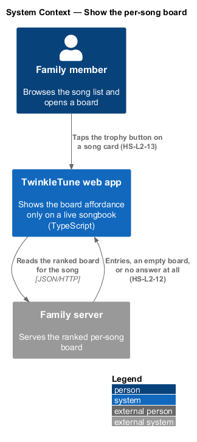
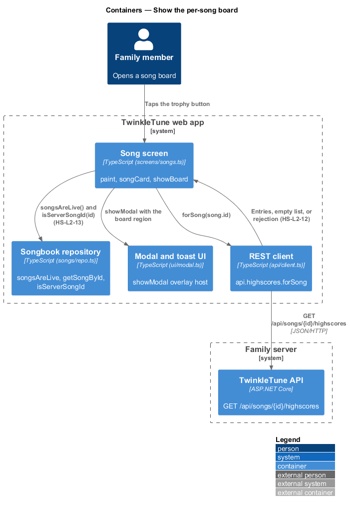
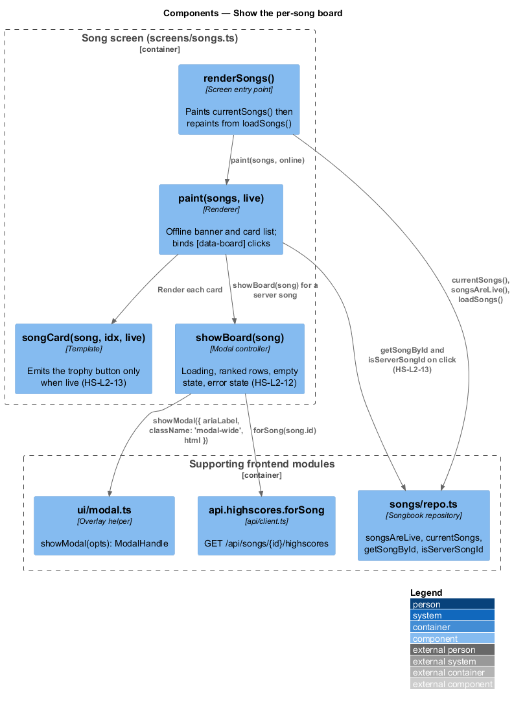
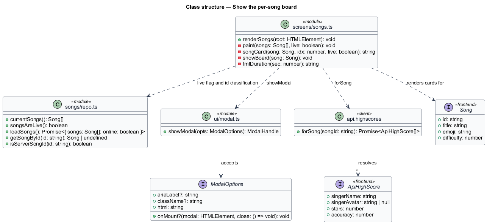
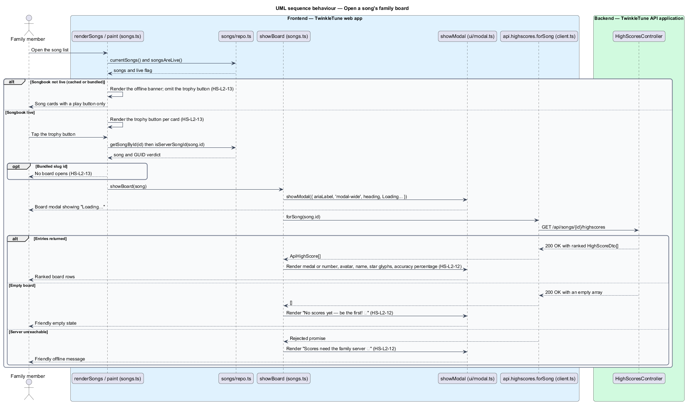

# Show the per-song board

## Overview

The song list carries a trophy button on each card that opens a modal showing who
in the family sings that song best. The board is a server feature, so the button
appears only when the songbook is being served live, and it opens only for songs
that came from the server. Inside the modal, positions read as medals for the top
three and numbers after that, each row pairing the singer's avatar and name with
star glyphs and an accuracy percentage. An empty board and an unreachable server
each get a short, warm message rather than blank space or an error dialog.

The terms below are used throughout.

- board modal — overlay dialog listing one song's ranked family bests
- board affordance — trophy button (`🏆`) rendered on a song card, labelled "High
  scores for &lt;title&gt;"
- live songbook — state in which the current song list came from the family
  server this session, rather than from cache or the offline bundle
- medal position — one of `🥇`, `🥈`, `🥉` for the first three entries, with
  `4.`, `5.`, and so on after them
- star glyph rendering — three-character run of `★` for earned stars and `☆` for
  the remainder
- empty state — message shown when the song has no stored bests yet

Producing and ordering the entries is covered by `rank-family-board`; deciding
which songbook is live is owned by the song library subsystem (`SL-L2-4`,
`SL-L2-5`).

## Description

Frontend — song screen (`frontend/src/screens/songs.ts`):

- **`renderSongs`** — screen function that paints `currentSongs()` with
  `songsAreLive()` immediately, then repaints from `loadSongs()` with the
  resolved `online` flag.
- **`paint(songs, live)`** — renders the card list; the `live` argument decides
  whether the board affordance exists at all.
- **`songCard(song, idx, live)`** — emits the `extras` fragment only when `live`
  is true. That fragment holds
  `<button class="mini-btn" data-board="${song.id}" aria-label="High scores for
  ${song.title}">🏆</button>` alongside the duet button.
- **offline banner** — when `live` is false, `paint` renders "Offline songbook —
  duets and family scores come back when the server does." and omits `extras`
  entirely.
- **board click handler** — `list.querySelectorAll('[data-board]')` binds a click
  that resolves `getSongById(btn.dataset.board)` and calls `showBoard(song)` only
  when `isServerSongId(song.id)` holds.
- **`showBoard(song)`** — opens `showModal` with
  `ariaLabel: 'High scores for ${song.title}'`, `className: 'modal-wide'`, a
  `<h3>🏆 ${song.title}</h3>` heading, a `[data-board]` region showing "Loading…",
  and a Close button.
- **row template** — for each entry at index `i`, renders `.board-row` with
  `['🥇','🥈','🥉'][i] ?? \`${i + 1}.\`` as the position, `s.singerAvatar ?? '🎤'`
  as the emoji, `s.singerName`, `'★'.repeat(s.stars)` followed by
  `'☆'.repeat(Math.max(0, 3 - s.stars))`, and `Math.round(s.accuracy * 100)`
  followed by a percent sign.
- **empty state** — when `scores.length` is zero, the region shows "No scores yet
  — be the first! ⭐".
- **error state** — the `.catch` branch replaces the region with "Scores need the
  family server 📡".

Frontend — supporting modules:

- **`api.highscores.forSong`** (`frontend/src/api/client.ts`) — issues
  `GET /api/songs/${songId}/highscores` and resolves `ApiHighScore[]`; a non-2xx
  or network failure rejects and drives the error state.
- **`songsAreLive`**, **`currentSongs`**, **`loadSongs`**, **`getSongById`**,
  **`isServerSongId`** (`frontend/src/songs/repo.ts`) — the songbook accessors
  that supply the live flag, the list, and the GUID id test.
- **`showModal`** (`frontend/src/ui/modal.ts`) — builds the overlay and returns a
  handle; `onMount` receives the modal element and a `close` callback.

## Requirements

The feature realizes the following level-2 (L2) requirements. Each L2 requirement
refines a level-1 (L1) requirement, cited by identifier.

| L2 ID | Refines (L1) | Requirement |
|-------|--------------|-------------|
| `HS-L2-12` | `HS-L1-5` | The per-song board shall list ranked entries with a medal or numeric position, the singer's avatar and name, a star glyph rendering, and an accuracy percentage; it shall show "No scores yet — be the first! ⭐" when there are no scores and "Scores need the family server 📡" when the server is unreachable. |
| `HS-L2-13` | `HS-L1-5` | The per-song board affordance shall appear only when the songbook is served live, and the board shall open only for server (GUID) song ids. |

## Diagrams

### System context

A family member browsing the song list opens a board, which the web app reads
from the family server; without that server no board affordance is offered
(`HS-L2-13`).

### Containers

The song screen asks the songbook repository whether the list is live, then reads
the ranked entries through the REST client from the TwinkleTune API (`HS-L2-13`,
`HS-L2-12`).

### Components

`paint` and `songCard` gate the trophy button on the live flag and
`isServerSongId` (`HS-L2-13`); `showBoard` renders the loading, populated, empty,
and error states inside the modal (`HS-L2-12`).

### Class structure

The song screen module holds `renderSongs`, `paint`, `songCard`, and `showBoard`,
and depends on the songbook repository for the live flag and id classification and
on `api.highscores.forSong` for the entries.

### Behaviour — open a song's family board

The outer `alt` shows the offline songbook hiding the affordance and the live
songbook rendering it, with the click handler re-checking `isServerSongId`
(`HS-L2-13`). The inner `alt` covers the three board outcomes — ranked rows, the
empty state, and the unreachable-server message (`HS-L2-12`).

