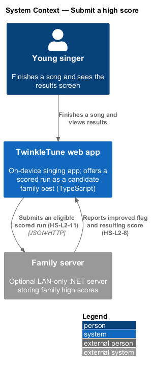
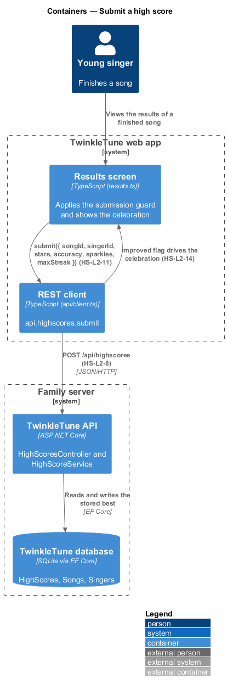
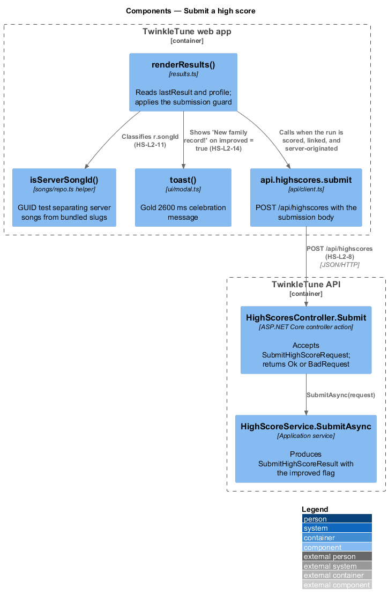
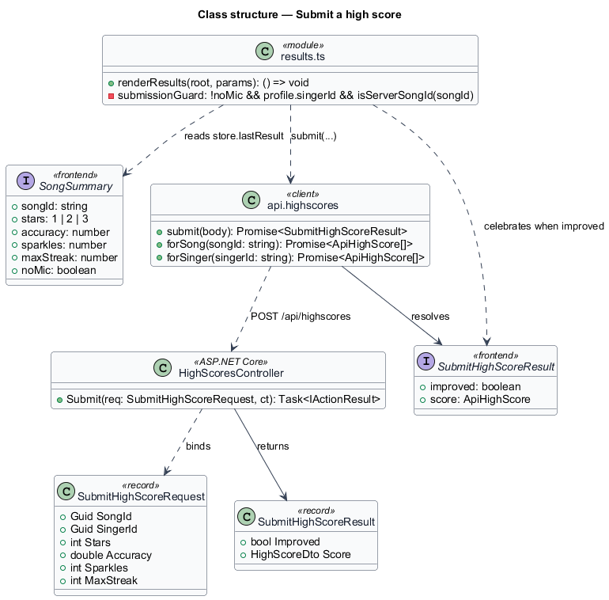
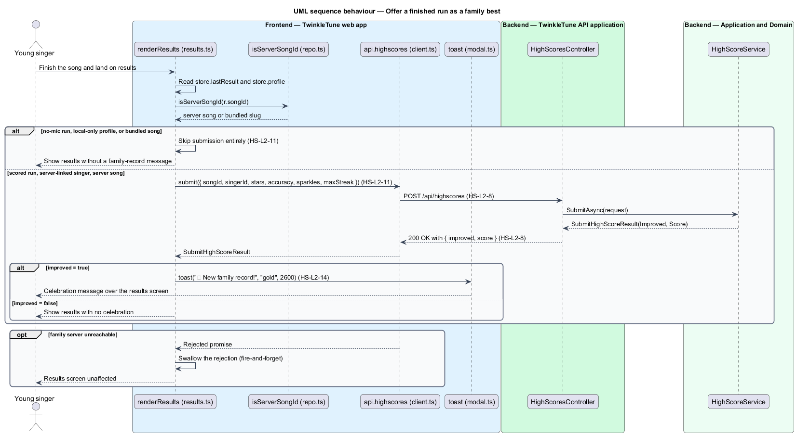

# Submit a high score

## Overview

When a child finishes singing, the results screen offers the performance to the
family server as a candidate best. The offer is conditional: only a scored run,
by a singer who exists on the server, on a song that came from the server, is
worth submitting. Everything else — a no-mic sing-along, a device-only profile, a
bundled song — stays on the device. The submission is fire-and-forget, so a
missing or unreachable server never delays or breaks the results screen. When the
server answers that the record improved, the app celebrates the moment.

family high score — best stored result for one singer on one song, held on the
family server

The terms below are used throughout.

- submission — request carrying `{ songId, singerId, stars, accuracy, sparkles,
  maxStreak }` offered to the server as a candidate best
- server-linked singer — device profile that carries a `singerId` issued by the
  family server, as opposed to a device-only profile
- server song — song whose id is a GUID, marking it as served by the family
  server rather than compiled into the bundle
- no-mic run — "just for fun" play mode with no microphone, which earns no stars
  and no high score
- improved flag — boolean in the submission response stating whether the stored
  best changed
- fire-and-forget — call whose promise is neither awaited nor surfaced as an
  error, so the caller proceeds regardless of the outcome

This feature covers the client-side decision to submit, the endpoint that accepts
the submission, and the celebration on an improved record. Comparing the
submission against the stored best belongs to `record-personal-best`, and
validating its values belongs to `validate-submission`.

## Description

Frontend — results screen (`frontend/apps/game/src/screens/results.ts`):

- **`renderResults`** — screen function that reads `store.get()` for
  `lastResult` (a `SongSummary`) and `profile`, then runs the submission block
  before painting the results markup.
- **submission guard** — the condition `!r.noMic && state.profile?.singerId &&
  isServerSongId(r.songId)`. All three parts hold before any request is issued.
- **`isServerSongId`** — `frontend/apps/game/src/songs/repo.ts` helper testing an id
  against the GUID regular expression
  `/^[0-9a-f]{8}-[0-9a-f]{4}-[0-9a-f]{4}-[0-9a-f]{4}-[0-9a-f]{12}$/i`.
- **`SongSummary`** — `frontend/apps/game/src/state/scoring.ts` result type supplying
  `songId`, `stars`, `accuracy`, `sparkles`, `maxStreak`, and `noMic`.
- **`toast('🏆 New family record!', 'gold', 2600)`** — `frontend/apps/game/src/ui/modal.ts`
  call fired when the response carries `improved = true`; the gold variant shows
  for 2600 ms.
- **`.catch(() => {})`** — the empty rejection handler that keeps an unreachable
  server silent on the results screen.

Frontend — REST client (`frontend/apps/game/src/api/client.ts`):

- **`api.highscores.submit`** — issues `POST /api/highscores` with a JSON body of
  `{ songId, singerId, stars, accuracy, sparkles, maxStreak }` and resolves a
  `SubmitHighScoreResult`.
- **`SubmitHighScoreResult`** — client interface with `improved: boolean` and
  `score: ApiHighScore`.
- **`req`** — the shared fetch wrapper; a non-2xx response throws an `ApiError`
  carrying the server's `error` string.

Backend — API (`backend/src/TwinkleTune.Api/Controllers/HighScoresController.cs`):

- **`HighScoresController`** — `[ApiController]` exposing the three high-score
  routes: `POST /api/highscores`, `GET /api/songs/{songId:guid}/highscores`, and
  `GET /api/singers/{singerId:guid}/highscores`.
- **`Submit`** — action that calls `IHighScoreService.SubmitAsync` and returns
  `Ok(result)` on success or `BadRequest(new { error })` when the service reports
  a rejection.
- **`SubmitHighScoreRequest`** — `backend/src/TwinkleTune.Application/Dtos/Dtos.cs`
  record of `Guid SongId`, `Guid SingerId`, `int Stars`, `double Accuracy`,
  `int Sparkles`, `int MaxStreak`.
- **`SubmitHighScoreResult`** — record of `bool Improved` and
  `HighScoreDto Score`.

## Requirements

The feature realizes the following level-2 (L2) requirements. Each L2 requirement
refines a level-1 (L1) requirement, cited by identifier.

| L2 ID | Refines (L1) | Requirement |
|-------|--------------|-------------|
| `HS-L2-8` | `HS-L1-5` | The server shall expose a submission endpoint (`POST /api/highscores`) whose response carries the `improved` flag and the resulting score, alongside the per-song and per-singer board endpoints. |
| `HS-L2-11` | `HS-L1-5` | The client shall submit a high score only for a scored run by a server-linked singer on a server (GUID) song, and shall not submit for no-mic runs, local-only profiles, or bundled songs. |
| `HS-L2-14` | `HS-L1-2` | When a submission improves the family record, the app shall celebrate it with a "🏆 New family record!" message. |

## Diagrams

### System context

The young singer finishes a song in the web app, which offers the result to the
optional family server as a candidate best (`HS-L2-11`).

### Containers

The results screen calls the REST client, which posts to the TwinkleTune API; the
API records the best in the SQLite database and answers with the `improved` flag
(`HS-L2-8`).

### Components

`renderResults` applies the three-part eligibility guard with `isServerSongId`
(`HS-L2-11`), `api.highscores.submit` carries the request to
`HighScoresController.Submit` (`HS-L2-8`), and `toast` renders the celebration
(`HS-L2-14`).

### Class structure

`SongSummary` supplies the submission values, `api.highscores.submit` maps them
onto `SubmitHighScoreRequest`, and `SubmitHighScoreResult` returns the `improved`
flag with the resulting `HighScoreDto`.

### Behaviour — offer a finished run as a family best

The `alt` on the eligibility guard shows the three ineligible cases leaving the
device silent (`HS-L2-11`); the eligible path posts to `/api/highscores`
(`HS-L2-8`) and the inner `alt` splits an improved record — which raises the
celebration toast (`HS-L2-14`) — from an unchanged record and from an unreachable
server, whose rejection is swallowed.

