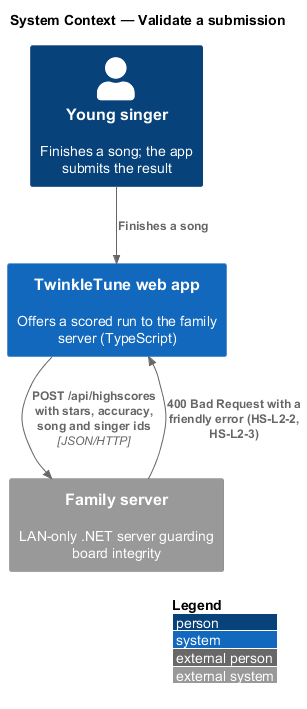
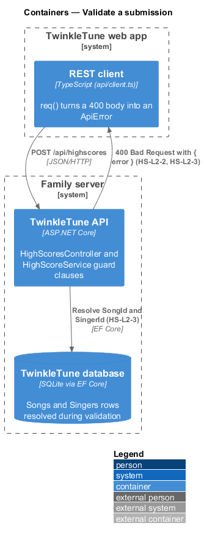
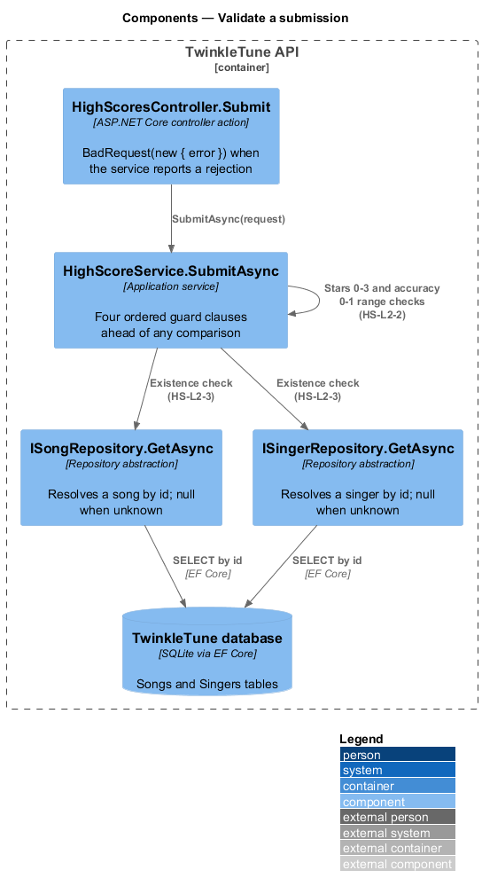
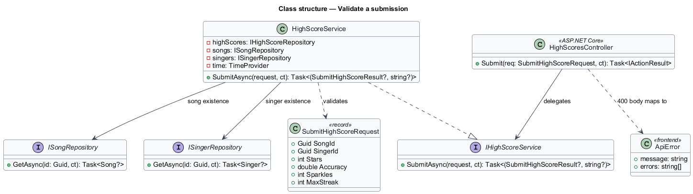
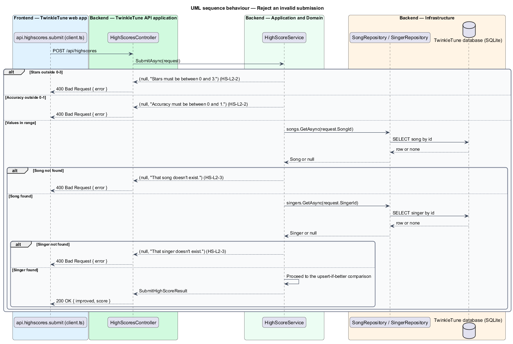

# Validate a submission

## Overview

A family board is only as trustworthy as the values behind it. Before any
comparison against a stored best takes place, the server checks that the
submitted numbers fall inside the ranges the product defines and that the song
and the singer the submission points at both exist. A submission that fails any
check is rejected with a short, plain-language message rather than a stack trace
or a numeric code, in keeping with the product's kid-first tone.

The terms below are used throughout.

- guard clause — early return in `SubmitAsync` that rejects a submission before
  any state is read or written
- friendly error — short sentence naming what went wrong in ordinary language,
  returned as the `error` property of a `400 Bad Request` body
- referential integrity — property that a submission's `SongId` and `SingerId`
  both resolve to rows that exist on the family server
- dangling submission — submission naming a song or singer that has been deleted
  or never existed

Validation runs first in `HighScoreService.SubmitAsync`, ahead of the
upsert-if-better comparison described in `record-personal-best`. All four checks
are ordered, and the first failure ends the call.

## Description

Backend — application service
(`backend/src/TwinkleTune.Application/Services/HighScoreService.cs`):

- **`IHighScoreService.SubmitAsync`** — returns the tuple
  `(SubmitHighScoreResult? Result, string? Error)`; exactly one of the two parts
  is non-null.
- **stars range check** — `if (request.Stars is < 0 or > 3) return (null, "Stars
  must be between 0 and 3.");`.
- **accuracy range check** — `if (request.Accuracy is < 0 or > 1) return (null,
  "Accuracy must be between 0 and 1.");`.
- **song existence check** — `if (await songs.GetAsync(request.SongId, ct) is
  null) return (null, "That song doesn't exist.");`, using `ISongRepository`.
- **singer existence check** — `if (await singers.GetAsync(request.SingerId, ct)
  is null) return (null, "That singer doesn't exist.");`, using
  `ISingerRepository`.
- **`ISongRepository.GetAsync` / `ISingerRepository.GetAsync`** —
  `backend/src/TwinkleTune.Application/Abstractions/IRepositories.cs` lookups
  returning `null` for an unknown id.

Backend — API
(`backend/src/TwinkleTune.Api/Controllers/HighScoresController.cs`):

- **`Submit`** — maps a non-null `error` onto `BadRequest(new { error })`, so the
  response body is `{ "error": "<friendly error>" }` with status `400`.

Frontend — REST client (`frontend/apps/game/src/api/client.ts`):

- **`req`** — reads the `error` property from a non-2xx JSON body and throws an
  `ApiError` carrying it as the message.
- **`ApiError`** — `Error` subclass with an additional `errors: string[]` field
  for multi-message responses.
- **results-screen handling** — `renderResults` attaches `.catch(() => {})` to
  the submission, so a rejected validation stays invisible to the child rather
  than interrupting the celebration screen.

## Requirements

The feature realizes the following level-2 (L2) requirements. Each L2 requirement
refines a level-1 (L1) requirement, cited by identifier.

| L2 ID | Refines (L1) | Requirement |
|-------|--------------|-------------|
| `HS-L2-2` | `HS-L1-4` | The server shall reject a submission whose stars fall outside 0–3 (with "Stars must be between 0 and 3.") or whose accuracy falls outside 0–1 (with "Accuracy must be between 0 and 1."). |
| `HS-L2-3` | `HS-L1-4` | The server shall reject a submission that references a non-existent song (with "That song doesn't exist.") or a non-existent singer (with "That singer doesn't exist."). |

## Diagrams

### System context

The web app offers a submission to the family server, which accepts it only after
the values and the referenced song and singer pass validation (`HS-L2-2`,
`HS-L2-3`).

### Containers

The REST client posts the submission to the TwinkleTune API; the API resolves the
referenced song and singer from the SQLite database before proceeding
(`HS-L2-3`).

### Components

`HighScoreService.SubmitAsync` runs the two range checks (`HS-L2-2`) and then the
two repository lookups (`HS-L2-3`); `HighScoresController.Submit` turns any
returned error string into a `400 Bad Request`.

### Class structure

`SubmitHighScoreRequest` carries the values under check, `HighScoreService` holds
the guard clauses, and `ISongRepository` and `ISingerRepository` supply the
existence lookups.

### Behaviour — reject an invalid submission

The four ordered guards appear as `alt` branches: stars outside 0–3 and accuracy
outside 0–1 (`HS-L2-2`), then an unknown song id and an unknown singer id
(`HS-L2-3`). Each failure returns a friendly error as a `400`, and only the final
branch reaches the upsert comparison.

