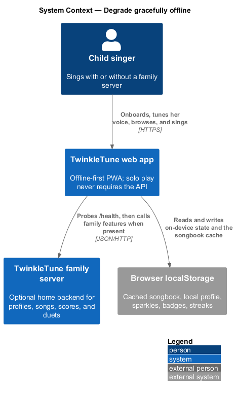
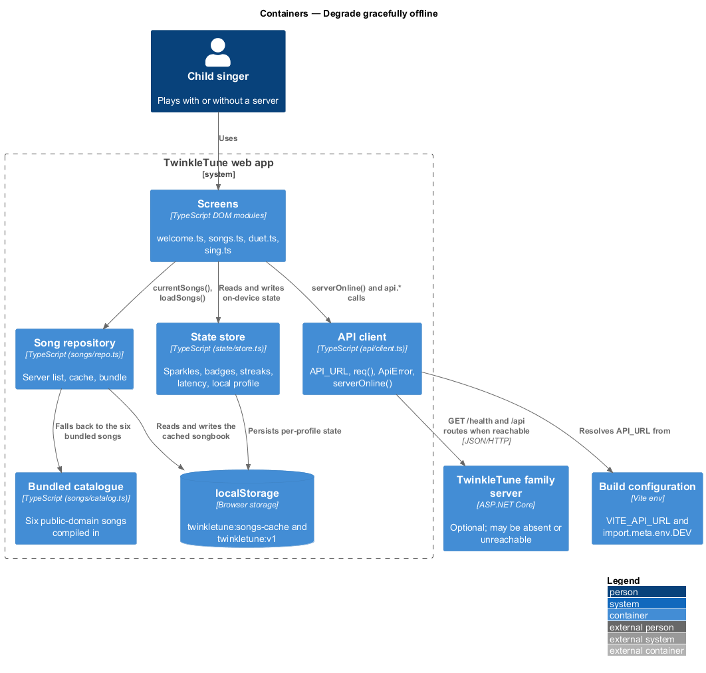
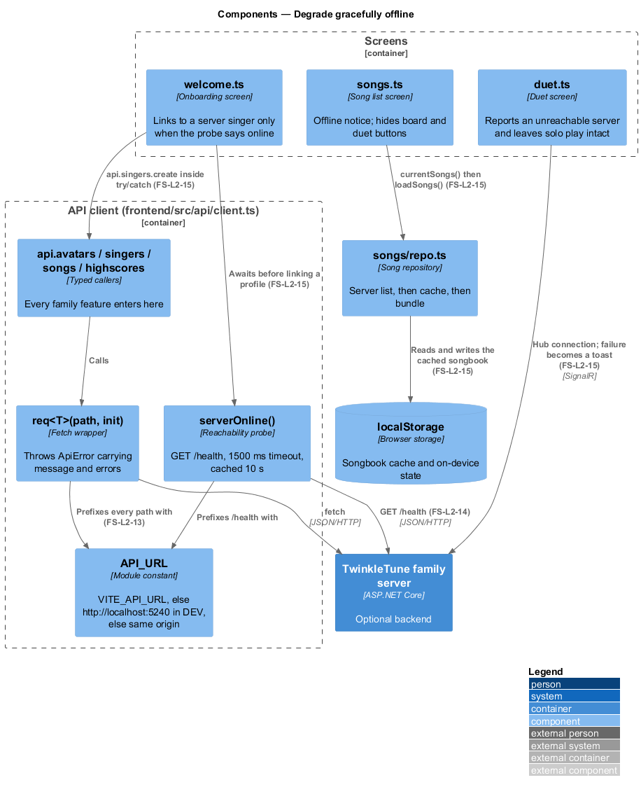
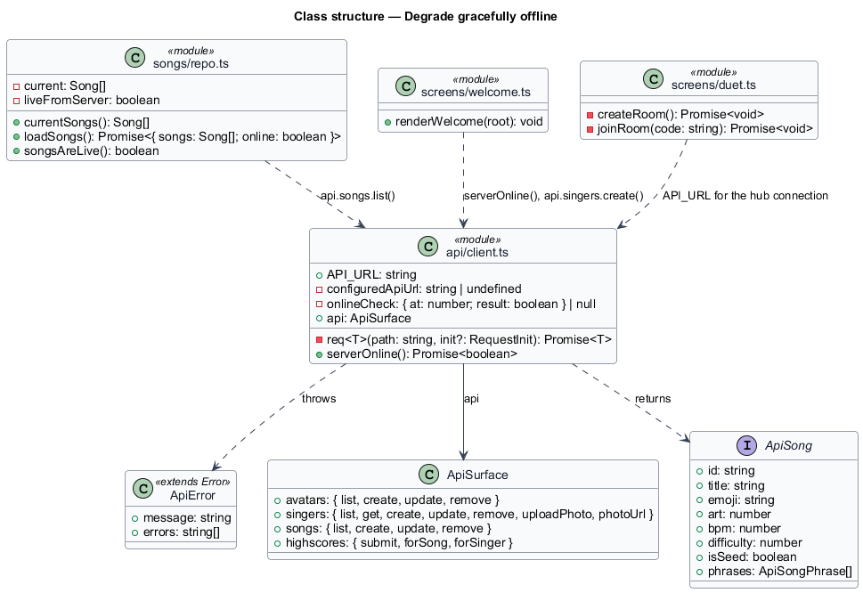
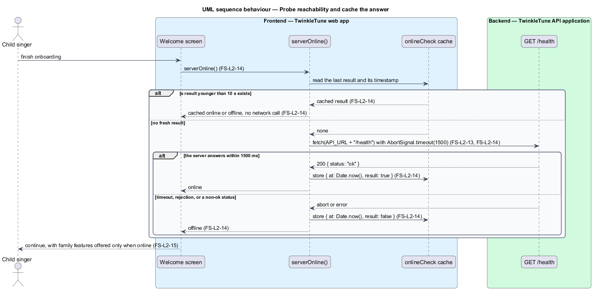
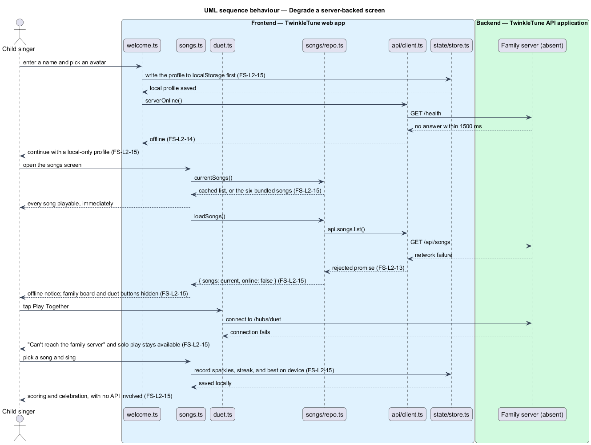
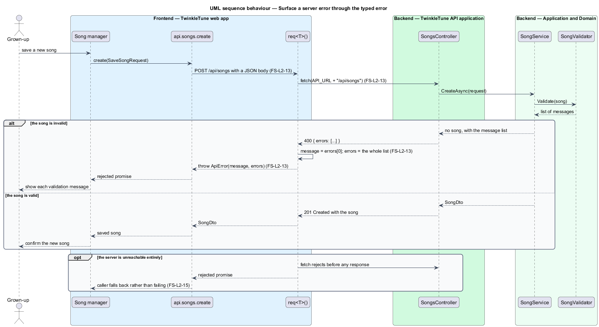

# Degrade Gracefully Offline

## Overview

The family server is optional. A household may never run one, may run one that is
switched off, or may take the tablet to a grandparent's house where nothing
answers. In all three cases the child opens the app and sings. This feature
covers the client-side contract that makes that true: where the API base URL
comes from, how server errors reach a screen, how the app decides cheaply whether
a server is present, and what each server-backed feature does when the answer is
no.

The contract is stated at the top of `frontend/src/api/client.ts`: solo play
never requires the API, and every caller degrades. The requirements below make
that statement verifiable.

The terms below are used throughout.

- API base URL — origin the client prefixes to every request path, resolved once
  at module load
- reachability probe — short, cached `GET /health` call whose result tells a
  screen whether a family server is present
- probe cache — single in-memory record of the last probe result and the moment
  it was taken, reused for 10 seconds
- typed error — `ApiError`, carrying a human-readable message and the server's
  validation message list
- graceful degradation — behaviour in which a feature whose server is absent
  offers a local or cached substitute and says so, rather than failing
- local-only profile — singer profile held in `localStorage` that was never
  linked to a server singer record
- offline songbook — song list served from the `localStorage` cache or the
  bundled catalogue when the server list cannot be fetched

## Description

Base URL and errors (`frontend/src/api/client.ts`):

- **`configuredApiUrl`** — `import.meta.env.VITE_API_URL` with any trailing
  slash removed.
- **`API_URL`** — `configuredApiUrl ?? (import.meta.env.DEV ? 'http://localhost:5240' : '')`.
  A development build with no configuration targets the local family server; a
  production build with no configuration stays same-origin, so the public static
  build never probes a visitor's own machine. A family-server deployment sets
  `VITE_API_URL` explicitly.
- **`ApiError`** — `Error` subclass with a `readonly errors: string[]` field
  defaulting to an empty array.
- **`req<T>(path, init)`** — the single fetch wrapper. It sets
  `Content-Type: application/json` unless the body is `FormData`, and on a
  non-`ok` response it builds the message from `body.error`, or from
  `body.errors[0]` while carrying the whole `errors` array, or falls back to
  `Server said {status}`, then throws `ApiError`. A `204` returns `undefined`.
- **`api`** — the typed surface: `api.avatars`, `api.singers` (including
  `uploadPhoto` and `photoUrl`), `api.songs`, and `api.highscores`.

Reachability probe (`client.ts`):

- **`onlineCheck`** — module-level `{ at: number; result: boolean } | null`.
- **`serverOnline()`** — returns the cached result while
  `Date.now() - onlineCheck.at < 10_000`; otherwise fetches
  `${API_URL}/health` with `AbortSignal.timeout(1500)`, treats any rejection or
  timeout as `false`, records the result with its timestamp, and returns it.

Degradation per feature:

- **Songbook** (`frontend/src/songs/repo.ts`) — `current` initializes to
  `readCache() ?? bundledSongs`, so a synchronous read is usable before any
  network call; `loadSongs()` returns `{ songs, online }` and sets
  `liveFromServer` only after a successful fetch.
- **Songs screen** (`frontend/src/screens/songs.ts`) — `paint(songs, live)`
  renders every song as playable, and when `live` is false it adds the notice
  "Offline songbook — duets and family scores come back when the server does."
  and omits the per-card family-score board and duet buttons.
- **Onboarding** (`frontend/src/screens/welcome.ts`) — writes the profile to
  local storage first, then attempts to link it to a server singer only when
  `await serverOnline()` is true; the `catch` around `api.singers.create`
  leaves a local-only profile.
- **Duet** (`frontend/src/screens/duet.ts`) — `createRoom` and `joinRoom` wrap
  the hub call in `try/catch` and, on failure, show "Can't reach the family
  server 📡" rather than blocking the screen; solo singing is unaffected.
- **On-device state** (`frontend/src/state/store.ts`) — sparkles, badges,
  streaks, per-song bests, and the mic latency offset live under the
  `twinkletune:v1` storage key and never depend on the API.

## Requirements

The feature realizes the following level-2 (L2) requirements. Each L2 requirement
refines a level-1 (L1) requirement, cited by identifier.

| L2 ID | Refines (L1) | Requirement |
|-------|--------------|-------------|
| `FS-L2-13` | `FS-L1-5` | The client shall resolve the API base URL from configuration (defaulting to the local server) and shall surface server error messages and validation error lists through a typed error. |
| `FS-L2-14` | `FS-L1-5` | The client shall provide a cheap reachability probe against `/health` with a short timeout, caching the result briefly to avoid repeated probing. |
| `FS-L2-15` | `FS-L1-5` | Solo play shall never require the API; every server-backed feature shall have a defined fallback — cached or bundled songbook, local-only profile, duet routed to solo — so the app is fully usable offline. |

The shipped `API_URL` expression defaults to `http://localhost:5240` in a
development build and to the empty string (same origin) in a production build,
which is narrower than the unconditional default `FS-L2-13` states. Reconciling
the requirement text with the shipped expression is `<TO SUPPLY>`.

## Diagrams

### System context

The child sings whether or not a family server answers; only the family features
depend on one being present (`FS-L2-15`).

### Containers

The web app resolves its base URL from build configuration, probes `/health`, and
falls back to `localStorage` and the bundled catalogue when nothing answers
(`FS-L2-13`, `FS-L2-14`, `FS-L2-15`).

### Components

`client.ts` owns `API_URL`, `req`, `ApiError`, and `serverOnline`, and the three
screens that offer family features each hold their own fallback (`FS-L2-13`,
`FS-L2-14`, `FS-L2-15`).

### Class structure

The client module's exported surface: the base URL, the typed error, the cached
probe state, and the grouped endpoint callers (`FS-L2-13`, `FS-L2-14`).

### Behaviour — probe reachability and cache the answer

A first probe calls `/health` with a 1500 ms timeout; a repeat within 10 seconds
returns the cached answer without touching the network, and a timeout or
rejection resolves to offline (`FS-L2-14`).

### Behaviour — degrade a server-backed screen

With no server answering, onboarding keeps a local-only profile, the songbook
comes from cache or bundle with an offline notice, duet reports that the server
is unreachable, and singing proceeds unchanged (`FS-L2-15`).

### Behaviour — surface a server error through the typed error

A `400` carrying an `errors` array becomes an `ApiError` whose message is the
first entry and whose `errors` field carries the whole list, which the song
manager renders as validation messages (`FS-L2-13`).

