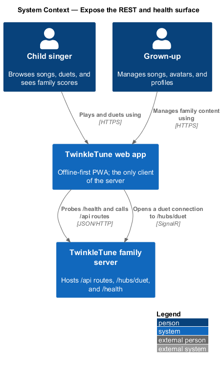
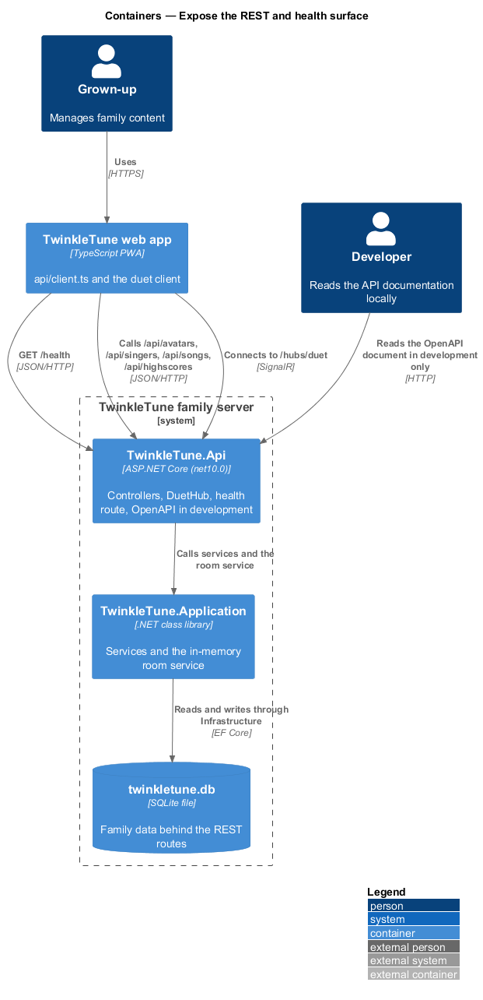
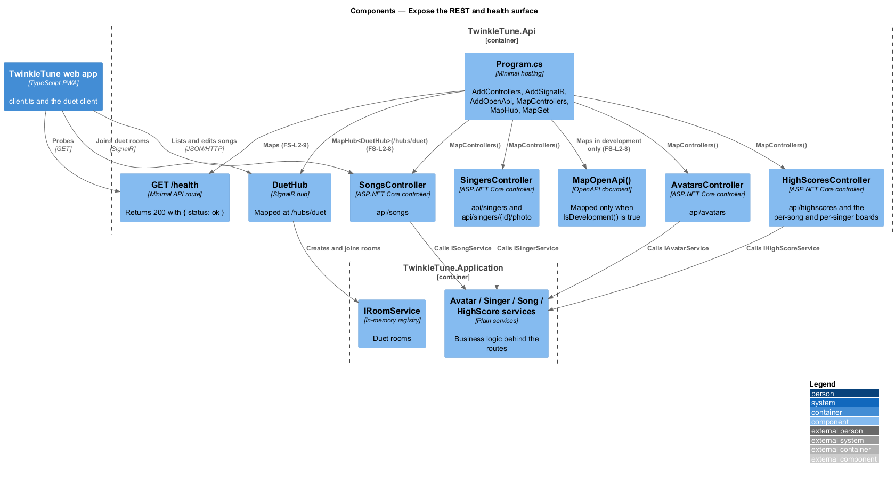
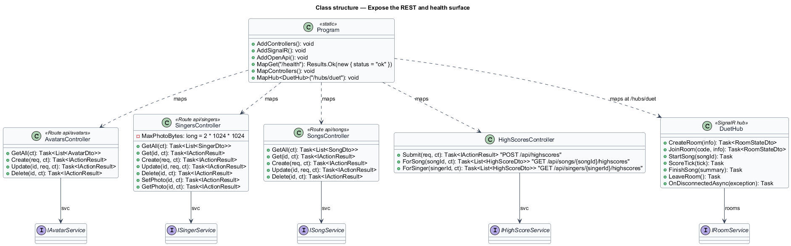
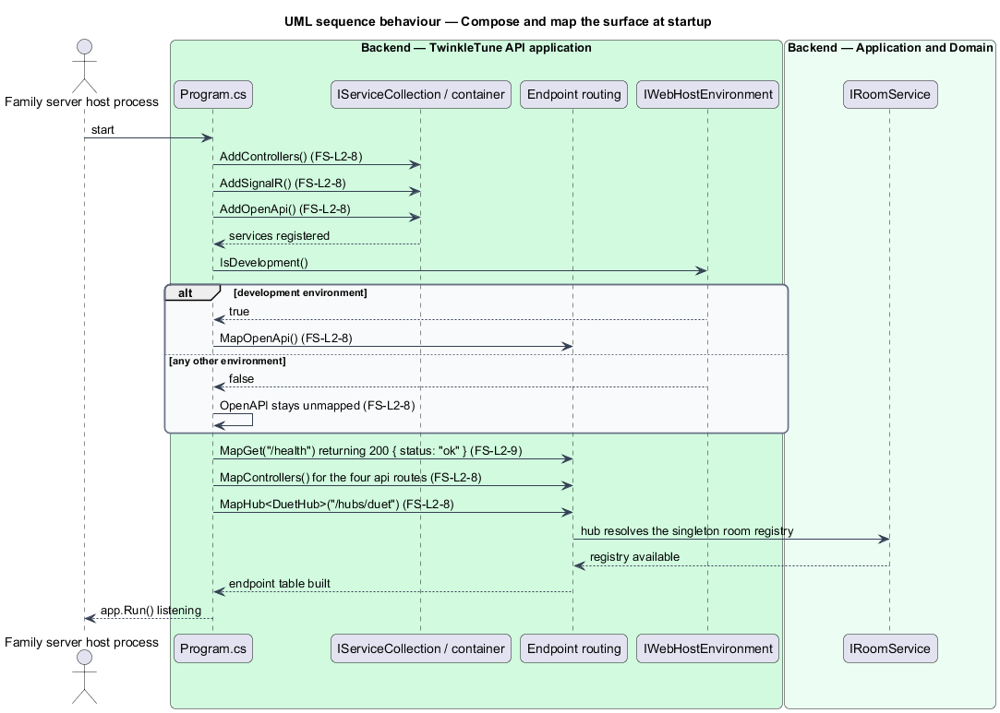
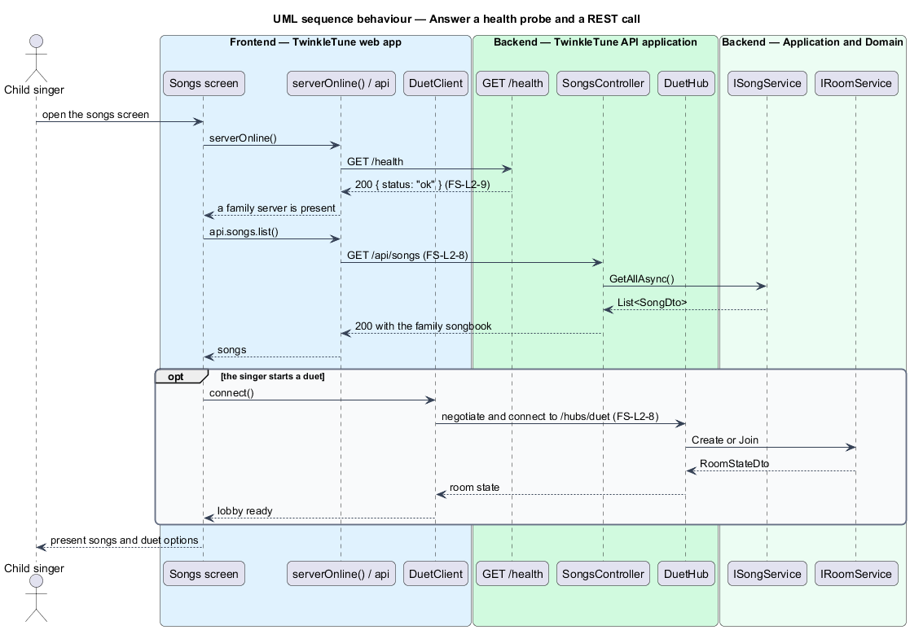

# Expose REST And Health Surface

## Overview

Everything the web app can ask of the family server arrives through one small
hosting composition: four REST controllers, one SignalR hub, a health probe, and
developer API documentation that appears in development only. This feature covers
that surface — what is mapped, at which route, and under which environment.

The health probe carries more weight than its size suggests. The client treats
the server as a progressive enhancement, so before offering a family feature it
asks whether a server answers at all. That question is `GET /health`, and its
answer is a 200 with `{ "status": "ok" }`.

The terms below are used throughout.

- hosting composition — set of `builder.Services` registrations and `app.Map...`
  calls in `Program.cs` that together define the reachable surface
- REST controller — attribute-routed ASP.NET Core class exposing one resource
  family under `/api/...`
- SignalR hub — persistent duplex endpoint, mapped at `/hubs/duet`, over which
  duet clients exchange room and score messages
- health endpoint — minimal `GET /health` route whose 200 response is the
  client's signal that a family server is present
- OpenAPI document — machine-readable description of the REST surface, mapped
  by `app.MapOpenApi()` and reachable in the development environment only
- development environment — hosting environment in which
  `app.Environment.IsDevelopment()` is true

## Description

Registration (`backend/src/TwinkleTune.Api/Program.cs`):

- **`builder.Services.AddControllers()`** — registers MVC controller services for
  the four attribute-routed controllers.
- **`builder.Services.AddSignalR()`** — registers the hub infrastructure the duet
  endpoint depends on.
- **`builder.Services.AddOpenApi()`** — registers the OpenAPI document services
  from `Microsoft.AspNetCore.OpenApi` 10.0.0. Registration is unconditional; only
  the mapping is environment-gated.

Mapping (`Program.cs`, after `app.UseCors("app")`):

- **`if (app.Environment.IsDevelopment()) app.MapOpenApi();`** — the OpenAPI
  document is reachable in development and absent everywhere else.
- **`app.MapGet("/health", () => Results.Ok(new { status = "ok" }));`** — the
  health endpoint, returning HTTP 200 and the body `{ "status": "ok" }`.
- **`app.MapControllers();`** — activates the attribute routes below.
- **`app.MapHub<DuetHub>("/hubs/duet");`** — mounts the duet hub.

Controllers (`backend/src/TwinkleTune.Api/Controllers`):

- **`AvatarsController`** — `[Route("api/avatars")]` with `GET`, `POST`,
  `PUT /{id:guid}`, and `DELETE /{id:guid}`.
- **`SingersController`** — `[Route("api/singers")]` with `GET`,
  `GET /{id:guid}`, `POST`, `PUT /{id:guid}`, `DELETE /{id:guid}`,
  `PUT /{id:guid}/photo`, and `GET /{id:guid}/photo`. `MaxPhotoBytes` is
  `2 * 1024 * 1024`.
- **`SongsController`** — `[Route("api/songs")]` with `GET`, `GET /{id:guid}`,
  `POST`, `PUT /{id:guid}`, and `DELETE /{id:guid}`.
- **`HighScoresController`** — absolute routes `POST /api/highscores`,
  `GET /api/songs/{songId:guid}/highscores`, and
  `GET /api/singers/{singerId:guid}/highscores`.

Response conventions across the controllers: a successful create returns `201
Created` with a `Location` of the new resource, a delete returns `204 No
Content`, a missing resource returns `404 Not Found`, a rejected singer or avatar
returns `400 Bad Request` with `{ error }`, and a rejected song returns `400 Bad
Request` with `{ errors }` — the list form the client renders as validation
messages.

Hub (`backend/src/TwinkleTune.Api/Hubs/DuetHub.cs`):

- **`DuetHub`** — takes `IRoomService` and exposes `CreateRoom`, `JoinRoom`,
  `StartSong`, `ScoreTick`, `FinishSong`, `LeaveRoom`, and an override of
  `OnDisconnectedAsync`. The room semantics belong to the Duet Multiplayer
  subsystem; this feature covers only the endpoint being mapped and reachable.

## Requirements

The feature realizes the following level-2 (L2) requirements. Each L2 requirement
refines a level-1 (L1) requirement, cited by identifier.

| L2 ID | Refines (L1) | Requirement |
|-------|--------------|-------------|
| `FS-L2-8` | `FS-L1-3` | The Api shall host REST controllers and the duet SignalR hub at `/hubs/duet`, and shall expose OpenAPI documentation in the development environment only. |
| `FS-L2-9` | `FS-L1-3` | The server shall expose a health endpoint returning HTTP 200 with an OK status. |

## Diagrams

### System context

The web app is the only client of the family server, and it reaches it over REST
and a SignalR connection on the home network (`FS-L2-8`).

### Containers

The Api container carries the whole reachable surface: `/api/...` routes,
`/hubs/duet`, `/health`, and — in development only — the OpenAPI document
(`FS-L2-8`, `FS-L2-9`).

### Components

`Program.cs` maps four controllers, the duet hub, and the health route, and gates
`MapOpenApi()` behind the development environment (`FS-L2-8`, `FS-L2-9`).

### Class structure

The four controllers and the hub, each a thin translation from a route to an
Application service or the room service (`FS-L2-8`).

### Behaviour — compose and map the surface at startup

Startup registers controllers, SignalR, and OpenAPI, then maps the health route,
the controller routes, and the hub, with the OpenAPI document mapped only when
the environment is development (`FS-L2-8`, `FS-L2-9`).

### Behaviour — answer a health probe and a REST call

The client probes `/health` first and calls a REST route once a server answers;
the hub connection follows the same host (`FS-L2-9`, `FS-L2-8`).

