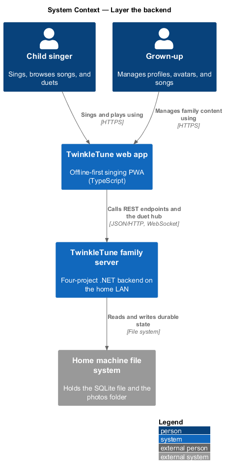
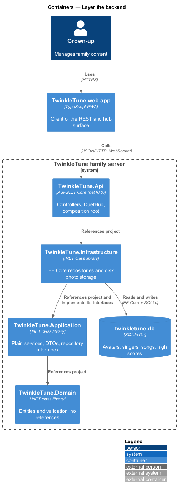
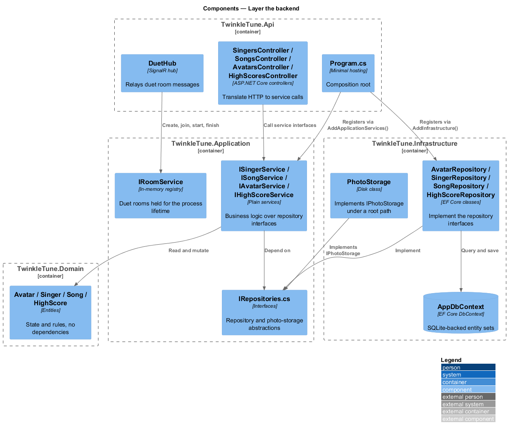
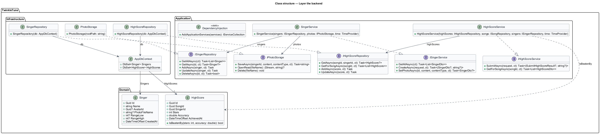
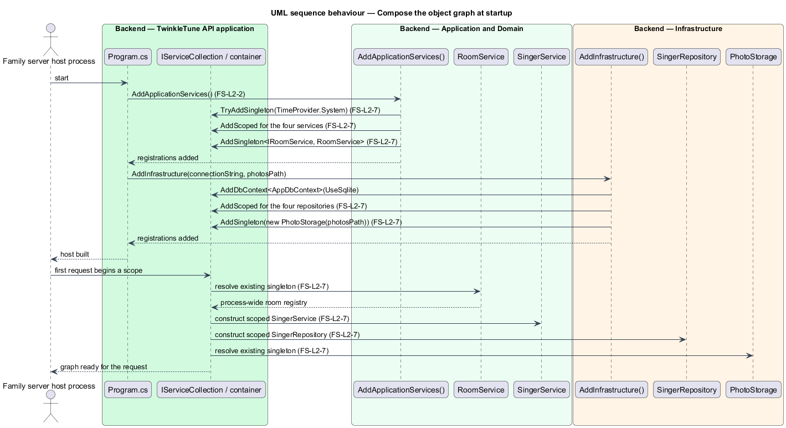
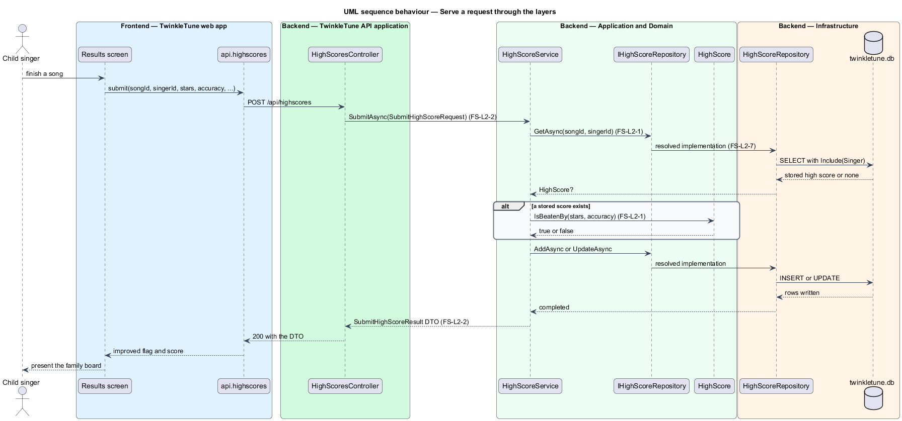

# Layer The Backend

## Overview

The family server is the optional home backend that holds a family's profiles,
songs, photos, and high scores. It is built as four .NET projects whose
references point inward only, so the rules of the product sit in code that knows
nothing about HTTP, SQLite, or SignalR. This feature covers that structure: which
project holds what, how business logic is expressed, and how the object graph is
composed at startup.

The layering exists for two reasons. A dependency-free Domain can be unit tested
without a host or a database, and a family-scale application does not carry the
ceremony of a mediator pipeline. The composition also fixes object lifetimes, and
one of those lifetimes is load-bearing: duet rooms live in process memory, so the
service that holds them is a singleton and everything per-request is scoped.

The terms below are used throughout.

- Clean Architecture — layering in which source dependencies point only toward
  the centre, so the innermost layer depends on nothing
- Domain layer — `TwinkleTune.Domain`, the project holding entities and
  validation rules and carrying no project or framework reference
- Application layer — `TwinkleTune.Application`, the project holding services,
  DTOs, and the repository interfaces those services depend on
- Infrastructure layer — `TwinkleTune.Infrastructure`, the project implementing
  the repository interfaces over EF Core and the photo storage over disk
- Api layer — `TwinkleTune.Api`, the ASP.NET Core host holding controllers, the
  SignalR hub, and the composition root
- plain service — class that implements an application interface directly and
  takes its repositories as constructor parameters, without a command or
  mediator indirection
- composition root — single place, `Program.cs` together with the two
  `DependencyInjection` extension classes, where implementations are bound to
  interfaces
- service lifetime — duration for which the container reuses one instance:
  singleton for the process, scoped for one request or hub invocation

## Description

Domain (`backend/src/TwinkleTune.Domain`):

- **`TwinkleTune.Domain.csproj`** — project file with no `PackageReference` and
  no `ProjectReference`, which is what makes the Domain dependency-free.
- **`Avatar`, `Singer`, `Song`, `HighScore`** — entity classes under `Entities/`.
  `HighScore.IsBeatenBy(stars, accuracy)` and `SongValidator.Validate(song)` are
  the two rule-carrying members, and both are plain C# with no framework type in
  their signature.

Application (`backend/src/TwinkleTune.Application`):

- **`IRepositories.cs`** — declares `IAvatarRepository`, `ISingerRepository`,
  `ISongRepository`, `IHighScoreRepository`, and `IPhotoStorage`. Each method is
  asynchronous and takes a trailing `CancellationToken ct = default`.
- **`AvatarService`, `SingerService`, `SongService`, `HighScoreService`** —
  plain services, each behind an interface (`IAvatarService` and siblings) and
  each taking its repositories and `TimeProvider` as primary-constructor
  parameters. No MediatR package is referenced anywhere in the solution.
- **`RoomService`** — in-memory duet room registry over two
  `ConcurrentDictionary` instances, consumed by the Api's `DuetHub`.
- **`Dtos.cs`** and **`Mapping.cs`** — request and response records plus the
  `ToDto()` extensions that keep entities out of the wire contract.
- **`AddApplicationServices()`** — extension method registering
  `TimeProvider.System` with `TryAddSingleton`, the four services with
  `AddScoped`, and `IRoomService` with `AddSingleton`.
- **`TwinkleTune.Application.csproj`** — references the Domain project and one
  package, `Microsoft.Extensions.DependencyInjection.Abstractions`.

Infrastructure (`backend/src/TwinkleTune.Infrastructure`):

- **`AppDbContext`** — EF Core context exposing `Avatars`, `Singers`, `Songs`,
  and `HighScores`.
- **`AvatarRepository`, `SingerRepository`, `SongRepository`,
  `HighScoreRepository`** — the EF Core implementations of the Application
  interfaces, each taking `AppDbContext` as its only dependency.
- **`PhotoStorage`** — disk implementation of `IPhotoStorage`, constructed with
  a root path rather than resolving one from configuration.
- **`AddInfrastructure(connectionString, photosPath)`** — extension method
  registering `AppDbContext` with `UseSqlite`, the four repositories with
  `AddScoped`, and a single constructed `PhotoStorage` instance with
  `AddSingleton`.
- **`TwinkleTune.Infrastructure.csproj`** — references the Application project
  and `Microsoft.EntityFrameworkCore.Sqlite`.

Api (`backend/src/TwinkleTune.Api`):

- **`Program.cs`** — composition root calling `AddApplicationServices()` then
  `AddInfrastructure(...)`, so the host is the only project that names a concrete
  implementation.
- **`TwinkleTune.Api.csproj`** — references the Infrastructure project only, and
  reaches Application and Domain types transitively.

The solution file `backend/TwinkleTune.slnx` lists the four projects in
dependency order, and `backend/Directory.Build.props` sets `net10.0`, nullable
reference types, and `WarningsAsErrors` on nullability for all of them.

## Requirements

The feature realizes the following level-2 (L2) requirements. Each L2 requirement
refines a level-1 (L1) requirement, cited by identifier.

| L2 ID | Refines (L1) | Requirement |
|-------|--------------|-------------|
| `FS-L2-1` | `FS-L1-1` | The backend shall be split into Domain, Application, Infrastructure, and Api projects, with dependencies pointing inward only and the Domain depending on nothing. |
| `FS-L2-2` | `FS-L1-1` | The Application layer shall implement business logic as plain services over repository interfaces, without a CQRS/mediator framework. |
| `FS-L2-7` | `FS-L1-1` | Services and repositories shall be scoped; the time provider, the in-memory room service, and the photo storage shall be singletons. |

## Diagrams

### System context

A grown-up and a child both reach the family server through the TwinkleTune web
app; the server keeps the family's data on the home machine that hosts it
(`FS-L2-1`).

### Containers

The four projects of the server sit inside one process: the Api host references
Infrastructure, Infrastructure references Application, and Application references
the Domain, so no arrow points outward (`FS-L2-1`).

### Components

Inside the running host, controllers and the duet hub call Application service
interfaces, which in turn call repository interfaces implemented in
Infrastructure (`FS-L2-2`).

### Class structure

`SingerService` and `HighScoreService` show the shape every Application service
follows: an interface, a primary constructor of repository abstractions plus
`TimeProvider`, and an Infrastructure class realizing each abstraction
(`FS-L2-2`).

### Behaviour — compose the object graph at startup

`Program.cs` registers the Application and Infrastructure graphs, then the
container serves a request: singletons resolve once for the process while the
scoped service and repository are built per request (`FS-L2-7`).

### Behaviour — serve a request through the layers

A high-score submission crosses every layer once — controller to service,
service to repository interface, interface to EF Core implementation — and
returns a DTO rather than an entity (`FS-L2-1`, `FS-L2-2`).

