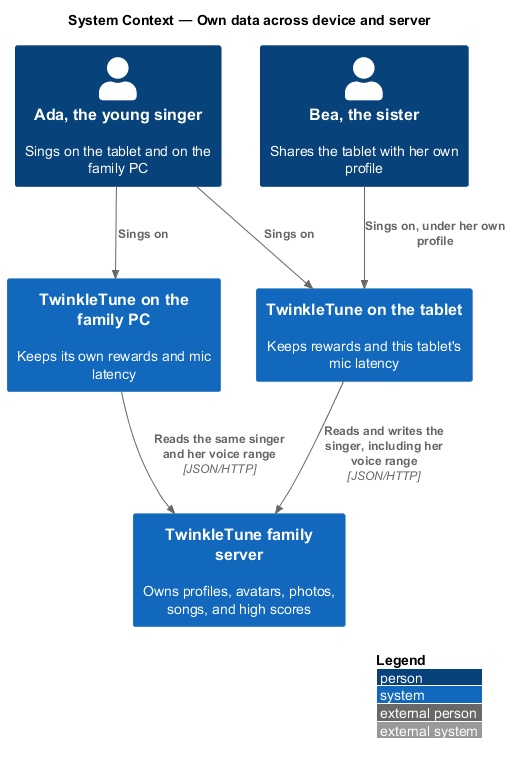
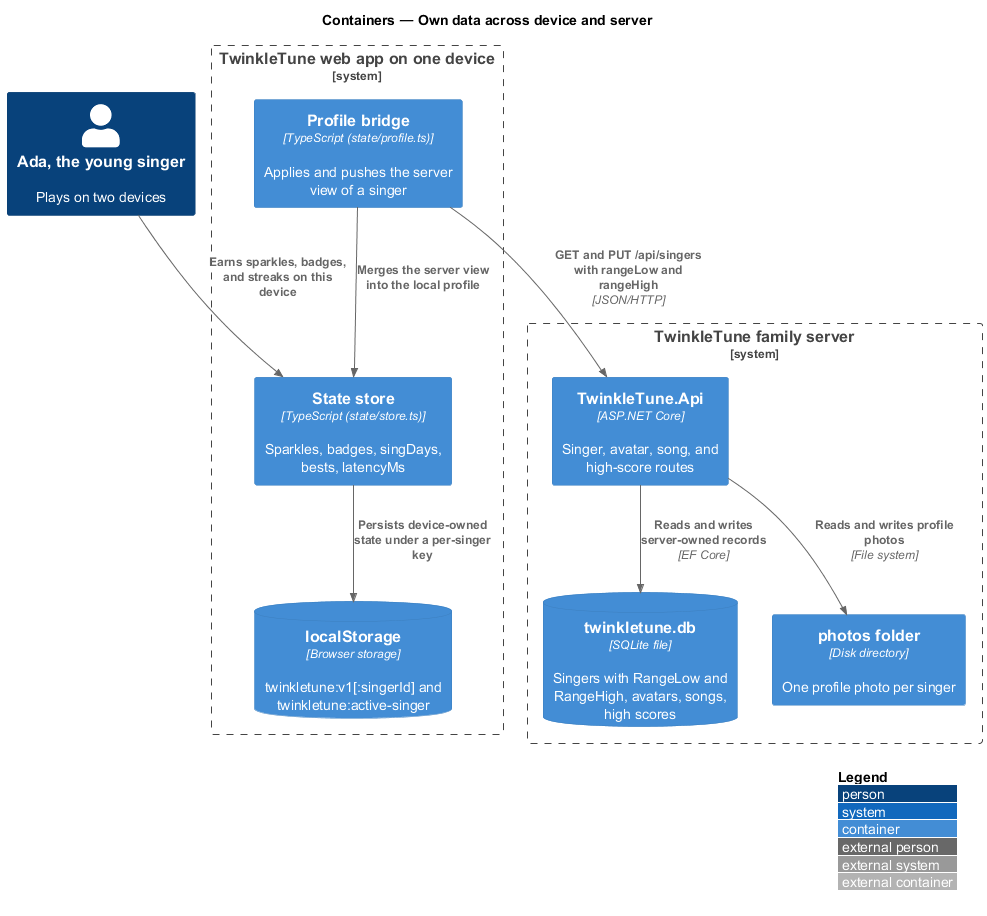
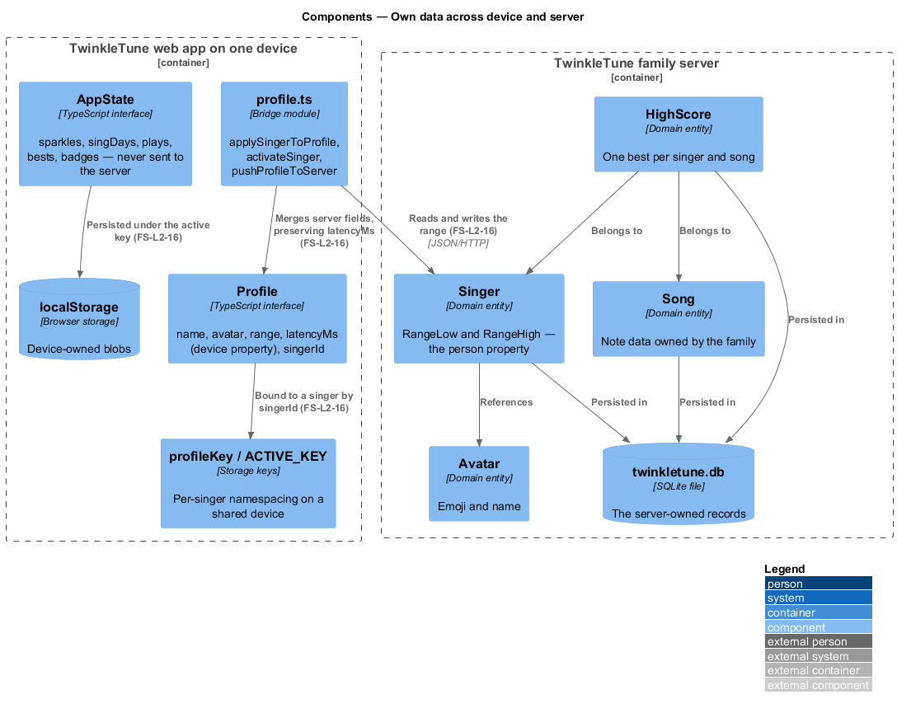
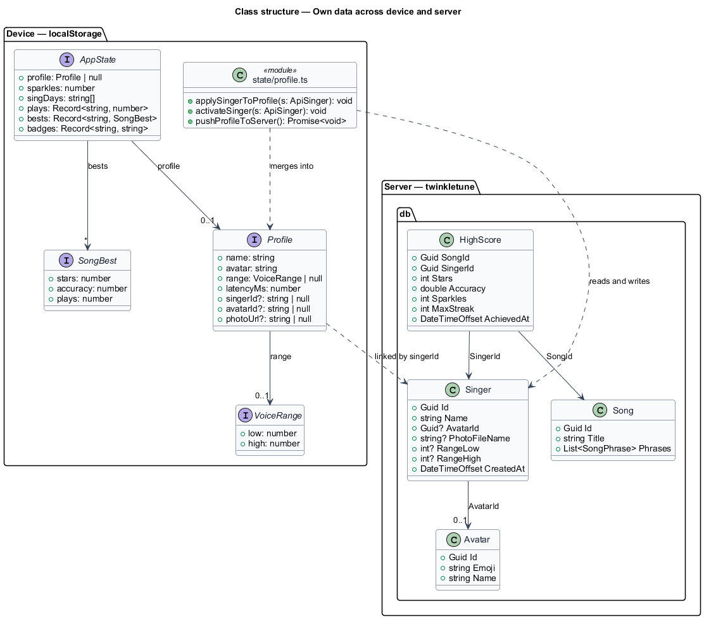
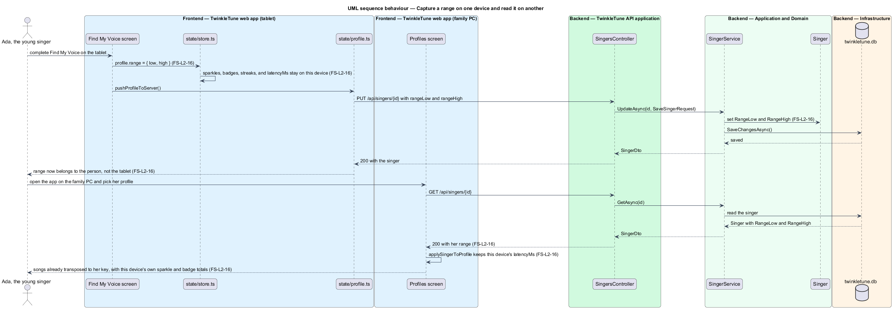

# Own Data Across Device And Server

## Overview

Each piece of TwinkleTune's data has exactly one owner, and which owner it is
follows a single question: does the datum belong to the person or to the machine
she is holding? A voice range belongs to the person, so it lives on the server
and follows her to the other tablet. A microphone latency offset belongs to the
tablet, so it stays there and never travels. Sparkles, badges, and day-streaks
stay on the device that earned them; profiles, avatars, photos, songs, and high
scores live on the family server.

This feature covers that split — where each datum is stored, why, and what a
family sees when the same singer plays on two devices. It exists to keep
children's data on the family's own hardware and to keep the amount of it small.

The terms below are used throughout.

- person property — datum that describes the singer herself and therefore
  follows her to any device, such as her voice range
- device property — datum that describes the hardware or its environment and
  therefore stays on it, such as the microphone latency offset
- server-owned data — records held in the family server's SQLite file and photos
  folder: avatars, singers, songs, and high scores
- device-owned data — records held in the browser's `localStorage`: sparkles,
  badges, day-streaks, per-song bests, latency, and the local profile
- profile namespacing — storage-key scheme that gives each server singer her own
  device-side state blob on a shared tablet
- linked profile — device profile carrying a `singerId`, so its device-side
  state is namespaced to that server singer

## Description

Server-owned records (`backend/src/TwinkleTune.Domain/Entities`):

- **`Singer`** — `Id`, `Name`, `AvatarId`, `PhotoFileName`, `RangeLow`,
  `RangeHigh`, and `CreatedAt`. `RangeLow` and `RangeHigh` are the person
  property: the class comment states that the voice range lives here because it
  belongs to the person and follows her across devices, and that mic latency does
  not.
- **`Avatar`** — `Id`, `Emoji`, `Name`, seeded with eight defaults and editable
  by a grown-up.
- **`Song`** — the note data and its metadata, phrases held as a JSON column.
- **`HighScore`** — one row per `(SongId, SingerId)` pair, holding `Stars`,
  `Accuracy`, `Sparkles`, `MaxStreak`, and `AchievedAt`. The server owns high
  scores; it owns no other progression figure.
- **Photo files** — one image per singer under the photos root, referenced by
  `Singer.PhotoFileName`.

Device-owned state (`frontend/apps/game/src/state/store.ts`):

- **`AppState`** — `profile`, `sparkles`, `singDays`, `plays`, `bests`,
  `badges`, `lastResult`, `lastSongId`, and `lastNewBadges`. None of these
  fields is sent to the server.
- **`Profile`** — `name`, `avatar`, `range`, `latencyMs`, `singerId`,
  `avatarId`, and `photoUrl`. The `latencyMs` comment records it as a device
  property kept per device; `singerId` is `null` or absent for a local-only
  profile.
- **`KEY`** — `'twinkletune:v1'`, the unlinked state blob.
- **`profileKey(singerId)`** — `` `${KEY}:${singerId}` ``, the per-singer blob on
  a shared device.
- **`ACTIVE_KEY`** — `'twinkletune:active-singer'`, holding the identifier of the
  singer whose blob the store is currently bound to.
- **`adoptLegacyState(singerId)`** — one-time migration moving the pre-profiles
  blob to the first server profile that claims it, so no sparkles or badges are
  lost when a device first links to a server.

Where the two meet (`frontend/apps/game/src/state/profile.ts`):

- **`applySingerToProfile(s)`** — merges the server's view of a singer into the
  device profile, taking `name`, `avatarEmoji`, `rangeLow`/`rangeHigh`, and the
  photo URL, and preserving the device's own `latencyMs`.
- **`activateSinger(s)`** — calls `adoptLegacyState`, records the active singer,
  switches the store to `profileKey(s.id)`, and applies the server fields.
- **`pushProfileToServer()`** — sends `name`, `avatarId`, `rangeLow`, and
  `rangeHigh` back through `api.singers.update`, and swallows a failure so an
  offline device catches up on a later call.
- **`api.singers.create` and `api.singers.update`** — carry `rangeLow` and
  `rangeHigh`, so a range captured on one device is readable on another.
- **`api.highscores.submit`** — sends `stars`, `accuracy`, `sparkles`, and
  `maxStreak` for the family board. The device keeps its own copy of the same
  figures in `bests`, and the two are maintained independently.
- **ADR-0002 §6 and §7** — record the decision: the voice range lives on the
  `Singer` entity, the mic latency stays in device `localStorage`, and the server
  owns high scores only while sparkles, badges, and day-streaks remain
  client-side, namespaced per profile.

## Requirements

The feature realizes the following level-2 (L2) requirement. The L2 requirement
refines a level-1 (L1) requirement, cited by identifier.

| L2 ID | Refines (L1) | Requirement |
|-------|--------------|-------------|
| `FS-L2-16` | `FS-L1-6` | The platform shall keep on-device the rewards (sparkles, badges, day-streaks) and the mic latency (a device property); the server shall own profiles, avatars, photos, songs, and high scores; and the voice range shall live on the singer, a person property that follows her across devices. |

## Diagrams

### System context

One singer, two devices, one server: her range and her family high scores follow
her, while each tablet keeps its own latency offset and its own rewards
(`FS-L2-16`).

### Containers

Device-owned state sits in `localStorage` on each tablet; server-owned state sits
in the SQLite file and the photos folder on the home machine (`FS-L2-16`).

### Components

The store holds rewards, bests, and latency behind a namespaced key, while the
`Singer`, `Avatar`, `Song`, and `HighScore` entities hold everything the server
owns (`FS-L2-16`).

### Class structure

`Profile` and `AppState` on the device beside `Singer` and `HighScore` on the
server, with `singerId` as the only link between them (`FS-L2-16`).

### Behaviour — capture a range on one device and read it on another

"Find My Voice" writes the range to the device profile and to the server singer;
a second tablet reads it back with the profile, while its own latency offset and
reward totals stay local (`FS-L2-16`).

