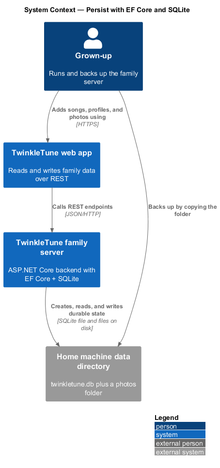
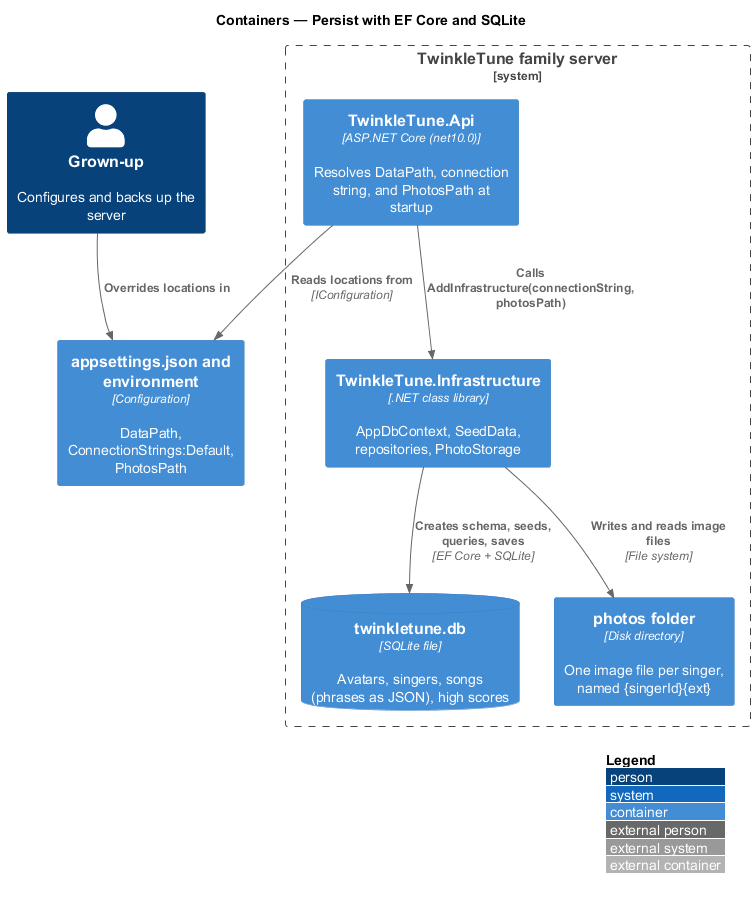
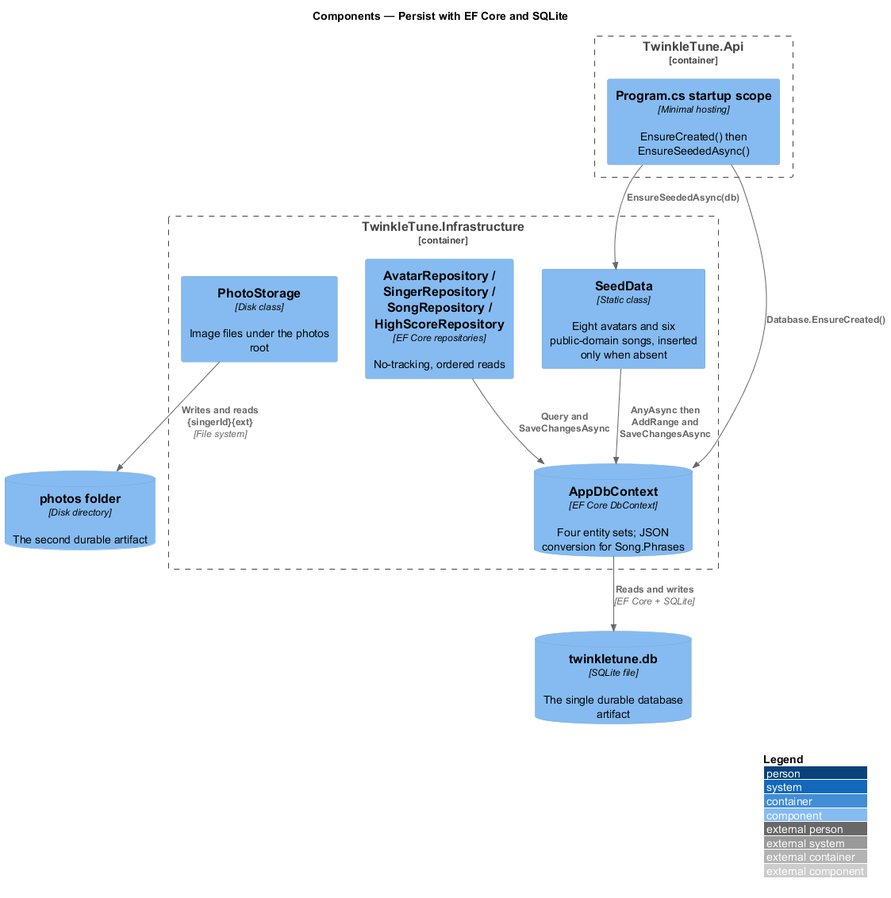
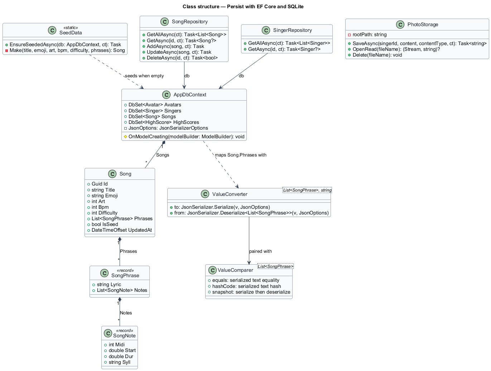
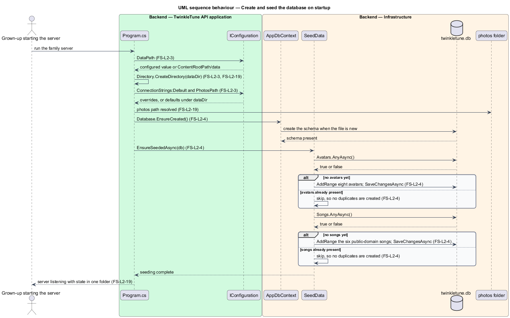
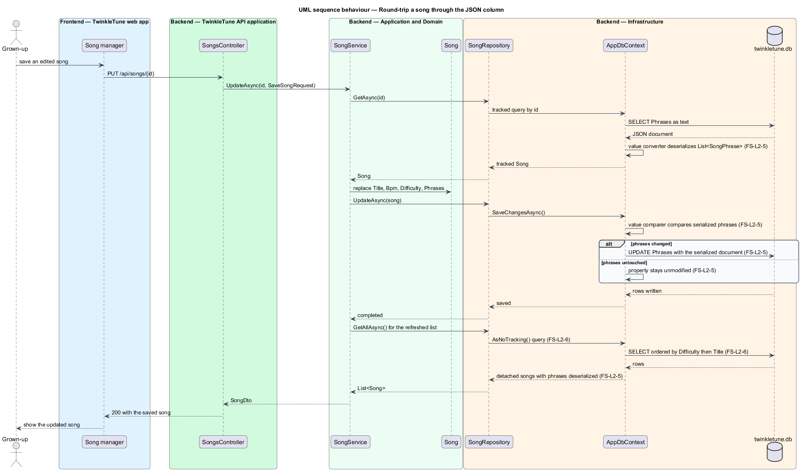
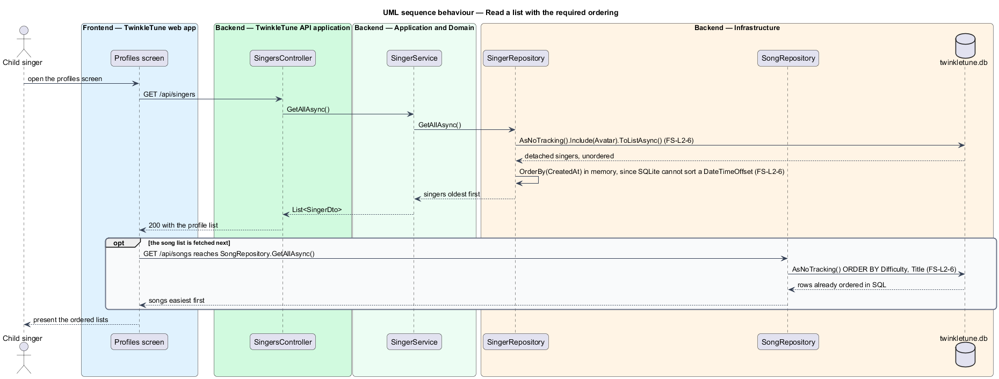

# Persist With EF Core And SQLite

## Overview

A family server runs on whatever machine a household already owns, maintained by
a parent who did not sign up to administer a database. Persistence is therefore
sized to that reality: one SQLite file and one folder of photos, created on first
start, seeded with the same eight avatars and six public-domain songs the offline
app already ships, and backed up by copying a folder.

This feature covers the durable state end to end — where the file lives, how the
schema comes into existence, how a song's phrases are stored, how reads are
shaped, and what the whole footprint amounts to. It does not cover the meaning of
each entity, which belongs to the Song Library, Player Profiles, and Family High
Scores subsystems.

The terms below are used throughout.

- data directory — folder holding every durable artifact, defaulting to `data`
  under the content root and overridable through the `DataPath` setting
- JSON column — single text column holding an entity's nested structure
  serialized as one JSON document rather than spread over child tables
- value converter — EF Core pair of expressions translating a property between
  its CLR shape and its stored column shape
- value comparer — EF Core triple of expressions telling change tracking how to
  compare, hash, and snapshot a mutable property, so an unchanged value is not
  reported as modified
- idempotent seeding — startup routine that inserts default rows only when the
  corresponding table is empty, so repeat starts add nothing
- no-tracking read — query issued with `AsNoTracking()`, returning detached
  entities that the change tracker never observes
- in-memory ordering — sorting applied to a materialized list in the process,
  used where SQLite cannot translate the comparison into SQL

## Description

Startup paths (`backend/src/TwinkleTune.Api/Program.cs`):

- **`dataDir`** — `builder.Configuration["DataPath"]`, falling back to
  `Path.Combine(builder.Environment.ContentRootPath, "data")`, and created with
  `Directory.CreateDirectory(dataDir)` before anything reads it.
- **`connectionString`** — `builder.Configuration.GetConnectionString("Default")`,
  falling back to `$"Data Source={Path.Combine(dataDir, "twinkletune.db")}"`.
- **`photosPath`** — `builder.Configuration["PhotosPath"]`, falling back to
  `Path.Combine(dataDir, "photos")`.
- **Startup scope** — `app.Services.CreateScope()` resolves `AppDbContext`, calls
  `db.Database.EnsureCreated()`, then awaits `SeedData.EnsureSeededAsync(db)`.

Context and mapping (`Infrastructure/Persistence/AppDbContext.cs`):

- **`AppDbContext`** — exposes `DbSet<Avatar> Avatars`, `DbSet<Singer> Singers`,
  `DbSet<Song> Songs`, and `DbSet<HighScore> HighScores`.
- **`OnModelCreating`** — caps `Avatar.Emoji` and `Song.Emoji` at 16 characters,
  `Avatar.Name` and `Singer.Name` at 30, `Singer.PhotoFileName` at 64, and
  `Song.Title` at 80.
- **`Song.Phrases` conversion** — `HasConversion` serializes
  `List<SongPhrase>` with `JsonSerializer.Serialize(v, JsonOptions)` and reads it
  back with `JsonSerializer.Deserialize<List<SongPhrase>>`, defaulting to an
  empty list. The attached `ValueComparer<List<SongPhrase>>` compares two lists by
  their serialized text, hashes the serialized text, and snapshots by a
  serialize-then-deserialize round trip.
- **Relationships** — `Singer.Avatar` uses `DeleteBehavior.SetNull`;
  `HighScore` carries a unique index on `(SongId, SingerId)` and cascades from
  both `Song` and `Singer`.

Seeding (`Infrastructure/Persistence/SeedData.cs`):

- **`EnsureSeededAsync(db, ct)`** — inserts the eight avatars only when
  `!await db.Avatars.AnyAsync(ct)`, and the six songs only when
  `!await db.Songs.AnyAsync(ct)`.
- **Seeded avatars** — Unicorn, Kitten, Frog, Fox, Bunny, Panda, Dino, Octopus.
- **Seeded songs** — `Twinkle()`, `Mary()`, `HotCrossBuns()`, `LondonBridge()`,
  `OldMacDonald()`, and `RowYourBoat()`, each built by `Make(...)` with
  `IsSeed = true` and note-for-note identical to
  `frontend/apps/game/src/songs/catalog.ts`.

Repositories (`Infrastructure/Repositories/Repositories.cs`):

- **`AvatarRepository.GetAllAsync`** — `AsNoTracking().OrderBy(a => a.Name)`.
- **`SingerRepository.GetAllAsync`** — materializes
  `AsNoTracking().Include(s => s.Avatar)` and then applies
  `.OrderBy(s => s.CreatedAt)` in memory, because SQLite cannot order by a
  `DateTimeOffset` column.
- **`SongRepository.GetAllAsync`** —
  `AsNoTracking().OrderBy(s => s.Difficulty).ThenBy(s => s.Title)`.
- **`HighScoreRepository`** — `GetForSongAsync` and `GetForSingerAsync` are
  no-tracking and include `Singer` then `Avatar`; `GetAsync(songId, singerId)`
  tracks, because the caller updates the returned entity in place.
- **Single-entity reads** — `GetAsync(id)` on each repository tracks its result
  so `UpdateAsync` can persist a mutation through `SaveChangesAsync`.

Photo files (`Infrastructure/Storage/PhotoStorage.cs`):

- **`PhotoStorage(rootPath)`** — writes each photo as `{singerId}{ext}` under the
  photos root, so the second durable artifact is a flat folder of image files.

## Requirements

The feature realizes the following level-2 (L2) requirements. Each L2 requirement
refines a level-1 (L1) requirement, cited by identifier.

| L2 ID | Refines (L1) | Requirement |
|-------|--------------|-------------|
| `FS-L2-3` | `FS-L1-2` | The backend shall persist to a SQLite database and a photos folder whose locations default under a data directory but are overridable by configuration. |
| `FS-L2-4` | `FS-L1-2` | On startup the backend shall ensure the schema exists and seed the default avatars and the six public-domain songs only when they are absent, so repeated startups do not duplicate seed data. |
| `FS-L2-5` | `FS-L1-2` | Song phrases and notes shall persist as a single JSON document via a value converter, with a value comparer so EF change tracking behaves correctly. |
| `FS-L2-6` | `FS-L1-2` | Read queries shall be no-tracking, lists shall be ordered as their consumers require, and ordering by a `DateTimeOffset` (unsupported by SQLite in SQL) shall be performed in memory. |
| `FS-L2-19` | `FS-L1-2` | The entire durable backend state shall be a single database file plus a photos folder, so backup is copying a folder. |

## Diagrams

### System context

The family server keeps every durable byte on the machine that hosts it, and a
grown-up backs the family up by copying that one data directory (`FS-L2-19`).

### Containers

The Api host resolves the database and photo locations from configuration at
startup, and Infrastructure reads and writes both artifacts (`FS-L2-3`).

### Components

`AppDbContext` maps the four entity sets and owns the JSON conversion for
`Song.Phrases`, `SeedData` fills an empty database, and the four repositories
shape every read (`FS-L2-4`, `FS-L2-5`, `FS-L2-6`).

### Class structure

The context, its entity sets, the phrase conversion pair, and the repository
implementations that consume them (`FS-L2-5`, `FS-L2-6`).

### Behaviour — create and seed the database on startup

Startup resolves the paths, creates the schema, and seeds each table only when
that table is empty, so a restart against a populated database inserts nothing
(`FS-L2-3`, `FS-L2-4`, `FS-L2-19`).

### Behaviour — round-trip a song through the JSON column

Saving a song serializes its phrases into one column; reloading deserializes them
back; and the value comparer keeps an untouched phrase list out of the modified
set (`FS-L2-5`, `FS-L2-6`).

### Behaviour — read a list with the required ordering

Avatars and songs sort in SQL, while singers materialize first and sort by
`CreatedAt` in memory because SQLite cannot order a `DateTimeOffset` column
(`FS-L2-6`).

