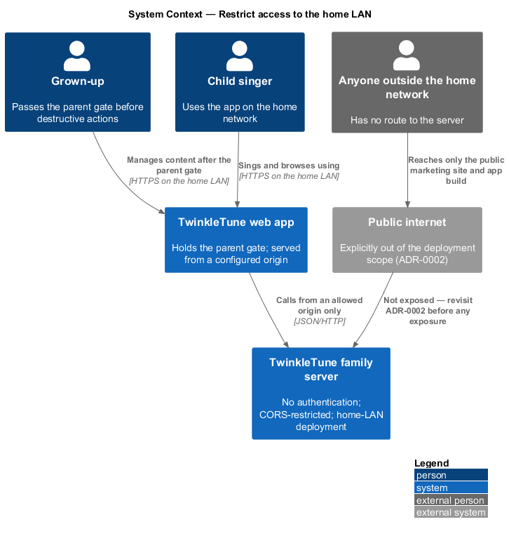
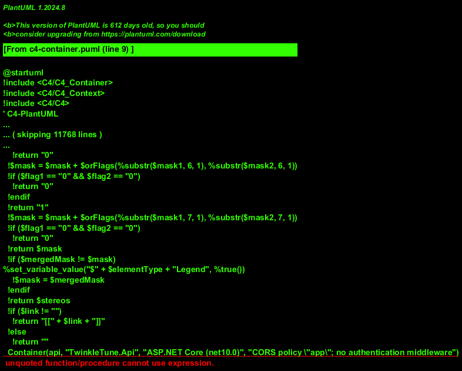
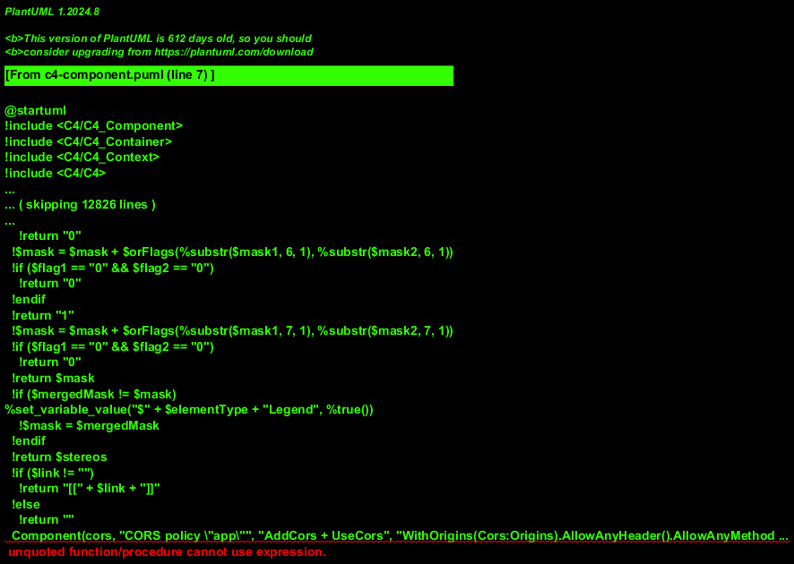
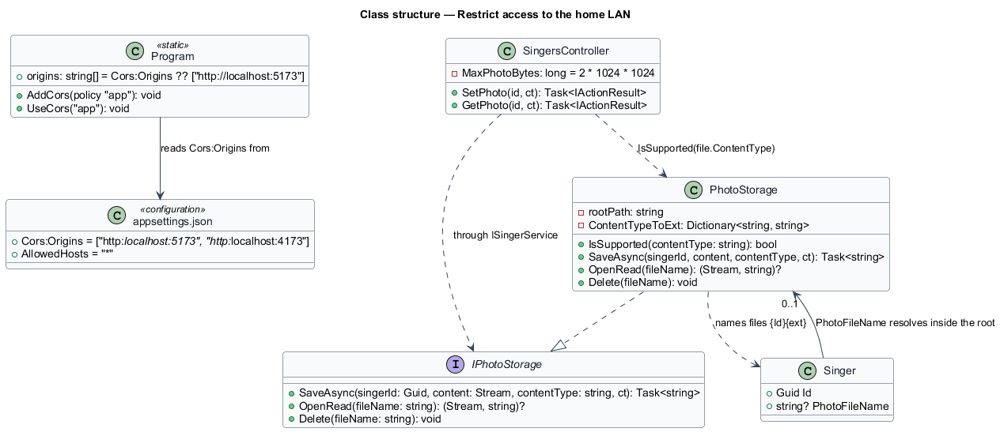
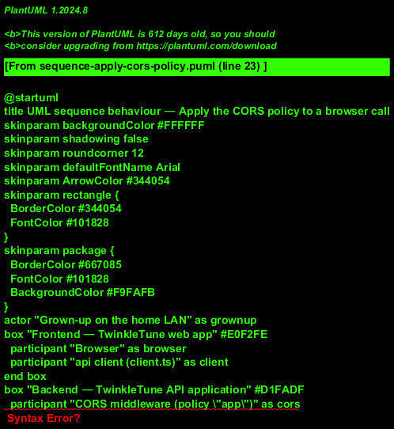
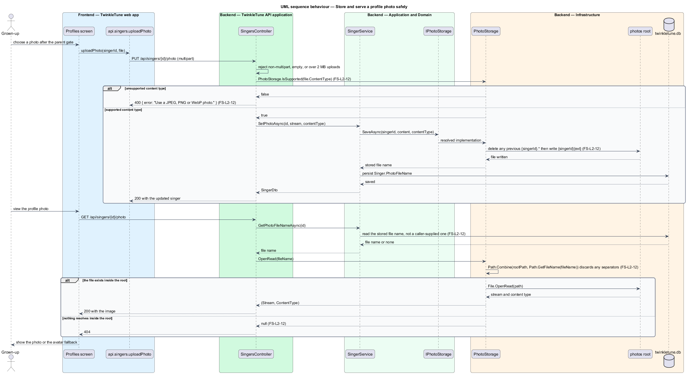

# Restrict Access To The Home LAN

## Overview

The family server has no accounts and no authentication. That is a decision, not
an omission: the product's users are a nine-year-old and her family, and a login
screen between a child and a song would cost more than it protects. What holds
the boundary instead is deployment scope — the server is meant for a home
network — together with a CORS policy that names the origins allowed to call it,
a client-side parent gate on destructive actions, and documentation that states
the limit plainly.

This feature covers that posture and the one place where the server accepts a
file from outside: profile photos. Photos are the first piece of child data
stored off the device, so they are written under a controlled root, restricted to
three image types, and read back only through a lookup that discards any path a
caller tries to smuggle in.

The terms below are used throughout.

- CORS policy — named set of allowed origins, headers, methods, and credential
  rules that a browser enforces on cross-origin calls
- allowed origin — scheme, host, and port combination listed in `Cors:Origins`
  and therefore permitted to call the API from a browser
- parent gate — client-side arithmetic challenge guarding the Grown-Ups Corner
  and destructive actions, and the only guard the product places on the API
- LAN-only posture — deployment scope in which the server is reachable from the
  home network and not from the public internet
- photos root — directory, resolved once at startup, under which every stored
  profile photo lives
- path traversal — attack in which a crafted file name containing separators or
  parent-directory segments escapes the intended folder
- supported photo type — one of the three content types the server accepts:
  `image/jpeg`, `image/png`, and `image/webp`

## Description

CORS (`backend/src/TwinkleTune.Api/Program.cs` and `appsettings.json`):

- **`origins`** — `builder.Configuration.GetSection("Cors:Origins").Get<string[]>()`,
  falling back to `["http://localhost:5173"]` when the section is absent.
- **`appsettings.json`** — ships `Cors:Origins` as
  `["http://localhost:5173", "http://localhost:4173"]`, the Vite dev and preview
  ports.
- **Policy `"app"`** — `p.WithOrigins(origins).AllowAnyHeader().AllowAnyMethod().AllowCredentials()`,
  registered by `AddCors` and applied by `app.UseCors("app")` before any endpoint
  is mapped.

Authentication posture:

- **No authentication middleware** — `Program.cs` calls neither
  `AddAuthentication` nor `UseAuthentication`, and no controller or hub carries an
  `[Authorize]` attribute. Every mapped route is anonymous by design.
- **ADR-0002** — records the decision ("No authentication. The API is designed
  for home-LAN deployment; the client-side parent gate remains the only guard.
  CORS restricted to configured origins") and the matching risk: if the API is
  ever port-forwarded to the internet, the decision becomes unsafe and the ADR is
  to be revisited before that exposure.
- **`README.md`** — states that the server is designed for home-LAN use only and
  is not to be exposed to the internet, and points at ADR-0002.
- **`docs/deployment.md`** — records that the published Azure Static Web Apps
  resource serves the marketing site and the app build only, and that the family
  server is deliberately not hosted there.

Photo storage (`backend/src/TwinkleTune.Infrastructure/Storage/PhotoStorage.cs`):

- **`PhotoStorage(rootPath)`** — constructed once at startup with the resolved
  photos path and registered as a singleton.
- **`ContentTypeToExt`** — case-insensitive map of the three supported types to
  `.jpg`, `.png`, and `.webp`.
- **`IsSupported(contentType)`** — static predicate the controller calls before
  opening the uploaded stream.
- **`SaveAsync(singerId, content, contentType, ct)`** — rejects an unsupported
  type with `ArgumentException`, creates the root if absent, deletes any previous
  `{singerId}.*` file, and writes `{singerId}{ext}`. The stored name is derived
  from the singer identifier, never from the uploaded file name.
- **`OpenRead(fileName)`** — combines the root with
  `Path.GetFileName(fileName)`, so any directory component in the argument is
  discarded before the path is resolved; a missing file returns `null`.
- **`Delete(fileName)`** — applies the same `Path.GetFileName` reduction.

Upload guard (`backend/src/TwinkleTune.Api/Controllers/SingersController.cs`):

- **`SetPhoto`** — rejects a non-multipart request, an empty file, a file larger
  than `MaxPhotoBytes` (`2 * 1024 * 1024`), and an unsupported content type, each
  with `400 Bad Request` and a child-readable `{ error }` message.
- **`GetPhoto`** — reads the stored file name from the singer record rather than
  from the request, then opens it through `OpenRead`.

## Requirements

The feature realizes the following level-2 (L2) requirements. Each L2 requirement
refines a level-1 (L1) requirement, cited by identifier.

| L2 ID | Refines (L1) | Requirement |
|-------|--------------|-------------|
| `FS-L2-10` | `FS-L1-3, FS-L1-4` | The server shall restrict cross-origin access to a configured list of origins (defaulting to the local dev and preview origins), allowing credentials, so only the intended app origins can call it. |
| `FS-L2-11` | `FS-L1-4` | The server shall operate without authentication for home-LAN use, relying on the client parent gate as the only guard, and the product shall document that it is not to be exposed to the public internet, revisiting the decision before any such exposure. |
| `FS-L2-12` | `FS-L1-4` | Photo files shall be stored under a controlled root and read back only via a path-traversal-safe lookup, accepting only supported image types. |

## Diagrams

### System context

The family server sits on the home network, reachable by the household's devices
and deliberately not published to the internet; the parent gate in the app is the
only guard in front of it (`FS-L2-11`).

### Containers

The browser enforces the `"app"` CORS policy against the configured origin list,
and photo bytes land in the photos folder rather than the database (`FS-L2-10`,
`FS-L2-12`).

### Components

The CORS policy is built from `Cors:Origins` and applied before routing, while
`SingersController` and `PhotoStorage` together bound what a photo upload can do
(`FS-L2-10`, `FS-L2-12`).

### Class structure

`PhotoStorage` holds the supported-type map and the `Path.GetFileName` reduction
that keeps every resolved path inside the root (`FS-L2-12`).

### Behaviour — apply the CORS policy to a browser call

A call from a listed origin passes; a call from an origin outside the list is
blocked by the browser because the response carries no matching
`Access-Control-Allow-Origin` (`FS-L2-10`, `FS-L2-11`).

### Behaviour — store and serve a profile photo safely

An upload passes the size and type guards before any byte is written, the stored
name comes from the singer identifier, and a read reduces the requested name to
its base file name before resolving it (`FS-L2-12`).

