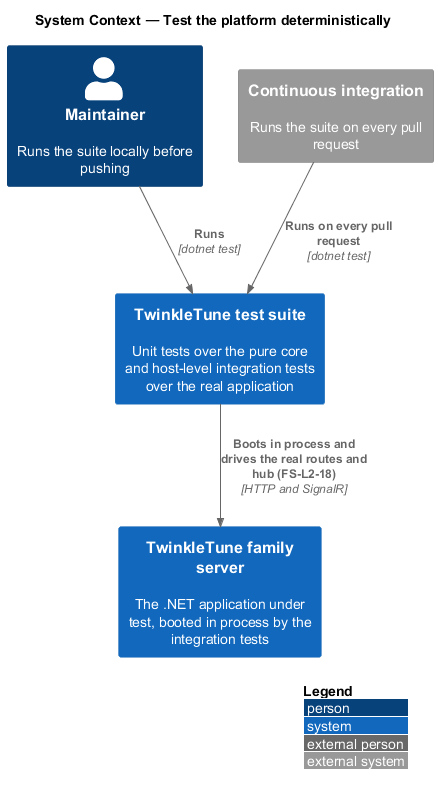
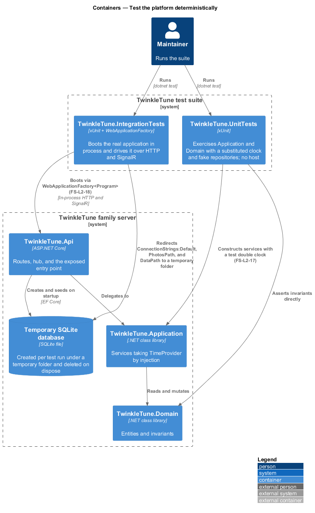
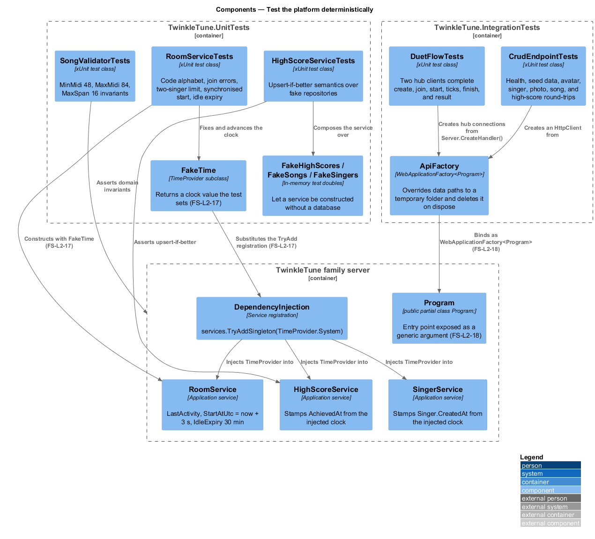
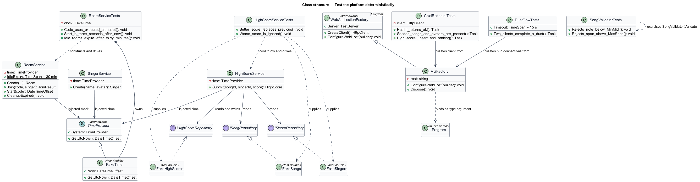
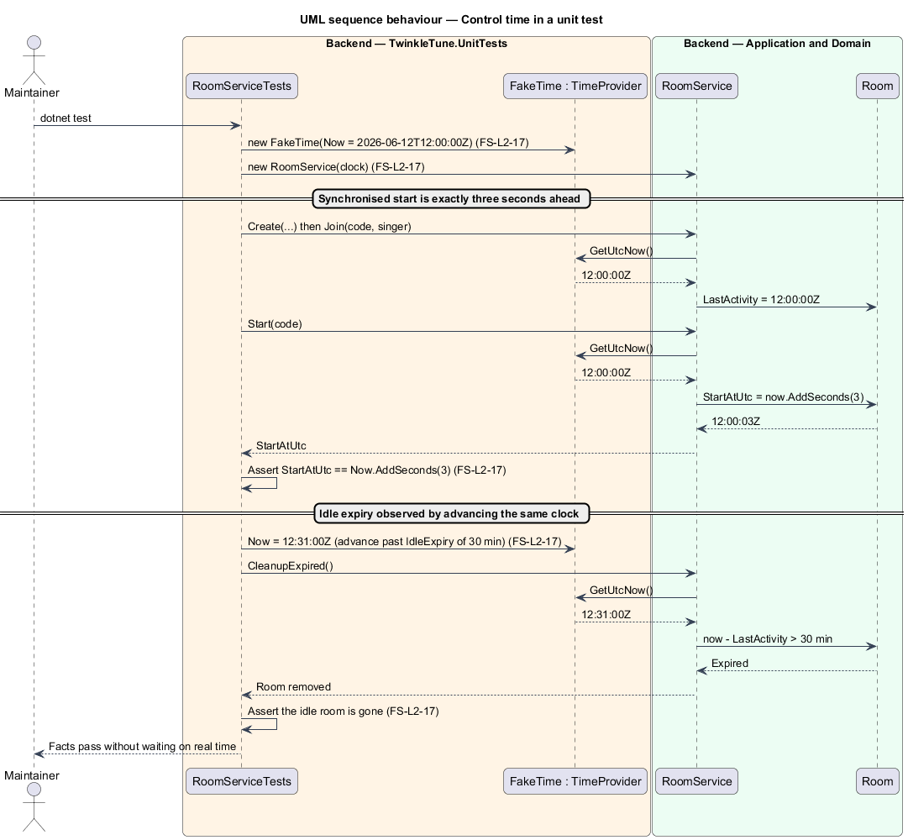
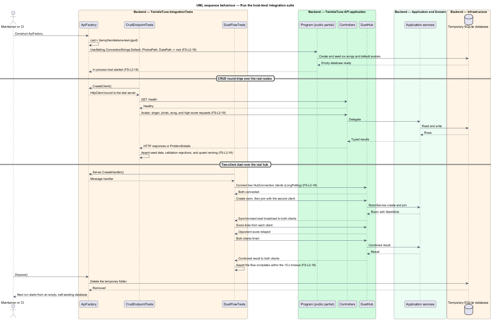

# Test The Platform Deterministically

## Overview

Two properties make the family server testable, and both are design decisions
rather than test-suite conveniences. Nothing in the backend reads the clock
directly — every timestamp and every expiry decision goes through an injected
`TimeProvider`, so a test can place the clock wherever it needs it. And the Api's
entry point is visible to `WebApplicationFactory`, so the suite exercises the
real host, the real routes, and the real hub rather than a stand-in.

This feature covers the seams and the coverage they enable: unit tests over the
pure core, and integration tests that boot the app on a temporary database and
run a full two-client duet.

The terms below are used throughout.

- injectable time — dependency on `TimeProvider` rather than `DateTimeOffset.UtcNow`,
  so a substituted clock changes what the code under test observes
- test double clock — `TimeProvider` subclass whose `GetUtcNow()` returns a value
  the test sets
- host-level integration test — test that starts the real ASP.NET Core
  application in process and drives it over HTTP or SignalR
- entry-point visibility — declaration `public partial class Program;` that makes
  the generated entry-point type reachable as a generic argument
- test host — `WebApplicationFactory<Program>` instance owning the in-process
  server and its configuration overrides
- two-client duet flow — integration scenario in which two SignalR connections
  complete create, join, start, ticks, finish, and result

## Description

Time seam:

- **`services.TryAddSingleton(TimeProvider.System)`** — the single registration
  in `Application/DependencyInjection.cs`. `TryAdd` means a test that registers
  its own `TimeProvider` first keeps it.
- **`HighScoreService`** — takes `TimeProvider time` and stamps `AchievedAt`
  with `time.GetUtcNow()` on both the insert and the beat-the-best update path.
- **`SingerService`** — takes `TimeProvider time` and stamps `Singer.CreatedAt`,
  which is also the key the singer list orders by.
- **`RoomService`** — takes `TimeProvider time` and uses it for `LastActivity`,
  for `StartAtUtc = time.GetUtcNow().AddSeconds(3)`, and for the
  `IdleExpiry = TimeSpan.FromMinutes(30)` cutoff in `CleanupExpired()`.

Entry point and test host:

- **`public partial class Program;`** — the final line of `Program.cs`, carrying
  the comment that it exposes the entry point to `WebApplicationFactory` in
  integration tests.
- **`ApiFactory`** — `WebApplicationFactory<Program>` in
  `backend/tests/TwinkleTune.IntegrationTests`. It creates
  `{temp}/twinkletune-test-{guid}` and overrides `ConnectionStrings:Default`,
  `PhotosPath`, and `DataPath` through `builder.UseSetting`, then deletes the
  folder on dispose. Each run therefore starts from an empty database that seeds
  itself.

Unit tests (`backend/tests/TwinkleTune.UnitTests`):

- **`RoomServiceTests`** — drives `RoomService` with a nested `FakeTime :
  TimeProvider` fixed at `2026-06-12T12:00:00Z`, and asserts the four-letter code
  alphabet, the kid-readable join errors, the two-singer limit, the
  `StartAtUtc == Now.AddSeconds(3)` synchronised start, both-done finishing, and
  idle expiry.
- **`HighScoreServiceTests`** — composes `HighScoreService` over fake
  repositories (`FakeHighScores`, `FakeSongs`, `FakeSingers`) and asserts the
  upsert-if-better semantics.
- **`SongValidatorTests`** — exercises `SongValidator.Validate` over the
  `MinMidi = 48`, `MaxMidi = 84`, and `MaxSpan = 16` invariants.

Integration tests (`backend/tests/TwinkleTune.IntegrationTests`):

- **`CrudEndpointTests`** — eleven facts over the hosted app: `/health`, the
  seeded six songs and default avatars, avatar CRUD and rejection, singer CRUD
  with avatar and range, the singer list, range validation, photo upload and
  download, photo type rejection, song CRUD with validation, and high-score
  upsert and ranking.
- **`DuetFlowTests`** — connects two `HubConnection` clients through
  `factory.Server.CreateHandler()` with `HttpTransportType.LongPolling`, then
  runs create, join, synchronised start, score ticks, finish, and the combined
  result, under a 15-second `Timeout`.

## Requirements

The feature realizes the following level-2 (L2) requirements. Each L2 requirement
refines a level-1 (L1) requirement, cited by identifier.

| L2 ID | Refines (L1) | Requirement |
|-------|--------------|-------------|
| `FS-L2-17` | `FS-L1-7` | Time-dependent logic (achievement timestamps, room start times and expiry) shall use an injectable time provider so it can be controlled in tests. |
| `FS-L2-18` | `FS-L1-7` | The Api shall expose its entry point for host-level integration tests, and the platform shall be covered by unit tests (domain invariants, high-score upsert, room service) and integration tests (CRUD round-trips and a two-client duet flow). |

## Diagrams

### System context

A maintainer runs the suite locally and CI runs it on every pull request; both
drive the real application rather than a stand-in (`FS-L2-18`).

### Containers

`ApiFactory` boots the Api container against a temporary SQLite file and photos
folder, while the unit tests exercise Application and Domain with no host at all
(`FS-L2-17`, `FS-L2-18`).

### Components

The two test projects, the entry-point declaration they bind to, and the services
whose clock they substitute (`FS-L2-17`, `FS-L2-18`).

### Class structure

`ApiFactory` over `WebApplicationFactory<Program>`, the `FakeTime` clock, and the
fake repositories that let a service be constructed without a database
(`FS-L2-17`, `FS-L2-18`).

### Behaviour — control time in a unit test

`RoomServiceTests` fixes the clock, asserts that a start time is exactly three
seconds after it, then advances the same clock past 30 minutes to observe idle
expiry (`FS-L2-17`).

### Behaviour — run the host-level integration suite

`ApiFactory` redirects the data paths, the app creates and seeds a temporary
database, the CRUD facts round-trip over HTTP, and two hub clients complete a
duet (`FS-L2-18`).

