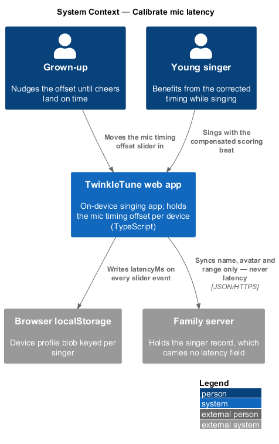
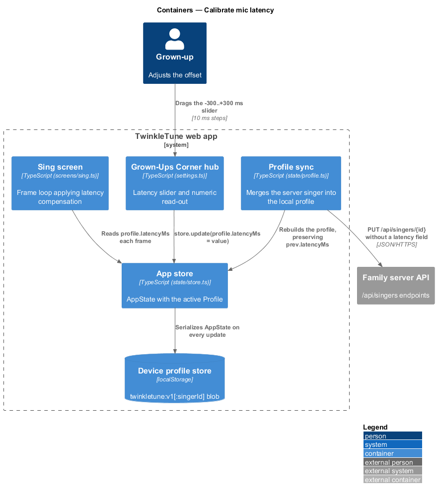
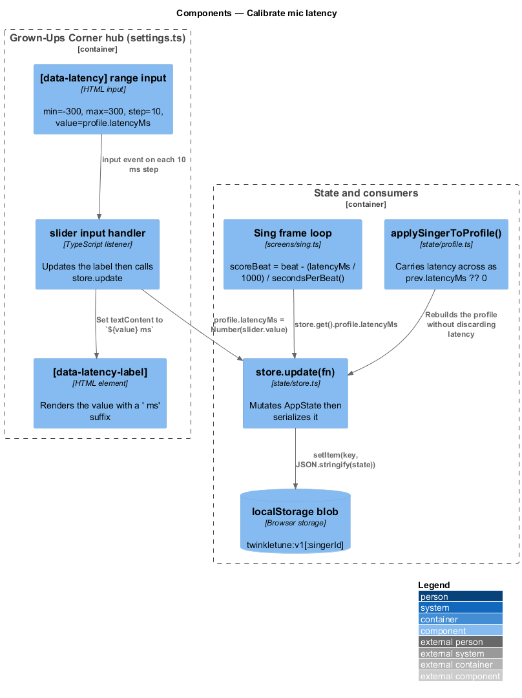
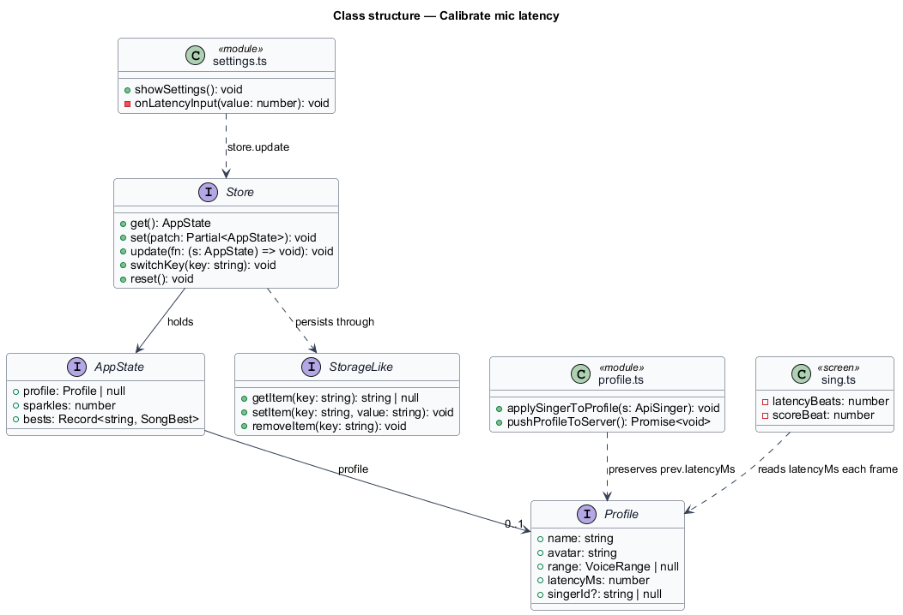
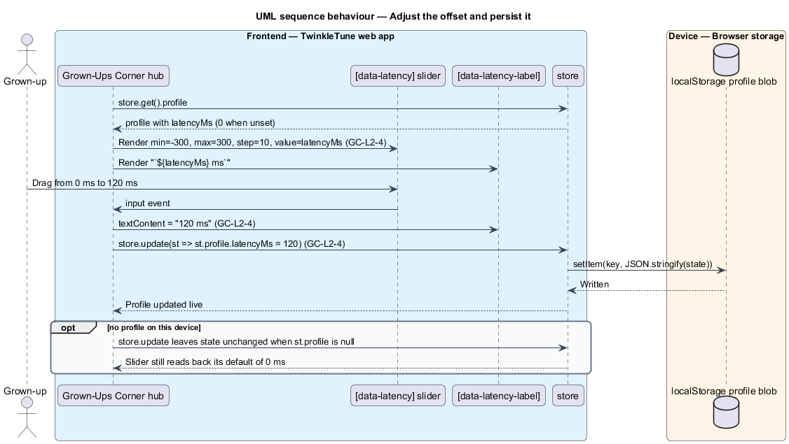
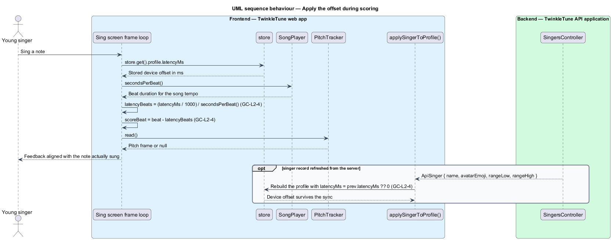

# Calibrate Mic Latency

## Overview

Budget tablets add a delay between a sung note and the moment its samples reach
the app. Left uncorrected, the delay makes Twinkle's cheers land after the note
has passed and pushes scoring off the beat. The hub gives a grown-up one slider
that shifts the app's idea of "now" against the audio it hears, so feedback lines
up again on the hardware in front of them.

Latency belongs to the device, not to the person. Two singers on one tablet share
the same offset, and one singer on two tablets carries a different offset on each.
The design keeps the value out of the server's singer record for that reason.

The terms below are used throughout.

- mic timing offset — signed delay in milliseconds between a note being sung and
  the app receiving it, held as `latencyMs` on the active profile
- latency slider — range input spanning −300 to +300 ms in 10 ms steps
- numeric read-out — bold label beside the slider showing the current value with
  a " ms" suffix
- device property — value stored in the device's own profile blob and never sent
  to the family server as part of the singer record
- latency compensation — subtraction of the offset from the current beat before
  scoring compares a sung note with the expected note
- live update — write of the new value on every `input` event, rather than on
  release or on a save action

Calibration covers the control, its persistence, and the point at which the
stored value is consumed. Scoring's use of the compensated beat belongs to the
singing gameplay subsystem.

## Description

The feature is a frontend-only slice. The control lives in
`frontend/src/ui/settings.ts`, the value lives on `Profile` in
`frontend/src/state/store.ts`, and the consumer is the play loop in
`frontend/src/screens/sing.ts`.

- **latency slider markup** — `<input type="range" min="-300" max="300"
  step="10" value="${profile?.latencyMs ?? 0}" data-latency>`, so the control
  spans 601 discrete positions at 10 ms resolution and opens at the stored value,
  defaulting to `0` when no profile exists.
- **`[data-latency-label]`** — the `<b>` element rendering
  `` `${profile?.latencyMs ?? 0} ms` `` at mount and
  `` `${slider.value} ms` `` on every change.
- **slider `input` handler** — bound in `onMount`. It sets the label text, then
  calls `store.update((st) => { if (st.profile) st.profile.latencyMs =
  Number(slider.value) })`. Each event both updates the label and persists.
- **`Profile.latencyMs: number`** — field on the profile interface in
  `store.ts`, documented there as a device property kept per device.
- **`Store.update(fn)`** — mutates the in-memory `AppState` through the supplied
  function and then calls `save()`, which writes
  `storage.setItem(key, JSON.stringify(state))`. Persistence is therefore
  synchronous with the slider movement.
- **per-device storage key** — the store writes to `twinkletune:v1` or, once a
  singer is linked, `` `twinkletune:v1:${singerId}` `` in the browser's
  `localStorage`. The blob never leaves the device.
- **`applySingerToProfile(s: ApiSinger)`** — profile merge in
  `frontend/src/state/profile.ts`. It rebuilds the profile from the server's
  singer record but carries latency across as `prev?.latencyMs ?? 0`, so a server
  round trip cannot overwrite the device's own offset.
- **`pushProfileToServer()`** — the outbound sync in `profile.ts`. Its request
  body carries `name`, `avatarId`, `rangeLow`, and `rangeHigh` only; latency is
  absent, which is what keeps the offset device-local.
- **latency compensation** — in `sing.ts`, the frame loop computes
  `const latencyBeats = (profile.latencyMs / 1000) / player.secondsPerBeat()` and
  `const scoreBeat = beat - latencyBeats`, then scores against `scoreBeat`.

Constants (the shipped baseline): range −300 to +300 ms, step 10 ms, default
`0` ms, read-out suffix `" ms"`.

## Requirements

The feature realizes the following level-2 (L2) requirements. Each L2 requirement
refines a level-1 (L1) requirement, cited by identifier.

| L2 ID | Refines (L1) | Requirement |
|-------|--------------|-------------|
| `GC-L2-4` | `GC-L1-3` | The hub shall provide a −300…+300 ms slider (10 ms steps) that updates the profile's mic latency live, with a numeric read-out; the value shall stay device-local (not synced as a person property) and shall feed scoring compensation. |

## Diagrams

### System context

The grown-up calibrates the tablet in front of them; the offset is written to
that device's own storage and is not carried to the family server (`GC-L2-4`).

### Containers

The hub writes `latencyMs` into the device profile store, and the Sing screen
reads it back each frame to shift the scoring beat (`GC-L2-4`).

### Components

The slider's `input` handler updates the read-out and calls `store.update`; the
profile merge deliberately preserves the previous `latencyMs` so a server sync
leaves it untouched (`GC-L2-4`).

### Class structure

`latencyMs` is a field of `Profile` inside `AppState`, written through `Store`
and read by the Sing screen's frame loop (`GC-L2-4`).

### Behaviour — adjust the offset and persist it

Each `input` event sets the read-out to the new value with a " ms" suffix and
writes `latencyMs` straight to the persisted profile, so no separate save step
exists (`GC-L2-4`).

### Behaviour — apply the offset during scoring

The Sing screen converts the stored milliseconds into beats through the player's
tempo and scores against `beat - latencyBeats`; a concurrent server sync keeps
the device value rather than replacing it (`GC-L2-4`).

