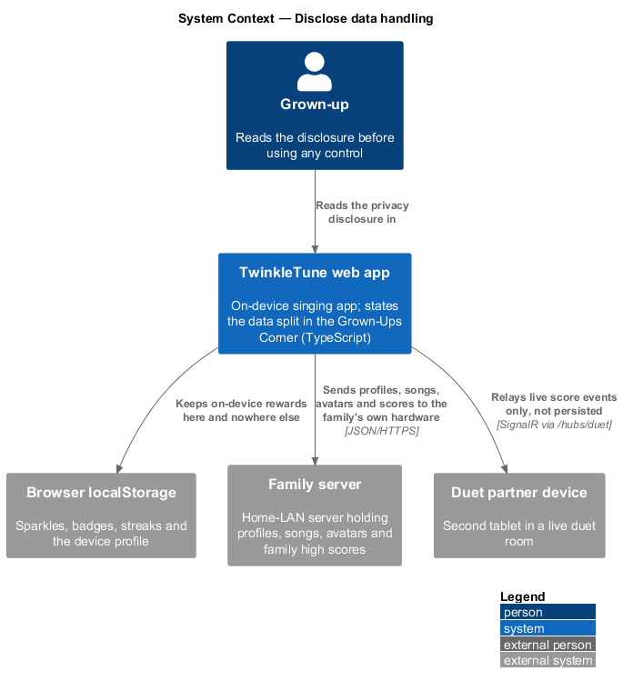
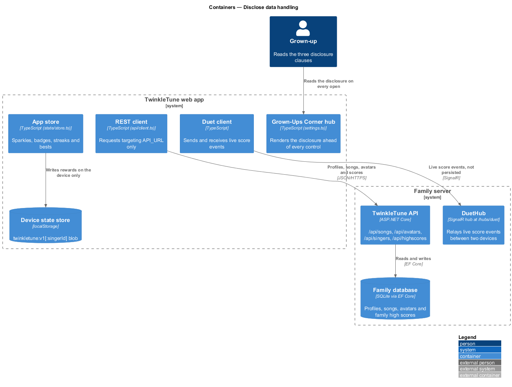
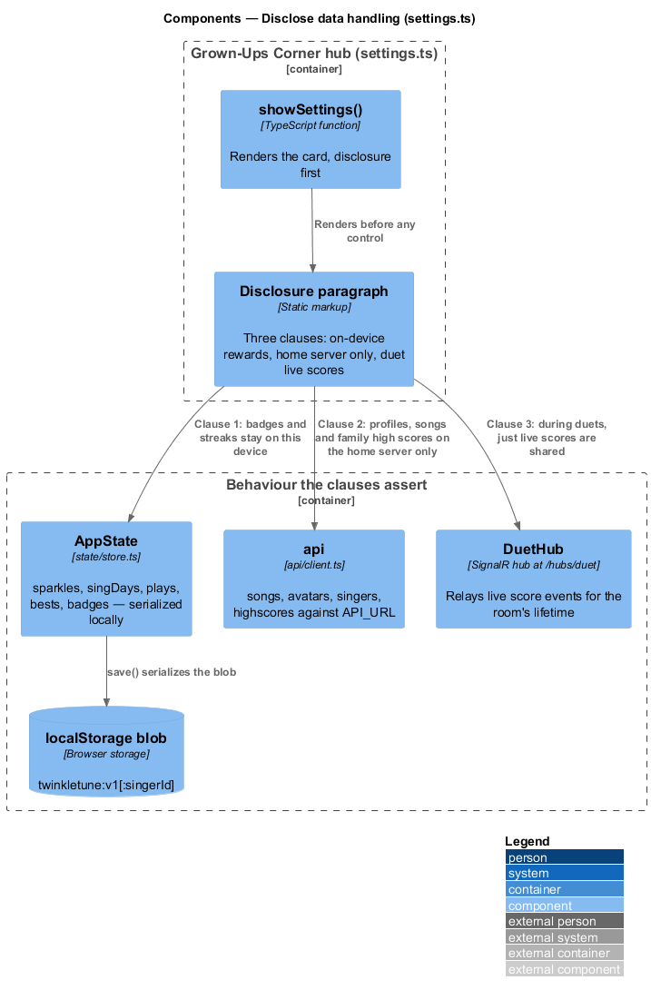
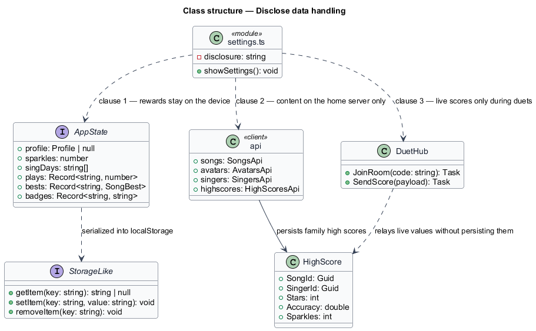
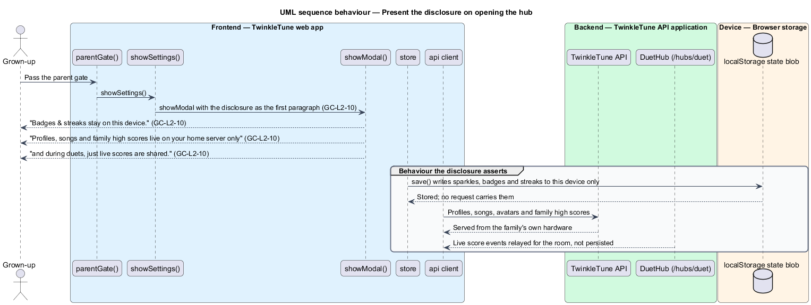

# Disclose Data Handling

## Overview

TwinkleTune is used by children, and its trust story rests on where their data
goes. The product's answer is that almost none of it goes anywhere: audio never
leaves the device, rewards stay in the browser, family content stays on hardware
the family owns, and a duet sends only live score events. That answer is worth
nothing when the grown-up can reach it only by inference from the code, so the hub states it in
the first paragraph a grown-up reads, in plain language and without jargon.

The disclosure is a product commitment expressed as copy. Its accuracy depends on
three other subsystems keeping their side of it, so the wording is written to
match what those subsystems do rather than what they intend.

The terms below are used throughout.

- privacy disclosure — introductory paragraph of the settings hub stating what is
  stored where and what crosses the network
- on-device reward — sparkle count, badge, or streak held in the browser's
  storage blob and never sent anywhere
- home server — family-owned server on the local network holding profiles,
  songs, avatars, and family high scores
- live score event — small message carrying a duet partner's current score,
  relayed during play and not persisted
- data split — division between state that stays in the browser and state that
  lives on the home server

The disclosure covers the statement itself and the behaviour it asserts. The
server's own security posture — no authentication, local-network deployment — is
stated by the family server platform subsystem.

## Description

The copy lives in `frontend/apps/game/src/ui/settings.ts`; the behaviour it describes lives
across the state layer, the REST client, and the duet relay.

- **disclosure paragraph** — the `
` directly beneath the "Grown-Ups Corner"
  heading in `showSettings`, rendered before any control. Its three clauses are:
  "Badges & streaks stay on this device."; "Profiles, songs and family high
  scores live on **your home server only**"; "and during duets, just live scores
  are shared."
- **first clause — on-device rewards** — backed by `AppState` in
  `frontend/apps/game/src/state/store.ts`, whose `sparkles`, `singDays`, `plays`, `bests`,
  and `badges` fields are serialized only into the browser's `localStorage` blob
  by the store's `save()`. No client call sends them.
- **second clause — home-server content** — backed by `api` in
  `frontend/apps/game/src/api/client.ts`, whose requests target `API_URL` alone. The
  endpoint groups are `/api/songs`, `/api/avatars`, `/api/singers`, and
  `/api/highscores`; each is served by the family's own ASP.NET Core
  application over the local network.
- **third clause — duet sharing** — backed by `DuetHub`
  (`backend/src/TwinkleTune.Api/Hubs/DuetHub.cs`), the SignalR hub mapped at
  `/hubs/duet` in `Program.cs`. It relays live score events between the two
  devices in a room for the duration of the song.
- **`showSettings`** — the function that renders the paragraph. The disclosure is
  part of the hub's static markup, so it appears on every open and cannot be
  dismissed independently of the hub.
- **audio** — no clause is needed for the microphone, because the audio engine
  keeps every sample on the device; no request body in `api/client.ts` carries
  audio.

## Requirements

The feature realizes the following level-2 (L2) requirements. Each L2 requirement
refines a level-1 (L1) requirement, cited by identifier.

| L2 ID | Refines (L1) | Requirement |
|-------|--------------|-------------|
| `GC-L2-10` | `GC-L1-7` | The settings hub shall state, in plain language, that on-device rewards stay on the device, that profiles/songs/family scores live only on the home server, and that during duets only live scores are shared. |

## Diagrams

### System context

The disclosure names three destinations for family data: the device itself, the
family's own server, and a duet partner's device during play (`GC-L2-10`).

### Containers

Rewards are written only to the device state store, content only to the family
server, and live scores only through the duet relay — the three claims the
paragraph makes (`GC-L2-10`).

### Components

The disclosure paragraph is rendered by `showSettings` ahead of every control,
and each of its clauses maps onto one storage or transport path (`GC-L2-10`).

### Class structure

`AppState` holds the on-device rewards, the `api` client groups the home-server
resources, and `DuetHub` carries the live score events (`GC-L2-10`).

### Behaviour — present the disclosure on opening the hub

Opening the hub renders the disclosure before any control, so the data split and
the duet sharing scope are stated on every visit (`GC-L2-10`).

