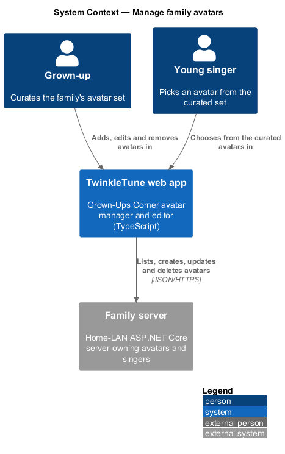
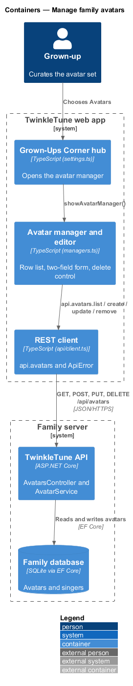
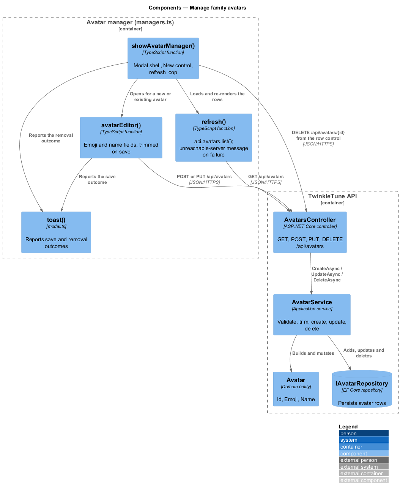
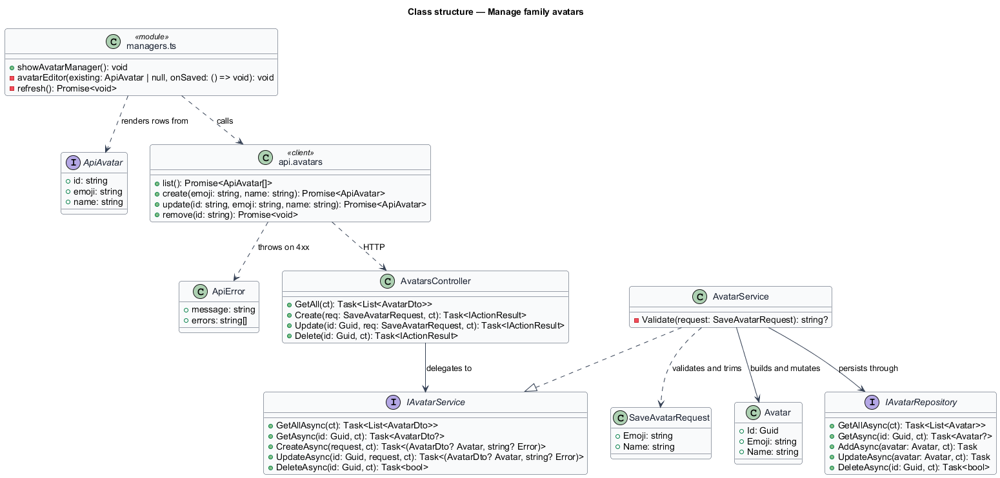
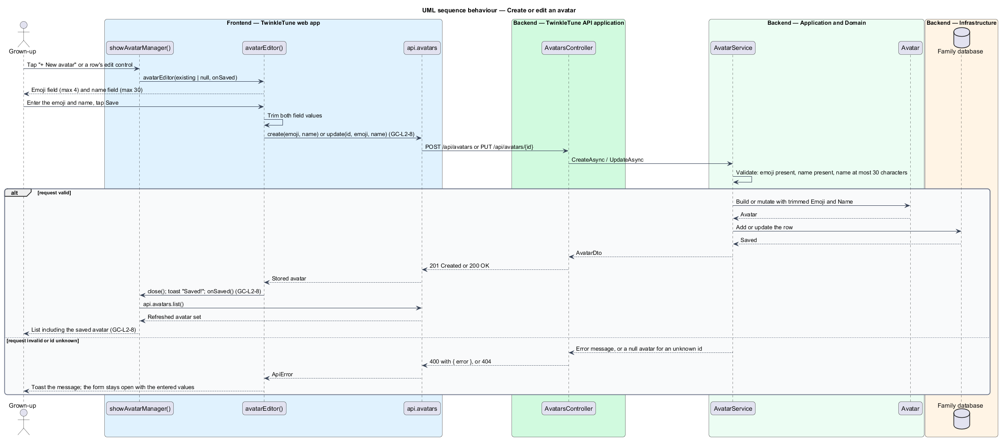
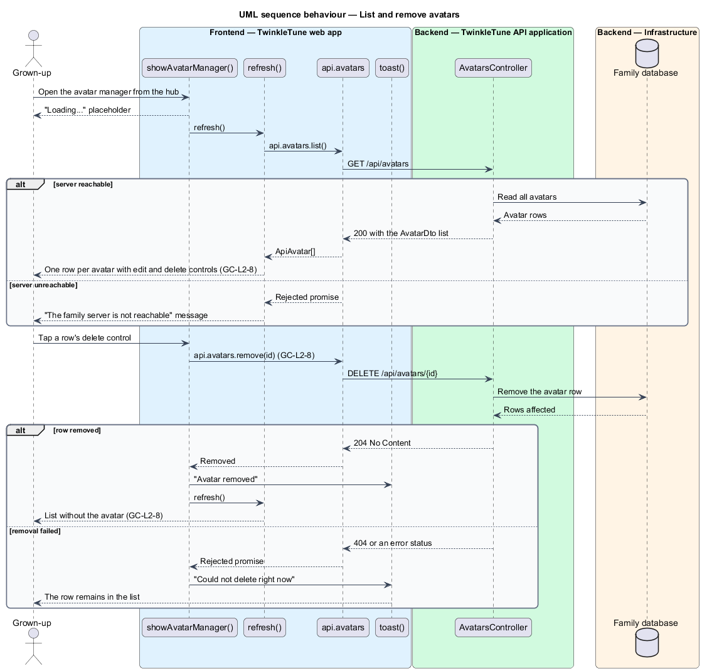

# Manage Family Avatars

## Overview

Every singer picks an avatar, and the set of avatars a family can choose from is
its own. The avatar manager is the grown-up's editor for that set: a list of
emoji-and-name pairs with add, edit, and remove controls, backed by the family
server so every device in the house sees the same choices.

An avatar carries no personal data — an emoji and a short label — so the manager
is deliberately lighter than the song manager. Removal takes effect on the tap,
without a second confirmation, and the singer records that referenced the avatar
keep working with a null reference.

The terms below are used throughout.

- avatar — reusable emoji-and-name pair a singer can adopt as their picture
- avatar manager — modal listing every avatar with edit and delete controls per
  row
- avatar editor — modal form carrying exactly two fields, emoji and name
- optimistic removal — deletion issued directly from the row control, reporting
  its outcome through a toast rather than a confirmation dialog
- toast — transient message strip used to report a save or a removal
- unreachable-server state — list replaced by a plain message when the family
  server does not answer

Avatar CRUD semantics on the server belong to the player profiles subsystem; this
feature covers the grown-up's editing surface over them.

## Description

The slice spans `frontend/apps/game/src/ui/managers.ts`, the REST client in
`frontend/apps/game/src/api/client.ts`, and the server side in
`backend/src/TwinkleTune.Api/Controllers/AvatarsController.cs` with
`backend/src/TwinkleTune.Application/Services/AvatarService.cs`.

Frontend — manager and editor (`frontend/apps/game/src/ui/managers.ts`):

- **`showAvatarManager(): void`** — opens the wide modal titled "Avatars",
  renders a loading placeholder, wires `[data-close]` and `[data-new]`, and runs
  `refresh()`.
- **`refresh()`** — calls `api.avatars.list()`. On a rejected promise it replaces
  the rows with "The family server is not reachable 📡" and returns. Otherwise it
  renders one `.mgr-row` per avatar holding the emoji, the name, an edit control
  `[data-edit]`, and a delete control `[data-del]`, each carrying the avatar id
  and an `aria-label` naming the avatar.
- **`avatarEditor(existing: ApiAvatar | null, onSaved: () => void)`** — the
  create and edit form. It renders `[data-f-emoji]` (`maxlength="4"`,
  placeholder `🐯`) and `[data-f-name]` (`maxlength="30"`, placeholder `Tiger`),
  prefilled from `existing` when editing.
- **save handler** — `[data-save]` trims both field values, then calls
  `api.avatars.update(existing.id, emoji, name)` or
  `api.avatars.create(emoji, name)`. On success it closes the modal, toasts
  "Saved! ✨" in the gold variant, and calls `onSaved()` so the list refreshes. A
  rejection toasts the error message in the pink variant and leaves the form
  open, so the entered values survive.
- **delete handler** — `[data-del]` calls `api.avatars.remove(id)` directly, then
  toasts "Avatar removed 💙" and refreshes. A rejection toasts "Could not delete
  right now" in the pink variant and leaves the row in place.
- **`toast(message, variant, ms)`** — the transient message strip from
  `ui/modal.ts`; the default lifetime is 2200 ms.

Frontend — REST client (`frontend/apps/game/src/api/client.ts`):

- **`ApiAvatar`** — record with `id`, `emoji`, and `name`.
- **`api.avatars`** — `list()` over `GET /api/avatars`, `create(emoji, name)`
  over `POST /api/avatars`, `update(id, emoji, name)` over
  `PUT /api/avatars/{id}`, and `remove(id)` over `DELETE /api/avatars/{id}`.
- **`req<T>`** — shared request helper. It throws `ApiError` for any non-`2xx`
  response, reading `error` or `errors` from a JSON body, and returns
  `undefined` for a `204`.

Backend — API (`backend/src/TwinkleTune.Api/Controllers/AvatarsController.cs`):

- **`GetAll`** — `GET /api/avatars`, returns the `AvatarDto` list.
- **`Create`** — `POST /api/avatars`; `Created` (`201`) with the stored avatar,
  or `BadRequest(new { error })` (`400`).
- **`Update`** — `PUT /api/avatars/{id}`; `400` on a validation error, `404` when
  the id is unknown, else `200`.
- **`Delete`** — `DELETE /api/avatars/{id}`; `204` when a row was removed, `404`
  otherwise.

Backend — application
(`backend/src/TwinkleTune.Application/Services/AvatarService.cs`):

- **`Validate(request)`** — returns "An avatar needs an emoji." for a blank
  emoji, "An avatar needs a name." for a blank name, and "Avatar name is too long
  (max 30 characters)." beyond 30 characters, and `null` when the request passes.
- **`CreateAsync`** — validates, builds an `Avatar` with a new `Guid` and both
  fields trimmed, and adds it.
- **`UpdateAsync`** — validates, loads the avatar, returns a null result with no
  error when absent so the endpoint maps to `404`, then writes the trimmed
  fields.
- **`DeleteAsync`** — delegates to `IAvatarRepository`, which reports whether a
  row was removed.

Constants (the shipped baseline): emoji field at most 4 characters, name field at
most 30 characters on both the client input and the server check, toast lifetime
2200 ms.

## Requirements

The feature realizes the following level-2 (L2) requirements. Each L2 requirement
refines a level-1 (L1) requirement, cited by identifier.

| L2 ID | Refines (L1) | Requirement |
|-------|--------------|-------------|
| `GC-L2-8` | `GC-L1-5` | The avatar manager shall list avatars and allow creating, editing, and deleting them (emoji + name), persisting via the API. |

## Diagrams

### System context

The grown-up curates the family's avatar set from the tablet, and the set itself
lives on the family server so every device shares it (`GC-L2-8`).

### Containers

The avatar manager calls the TwinkleTune API for list, create, update, and
delete, and the API validates and stores each avatar in the family database
(`GC-L2-8`).

### Components

`showAvatarManager` renders rows from `api.avatars.list()`, `avatarEditor` sends
the trimmed emoji and name, and `AvatarService.Validate` decides between a `400`
and a stored record (`GC-L2-8`).

### Class structure

The two-field editor maps onto `ApiAvatar` and `SaveAvatarRequest`, which the
controller passes to `AvatarService` and on to the `Avatar` entity (`GC-L2-8`).

### Behaviour — create or edit an avatar

The editor trims both fields and calls create or update; the server validates the
emoji and the 30-character name limit, and a rejection is reported as a toast
with the form left open (`GC-L2-8`).

### Behaviour — list and remove avatars

Opening the manager lists the avatars, degrading to an unreachable-server message
when the call fails; the delete control issues `DELETE /api/avatars/{id}`
directly and reports the outcome as a toast (`GC-L2-8`).

