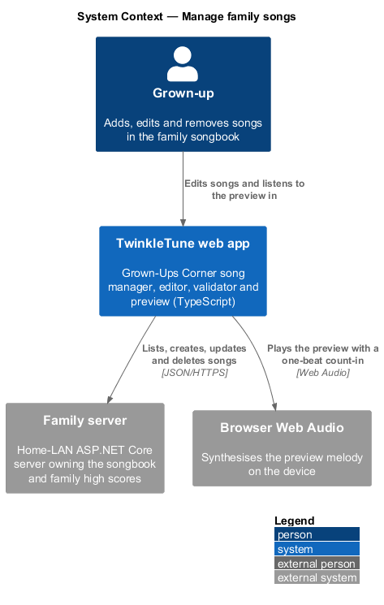
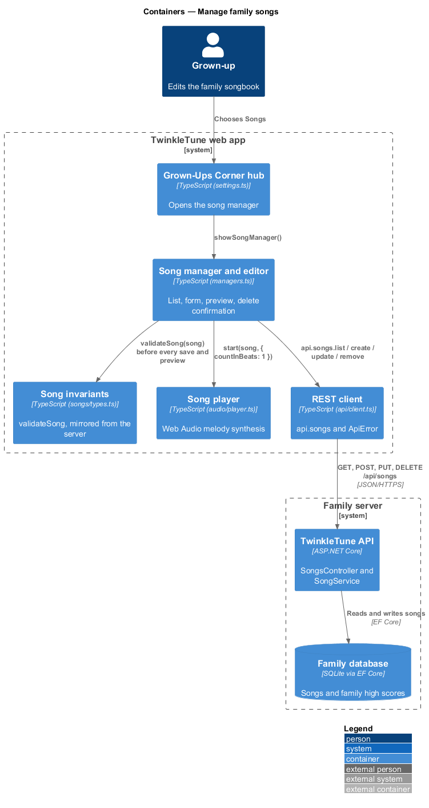
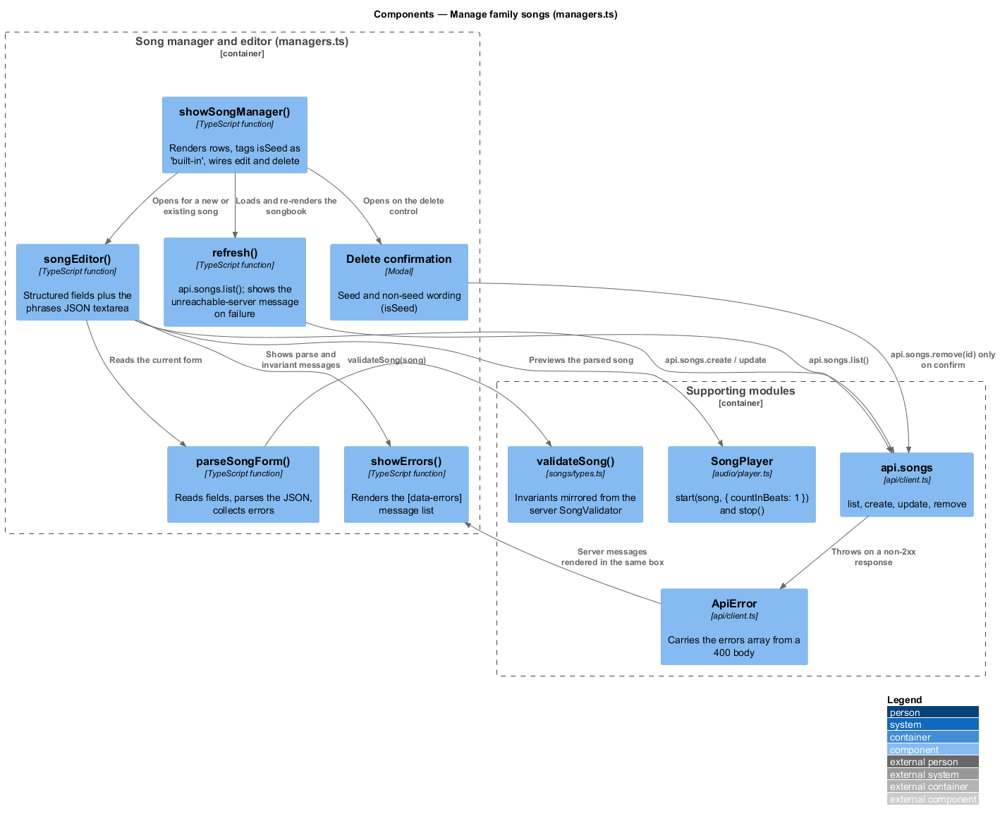
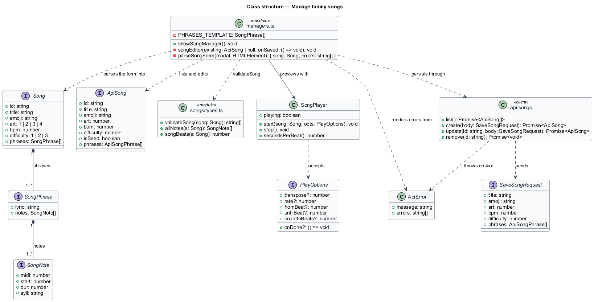
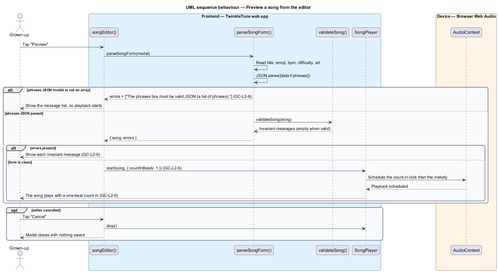
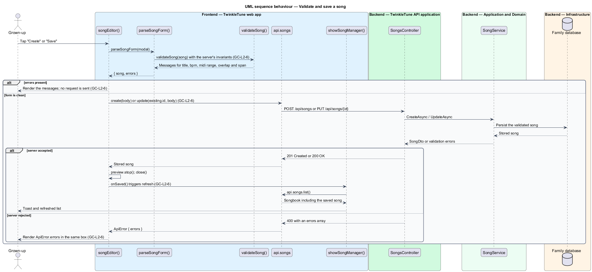
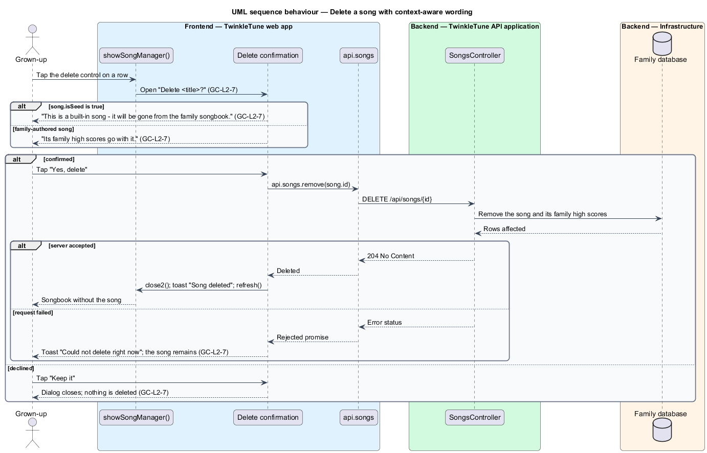

# Manage Family Songs

## Overview

The bundled songbook is small and public-domain. A family that runs the optional
family server can extend it with songs of its own, and the song manager is where
that happens. A grown-up sees the whole songbook, opens a structured editor,
hears the melody before committing to it, and gets the same validation messages
the server would produce. Songs are stored as note data rather than recordings,
so the editor edits numbers — MIDI note, start beat, duration, syllable — and the
preview synthesises them on the spot.

The terms below are used throughout.

- song manager — modal listing the family songbook with edit and delete controls
  per row
- song editor — modal form carrying the structured song fields plus a phrases
  JSON field
- phrases JSON — textarea holding the song's phrase and note array as JSON, the
  authoring surface for the melody itself
- built-in song — song written by server seeding and flagged `isSeed`, labelled
  "built-in" in the manager list
- live preview — synthesised playback of the form's current contents, preceded
  by a one-beat count-in
- mirrored validation — client-side invariant check running the identical rules
  the server enforces, so a save is rejected before it leaves the device
- context-aware confirmation — delete dialog whose wording changes according to
  whether the song is built-in or family-authored

Song invariants and the server's CRUD semantics belong to the song library
subsystem; this feature covers the grown-up's editing surface over them.

## Description

The slice spans the frontend manager in `frontend/src/ui/managers.ts`, the shared
invariant check in `frontend/src/songs/types.ts`, the synthesiser in
`frontend/src/audio/player.ts`, the REST client in
`frontend/src/api/client.ts`, and the server endpoints in
`backend/src/TwinkleTune.Api/Controllers/SongsController.cs`.

Frontend — manager and editor (`frontend/src/ui/managers.ts`):

- **`showSongManager(): void`** — opens the wide modal titled "Songbook", renders
  a loading placeholder, and runs `refresh()`. Each row shows the emoji, the
  title, an edit control `[data-edit]`, and a delete control `[data-del]`. A
  seed row appends `<small>built-in</small>` after the title.
- **`refresh()`** — calls `api.songs.list()`; on a rejected promise it replaces
  the rows with "The family server is not reachable 📡" and returns, so an
  unreachable server degrades to a message rather than an error.
- **`songEditor(existing: ApiSong | null, onSaved: () => void)`** — the create
  and edit form. It constructs one `SongPlayer` for previewing and seeds the
  phrases field with `JSON.stringify(existing?.phrases ?? PHRASES_TEMPLATE, null,
  2)`.
- **editor fields** — `[data-f-title]` (`maxlength="80"`), `[data-f-emoji]`
  (`maxlength="4"`, default `🎵`), `[data-f-bpm]` (number, `min="40"`,
  `max="220"`, default `100`), `[data-f-difficulty]` (select over 1 Easy,
  2 Medium, 3 Brave), `[data-f-art]` (select over styles 1 to 4), and
  `[data-f-phrases]` (textarea, `spellcheck="false"`).
- **`PHRASES_TEMPLATE`** — the starter melody offered to a new song: one phrase
  with the lyric `La la la` and three notes at MIDI 60, 62, and 64.
- **`parseSongForm(modal)`** — reads every field, parses the phrases JSON, and
  returns `{ song, errors }`. A parse failure or a non-array result pushes "The
  phrases box must be valid JSON (a list of phrases)." and suppresses the
  invariant pass; otherwise it appends `validateSong(song)`.
- **`showErrors(errors)`** — toggles the `[data-errors]` box and renders one
  `
• …
` per message.
- **preview handler** — `[data-preview]` parses the form, shows any errors, and
  starts playback only when the error list is empty:
  `preview.start(song, { countInBeats: 1 })`.
- **save handler** — `[data-save]` parses and validates first, returning early on
  any error. It then posts the six-field body through
  `api.songs.update(existing.id, body)` or `api.songs.create(body)`, stops the
  preview, closes the modal, raises a toast ("Song saved! ✨" or "Song created!
  🎉", gold), and calls `onSaved()` so the list refreshes. A rejection renders
  `ApiError.errors` when present and the error message otherwise.
- **delete confirmation** — `[data-del]` opens a second modal titled
  `Delete "<title>"?` whose body reads "This is a built-in song — it will be gone
  from the family songbook." for a seed song and "Its family high scores go with
  it." otherwise. `[data-no]` closes it unchanged; `[data-yes]` calls
  `api.songs.remove(song.id)`, toasts "Song deleted 💙", and refreshes. A failed
  call toasts "Could not delete right now" in the pink variant and leaves the
  dialog open.

Frontend — shared invariants (`frontend/src/songs/types.ts`):

- **`validateSong(song: Song): string[]`** — documented as kept identical to the
  backend `SongValidator`. It requires a non-empty title of at most 80
  characters, a non-empty emoji, `art` in 1 to 4, `bpm` in 40 to 220,
  `difficulty` in 1 to 3, at least one phrase, a lyric and at least one note per
  phrase, positive note durations, a syllable per note, `midi` in 48 to 84
  (C3 to C6), no overlap with the previous note, and a melody span of at most 16
  semitones.
- **`Song`, `SongPhrase`, `SongNote`** — the structural types the editor parses
  into; `SongNote` carries `midi`, `start`, `dur`, and `syll` in beats.

Frontend — audio and transport:

- **`SongPlayer.start(song, opts)`** — synthesises the melody with Web Audio.
  `PlayOptions.countInBeats` defaults to 4; the editor passes `1`.
  `SongPlayer.stop()` is called on cancel and after a successful save.
- **`api.songs`** — `list()`, `create(body)`, `update(id, body)`, `remove(id)`
  over `/api/songs`.
- **`ApiError`** — error type carrying the `errors` array parsed from a `400`
  body; `req<T>` throws it for any non-`2xx` response.

Backend — `backend/src/TwinkleTune.Api/Controllers/SongsController.cs`:

- **`Create` / `Update` / `Delete`** — `POST /api/songs`, `PUT /api/songs/{id}`,
  `DELETE /api/songs/{id}`, delegating to `SongService` for validation and
  persistence.

Constants (the shipped baseline): title at most 80 characters, emoji at most 4
characters, BPM 40 to 220 with a default of 100, difficulty 1 to 3, art 1 to 4,
note MIDI 48 to 84, melody span at most 16 semitones, preview count-in 1 beat.

## Requirements

The feature realizes the following level-2 (L2) requirements. Each L2 requirement
refines a level-1 (L1) requirement, cited by identifier.

| L2 ID | Refines (L1) | Requirement |
|-------|--------------|-------------|
| `GC-L2-6` | `GC-L1-4` | The song manager shall list the songbook (marking built-in songs), allow creating a new song or editing an existing one via a structured form plus a phrases/notes JSON field, offer a live preview, validate before saving (identically to the server), and persist via the API. |
| `GC-L2-7` | `GC-L1-4` | Deleting a song shall require confirmation; the confirmation shall explain the consequence, differing for a built-in song (removed from the songbook) versus a custom song (its family high scores go with it). |

## Diagrams

### System context

The grown-up edits the family songbook from the tablet; the songs themselves live
on the family server, and the preview is synthesised on the device (`GC-L2-6`).

### Containers

The manager and editor call the TwinkleTune API for list, create, update, and
delete, while validation and preview stay on the device (`GC-L2-6`, `GC-L2-7`).

### Components

`songEditor` parses the form through `parseSongForm`, checks it with the shared
`validateSong`, previews it through `SongPlayer`, and persists through
`api.songs`; the delete path chooses its wording from `isSeed` (`GC-L2-6`,
`GC-L2-7`).

### Class structure

The editor's form maps onto `Song` and its `SongPhrase` and `SongNote` parts,
`ApiSong` adds the `isSeed` flag that drives the delete wording, and `ApiError`
carries server validation messages back to the errors box (`GC-L2-6`,
`GC-L2-7`).

### Behaviour — preview a song from the editor

Preview parses the form, shows any validation messages, and starts playback only
on a clean parse, with a one-beat count-in (`GC-L2-6`).

### Behaviour — validate and save a song

Saving runs the mirrored invariant check before any request; a clean form is
created or updated through the API and the list refreshes, while a server `400`
is rendered from `ApiError.errors` (`GC-L2-6`).

### Behaviour — delete a song with context-aware wording

Deletion opens a confirmation whose copy differs for a built-in song and a
family-authored one, and only the confirm button issues the `DELETE` call
(`GC-L2-7`).

