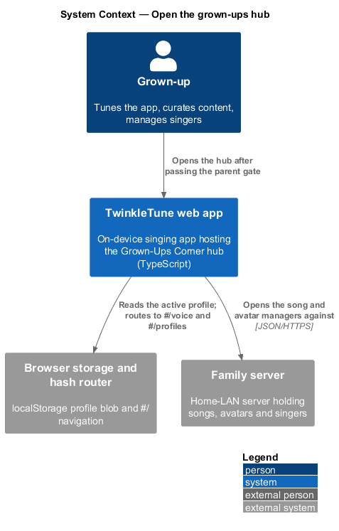
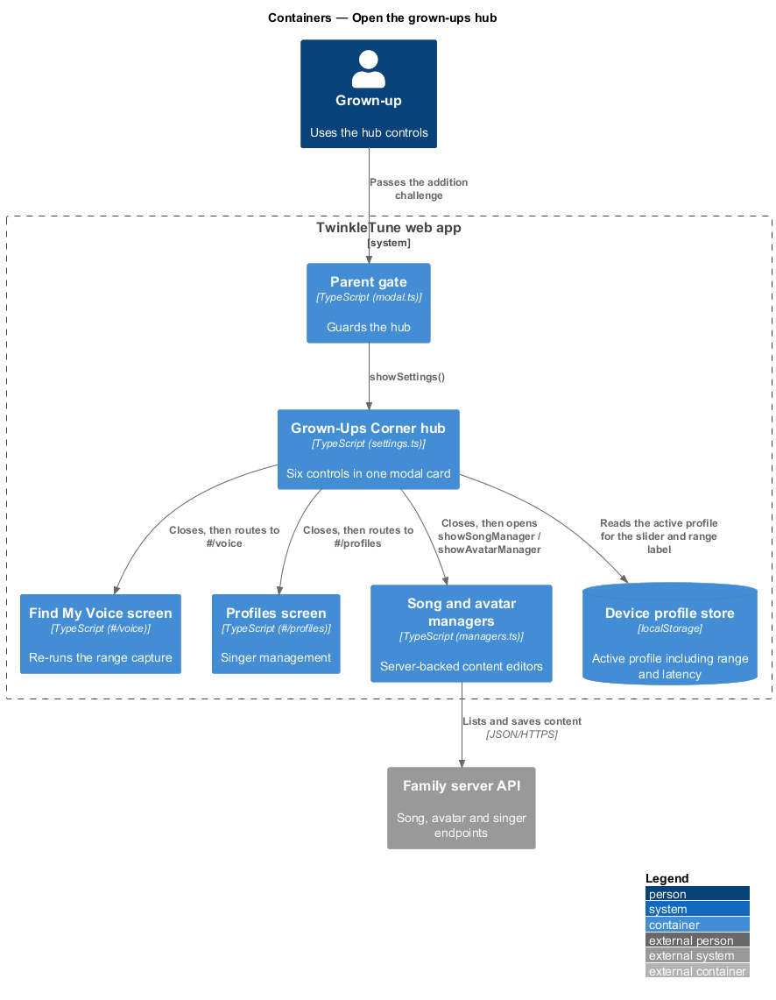
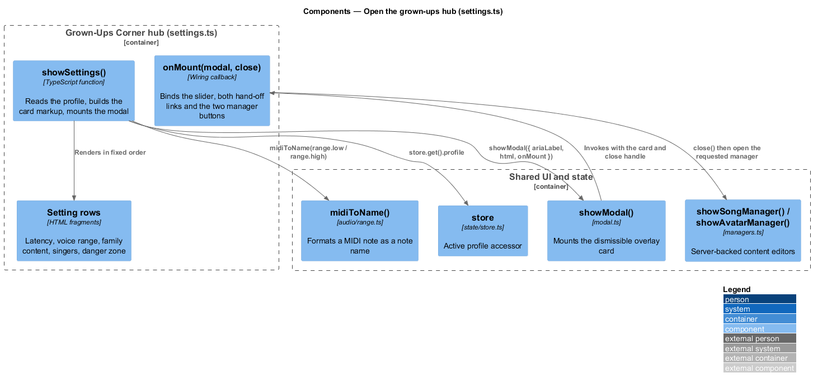
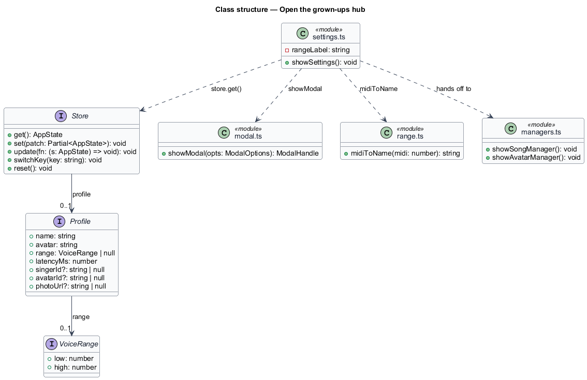
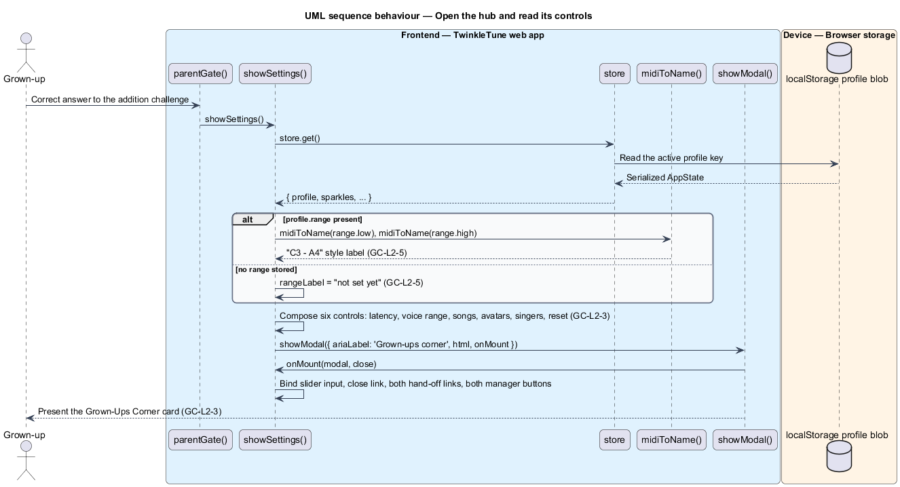
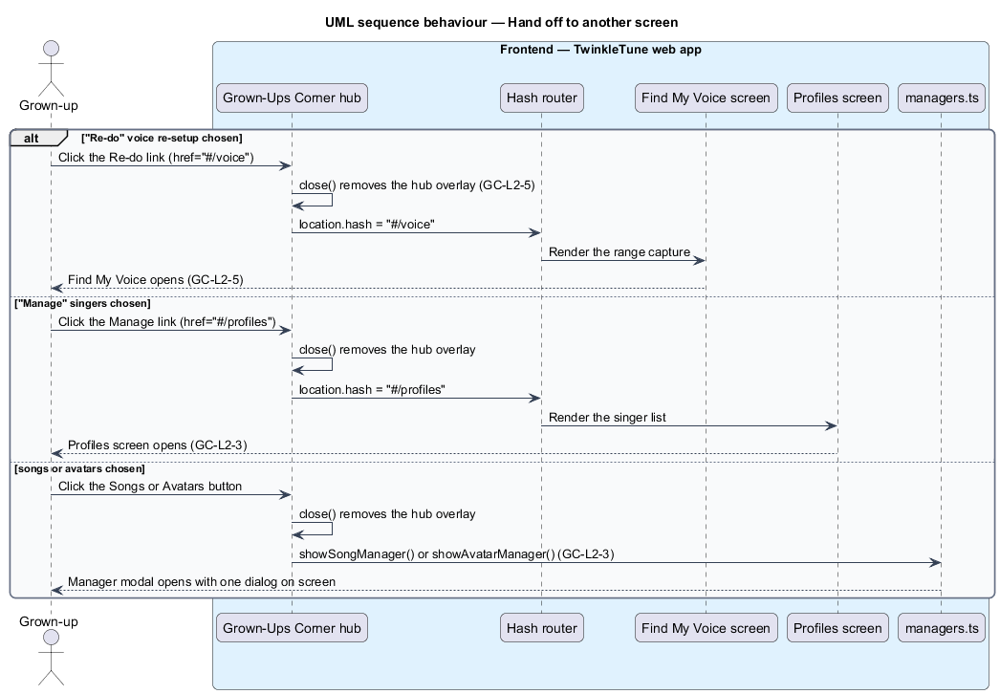

# Open The Grown-Ups Hub

## Overview

Everything a grown-up needs to tune, curate, or clear the app lives in one
modal: the Grown-Ups Corner hub. Gathering device tuning, content management,
profile management, and reset into a single card keeps a parent from hunting
through child-facing screens, and keeps grown-up controls off those screens
entirely. The hub opens only from the parent gate, and every control it holds
either changes device-local state or hands off to another screen or manager.

The terms below are used throughout.

- settings hub — modal card presenting every grown-up control in one place,
  opened as the parent gate's guarded action
- setting row — layout unit pairing a label, an optional sub-label, and one
  control
- danger zone — hub region holding the "start everything over" reset, styled
  apart from the ordinary rows
- voice re-setup shortcut — link that closes the hub and routes to the
  "Find My Voice" screen
- voice range label — rendered low and high note names of the active profile's
  stored range, or "not set yet" when no range exists
- hand-off — hub control that closes the modal before opening another screen or
  manager, so two dialogs never stack

The hub owns its composition and the two links that leave it. The latency
slider, the song and avatar managers, the reset confirmation, and the privacy
copy each have their own feature; this one covers the container that holds them.

## Description

The feature is a frontend-only slice in `frontend/apps/game/src/ui/settings.ts`, using the
modal host from `ui/modal.ts`, the range formatter from `audio/range.ts`, and the
two manager entry points from `ui/managers.ts`.

- **`showSettings(): void`** — the single exported function of `settings.ts`. It
  reads `store.get()` once for the active profile, formats the voice range
  label, and mounts one modal with `ariaLabel: 'Grown-ups corner'`.
- **`rangeLabel`** — computed as
  `` `${midiToName(profile.range.low)} – ${midiToName(profile.range.high)}` ``
  when `profile.range` is present, and the literal `not set yet` otherwise.
- **`midiToName(midi)`** — helper from `frontend/packages/audio-engine/src/range.ts` that renders
  a MIDI note number as a note name.
- **hub composition** — five `.setting-row` blocks plus the danger-zone button,
  in fixed order: mic timing offset (`[data-latency]` with
  `[data-latency-label]`), voice range with the "Re-do" link
  (`[data-close-link]`), family content with `[data-songs-mgr]` and
  `[data-avatars-mgr]`, singers with the "Manage" link (`[data-close-link2]`),
  and the reset button (`[data-reset]`). A `[data-close]` link closes the hub.
- **`onMount(modal, close)`** — the wiring callback. It binds `input` on the
  latency slider, `click` on `[data-close]`, and `click` on both hand-off links
  so the hub closes as navigation starts.
- **manager hand-off** — `[data-songs-mgr]` calls `close()` then
  `showSongManager()`; `[data-avatars-mgr]` calls `close()` then
  `showAvatarManager()`. Closing first keeps one modal on screen at a time.
- **voice re-setup shortcut** — the "Re-do" control is an `<a>` with
  `href="#/voice"`, so the hash router navigates while the click listener closes
  the hub. Its sub-label shows `rangeLabel`.
- **profiles shortcut** — the "Manage" control is an `<a>` with
  `href="#/profiles"`, wired to the same close-on-click behaviour.
- **`store`** — the app store from `frontend/apps/game/src/state/store.ts`. `showSettings`
  reads `store.get().profile` for the slider value and the range label.
- **`showModal` / `ModalHandle`** — modal host from `ui/modal.ts`; the hub is
  dismissible, so a backdrop click also closes it.

## Requirements

The feature realizes the following level-2 (L2) requirements. Each L2 requirement
refines a level-1 (L1) requirement, cited by identifier.

| L2 ID | Refines (L1) | Requirement |
|-------|--------------|-------------|
| `GC-L2-3` | `GC-L1-2` | The settings hub shall present, in one place: the microphone timing offset, a voice re-setup shortcut, the song and avatar managers, a profiles-management shortcut, and a danger-zone reset, alongside the privacy disclosure. |
| `GC-L2-5` | `GC-L1-2` | The hub shall offer a shortcut to re-run "Find My Voice", showing the current range. |

## Diagrams

### System context

The grown-up reaches the hub through the web app after the parent gate; the hub
itself touches the device profile and, through its managers, the family server
(`GC-L2-3`).

### Containers

The hub sits between the parent gate and the four destinations it hands off to:
the voice-setup screen, the profiles screen, and the song and avatar managers
(`GC-L2-3`, `GC-L2-5`).

### Components

`showSettings` reads the active profile from the store, formats the range label
through `midiToName`, and mounts the card through `showModal`, whose `onMount`
callback binds each control (`GC-L2-3`).

### Class structure

`settings.ts` depends on the modal host, the store, the range formatter, and the
two manager entry points; the hub's controls map one-to-one onto those
dependencies (`GC-L2-3`, `GC-L2-5`).

### Behaviour — open the hub and read its controls

`showSettings` reads the profile once, derives the range label, and renders all
six controls in one card (`GC-L2-3`), with the voice range row showing the stored
range beside its "Re-do" link (`GC-L2-5`).

### Behaviour — hand off to another screen

Each hand-off closes the hub before its destination opens: the "Re-do" link
routes to `#/voice` (`GC-L2-5`), the "Manage" link routes to `#/profiles`, and
the two manager buttons open their managers (`GC-L2-3`).

