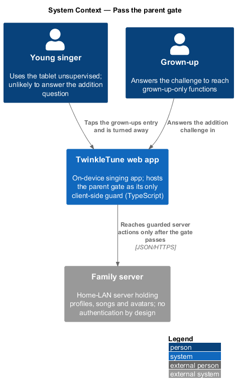
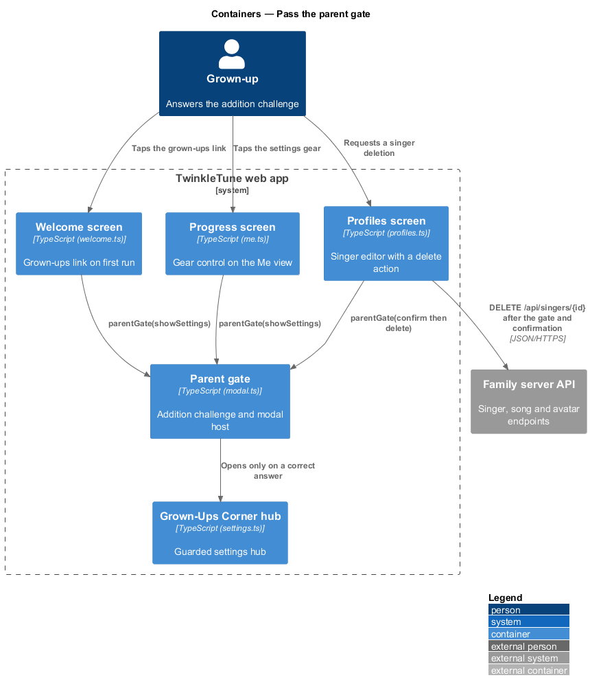
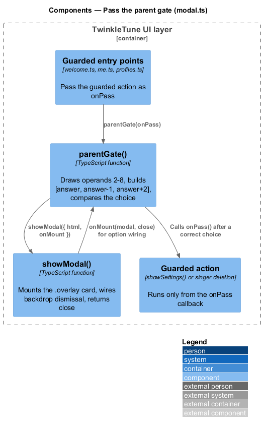
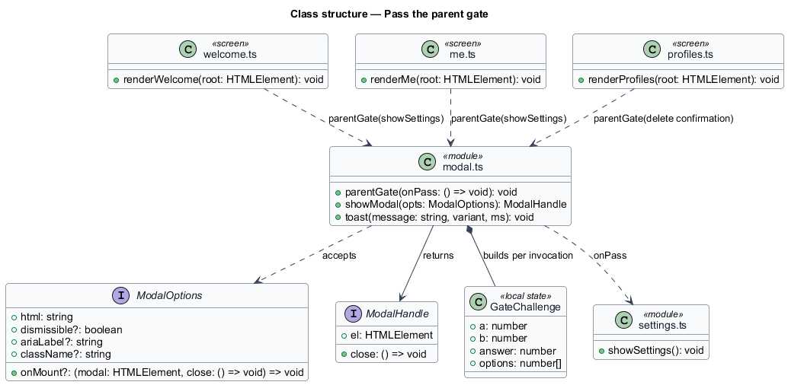
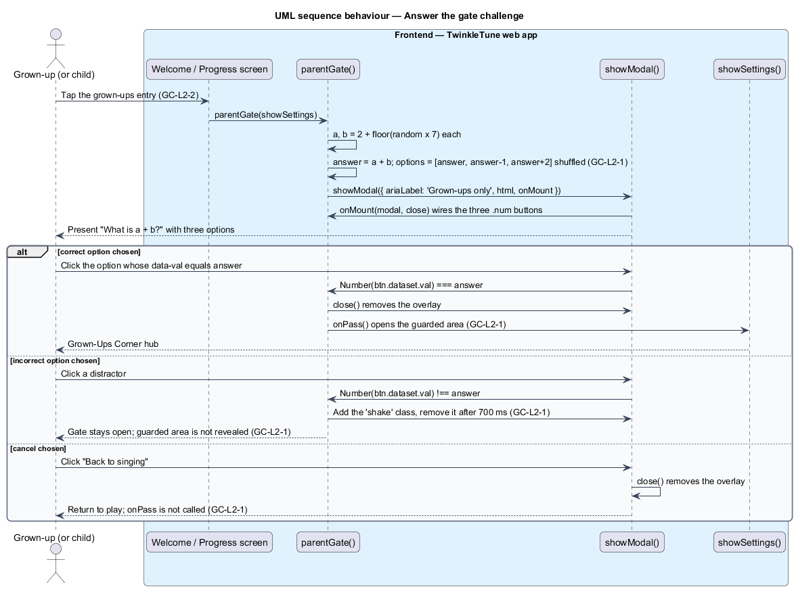
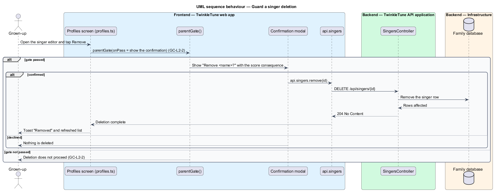

# Pass The Parent Gate

## Overview

TwinkleTune runs on a family tablet that a child holds unsupervised. Some
actions on that tablet belong to a grown-up: opening the settings hub, editing
the songbook, removing a singer. The parent gate is the challenge that stands in
front of those actions. It asks a single-digit addition question and offers
three answers, so a reader who cannot yet add is turned away without being told
off. The family server has no authentication by design (principle P4), so this
client-side challenge is the product's only guard, and its limits are stated
plainly: it resists a curious child, not an adversary.

The terms below are used throughout.

- parent gate — modal challenge posing a single-digit addition question, shown
  before a grown-up-only action proceeds
- guarded action — operation that runs only after the gate is passed, passed in
  as the gate's `onPass` callback
- gate option — one of three answer buttons offered for the question, one
  correct and two incorrect
- distractor — incorrect gate option, generated as one below and two above the
  correct sum
- shake feedback — brief animation applied to a wrongly chosen option, leaving
  the gate open
- guarded area — settings hub and the destructive actions behind it, never
  rendered until the gate passes

The gate covers the challenge itself and its placement on entry points. What
happens after the gate passes — the hub layout, the song editor, singer deletion
— belongs to the features that own those screens.

## Description

The feature is a frontend-only slice. `frontend/apps/game/src/ui/modal.ts` holds the gate;
three screens under `frontend/apps/game/src/screens/` place it in front of their guarded
actions. No server participates, and no state is persisted.

- **`parentGate(onPass: () => void): void`** — function in `modal.ts` that draws
  one operand pair, builds the option set, shows the modal, and calls `onPass`
  exactly once, after the modal closes on a correct choice. It returns
  immediately; the outcome arrives through the callback.
- **operand generation** — `a` and `b` are each computed as
  `2 + Math.floor(Math.random() * 7)`, giving an integer in 2 to 8 inclusive.
  `answer` is `a + b`, so the sum lies in 4 to 16.
- **option set** — `[answer, answer - 1, answer + 2]` shuffled by
  `sort(() => Math.random() - 0.5)`, rendered as three `button.num` elements
  carrying `data-val`. The distractors sit adjacent to the answer, so guessing by
  magnitude does not help.
- **choice handling** — the click listener compares `Number(btn.dataset.val)`
  with `answer`. On a match it calls `close()` then `onPass()`. On a mismatch it
  adds the `shake` class and removes it after 700 ms, leaving the modal mounted
  and `onPass` uncalled.
- **cancel path** — the `[data-close]` button labelled "Back to singing" calls
  `close()` only. Backdrop dismissal also applies, since the gate uses the
  default `dismissible` behaviour of `showModal`.
- **`showModal(opts: ModalOptions): ModalHandle`** — modal host in `modal.ts`.
  It appends an `.overlay` element carrying a `.modal` card with
  `role="dialog"`, wires backdrop dismissal unless `dismissible` is `false`, and
  invokes `onMount(modal, close)` so the caller can attach listeners. `close()`
  removes the overlay from the document.
- **`ModalHandle`** — returned record with `el` (the card element) and `close`.
- **welcome entry point** — `frontend/apps/game/src/screens/welcome.ts` binds
  `[data-grownups]` to `parentGate(showSettings)`.
- **progress entry point** — `frontend/apps/game/src/screens/me.ts` binds the gear control
  `[data-settings]` to `parentGate(showSettings)`.
- **deletion entry point** — `frontend/apps/game/src/screens/profiles.ts` binds
  `[data-delete]` in the singer editor to `parentGate(...)`; the callback opens
  the "Remove <name>?" confirmation, and only its `[data-yes]` button calls
  `api.singers.remove`.

Constants (the shipped baseline): operands in 2 to 8, option offsets `-1` and
`+2`, shake duration 700 ms, three options per challenge.

## Requirements

The feature realizes the following level-2 (L2) requirements. Each L2 requirement
refines a level-1 (L1) requirement, cited by identifier.

| L2 ID | Refines (L1) | Requirement |
|-------|--------------|-------------|
| `GC-L2-1` | `GC-L1-1` | The parent gate shall pose a single-digit addition question with three answer options (one correct, two incorrect); a correct choice shall proceed to the guarded action, a wrong choice shall give gentle feedback and keep the gate closed, and a cancel option shall return to play. |
| `GC-L2-2` | `GC-L1-1` | Opening the settings hub and deleting a singer shall each require passing the parent gate first. |

## Diagrams

### System context

A child and a grown-up share one tablet. The gate stands between the child-facing
screens and the grown-up-only functions, and no other system takes part
(`GC-L2-1`).

### Containers

The welcome screen, the progress screen, and the profiles screen each call the
gate before their guarded action, and only the guarded action reaches the family
server (`GC-L2-2`).

### Components

Inside `modal.ts`, `parentGate` composes the challenge and hands the markup to
`showModal`, which mounts the overlay and returns a `close` handle; the guarded
action is held as the `onPass` callback until a correct option is chosen
(`GC-L2-1`).

### Class structure

`parentGate` depends on `showModal` and its `ModalOptions` and `ModalHandle`
types, and holds the `onPass` callback that names the guarded action
(`GC-L2-1`, `GC-L2-2`).

### Behaviour — answer the gate challenge

The gate draws two operands in 2 to 8, shuffles the answer with its two
distractors, and branches on the choice: correct closes and runs the guarded
action, incorrect shakes for 700 ms and leaves the gate open, and cancel returns
to play (`GC-L2-1`).

### Behaviour — guard a singer deletion

Singer deletion sits behind the gate and behind a second confirmation, so the
`DELETE /api/singers/{id}` call is reached only after both are passed
(`GC-L2-2`).

