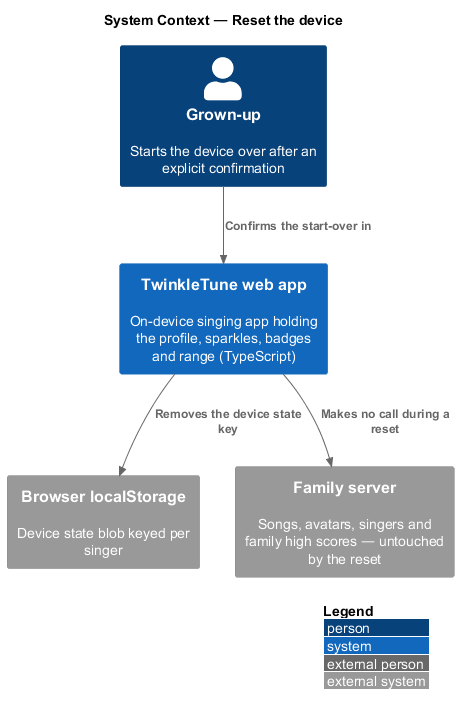
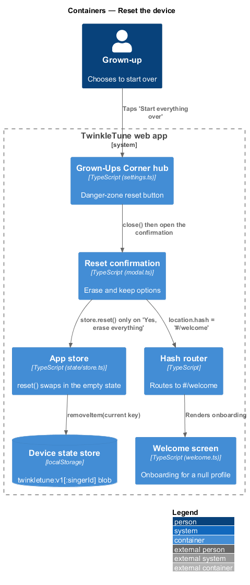
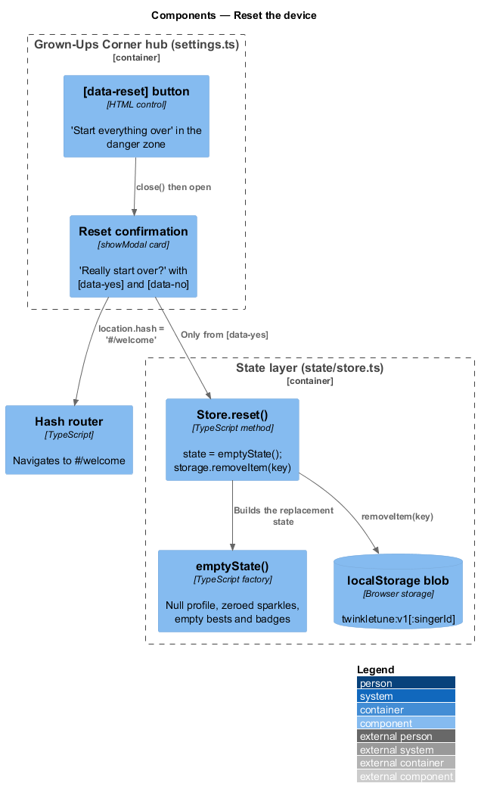
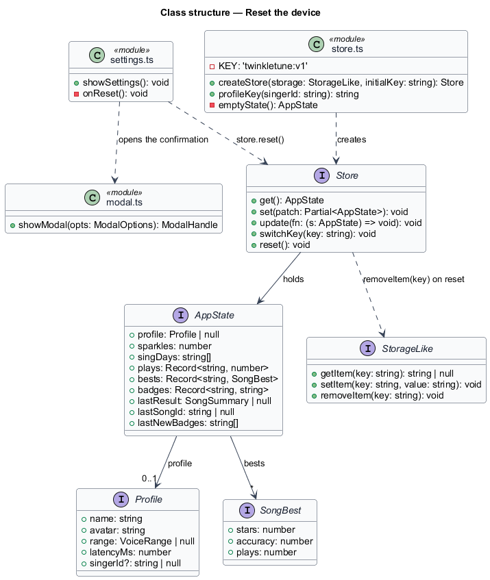
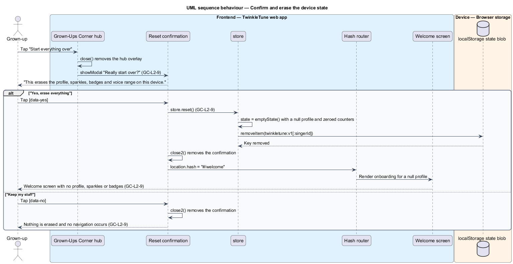

# Reset The Device

## Overview

A tablet gets handed on, a family starts again, or a profile is set up wrongly
and is easier to rebuild than to repair. The danger zone at the foot of the
Grown-Ups Corner covers those cases with a single action that clears the device's
own state and returns the app to onboarding.

The action is destructive and cannot be undone from inside the app, so it is
guarded twice: the parent gate stands in front of the hub, and an explicit
confirmation stands in front of the erase. The confirmation names what goes —
profile, sparkles, badges, and voice range — and its decline path leaves
everything untouched. Only device-local state is erased; songs, avatars, singers,
and family high scores live on the family server and survive the reset.

The terms below are used throughout.

- danger zone — hub region holding the destructive reset, styled apart from the
  ordinary setting rows
- reset confirmation — second modal that names the consequence and offers an
  erase option and a keep option
- device state — profile, sparkles, sing days, plays, per-song bests, badges, and
  last-result fields held in the browser's storage blob
- empty state — freshly constructed `AppState` with a null profile and zeroed
  counters, the value the store holds after a reset
- onboarding — welcome screen the app returns to once no profile exists

The reset covers the device's own blob. Server-owned content is out of scope,
and its survival is what the confirmation copy is careful not to overstate.

## Description

The slice spans the hub in `frontend/apps/game/src/ui/settings.ts`, the store in
`frontend/apps/game/src/state/store.ts`, and the hash router's welcome route. No server
call takes part.

- **`[data-reset]` button** — the danger-zone control labelled "Start everything
  over 🗑️". Its handler calls `close()` on the hub first, then opens the
  confirmation, so a single modal stays on screen.
- **reset confirmation modal** — `showModal` with `ariaLabel: 'Confirm reset'`,
  the heading "Really start over?", and the body "This erases the profile,
  sparkles, badges and voice range on this device." It offers `[data-yes]`
  ("Yes, erase everything") and `[data-no]` ("Keep my stuff").
- **decline path** — `[data-no]` calls `close2()` only. No store call is made and
  no navigation occurs.
- **erase path** — `[data-yes]` calls `store.reset()`, then `close2()`, then sets
  `location.hash = '#/welcome'`.
- **`Store.reset(): void`** — implementation in `createStore`. It assigns
  `state = emptyState()` and calls `storage.removeItem(key)`, so both the
  in-memory state and the persisted blob are cleared in one step.
- **`emptyState()`** — factory returning `profile: null`, `sparkles: 0`,
  `singDays: []`, `plays: {}`, `bests: {}`, `badges: {}`, `lastResult: null`,
  `lastSongId: null`, and `lastNewBadges: []`.
- **storage key** — `reset()` removes the key the store is currently pointed at:
  `twinkletune:v1` for a local-only profile, or
  `` `twinkletune:v1:${singerId}` `` once `switchKey` has namespaced the store to
  a server singer. The separate `twinkletune:active-singer` pointer is not
  removed by `reset()`.
- **`StorageLike.removeItem(key)`** — the storage port the store writes through;
  the shipped binding is the browser's `localStorage`, with an in-memory map used
  where `localStorage` is absent.
- **return to onboarding** — `location.hash = '#/welcome'` routes to the welcome
  screen, which builds a fresh profile because `store.get().profile` is now
  `null`.

## Requirements

The feature realizes the following level-2 (L2) requirements. Each L2 requirement
refines a level-1 (L1) requirement, cited by identifier.

| L2 ID | Refines (L1) | Requirement |
|-------|--------------|-------------|
| `GC-L2-9` | `GC-L1-6` | The hub shall offer a "start over" reset that, only after an explicit confirmation, erases the active profile and progress on the device and returns to onboarding; declining shall keep everything. |

## Diagrams

### System context

The grown-up resets the tablet in front of them; the erase touches the device's
own storage only, and the family server's content is untouched (`GC-L2-9`).

### Containers

The hub's danger zone opens a confirmation, whose erase path clears the device
profile store and routes to the welcome screen (`GC-L2-9`).

### Components

`[data-reset]` closes the hub and opens the confirmation; only `[data-yes]`
reaches `store.reset()`, which swaps in the empty state and removes the storage
key (`GC-L2-9`).

### Class structure

`Store.reset` replaces `AppState` with the value from `emptyState()` and removes
the current key through `StorageLike` (`GC-L2-9`).

### Behaviour — confirm and erase the device state

The confirm branch clears both the in-memory state and the persisted blob before
routing to `#/welcome`; the decline branch closes the dialog and leaves every
field in place (`GC-L2-9`).

