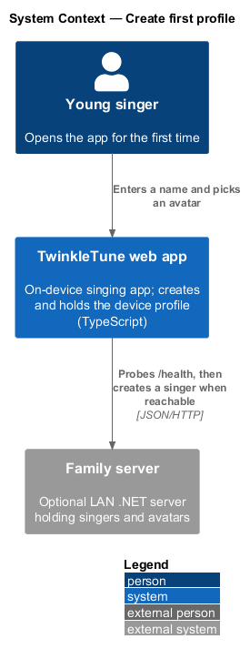
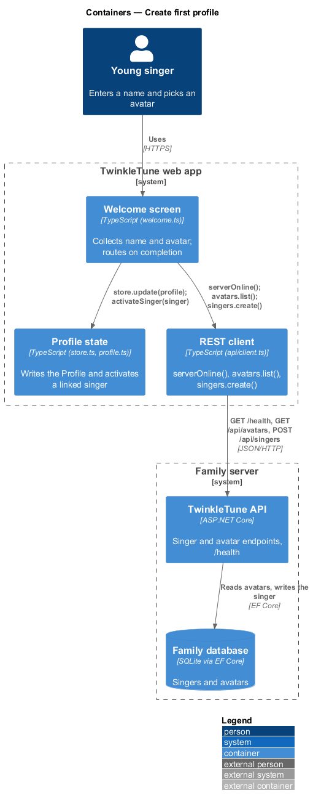
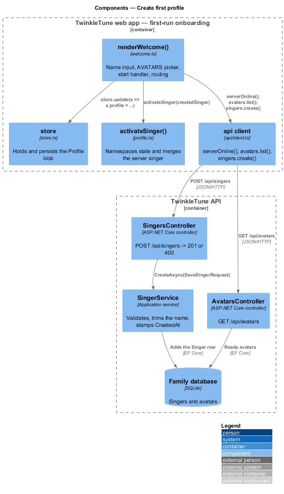
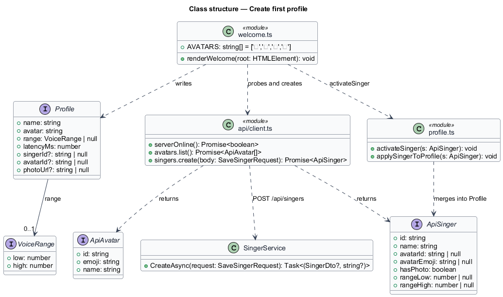
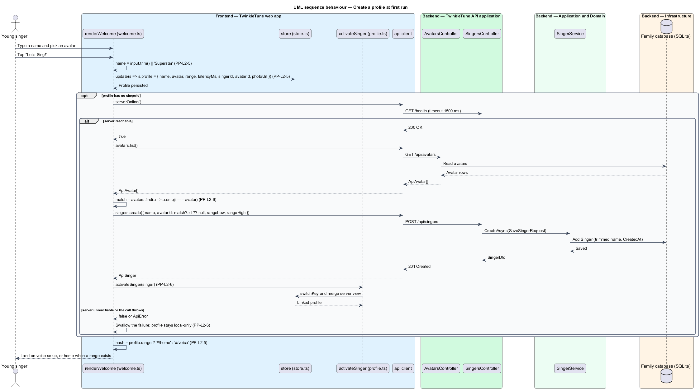

# Create First Profile

## Overview

The first time TwinkleTune opens there is no singer yet. This feature is the
first-run path that turns an anonymous visit into a named singer with an avatar,
and — when the family server answers — into a singer the server also knows about.
It is the entry point of the player-profiles subsystem: every later feature
(namespacing, switching, photos, high scores) reads the profile this feature
writes.

The screen asks for two things and nothing else, in keeping with the kid-first
principle: a name and one of four avatars. Server linking happens behind the
screen and never blocks the child. When the server is absent or the call fails,
onboarding still completes and the profile stays on the device.

- profile — device record of the active singer, holding name, avatar emoji, voice
  range, mic latency, and the optional server ids
- local-only profile — profile whose `singerId` is null, so all of its state lives
  on the device and no server row corresponds to it
- server link — association between a device profile and a server `Singer`,
  carried by the profile's `singerId` and `avatarId`
- reachability probe — cheap `GET /health` request with a 1500 ms timeout whose
  result is cached for 10 s, used to decide whether linking is worth attempting
- default name — the string `Superstar`, substituted when the name field is left
  blank
- voice range — lowest and highest comfortable MIDI notes, captured elsewhere by
  "Find My Voice" and used here only to choose the landing screen

## Description

Frontend — welcome screen (`frontend/src/screens/welcome.ts`):

- **`renderWelcome(root)`** — renders the first-run screen and wires its
  handlers. It pre-fills the name input from any existing profile and pre-selects
  that profile's avatar, falling back to the first entry of `AVATARS`.
- **`AVATARS`** — the module constant `['🦄', '🐱', '🐸', '🦊']`. The four
  buttons carry `data-avatar` and `aria-pressed`; selecting one moves the
  `picked` class and updates the local `avatar` variable.
- **name input** — `#kid-name`, `maxlength="20"`. The start handler reads
  `.value.trim() || 'Superstar'`, so whitespace and emptiness both resolve to the
  default name.
- **start handler** — the `[data-go]` click listener. It writes the profile
  through `store.update`, carrying forward the previous `range`, `latencyMs`,
  `singerId`, `avatarId`, and `photoUrl`, then attempts the server link, then
  routes.
- **routing** — `location.hash` becomes `#/home` when the profile already has a
  range and `#/voice` otherwise, so a new singer lands in "Find My Voice".
- **grown-ups link** — `[data-grownups]` calls `parentGate(showSettings)`, and a
  quiet link points at `#/profiles`.

Frontend — profile state (`frontend/src/state/store.ts`,
`frontend/src/state/profile.ts`):

- **`Profile`** — interface with `name`, `avatar`, `range: VoiceRange | null`,
  `latencyMs`, and the optional `singerId`, `avatarId`, and `photoUrl`.
- **`store.update(fn)`** — mutates the active state blob and persists it under the
  current storage key.
- **`activateSinger(s: ApiSinger)`** — adopts any legacy blob, records the active
  singer id, switches the store namespace, and merges the server view into the
  profile.

Frontend — REST client (`frontend/src/api/client.ts`):

- **`serverOnline()`** — probes `${API_URL}/health` with
  `AbortSignal.timeout(1500)`, returns `false` on any throw, and caches the answer
  for `10_000` ms in the module-level `onlineCheck`.
- **`api.avatars.list()`** — `GET /api/avatars`, returning `ApiAvatar[]` with
  `id`, `emoji`, and `name`.
- **`api.singers.create(body)`** — `POST /api/singers` with `name`, `avatarId`,
  `rangeLow`, and `rangeHigh`, returning the created `ApiSinger`.

Backend — Family Server:

- **`SingersController.Create`** — `POST /api/singers`, returning `201 Created`
  with the stored singer or `400 Bad Request` carrying `{ error }`.
- **`SingerService.CreateAsync`** — validates, assigns a new `Guid`, trims the
  name, and stamps `CreatedAt` from the injected `TimeProvider`.

The avatar match is by emoji: the handler reads the server avatar list and picks
`avatars.find(a => a.emoji === avatar)`, sending `match?.id ?? null` as the
`avatarId`. Any throw inside the linking block is swallowed, leaving a local-only
profile.

## Requirements

The feature realizes the following level-2 (L2) requirements. Each L2 requirement
refines a level-1 (L1) requirement, cited by identifier.

| L2 ID | Refines (L1) | Requirement |
|-------|--------------|-------------|
| `PP-L2-5` | `PP-L1-3` | The welcome screen shall collect a name and a chosen avatar and create a profile; a blank name shall default to "Superstar"; after creation it shall route to voice setup, or to home when a range already exists. |
| `PP-L2-6` | `PP-L1-3` | On creating a profile with no server link, the system shall create a corresponding server singer — matching the chosen avatar by emoji — and activate it when the server is reachable; any failure shall leave the profile local-only without surfacing an error, and play shall continue either way. |

## Diagrams

### System context

The young singer enters a name and picks an avatar in the web app; the app
contacts the optional family server only to create a matching singer, and
completes onboarding whether or not the server answers (`PP-L2-6`).

### Containers

The welcome screen writes the profile into the device store and calls the REST
client, which probes reachability before touching the singer and avatar endpoints
(`PP-L2-5`, `PP-L2-6`).

### Components

`renderWelcome()` applies the blank-name default and the avatar choice, then
hands the created `ApiSinger` to `activateSinger()`; `SingerService.CreateAsync`
trims the name and stamps the creation time on the server side (`PP-L2-5`,
`PP-L2-6`).

### Class structure

The device-side `Profile` and the server-side `SingerDto` overlap on name,
avatar, and range; `singerId` and `avatarId` are the fields that record the link.

### Behaviour — create a profile at first run

The start handler resolves the name (`PP-L2-5`), writes the profile, and probes
the server. The `alt` shows the two linking outcomes required by `PP-L2-6`: a
created and activated server singer, or a silently retained local-only profile.
The closing step picks the landing screen from the presence of a range
(`PP-L2-5`).

