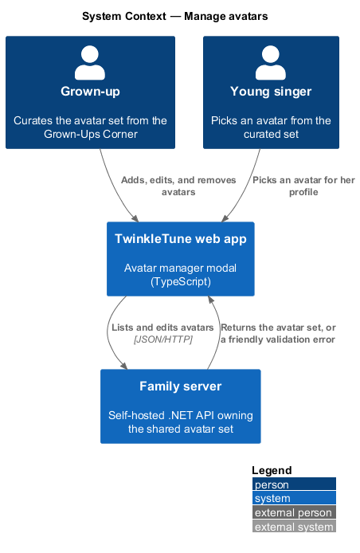
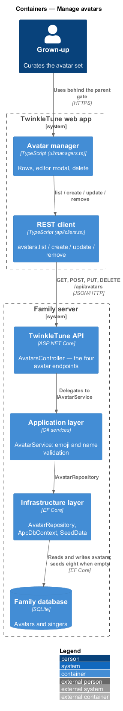
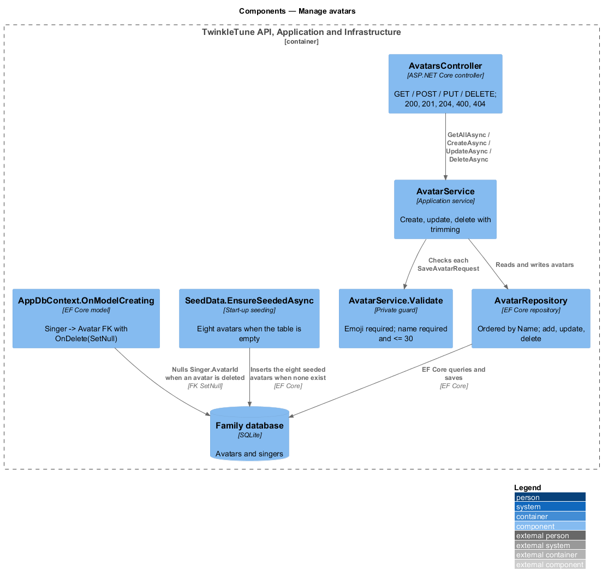
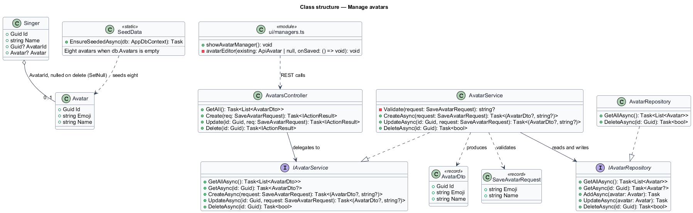
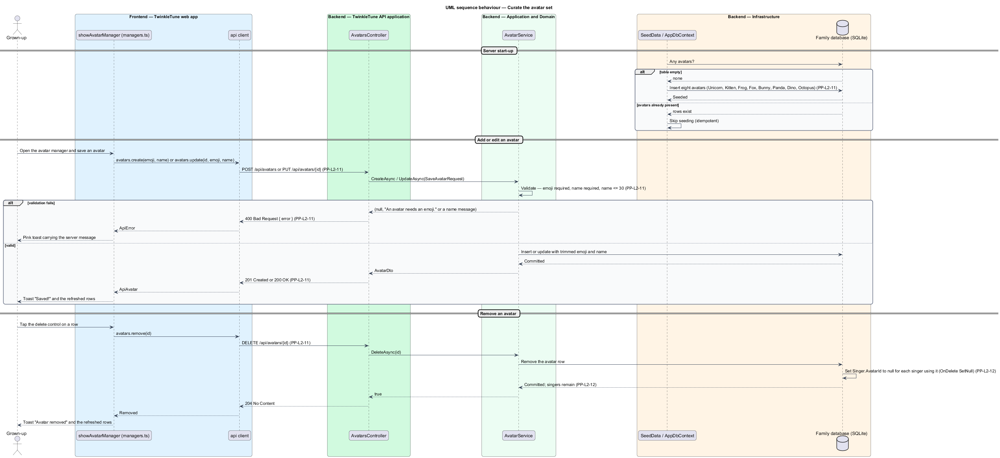

# Manage Avatars

## Overview

An avatar is the friendly face a child picks for herself: an emoji and a name,
such as 🦄 Unicorn. Avatars are shared, not private — one curated set on the
family server that every singer chooses from — which keeps identity choices safe
and consistent, and lets a grown-up decide what the set contains.

This feature is the avatar lifecycle: the eight avatars a fresh server seeds, the
four REST endpoints, the two validation rules, the grown-ups' manager that drives
them, and the deletion rule that detaches an avatar from its singers instead of
removing the singers. The singer-side pick of an avatar belongs to the
manage-server-singers feature.

- avatar — reusable identity holding one emoji and one friendly name, shared by
  every singer on the family server
- seeded avatar — one of the eight avatars a fresh server creates when the avatar
  table is empty
- avatar manager — grown-ups-only modal listing avatars with edit and delete
  controls
- detach on delete — foreign-key rule that nulls a singer's avatar reference when
  the avatar is removed, leaving the singer intact
- idempotent seeding — seeding that runs only when the table is empty, so a
  restart never duplicates the set

## Description

Backend — Domain (`backend/src/TwinkleTune.Domain/Entities/Avatar.cs`):

- **`Avatar`** — entity with `Guid Id`, `required string Emoji`, and
  `required string Name`.

Backend — Application (`.../Services/AvatarService.cs`, `Dtos.cs`, `Mapping.cs`):

- **`AvatarDto`** — record `(Guid Id, string Emoji, string Name)`.
- **`SaveAvatarRequest`** — record `(string Emoji, string Name)`.
- **`AvatarService.Validate(request)`** — returns the first broken rule, or
  `null`: `"An avatar needs an emoji."` for a blank or whitespace emoji,
  `"An avatar needs a name."` for a blank name, and
  `"Avatar name is too long (max 30 characters)."` above 30 characters.
- **`CreateAsync`** — validates, then adds an `Avatar` with `Guid.NewGuid()` and
  both fields trimmed.
- **`UpdateAsync`** — validates, loads by id, returns `(null, null)` when the
  avatar is absent — a case the endpoint maps to `404` — and otherwise assigns the
  trimmed emoji and name and saves.
- **`DeleteAsync`** — delegates straight to `IAvatarRepository.DeleteAsync`,
  which returns `false` for an unknown id.
- **`Avatar.ToDto()`** — maps `(a.Id, a.Emoji, a.Name)`.

Backend — API (`.../Controllers/AvatarsController.cs`):

- **`GetAll`** — `GET /api/avatars`, returning `List<AvatarDto>`.
- **`Create`** — `POST /api/avatars`, returning `400 Bad Request` with
  `{ error }` on a validation failure and `201 Created` at `/api/avatars/{id}`
  otherwise.
- **`Update`** — `PUT /api/avatars/{id:guid}`, returning `400`, `404`, or
  `200 OK`.
- **`Delete`** — `DELETE /api/avatars/{id:guid}`, returning `204 No Content` or
  `404`.

Backend — Infrastructure (`.../Persistence/SeedData.cs`,
`.../Persistence/AppDbContext.cs`, `.../Repositories/Repositories.cs`):

- **`SeedData.EnsureSeededAsync`** — when `db.Avatars` holds no rows, adds the
  eight seeded avatars — 🦄 Unicorn, 🐱 Kitten, 🐸 Frog, 🦊 Fox, 🐰 Bunny,
  🐼 Panda, 🦖 Dino, 🐙 Octopus — and saves. The emptiness check is what makes
  seeding idempotent across restarts.
- **`AppDbContext.OnModelCreating`** — caps `Avatar.Emoji` at 16 characters and
  `Avatar.Name` at 30, and configures the `Singer` → `Avatar` relationship with
  `.HasForeignKey(s => s.AvatarId).OnDelete(DeleteBehavior.SetNull)`, which is
  the detach-on-delete rule.
- **`AvatarRepository.GetAllAsync`** — reads `AsNoTracking()` ordered by
  `a.Name`.

Frontend — avatar manager (`frontend/src/ui/managers.ts`):

- **`showAvatarManager()`** — the Grown-Ups Corner modal. `refresh()` loads
  `api.avatars.list()` and renders one `.mgr-row` per avatar with its emoji, its
  name, an edit button, and a delete button; a failed load renders
  `The family server is not reachable 📡` in place of the rows. Deleting calls
  `api.avatars.remove(id)`, toasts `Avatar removed 💙`, and refreshes.
- **`avatarEditor(existing, onSaved)`** — the create-and-edit modal with an emoji
  field (`maxlength="4"`) and a name field (`maxlength="30"`). It calls
  `api.avatars.update(id, emoji, name)` or `api.avatars.create(emoji, name)` and
  shows a thrown error's message as a pink toast, so the server's friendly
  validation text reaches the grown-up unchanged.

## Requirements

The feature realizes the following level-2 (L2) requirements. Each L2 requirement
refines a level-1 (L1) requirement, cited by identifier.

| L2 ID | Refines (L1) | Requirement |
|-------|--------------|-------------|
| `PP-L2-11` | `PP-L1-4` | The server shall expose `GET /api/avatars`, `POST /api/avatars`, `PUT /api/avatars/{id}`, and `DELETE /api/avatars/{id}`, validating that an avatar has a non-empty emoji and a non-empty name of at most 30 characters; a fresh server shall seed eight avatars. |
| `PP-L2-12` | `PP-L1-4` | Deleting an avatar shall set the avatar reference of any singer using it to null, rather than deleting the singer. |

## Diagrams

### System context

A grown-up curates the avatar set from the web app; the family server owns the
set and seeds eight avatars on a fresh install (`PP-L2-11`).

### Containers

The avatar manager in the Grown-Ups Corner calls the avatar endpoints, and the
seeding step populates the database when the avatar table is empty (`PP-L2-11`).

### Components

`AvatarsController` maps the status codes, `AvatarService.Validate` carries the
emoji and name rules, `SeedData` fills an empty table, and the `Singer` → `Avatar`
foreign key is configured to null the reference on delete (`PP-L2-11`,
`PP-L2-12`).

### Class structure

`Avatar`, its `AvatarDto` projection, and the `SetNull` association from `Singer`
that keeps a singer alive when her avatar is removed (`PP-L2-12`).

### Behaviour — curate the avatar set

Seeding fills an empty table with eight avatars, the `alt` shows the two
validation rejections of `PP-L2-11`, and deletion nulls each using singer's
`AvatarId` while leaving the singer in place (`PP-L2-12`).

