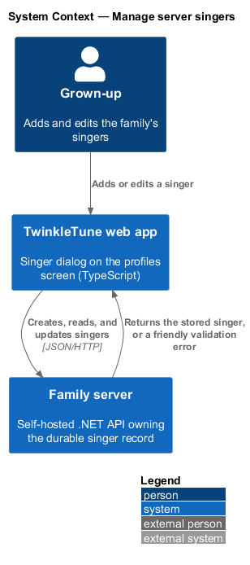
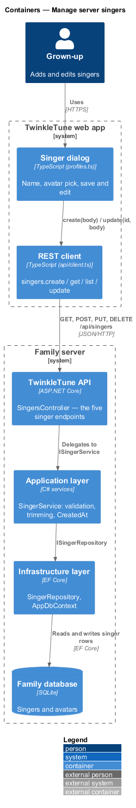
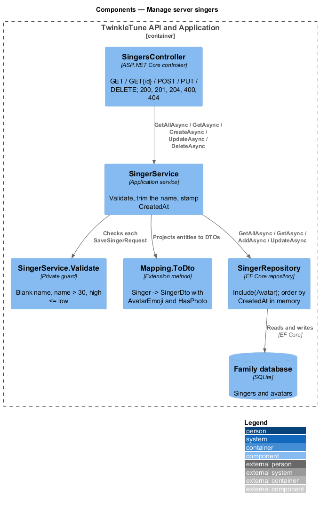
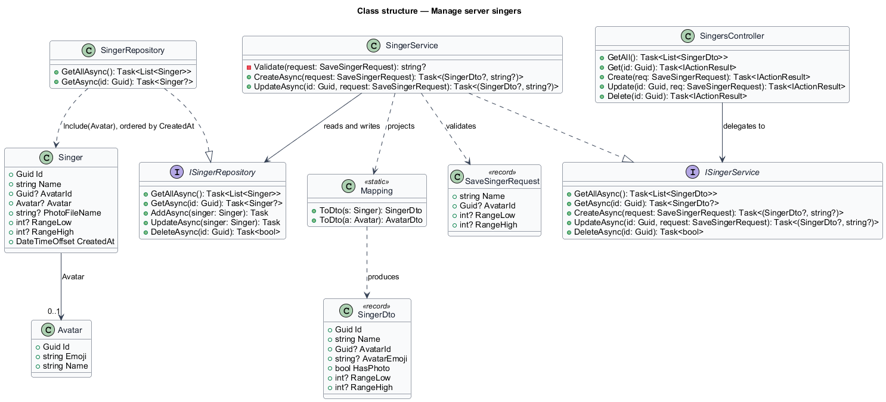
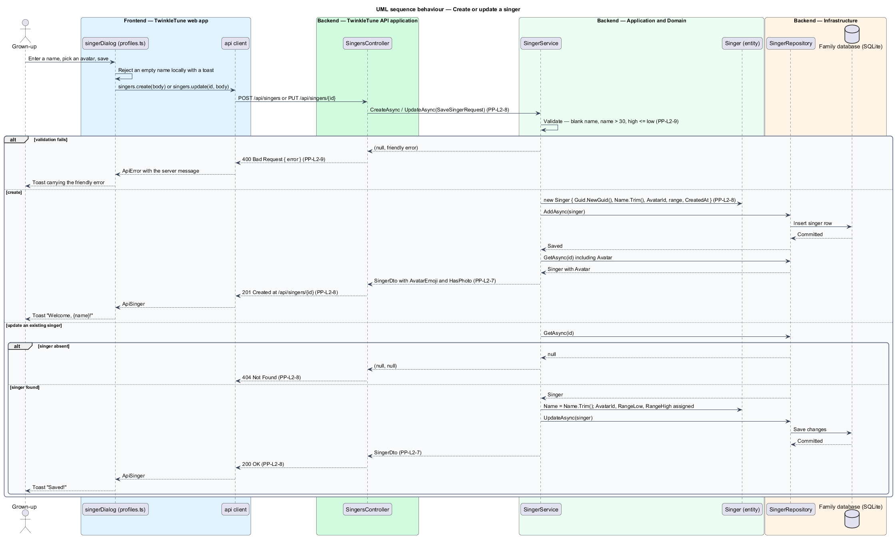
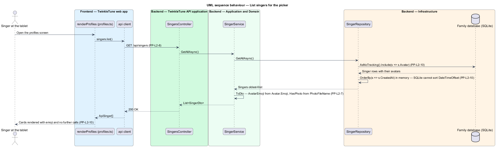

# Manage Server Singers

## Overview

The family server is what lets a singer follow her family across devices. Its
`Singer` row is the durable identity behind a device profile: it carries the
name, the chosen avatar, the captured voice range, and the file name of any
uploaded photo, and its id is the key that per-singer state, high scores, and
duet results hang from.

This feature is the server-side lifecycle of that row — the entity, the DTO it is
exposed as, the five REST endpoints, the validation every write passes, and the
ordering the list is returned in — together with the profiles-screen dialog that
drives create and update from the device. Deletion is covered separately by the
remove-singer feature.

- singer — server-side record of a family member who sings, holding identity and
  voice range but not device-specific settings
- singer DTO — outward projection of a singer, flattening the avatar to an id and
  an emoji and reducing the photo to a boolean
- save request — inbound body `SaveSingerRequest(Name, AvatarId, RangeLow,
  RangeHigh)`, shared by create and update
- friendly error — short, plain-language sentence returned in `{ error }` and
  shown to a grown-up as a toast
- creation ordering — listing singers oldest-first by `CreatedAt`, so the picker
  is stable as singers are added
- eager avatar include — loading each singer's `Avatar` with the singer, so the
  picker renders emoji without a second call

## Description

Backend — Domain (`backend/src/TwinkleTune.Domain/Entities/Singer.cs`):

- **`Singer`** — entity with `Guid Id`, `required string Name`, `Guid? AvatarId`,
  `Avatar? Avatar`, `string? PhotoFileName`, `int? RangeLow`, `int? RangeHigh`,
  and `DateTimeOffset CreatedAt`. Its comment records the division of ownership:
  the voice range belongs to the person and follows her across devices, while mic
  latency belongs to the device and is not stored here.
- **`Avatar`** — entity with `Guid Id`, `required string Emoji`, and
  `required string Name`.

Backend — Application (`.../Dtos/Dtos.cs`, `Mapping.cs`,
`Services/SingerService.cs`):

- **`SingerDto`** — record `(Guid Id, string Name, Guid? AvatarId,
  string? AvatarEmoji, bool HasPhoto, int? RangeLow, int? RangeHigh)`.
- **`SaveSingerRequest`** — record `(string Name, Guid? AvatarId, int? RangeLow,
  int? RangeHigh)`.
- **`Singer.ToDto()`** — maps the entity to the DTO, projecting `s.Avatar?.Emoji`
  and `s.PhotoFileName is not null` into `AvatarEmoji` and `HasPhoto`.
- **`SingerService.Validate(request)`** — returns the first broken rule as a
  string, or `null`: `"Every singer needs a name."` for a blank or whitespace
  name, `"Name is too long (max 30 characters)."` above 30 characters, and
  `"The high note must be above the low note."` when both range ends are present
  and `high <= low`.
- **`CreateAsync`** — validates, then builds a `Singer` with `Guid.NewGuid()`, a
  trimmed `Name`, the request's `AvatarId` and range, and `CreatedAt` from the
  injected `TimeProvider`, adds it, and returns the re-read DTO.
- **`UpdateAsync`** — validates, loads by id, returns `(null, null)` when the
  singer is absent, otherwise assigns the trimmed name, avatar id, and range and
  saves.
- **`GetAllAsync`** / **`GetAsync`** — project the repository results through
  `ToDto()`.

Backend — API (`.../Controllers/SingersController.cs`):

- **`GetAll`** — `GET /api/singers`, returning `List<SingerDto>`.
- **`Get`** — `GET /api/singers/{id:guid}`, returning `200 OK` or `404 Not Found`.
- **`Create`** — `POST /api/singers`, returning `400 Bad Request` with
  `{ error }` when validation fails and `201 Created` at
  `/api/singers/{id}` otherwise.
- **`Update`** — `PUT /api/singers/{id:guid}`, returning `400` on a validation
  error, `404` when the singer is absent, and `200 OK` with the stored singer
  otherwise.
- **`Delete`** — `DELETE /api/singers/{id:guid}`, returning `204 No Content` or
  `404`.

Backend — Infrastructure (`.../Repositories/Repositories.cs`,
`.../Persistence/AppDbContext.cs`):

- **`SingerRepository.GetAllAsync`** — reads `AsNoTracking()` with
  `Include(s => s.Avatar)`, then orders by `CreatedAt` in memory, with the
  comment recording why: SQLite cannot `ORDER BY` a `DateTimeOffset` column.
- **`SingerRepository.GetAsync`** — tracked read with `Include(s => s.Avatar)`.
- **`AppDbContext.OnModelCreating`** — caps `Singer.Name` at 30 characters and
  `Singer.PhotoFileName` at 64, and configures the `Singer` → `Avatar` foreign
  key.

Frontend — profiles screen (`frontend/apps/game/src/screens/profiles.ts`):

- **`singerDialog(existing, avatars, onSaved)`** — the create-and-edit modal
  shared by `+ New singer` and the `✏️` button. It rejects an empty name locally
  with the toast `Every singer needs a name! 💙`, then calls
  `api.singers.update(existing.id, body)` or `api.singers.create(body)`, carrying
  `existing?.rangeLow` and `existing?.rangeHigh` through unchanged so an edit
  never discards a captured range. A thrown `ApiError` is shown as its message,
  and any other failure as `The family server had a hiccup 💙`.

## Requirements

The feature realizes the following level-2 (L2) requirements. Each L2 requirement
refines a level-1 (L1) requirement, cited by identifier.

| L2 ID | Refines (L1) | Requirement |
|-------|--------------|-------------|
| `PP-L2-7` | `PP-L1-1` | A server singer shall hold id, name, optional avatar (id and emoji), optional photo file name, optional range low and high, and creation time; its DTO shall expose id, name, avatar id, avatar emoji, a has-photo flag, and range. |
| `PP-L2-8` | `PP-L1-7` | The server shall expose `GET /api/singers`, `GET /api/singers/{id}`, `POST /api/singers`, `PUT /api/singers/{id}`, and `DELETE /api/singers/{id}`, returning 200/201/204 on success and 404 for a missing singer; the name shall be trimmed and the creation time set on create. |
| `PP-L2-9` | `PP-L1-7` | The server shall reject a singer with a blank name, a name over 30 characters, or a range whose high note is not above its low note, returning a friendly error. |
| `PP-L2-10` | `PP-L1-7` | The singer list shall be ordered by creation time and shall include each singer's avatar, so the picker renders emoji without extra calls. |

## Diagrams

### System context

A grown-up adds and edits singers from the web app; the family server owns the
durable singer record and validates every write (`PP-L2-8`, `PP-L2-9`).

### Containers

The singer dialog on the profiles screen calls the singer endpoints, which reach
the database through the application service and repository (`PP-L2-8`).

### Components

`SingersController` maps status codes, `SingerService` validates and trims,
`SingerRepository` includes the avatar and orders by creation time, and
`Mapping.ToDto` flattens the entity into `SingerDto` (`PP-L2-7`, `PP-L2-9`,
`PP-L2-10`).

### Class structure

`Singer` and its `Avatar`, the `SingerDto` projection required by `PP-L2-7`, and
the `SaveSingerRequest` that both create and update accept.

### Behaviour — create or update a singer

The dialog sends one `SaveSingerRequest`; the `alt` blocks show the validation
rejection of `PP-L2-9`, the `404` for an absent singer, and the `201`/`200`
success paths with the trimmed name and stamped creation time of `PP-L2-8`.

### Behaviour — list singers for the picker

One `GET /api/singers` returns every singer oldest-first with the avatar emoji
already included, so the picker renders without a second round trip
(`PP-L2-10`).

