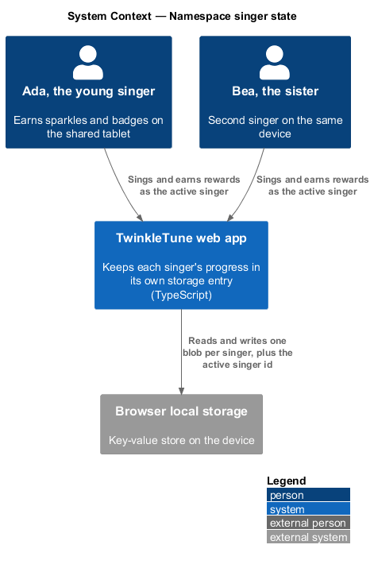
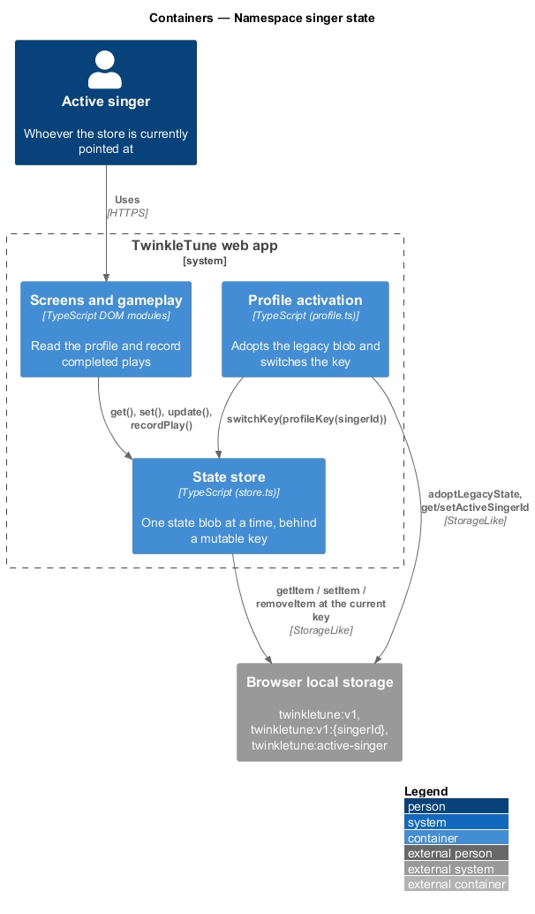
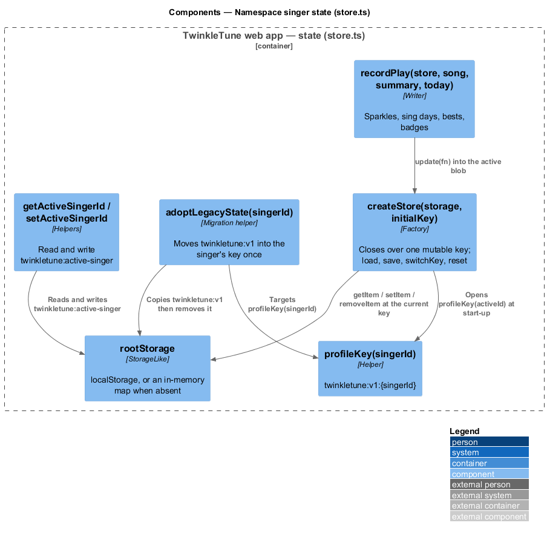
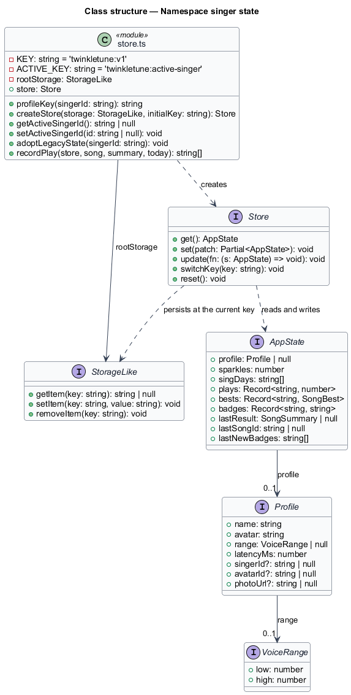
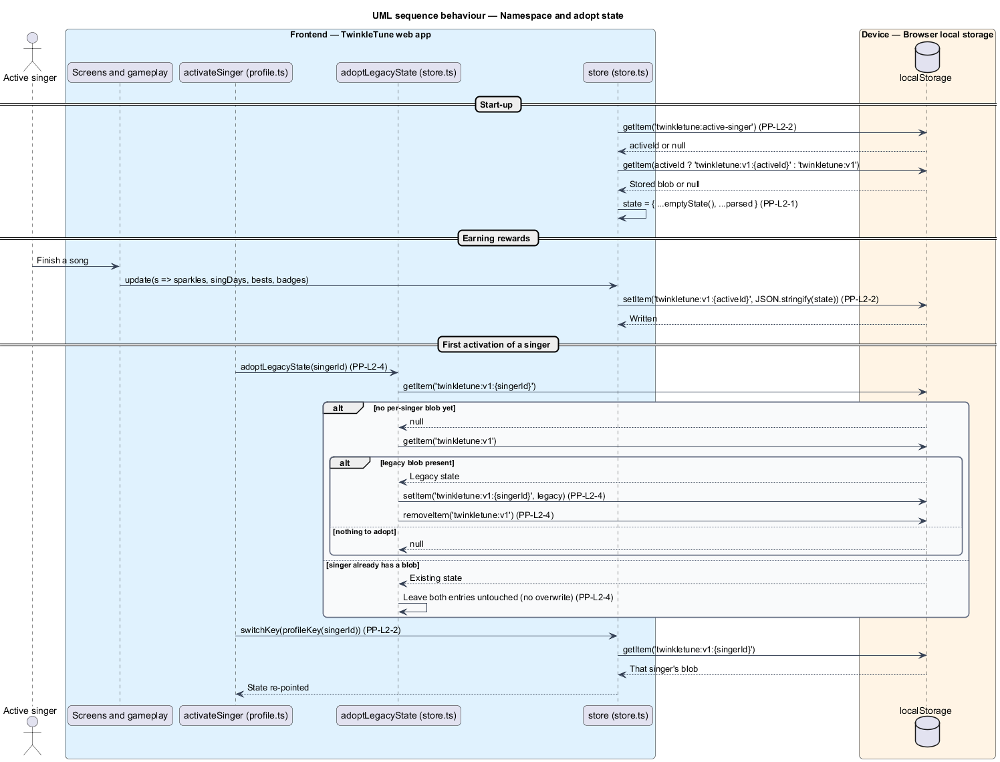

# Namespace Singer State

## Overview

Two sisters share one tablet. Each earns her own sparkles, badges, streaks, and
per-song bests, and neither ever sees the other's numbers appear under her own
name. This feature is the storage discipline that makes that true: every singer's
on-device state lives in its own browser-storage entry, keyed by her server
singer id, and one small entry records which singer is currently active.

The feature also carries the one-time migration that existed before profiles did.
A device that played solo before the family server arrived holds a single
unkeyed state blob; the first singer to be activated adopts it, so nothing earned
in that era is lost.

- state blob — JSON serialization of `AppState`, holding the profile, sparkles,
  sing days, plays, bests, badges, and the last result
- storage key — string under which one state blob is stored, of the form
  `twinkletune:v1:{singerId}`
- active singer id — server singer id of the singer whose state the store is
  currently pointed at, held under `twinkletune:active-singer`
- legacy blob — pre-profiles state blob stored under the unkeyed
  `twinkletune:v1`, written before per-singer namespacing existed
- adoption — one-time move of the legacy blob into a singer's own key, performed
  by the first singer that claims it
- store — object exposing `get`, `set`, `update`, `switchKey`, and `reset` over
  one state blob at a time

## Description

Frontend — state store (`frontend/src/state/store.ts`):

- **`KEY`** — the module constant `'twinkletune:v1'`, the base key and also the
  legacy blob's key.
- **`ACTIVE_KEY`** — the module constant `'twinkletune:active-singer'`, holding
  the active singer id alone, outside any singer's blob.
- **`profileKey(singerId)`** — returns `` `${KEY}:${singerId}` ``, the per-singer
  storage key.
- **`StorageLike`** — three-method interface (`getItem`, `setItem`, `removeItem`)
  that the store depends on instead of `localStorage` directly, so tests supply
  an in-memory map.
- **`rootStorage`** — the `localStorage` instance when the global exists, and a
  `Map`-backed `memoryStorage()` otherwise.
- **`AppState`** — interface holding `profile`, `sparkles`, `singDays`, `plays`,
  `bests`, `badges`, `lastResult`, `lastSongId`, and `lastNewBadges`.
- **`Profile`** — interface holding `name`, `avatar`, `range: VoiceRange | null`,
  `latencyMs`, and the optional `singerId`, `avatarId`, and `photoUrl`. The
  comment on `latencyMs` records that mic latency is a device property and stays
  per device, while `range` belongs to the singer.
- **`createStore(storage, initialKey = KEY)`** — closes over one mutable `key`.
  `load()` parses the blob at `key`, merging it over `emptyState()`, and falls
  back to `emptyState()` when the entry is absent or the JSON is corrupt.
  `save()` writes `JSON.stringify(state)` back to `key`.
- **`store.switchKey(newKey)`** — reassigns `key` and reloads the state from the
  new entry, which is the whole of the re-pointing act.
- **`store.reset()`** — replaces the state with `emptyState()` and removes the
  entry at the current key.
- **`getActiveSingerId()`** / **`setActiveSingerId(id)`** — read and write
  `ACTIVE_KEY` on `rootStorage`; passing `null` removes the entry.
- **`adoptLegacyState(singerId)`** — reads `profileKey(singerId)`; when that entry
  is absent and `KEY` is present, it copies the legacy value to the singer's key
  and removes `KEY`. When the singer already has a blob it does nothing, so no
  existing state is overwritten.
- **`store`** — the module-level singleton, constructed as
  `createStore(rootStorage, activeId ? profileKey(activeId) : KEY)`, so a reload
  reopens the active singer's namespace.
- **`recordPlay(store, song, summary, today)`** — the single writer of earned
  state, mutating only the blob the store is currently pointed at.

Client key layout (the shipped baseline): active singer at
`twinkletune:active-singer`; per-singer blob at `twinkletune:v1:{singerId}`;
legacy blob at `twinkletune:v1`.

## Requirements

The feature realizes the following level-2 (L2) requirements. Each L2 requirement
refines a level-1 (L1) requirement, cited by identifier.

| L2 ID | Refines (L1) | Requirement |
|-------|--------------|-------------|
| `PP-L2-1` | `PP-L1-1` | A profile shall hold the singer's name, chosen avatar emoji, optional voice range, device mic latency, and — when server-linked — the server singer id, avatar id, and photo URL. |
| `PP-L2-2` | `PP-L1-2` | Each singer's on-device state shall be stored under a per-singer key, and the active singer id shall be persisted separately, so two singers' data never mix. |
| `PP-L2-4` | `PP-L1-6` | The first profile to be activated shall adopt any pre-profiles state blob, so earlier solo progress (sparkles, badges) is preserved, and the legacy blob shall then be removed. |

## Diagrams

### System context

Two singers share one device; the web app keeps each singer's progress in its own
browser-storage entry, and no progress leaves the device (`PP-L2-2`).

### Containers

The store sits between every state-writing screen and browser storage, holding a
single mutable key that names the entry currently in play (`PP-L2-2`).

### Components

`createStore` owns `load`, `save`, and `switchKey`; `profileKey`,
`getActiveSingerId`, `setActiveSingerId`, and `adoptLegacyState` sit alongside it
and address browser storage directly (`PP-L2-2`, `PP-L2-4`).

### Class structure

`AppState` carries the `Profile` described by `PP-L2-1`; the `Store` interface
exposes `switchKey` as the re-pointing operation, and `StorageLike` is the
narrow browser-storage seam.

### Behaviour — namespace and adopt state

The store loads the active singer's blob at start-up, writes every earned reward
under that one key (`PP-L2-2`), and — for the first singer to be activated —
adopts the legacy blob before switching, with the `alt` showing the no-overwrite
branch required by `PP-L2-4`.

