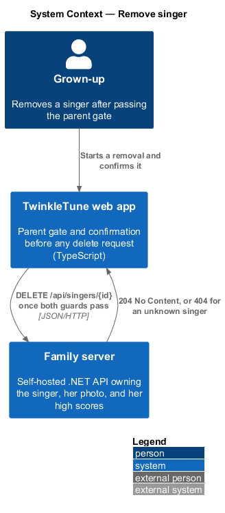
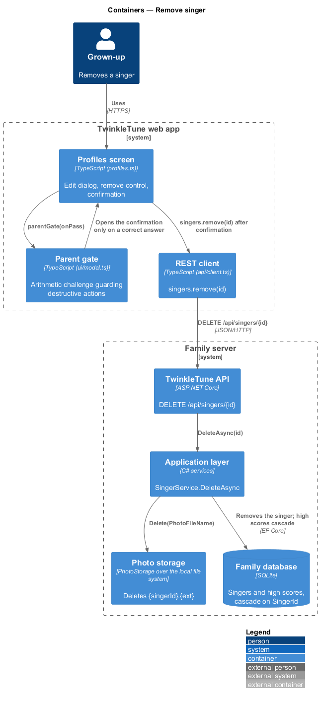
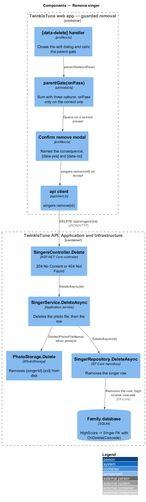
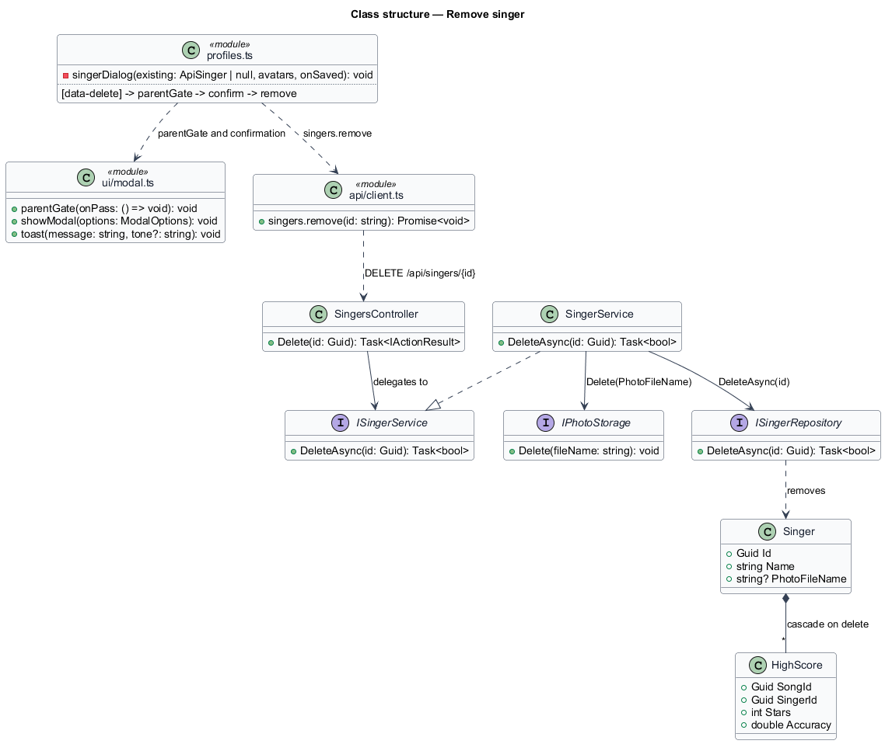
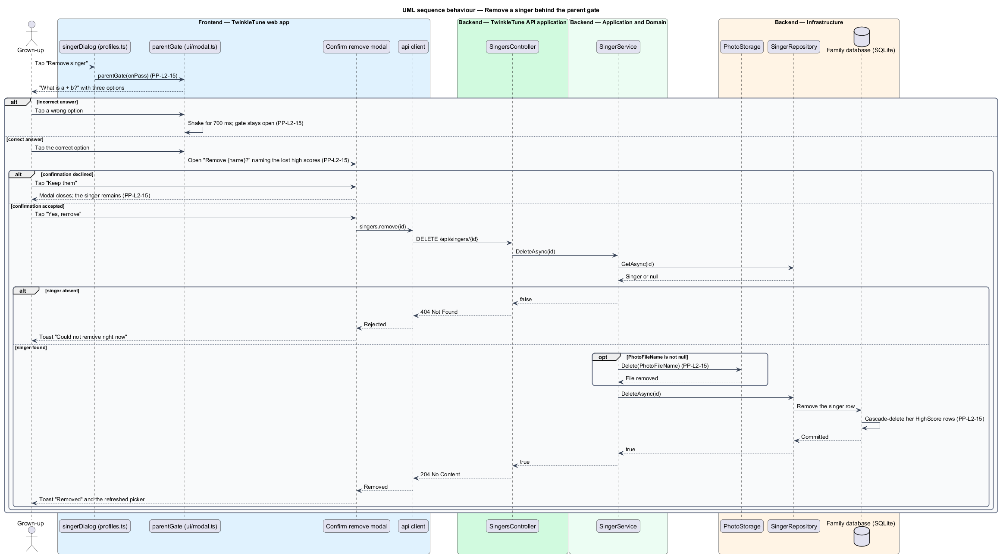

# Remove Singer

## Overview

Removing a singer is the one destructive act in the player-profiles subsystem,
and it is the only one that reaches beyond the subsystem's own data: a singer's
family high scores go with her. The design therefore puts two doors in front of
it and cleans up completely behind it.

The two doors are on the device. A grown-up starts the removal from the edit
dialog, passes the parent gate — an arithmetic challenge a young child does not
answer by accident — and then accepts a confirmation that names what else is
lost. The clean-up is on the server: the singer's photo file is deleted from disk
before the row is removed, and the database cascade takes her high-score rows with
it. On-device badges and sparkles are not touched; the confirmation says so.

- destructive action — operation that removes data a child cannot restore,
  guarded on the client before any request is sent
- parent gate — client-side arithmetic challenge that shows a sum with three
  answer buttons and calls its continuation only on the correct one
- confirmation — second modal naming the consequence, with an accept control and
  a decline control
- cascade delete — database rule that removes a singer's high-score rows when her
  own row is removed
- orphan — stored file or row whose owning singer no longer exists; the design
  admits none

## Description

Frontend — profiles screen (`frontend/apps/game/src/screens/profiles.ts`):

- **`[data-delete]` handler** — present in `singerDialog` only when editing an
  existing singer. It closes the edit dialog and calls `parentGate(...)`.
- **confirmation modal** — opened by the parent gate's continuation with the
  `ariaLabel` `Confirm remove`. It reads `Remove {name}?` and states that the
  singer's family high scores go too while this device's badges stay until "start
  over". `[data-yes]` performs the removal; `[data-no]` closes the modal and
  leaves the singer in place.
- **removal call** — `api.singers.remove(existing!.id)`, followed by closing the
  modal, the toast `Removed 💙`, and the `onSaved()` callback that refreshes the
  picker. A throw yields the toast `Could not remove right now`.

Frontend — parent gate (`frontend/apps/game/src/ui/modal.ts`):

- **`parentGate(onPass)`** — draws two addends, each `2 + Math.floor(Math.random()
  * 7)`, and offers three shuffled options: the answer, the answer minus one, and
  the answer plus two. A correct choice closes the modal and calls `onPass()`; an
  incorrect one adds the `shake` class for 700 ms and leaves the modal open.

Frontend — client:

- **`api.singers.remove(id)`** — `DELETE /api/singers/{id}`, typed `void` since
  the endpoint answers `204 No Content`.

Backend — API (`.../Controllers/SingersController.cs`):

- **`Delete`** — `DELETE /api/singers/{id:guid}`, returning `204 No Content` when
  the service reports success and `404 Not Found` otherwise.

Backend — Application (`.../Services/SingerService.cs`):

- **`DeleteAsync(id, ct)`** — loads the singer, returns `false` when absent,
  calls `photos.Delete(singer.PhotoFileName)` when that field is non-null, and
  then calls `singers.DeleteAsync(id, ct)`. Deleting the file before the row means
  no photo survives its singer.

Backend — Infrastructure (`.../Storage/PhotoStorage.cs`,
`.../Repositories/Repositories.cs`, `.../Persistence/AppDbContext.cs`):

- **`PhotoStorage.Delete(fileName)`** — reduces the name with
  `Path.GetFileName`, then deletes when the file exists.
- **`SingerRepository.DeleteAsync(id, ct)`** — loads the row, returns `false`
  when absent, removes it, and saves.
- **`AppDbContext.OnModelCreating`** — configures
  `HasOne(h => h.Singer).WithMany().HasForeignKey(h => h.SingerId)
  .OnDelete(DeleteBehavior.Cascade)` on `HighScore`, which is the cascade that
  removes the singer's scores.

## Requirements

The feature realizes the following level-2 (L2) requirements. Each L2 requirement
refines a level-1 (L1) requirement, cited by identifier.

| L2 ID | Refines (L1) | Requirement |
|-------|--------------|-------------|
| `PP-L2-15` | `PP-L1-7` | Deleting a singer shall remove her stored photo and cascade-delete her family high scores; in the user interface, deletion shall be guarded by the parent gate and shall proceed only after a confirmation is accepted. |

## Diagrams

### System context

A grown-up removes a singer from the web app; the family server deletes her photo
and her family high scores along with her record (`PP-L2-15`).

### Containers

The parent gate and the confirmation stand between the profiles screen and the
delete endpoint; the API removes the photo file from photo storage and the row
from the database (`PP-L2-15`).

### Components

`parentGate` guards the confirmation modal, `SingerService.DeleteAsync` deletes
the photo before the row, and the `HighScore` → `Singer` cascade removes the
scores (`PP-L2-15`).

### Class structure

The guarding path on the client and the deleting path on the server, with the
composition from `Singer` to `HighScore` that carries the cascade.

### Behaviour — remove a singer behind the parent gate

The two `alt` blocks show the guards of `PP-L2-15`: a failed arithmetic answer
keeps the gate open, and declining the confirmation ends the flow. The accepted
path deletes the photo file, removes the row, and cascades the high scores.

