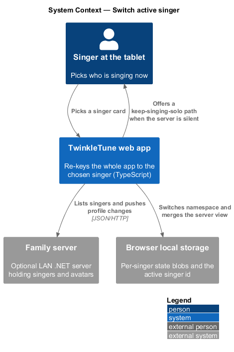
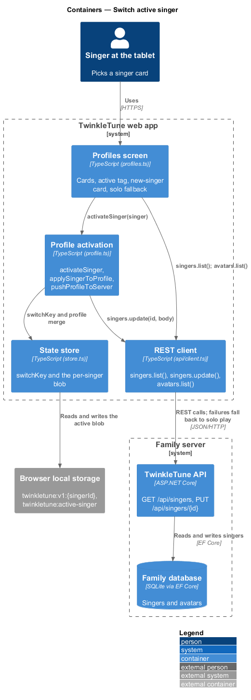
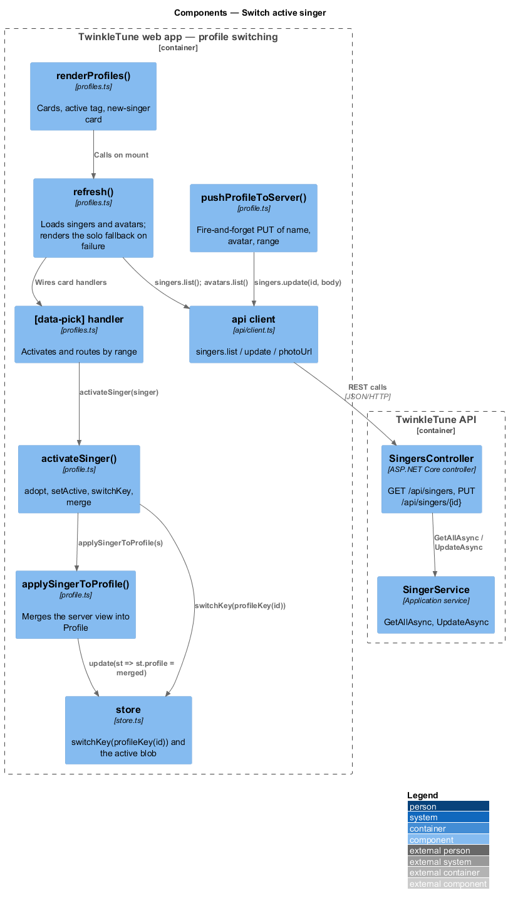
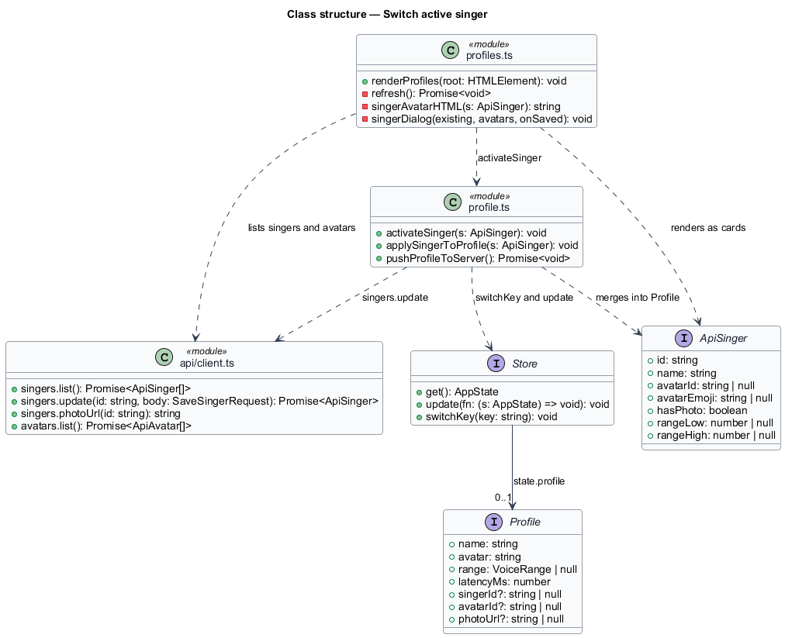
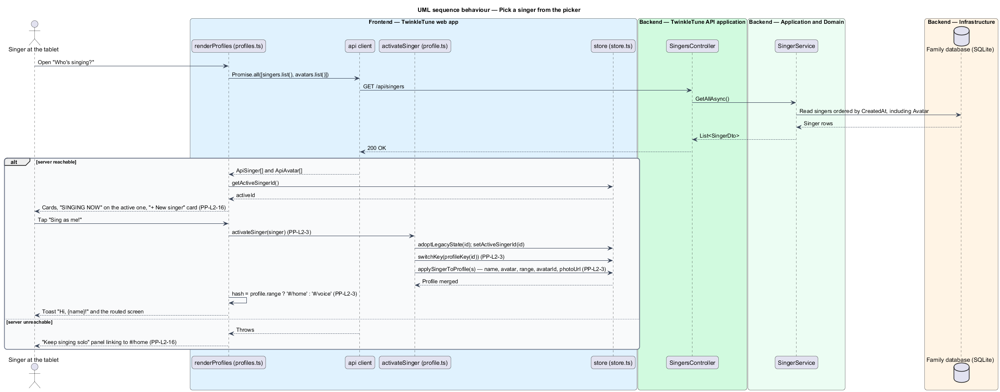
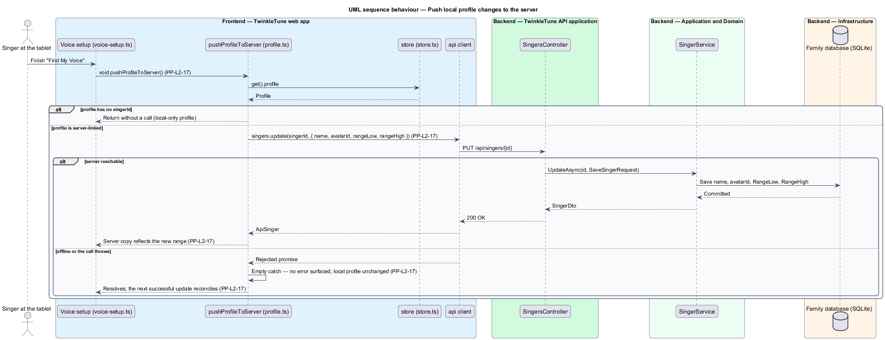

# Switch Active Singer

## Overview

The profiles screen answers one question — "Who's singing?" — and answering it
re-keys the whole app. Tapping a card makes that singer active: the state store
moves to her namespace, the server's view of her name, avatar, range, and photo
lands in the local profile, and the app routes to the screen she needs next. From
that moment her songs, her key, and her sparkles are the ones in play.

The same screen carries the offline story. The family server is optional, so a
picker that cannot reach it presents a way to keep playing rather than an error,
and a profile whose local fields changed pushes those changes back to the server
whenever it can.

- profiles screen — picker listing every server singer as a tappable card, with
  the active singer marked
- activation — act of making a singer the active one: adopt, record, switch
  namespace, and merge
- merge — copying the server singer's name, avatar emoji, range, avatar id, and
  photo URL over the local profile, keeping the device-owned fields
- device-owned field — profile field that belongs to the tablet rather than the
  singer, namely `latencyMs`
- solo fallback — panel shown in place of the picker when the server is
  unreachable, offering a route back to home
- fire-and-forget push — outbound `PUT` of the local profile whose failure is
  swallowed, leaving the local state unchanged

## Description

Frontend — profiles screen (`frontend/apps/game/src/screens/profiles.ts`):

- **`renderProfiles(root)`** — renders the header, the Twinkle coach bubble, and a
  `[data-list]` placeholder, then calls `refresh()`.
- **`refresh()`** — loads `api.singers.list()` and `api.avatars.list()` through
  one `Promise.all`. On success it renders a `.profile-grid` of `.profile-card`
  entries plus a `[data-new]` card. On any throw it replaces the list with the
  solo-fallback panel: a `📡` message and a `Keep singing solo ▶` link to
  `#/home`.
- **active marking** — the card whose `s.id` equals `getActiveSingerId()` gains
  the `active` class, a `SINGING NOW ⭐` tag, and the button label `That's me!`;
  every other card reads `Sing as me! 🎤`.
- **`[data-pick]` handler** — finds the chosen `ApiSinger`, calls
  `activateSinger(singer)`, raises a gold `Hi, {name}! 👋` toast, and sets
  `location.hash` to `#/home` when the switched-in profile has a range and
  `#/voice` otherwise.
- **`singerAvatarHTML(s)`** — renders the singer's photo when `s.hasPhoto`, and
  her `avatarEmoji ?? '🎤'` otherwise.

Frontend — profile activation (`frontend/apps/game/src/state/profile.ts`):

- **`activateSinger(s: ApiSinger)`** — the four steps of activation, in order:
  `adoptLegacyState(s.id)`, `setActiveSingerId(s.id)`,
  `store.switchKey(profileKey(s.id))`, and `applySingerToProfile(s)`.
- **`applySingerToProfile(s)`** — writes `st.profile` from the server view.
  `avatar` falls back to the previous avatar and then to `'🦄'`; `range` uses the
  server pair only when both `rangeLow` and `rangeHigh` are non-null, otherwise
  the previous range; `latencyMs` carries the previous value or `0`; `photoUrl`
  is `api.singers.photoUrl(s.id)` when `s.hasPhoto` and `null` otherwise.
- **`pushProfileToServer()`** — returns immediately when the profile has no
  `singerId`. Otherwise it awaits
  `api.singers.update(singerId, { name, avatarId, rangeLow, rangeHigh })` inside a
  `try`/`catch` whose `catch` body is empty, so an offline push surfaces nothing
  and the next successful update reconciles the server copy.

Frontend — callers and client:

- **`voice-setup.ts`** — calls `void pushProfileToServer()` once a range is
  captured, so the range follows the singer to other devices.
- **`api.singers.list()`** — `GET /api/singers`, returning `ApiSinger[]` ordered
  by creation time with the avatar emoji included.
- **`api.singers.update(id, body)`** — `PUT /api/singers/{id}`.

## Requirements

The feature realizes the following level-2 (L2) requirements. Each L2 requirement
refines a level-1 (L1) requirement, cited by identifier.

| L2 ID | Refines (L1) | Requirement |
|-------|--------------|-------------|
| `PP-L2-3` | `PP-L1-2` | Selecting a singer shall set her as active, switch the store to her namespace, merge the server's view into her local profile, and route to home when she has a range or to voice setup otherwise. |
| `PP-L2-16` | `PP-L1-8` | The profiles screen shall list singers as pickable cards marking the active one, shall offer creating a new singer, and shall present a "keep singing solo" path instead of an error when the server is unreachable. |
| `PP-L2-17` | `PP-L1-8` | When linked, local changes to the profile's name, avatar, and range shall be pushed to the server; a push that fails while offline shall not surface an error and shall reconcile on a later successful update. |

## Diagrams

### System context

A grown-up or a singer picks who is singing; the web app reads the singer list
from the optional family server and keeps playing on the device profile when that
server does not answer (`PP-L2-16`).

### Containers

The profiles screen reads singers and avatars through the REST client, hands the
chosen singer to profile activation, and profile activation re-points the state
store (`PP-L2-3`).

### Components

`renderProfiles()` renders the cards and the solo fallback; `activateSinger()`
sequences adoption, the active id, the key switch, and the merge; and
`pushProfileToServer()` sends local changes the other way (`PP-L2-3`,
`PP-L2-16`, `PP-L2-17`).

### Class structure

`ApiSinger` is the server view that `applySingerToProfile` merges into `Profile`,
and `Store.switchKey` is the operation that moves the whole app to the new
namespace.

### Behaviour — pick a singer from the picker

The picker loads singers and avatars, with the `alt` showing the solo fallback
required by `PP-L2-16`. Picking a card runs the four activation steps and the
range-driven route of `PP-L2-3`.

### Behaviour — push local profile changes to the server

A captured range triggers a fire-and-forget `PUT`; the `alt` shows the offline
branch that swallows the failure and leaves the local profile intact, to
reconcile on a later successful update (`PP-L2-17`).

