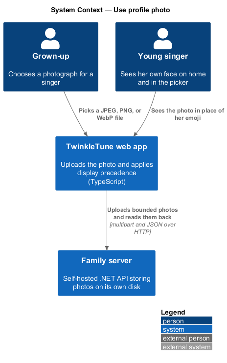
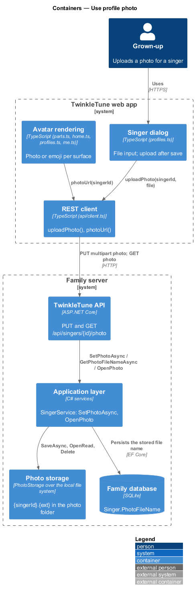
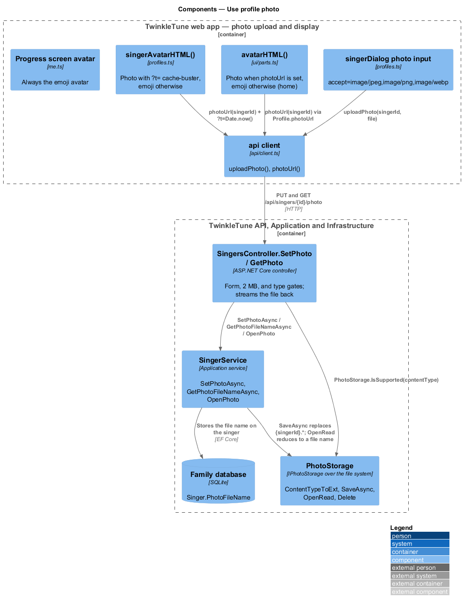

# Use Profile Photo

## Overview

An emoji avatar is friendly; a real photograph is personal. This feature lets a
grown-up attach a photo to a singer and have it appear wherever that singer is
shown as herself. A child's photograph is the most sensitive thing the product
holds, so the design keeps it narrow: the upload is bounded by size and type, the
file lives on the family server's own disk beside its database file, and it is
served back through an endpoint that reduces the requested name to its file name
before touching the disk.

Display is deliberately not uniform. Home and the profiles picker show the photo
when one exists, because those places show *who is singing*. The progress ("Me")
screen keeps the emoji avatar, so the celebration surface stays a cartoon rather
than a portrait.

- profile photo — image file uploaded for one singer, stored on the family server
  as `{singerId}.{ext}`
- supported type — one of `image/jpeg`, `image/png`, and `image/webp`, the three
  content types mapped to an extension by photo storage
- size bound — the `MaxPhotoBytes` limit of `2 * 1024 * 1024` bytes (2 MB) applied
  before any byte reaches the disk
- has-photo flag — the DTO's `HasPhoto` boolean, computed from
  `PhotoFileName is not null`, which is how the client learns a photo exists
  without fetching it
- display precedence — rule choosing the photo over the emoji on the home and
  picker surfaces, and the emoji unconditionally on the progress screen
- cache-buster — `?t={Date.now()}` query appended to the picker's photo URL so a
  freshly replaced photo is not served from cache

## Description

Backend — API (`.../Controllers/SingersController.cs`):

- **`MaxPhotoBytes`** — the private constant `2 * 1024 * 1024`.
- **`SetPhoto`** — `PUT /api/singers/{id:guid}/photo`. It rejects a non-form
  request with `"Send the photo as multipart form data."`, an absent or empty
  file with `"No photo file found."`, a file above `MaxPhotoBytes` with
  `"Photos must be 2 MB or smaller."`, and an unsupported content type with
  `"Use a JPEG, PNG or WebP photo."` — each as `400 Bad Request` carrying
  `{ error }`. It then opens the read stream, calls `svc.SetPhotoAsync`, and
  returns `404 Not Found` for an unknown singer or `200 OK` with the updated
  singer.
- **`GetPhoto`** — `GET /api/singers/{id:guid}/photo`. It reads the stored file
  name, returns `404` when the singer has none or the file is missing, and
  otherwise streams the file with its mapped content type.

Backend — Application (`.../Services/SingerService.cs`):

- **`SetPhotoAsync(id, content, contentType, ct)`** — loads the singer, returns
  `null` when absent, assigns `PhotoFileName` from `photos.SaveAsync(...)`, saves,
  and returns the DTO.
- **`GetPhotoFileNameAsync(id, ct)`** — returns the singer's `PhotoFileName`.
- **`OpenPhoto(fileName)`** — delegates to `photos.OpenRead(fileName)`.
- **`DeleteAsync`** — deletes the stored file when `PhotoFileName` is non-null
  before removing the singer; that path is detailed in the remove-singer feature.

Backend — Infrastructure (`.../Storage/PhotoStorage.cs`):

- **`ContentTypeToExt`** — case-insensitive dictionary mapping `image/jpeg` to
  `.jpg`, `image/png` to `.png`, and `image/webp` to `.webp`.
- **`IsSupported(contentType)`** — returns whether the dictionary holds the type;
  the controller calls it as its type gate.
- **`SaveAsync(singerId, content, contentType, ct)`** — throws
  `ArgumentException` for an unmapped type, creates the root folder, deletes every
  `{singerId}.*` file so any previous photo of any extension is replaced, writes
  `{singerId}{ext}`, and returns that file name.
- **`OpenRead(fileName)`** — combines the root path with
  `Path.GetFileName(fileName)`, which discards any directory component and is what
  the `// no traversal` comment records. It returns `null` when the file is
  absent, and otherwise the stream with the content type mapped back from the
  extension.
- **`Delete(fileName)`** — the same file-name reduction, then a delete when the
  file exists.

Frontend — client and rendering:

- **`api.singers.uploadPhoto(id, file)`** — appends the file to a `FormData`
  under the field name `photo`, sends it as `PUT /api/singers/{id}/photo`, and
  returns the updated `ApiSinger`. The `req` helper omits the JSON content-type
  header when the body is a `FormData`, so the browser sets the multipart
  boundary.
- **`api.singers.photoUrl(id)`** — returns `${API_URL}/api/singers/{id}/photo`.
- **`applySingerToProfile`** (`state/profile.ts`) — sets `photoUrl` to
  `api.singers.photoUrl(s.id)` when `s.hasPhoto`, and `null` otherwise.
- **`avatarHTML(profile, cls, label)`** (`ui/parts.ts`) — renders an
  `img.avatar-photo` inside the avatar box when `profile.photoUrl` is set, and the
  emoji otherwise. `home.ts` renders the profile avatar through this helper.
- **`singerAvatarHTML(s)`** (`screens/profiles.ts`) — renders
  `${api.singers.photoUrl(s.id)}?t=${Date.now()}` when `s.hasPhoto`, and
  `s.avatarEmoji ?? '🎤'` otherwise.
- **`me.ts`** — renders `
${profile.avatar}
`
  directly, so the progress screen always shows the emoji.
- **photo input** (`screens/profiles.ts`) — the singer dialog's
  `<input type="file" accept="image/jpeg,image/png,image/webp" data-photo>`;
  after the singer is saved, a selected file is uploaded through
  `api.singers.uploadPhoto(singer.id, file)`.

## Requirements

The feature realizes the following level-2 (L2) requirements. Each L2 requirement
refines a level-1 (L1) requirement, cited by identifier.

| L2 ID | Refines (L1) | Requirement |
|-------|--------------|-------------|
| `PP-L2-13` | `PP-L1-5` | The server shall accept a profile photo only as multipart form data, at most 2 MB, of type JPEG, PNG, or WebP; it shall store the photo as `{singerId}.{ext}`, replacing any previous photo, and shall serve it back without permitting path traversal. |
| `PP-L2-14` | `PP-L1-5` | Where a photo exists it shall be shown in place of the avatar emoji on home and in the picker, with a cache-buster on the picker; the progress ("Me") screen shall always show the emoji avatar. |

## Diagrams

### System context

A grown-up uploads a child's photograph from the web app; the photo is stored on
the family's own server and is served back to the app for display (`PP-L2-13`).

### Containers

The singer dialog uploads through the REST client to the photo endpoints, and the
API writes the file to the server's photo folder rather than into the database
(`PP-L2-13`).

### Components

`SingersController.SetPhoto` applies the form, size, and type gates;
`PhotoStorage` names, replaces, and reads the file safely; and `avatarHTML`,
`singerAvatarHTML`, and the "Me" screen apply the display precedence
(`PP-L2-13`, `PP-L2-14`).

### Class structure

`PhotoStorage` behind `IPhotoStorage`, the `Singer.PhotoFileName` field it
populates, the `HasPhoto` flag the DTO exposes, and the three render paths that
choose photo or emoji.

### Behaviour — upload and display a profile photo

The `alt` blocks show the three rejections of `PP-L2-13` — wrong body form,
oversize file, unsupported type — before the accepted path replaces any previous
photo. The closing steps show the display precedence of `PP-L2-14` across home,
the picker, and the progress screen.

