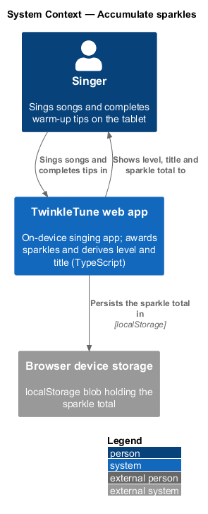
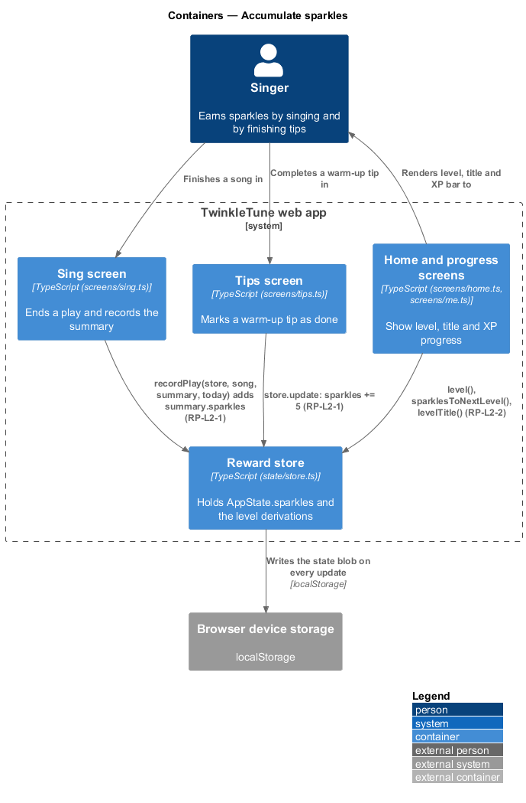
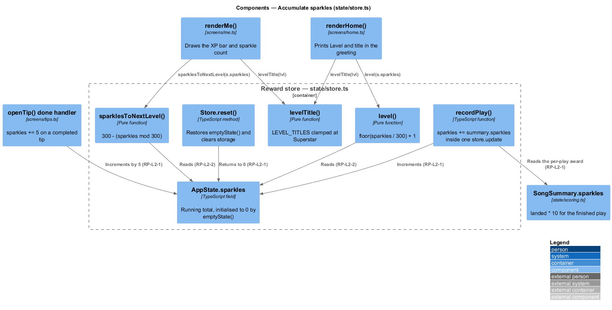
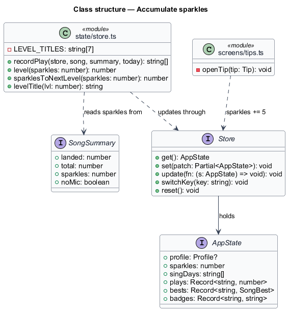
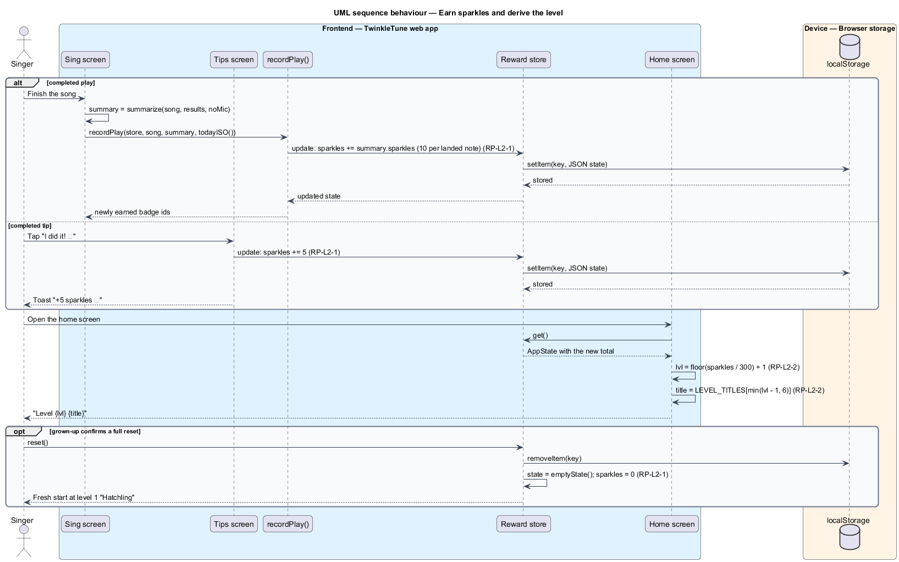

# Accumulate Sparkles

## Overview

Sparkles are the single reward currency in TwinkleTune. A child earns them by
singing and by finishing a warm-up tip, and the total only ever grows. From that
one number the app derives a level and an encouraging title, so progress reads as
a rank a nine-year-old recognises rather than a raw score. This feature owns the
currency and the two pure functions that turn it into a level and a title; it
does not compute how many sparkles a play is worth, which belongs to scoring and
results (SR).

The terms below are used throughout.

- sparkle — universal reward point, awarded at 10 per landed note and 5 per
  completed tip, never subtracted outside a full reset
- landed note — note the singer matched within tolerance for at least half of the
  frames it was heard, scored by SR
- level — rank derived from the sparkle total, one new level per 300 sparkles
- title — encouraging name for a level, drawn from a fixed seven-entry list
- sparkles-to-next-level — sparkles remaining before the total crosses the next
  300-sparkle boundary
- full reset — grown-up-initiated erase of the whole device state, the one event
  that returns the sparkle total to zero

The currency sits in the on-device state blob, so it survives reloads and works
with no server. Two screens read it: the home dashboard shows the level and
title in the greeting, and the progress screen shows the total and the distance
to the next level.

## Description

Frontend — reward state (`frontend/apps/game/src/state/store.ts`):

- **`AppState.sparkles`** — running total, initialised to `0` by `emptyState()`
  and only ever incremented.
- **`recordPlay`** — adds the play's earned sparkles with
  `s.sparkles += summary.sparkles` inside a single `store.update` call, so the
  addition and its persistence happen together.
- **`level(sparkles)`** — pure function returning `Math.floor(sparkles / 300) + 1`.
- **`sparklesToNextLevel(sparkles)`** — pure function returning
  `300 - (sparkles % 300)`.
- **`LEVEL_TITLES`** — module-level array of the seven titles: `Hatchling`,
  `Chick`, `Fledgling`, `Songbird`, `Skylark`, `Nightingale`, `Superstar`.
- **`levelTitle(lvl)`** — returns `LEVEL_TITLES[Math.min(lvl - 1, LEVEL_TITLES.length - 1)]`,
  which clamps every level of 7 or above to `Superstar`.
- **`Store.reset()`** — replaces the state with `emptyState()` and removes the
  storage key, returning the total to `0`.

Frontend — scoring input (`frontend/apps/game/src/state/scoring.ts`):

- **`SongSummary.sparkles`** — per-play award computed by `summarize` as
  `landed * 10`. RP consumes this value and does not recompute it.

Frontend — tips (`frontend/apps/game/src/screens/tips.ts`):

- **`openTip`** — the `I did it! ✨` handler runs `store.update((s) => { s.sparkles += 5 })`
  and raises the `+5 sparkles ✨` toast.

Frontend — readouts:

- **`renderHome`** (`frontend/apps/game/src/screens/home.ts`) — computes `lvl = level(s.sparkles)`
  and prints `Level ${lvl} ${levelTitle(lvl)}` under the greeting.
- **`renderMe`** (`frontend/apps/game/src/screens/me.ts`) — computes `lvl`,
  `toNext = sparklesToNextLevel(s.sparkles)`, and
  `xpPct = Math.round(((s.sparkles % 300) / 300) * 100)` for the XP bar.

Frontend — reset (`frontend/apps/game/src/ui/settings.ts`):

- **`showSettings`** — the confirmed `Yes, erase everything` action calls
  `store.reset()`, the only path that lowers the sparkle total.

Constants (the shipped baseline): 300 sparkles per level, 10 sparkles per landed
note, 5 sparkles per completed tip, 7 level titles.

## Requirements

The feature realizes the following level-2 (L2) requirements. Each L2 requirement
refines a level-1 (L1) requirement, cited by identifier.

| L2 ID | Refines (L1) | Requirement |
|-------|--------------|-------------|
| `RP-L2-1` | `RP-L1-1` | The system shall add the play's earned sparkles (10 × landed notes) to the running total on each completed play, and 5 sparkles on each completed tip; sparkles shall never decrease except on a full reset. |
| `RP-L2-2` | `RP-L1-1` | Level shall be ⌊sparkles ÷ 300⌋ + 1; sparkles-to-next-level shall be 300 − (sparkles mod 300); the title shall come from the fixed list Hatchling, Chick, Fledgling, Songbird, Skylark, Nightingale, Superstar, clamped at the last for high levels. |

## Diagrams

### System context

The singer earns sparkles by singing and by completing warm-up tips; the whole
currency lives on the device and no server participates (`RP-L2-1`).

### Containers

The sing screen and the tips screen both add to the total held in the reward
store, and the home and progress screens read the level derived from it
(`RP-L2-1`, `RP-L2-2`).

### Components

`recordPlay` and the tip handler write `AppState.sparkles`; `level`,
`sparklesToNextLevel`, and `levelTitle` read it as pure functions (`RP-L2-2`).

### Class structure

`AppState` holds the total, `SongSummary` supplies the per-play award, and the
three derivation functions sit beside `LEVEL_TITLES` in the store module.

### Behaviour — earn sparkles and derive the level

The `alt` separates the two earning paths: a completed play adds
`summary.sparkles` and a completed tip adds 5 (`RP-L2-1`). The home screen then
derives level, title, and remaining sparkles from the new total (`RP-L2-2`), and
the `opt` shows the single path that lowers the total.

