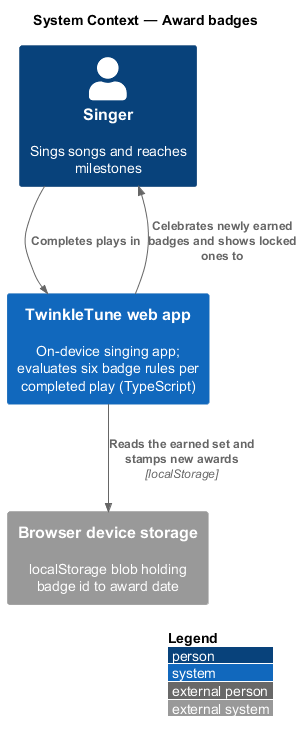
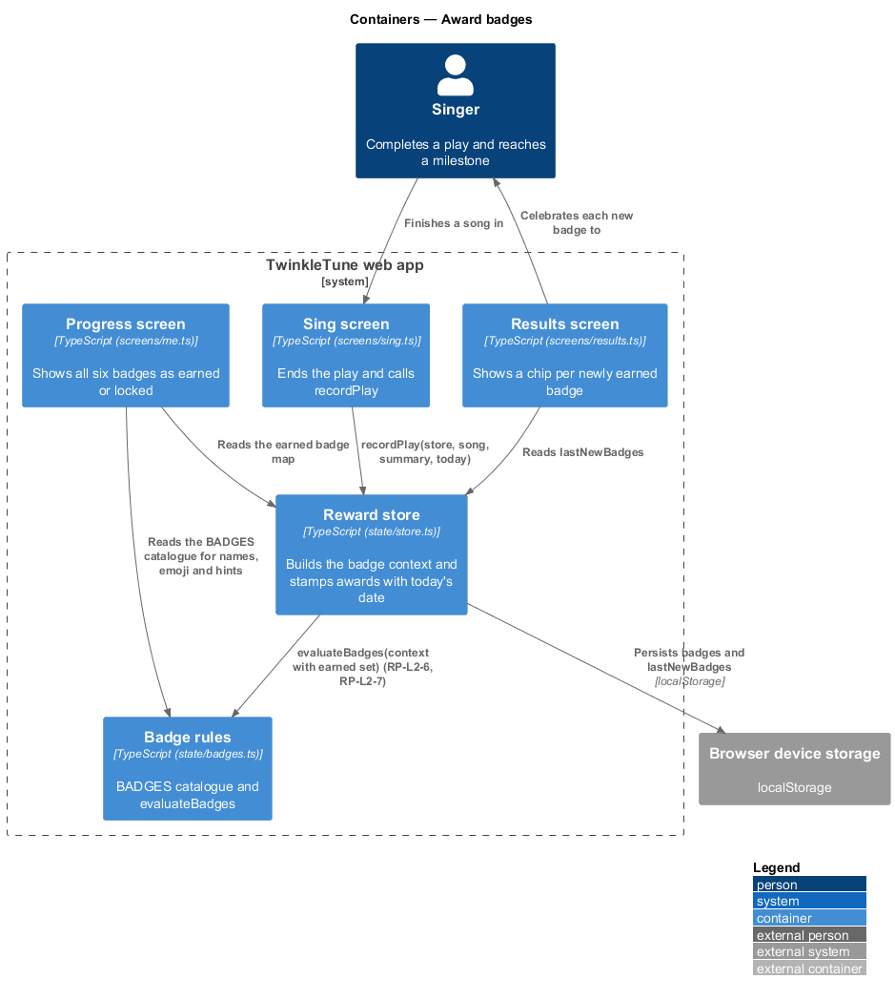
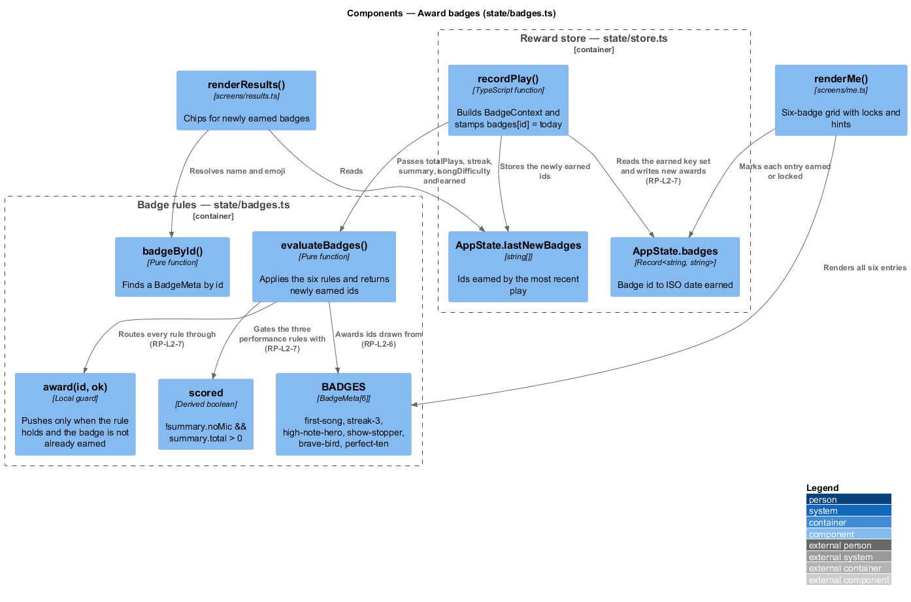
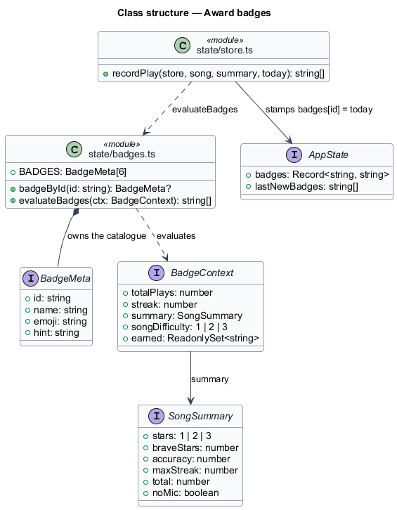
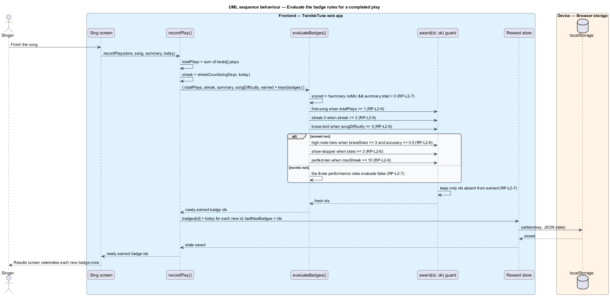
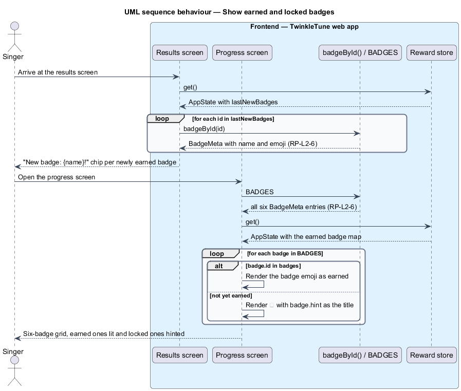

# Award Badges

## Overview

Badges are the milestone celebrations of TwinkleTune: six fixed achievements, each
with a name, an emoji, and a one-line hint that tells a child how to reach it.
They are awarded automatically at the end of a play by one pure evaluation over
the play's summary, the singer's streak, the song's difficulty, and the set of
badges already held. Fairness is the design constraint: a badge is awarded at
most once, and the three badges that reward performance are unreachable from a
no-mic run, so a "just for fun" play cannot mint a `Show Stopper`.

The terms below are used throughout.

- badge — fixed achievement with an id, a display name, an emoji, and a hint
- badge catalogue — the six-entry list of every badge the app can award
- badge context — evaluation input carrying total plays, daily streak, the play
  summary, the song difficulty, and the already-earned badge ids
- scored run — play with the microphone on that produced at least one note, the
  precondition for a performance badge
- performance badge — badge whose award depends on how well the song was sung:
  `High Note Hero`, `Show Stopper`, `Perfect Ten`
- participation badge — badge awarded for taking part rather than performing:
  `First Song`, `3-Day Streak`, `Brave Bird`
- idempotent award — property that a badge already held is never reported as newly
  earned
- newly earned list — badge ids awarded by this play, handed to the results screen
  so it can celebrate them once

The evaluation itself is a pure function with no state of its own; the store owns
the earned map and stamps each newly earned badge with the date.

## Description

Frontend — badge catalogue and rules (`frontend/apps/game/src/state/badges.ts`):

- **`BadgeMeta`** — interface with `id`, `name`, `emoji`, and `hint`.
- **`BADGES`** — the six-entry catalogue: `first-song` (`First Song`, 🎤,
  "Sing your very first song"), `streak-3` (`3-Day Streak`, 🔥, "Sing three days
  in a row"), `high-note-hero` (`High Note Hero`, 🚀, "Land the highest notes of a
  song"), `show-stopper` (`Show Stopper`, 🎭, "Earn three stars on any song"),
  `brave-bird` (`Brave Bird`, 🐦, "Finish a Brave (3-star difficulty) song"), and
  `perfect-ten` (`Perfect Ten`, 🔟, "Land ten notes in a row").
- **`badgeById(id)`** — lookup returning the `BadgeMeta` or `undefined`.
- **`BadgeContext`** — evaluation input with `totalPlays`, `streak`, `summary`,
  `songDifficulty`, and `earned: ReadonlySet<string>`.
- **`evaluateBadges(ctx)`** — returns the ids newly earned by this play. It
  defines `award(id, ok)`, which pushes `id` onto `fresh` only when `ok` holds and
  `!ctx.earned.has(id)`, and `scored = !ctx.summary.noMic && ctx.summary.total > 0`.
  The six rules are: `first-song` at `totalPlays >= 1`; `streak-3` at
  `streak >= 3`; `high-note-hero` at `scored && summary.braveStars === 3 && summary.accuracy >= 0.5`;
  `show-stopper` at `scored && summary.stars === 3`; `brave-bird` at
  `songDifficulty === 3`; `perfect-ten` at `scored && summary.maxStreak >= 10`.

Frontend — reward state (`frontend/apps/game/src/state/store.ts`):

- **`AppState.badges`** — `Record<string, string>` mapping badge id to the ISO
  date earned; its key set is the earned set.
- **`recordPlay`** — builds the `BadgeContext` from `totalPlays`,
  `streakCount(s.singDays, today)`, the summary, `song.difficulty`, and
  `new Set(Object.keys(s.badges))`, then writes `s.badges[id] = today` for each
  newly earned id and stores the list in `s.lastNewBadges`.

Frontend — presentation:

- **`renderResults`** (`frontend/apps/game/src/screens/results.ts`) — maps
  `state.lastNewBadges` through `badgeById` and renders one
  `New badge: ${b.name}!` chip each.
- **`renderMe`** (`frontend/apps/game/src/screens/me.ts`) — renders all six `BADGES`, using
  `b.id in s.badges` to choose between the badge emoji and a `🔒`, with `b.hint`
  as the element title.

Constants (the shipped baseline): 6 badges, a `3`-day streak threshold, a
`braveStars` threshold of `3` with accuracy at or above `0.5`, an overall star
threshold of `3`, a song difficulty of `3`, and an in-song streak threshold of
`10`.

## Requirements

The feature realizes the following level-2 (L2) requirements. Each L2 requirement
refines a level-1 (L1) requirement, cited by identifier.

| L2 ID | Refines (L1) | Requirement |
|-------|--------------|-------------|
| `RP-L2-6` | `RP-L1-4` | The system shall award badges by these rules: **First Song** at ≥ 1 total play; **3-Day Streak** at streak ≥ 3; **High Note Hero** when scored and braveness stars = 3 and accuracy ≥ 0.5; **Show Stopper** when scored and overall stars = 3; **Brave Bird** on finishing a difficulty-3 song; **Perfect Ten** when scored and the max streak ≥ 10. |
| `RP-L2-7` | `RP-L1-4` | No badge shall be awarded twice, and performance badges (High Note Hero, Show Stopper, Perfect Ten) shall never be awarded from a no-mic run. |

## Diagrams

### System context

The singer earns badges by singing; every rule is evaluated on the device against
state held there, with no server involvement (`RP-L2-6`).

### Containers

The sing screen ends a play, the reward store assembles the badge context and
stamps the awards, and the results and progress screens show them.

### Components

`evaluateBadges` reads the catalogue rules and the `earned` set through the
`award` guard, which is where idempotency lives (`RP-L2-7`); `scored` gates the
three performance rules.

### Class structure

`BADGES` holds `BadgeMeta` entries, `BadgeContext` carries the evaluation input,
and `AppState.badges` maps each earned badge id to its award date.

### Behaviour — evaluate the badge rules for a completed play

Each rule passes through `award`, which drops any id already in `earned`
(`RP-L2-7`). The `alt` on `scored` shows the three performance rules being
skipped for a no-mic run while `first-song`, `streak-3`, and `brave-bird` remain
reachable (`RP-L2-6`, `RP-L2-7`).

### Behaviour — show earned and locked badges

The results screen celebrates only the ids this play produced, and the progress
screen renders the full six-badge catalogue with a lock and a hint on the ones
not yet earned (`RP-L2-6`).

